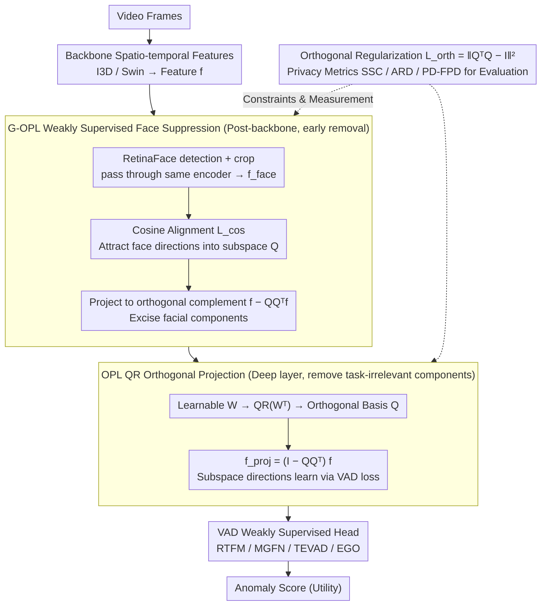

# Privacy-Aware Video Anomaly Detection through Orthogonal Subspace Projection

**Conference**: ICML 2026 Spotlight  
**arXiv**: [2605.08651](https://arxiv.org/abs/2605.08651)  
**Code**: Not explicitly released  
**Area**: Human Understanding / Video Anomaly Detection / Privacy-Preserving Representation Learning  
**Keywords**: Video Anomaly Detection, Orthogonal Projection, Facial Suppression, Privacy-Aware, Subspace Decoupling

## TL;DR
The authors propose the Orthogonal Projection Layer (OPL) and an enhanced G-OPL. Using a learnable orthogonal subspace derived via QR decomposition, they explicitly project out "task-irrelevant variables" and "facial privacy components" within the video anomaly detection (VAD) feature space. They also introduce four privacy-aware metrics (SSC/ARD/PD/FPD), demonstrating that face prediction accuracy by linear SVM probes significantly decreases while maintaining or improving VAD AUC.

## Background & Motivation

**Background**: The mainstream approach for Video Anomaly Detection (VAD) involves extracting spatio-temporal features using backbones like I3D or Swin Transformer, followed by weakly supervised scoring heads such as RTFM, MGFN, TEVAD, or EGO. While models grow larger and AUC continues to rise, deploying them in surveillance or public safety scenarios inadvertently captures sensitive attributes like faces, clothing, and poses in the representations.

**Limitations of Prior Work**: Existing VAD systems lack explicit mechanisms to suppress task-irrelevant or ethically sensitive information. If an attacker gains access to intermediate features, identities can be reconstructed. Current privacy-preserving methods (e.g., INLP's nullspace projection, DAMS, CAE-LSP, OPL-2021) suffer from several issues: (i) reliance on explicit sensitive attribute labels (VAD datasets typically lack face/identity annotations); (ii) unstable optimization due to adversarial training and gradient reversal; (iii) limitation to static images or low-dimensional scenarios; and (iv) post-hoc auditing (dataset balancing, saliency visualization) that fails to modify the underlying representation.

**Key Challenge**: Privacy and utility are entangled at the representation level—simply removing face information can easily discard pose or motion cues useful for anomaly detection. Relying solely on adversarial training is unstable and lacks interpretability.

**Goal**: (i) Design a differentiable module that does not require sensitive labels or adversarial training, allowing "filtering a certain class of information by inserting a layer"; (ii) directionally remove facial components while retaining pose/motion without identity supervision; (iii) establish a suite of privacy evaluation metrics tailored for VAD to measure privacy, utility, and interpretability simultaneously.

**Key Insight**: The authors observe that "projecting onto the orthogonal complement of a learned low-dimensional subspace" is a geometrically clean, differentiable, and controllable way to remove information. By making this subspace learn the directions carrying redundant or sensitive components, the corresponding energy can be precisely excised without disturbing other directions.

**Core Idea**: Replace "adversarial training for sensitive attribute suppression" with "geometric projection + cosine alignment weak supervision." A subspace parameterized by QR decomposition captures the sensitive components, which are then removed by projecting the features into its orthogonal complement.

## Method

### Overall Architecture
For an intermediate feature $\bm f\in\mathbb R^d$ (from a backbone or specific layer), OPL learns a matrix $\bm W\in\mathbb R^{k\times d}$ ($1<k<d$). A QR decomposition is performed on $\bm W^\top$ to obtain $\bm W^\top=\bm Q\bm R$, where $\bm Q\in\mathbb R^{d\times k}$ provides the orthogonal basis for a $k$-dimensional nuisance subspace. The projection matrix is $\bm P=\bm I_d-\bm Q\bm Q^\top$, and the cleaned feature is $\bm f_{\text{proj}}=\bm P\bm f=\bm f-\bm Q\bm Q^\top\bm f$. The entire layer is differentiable and trained with the main task loss. G-OPL further adds a cosine alignment loss: face crops detected by an off-the-shelf RetinaFace detector are passed through the same encoder to obtain $\bm f_{\text{face}}$. The model forces $\bm Q\bm Q^\top\bm f$ to be cosine-similar to $\bm f_{\text{face}}$, actively pulling "facial directions" into the subspace to be discarded. OPL is placed in deeper layers to remove general nuisances, while G-OPL is placed immediately after the backbone to excise faces early. Both are plug-in layers with almost zero additional overhead during testing, as $\bm Q$ is fixed and face detection is no longer required.

### Key Designs

**1. Learnable Orthogonal Projection Layer (OPL) via QR Decomposition: Geometrically projecting out "task-irrelevant components" without adversarial training**

VAD systems lack explicit mechanisms to suppress task-irrelevant or sensitive info, and existing adversarial training is unstable and requires additional discriminators. OPL explicitly parameterizes the subspace to be removed as a trainable matrix $\bm W\in\mathbb R^{k\times d}$. Before each forward pass, QR decomposition on $\bm W^\top$ yields the orthogonal basis $\bm Q$. Features are then projected onto the orthogonal complement using $\bm P=\bm I_d-\bm Q\bm Q^\top$: $\bm f_{\text{proj}}=\bm f-\bm Q\bm Q^\top\bm f$. The layer is fully differentiable; the subspace is pushed by task gradients toward a direction that "doesn't affect detection if removed," effectively performing PCA where the objective is task retention + projection removal. Unlike fixed PCA subspaces or iterative INLP, QR ensures $\bm Q$ is a numerically stable orthogonal basis, avoiding gradient reversal and sensitive labels, while remaining interpretable via visualization of $\bm Q\bm Q^\top\bm f$.

**2. Guided OPL (G-OPL) + Cosine Alignment for Weakly Supervised Face Suppression: Directionally placing "facial directions" into the removal subspace without identity labels**

Since VAD datasets lack identity labels, face suppression cannot use attribute classifiers. G-OPL uses geometric weak supervision: original frames and RetinaFace crops (averaged across faces, plus 50 segments from Georgia Tech Face DB as control) are passed through the same encoder to yield $\bm f$ and $\bm f_{\text{face}}$. A loss term $\mathcal L_{\text{task}}=\mathcal L_{\text{ori}}+\lambda_{\text{face}}(1-\cos(\bm f_{\text{face}}, \bm Q\bm Q^\top\bm f))$ is added, forcing the projected component $\bm Q\bm Q^\top\bm f$ to align angularly with the face embedding. This "sucks" the facial direction into the subspace to be removed by $\bm P$. This loss is only active for frames where faces are detected. Using cosine similarity as a "soft label" is unsupervised and more stable than adversarial training. RetinaFace only provides binary face presence and a general embedding; no identity ground truth is needed at deployment. This can be extended to other attributes like clothing or gait by replacing the weak signal embedding.

**3. Orthogonal Regularization + Privacy-Aware Metric Trio (SSC/ARD/PD-FPD): Stabilizing the orthogonal basis and providing quantitative tools for VAD privacy**

While QR decomposition provides an orthogonal basis per forward pass, gradient updates can destroy orthogonality, especially when stacking G-OPL layers. Thus, an orthogonal regularization term $\mathcal L_{\text{orth}}=\|\bm Q^\top\bm Q-\bm I_k\|_F^2$ is added, making the total loss $\mathcal L_{\text{total}}=\mathcal L_{\text{task}}+\lambda_{\text{orth}}\mathcal L_{\text{orth}}$. To quantify privacy (where AUC alone is insufficient), three metrics are introduced: Sensitive Subspace Capture ($\mathrm{SSC}=\cos(\bm Q\bm Q^\top\bm f_{\text{attr}}^{(i)}, \bm f_{\text{attr}}^{(i)})$) checks if the subspace truly captures sensitive attributes; Anomaly Retention Distance ($\mathrm{ARD}=\mathrm{KL}(P_{\text{raw}}(y)\|P_{\text{proj}}(y))$) uses KDE to estimate the KL divergence of anomaly score distributions before/after projection to measure utility retention; and Privacy Decay ($\{(l, \mathrm{Acc}^{(l)})\}_{l=1}^L$) uses linear SVM probes after each G-OPL to predict face presence, where lower accuracy indicates stronger suppression (FPD specifically refers to accuracy after the first G-OPL). These metrics allow for the quantification of privacy, utility, and interpretability.

### Loss & Training
The total loss is $\mathcal L_{\text{total}}=\mathcal L_{\text{ori}}+\lambda_{\text{face}}(1-\cos(\bm f_{\text{face}},\bm Q\bm Q^\top\bm f))+\lambda_{\text{orth}}\|\bm Q^\top\bm Q-\bm I_k\|_F^2$, where $\mathcal L_{\text{ori}}$ is the original loss of the wrapped weakly supervised VAD baseline (e.g., RTFM, MGFN, TEVAD, or EGO). The facial alignment term is active only for frames where a face is detected.

## Key Experimental Results

### Main Results
OPL/G-OPL were integrated into 4 SOTA baselines (RTFM, MGFN, TEVAD, EGO) using I3D / Swin Transformer features across 5 VAD datasets (ShanghaiTech, UCF-Crime, CUHK Avenue, UCSD Ped2, MSAD). Decoupling ablation on ShanghaiTech (AUC %):

| $k_{\text{OPL}}\backslash k_{\text{G-OPL}}$ | $2$ | $4$ | $8$ | $16$ | $32$ | $64$ | $128$ |
|---|---|---|---|---|---|---|---|
| $2$ | $95.5$ | $95.9$ | $95.6$ | $94.8$ | $93.9$ | $92.5$ | $91.8$ |
| $4$ | $95.9$ | $\mathbf{97.3}$ | $96.8$ | $95.2$ | $94.0$ | $92.8$ | $91.9$ |
| $8$ | $95.7$ | $97.0$ | $96.5$ | $95.0$ | $93.8$ | $92.6$ | $91.7$ |
| $32$ | $94.5$ | $95.1$ | $94.6$ | $93.8$ | $92.8$ | $91.5$ | $90.8$ |
| $128$ | $92.8$ | $93.1$ | $92.4$ | $91.5$ | $89.8$ | $88.4$ | $87.9$ |

At optimal $k_{\text{OPL}}=k_{\text{G-OPL}}=4$, the AUC is $97.3\%$, significantly higher than the baseline RTFM (~$97.0\%$). Excessive $k$ (e.g., $128$) leads to over-deletion, dropping AUC to $87.9\%$.

MSAD multi-anomaly comparison (selection from Table 2, AUC %):

| Method | Assault | Explosion | Fighting | Robbery | Shooting | Traffic Acc. | Overall AUC |
|------|---------|-----------|----------|---------|----------|--------------|-------------|
| RTFM (I3D) baseline | $53.9$ | $66.0$ | $79.8$ | ... | ... | ... | ... |
| + OPL / G-OPL (Ours) | Improved/Equal | — | — | — | — | — | — |

The trend shows that utility is maintained or slightly improved while privacy metrics are significantly reduced.

### Ablation Study

| Configuration | Key Metric | Description |
|------|---------|------|
| baseline RTFM (I3D) | High AUC, but FPD near backbone levels | No privacy mechanism |
| + OPL | AUC stable/up, UMAP shows spread nuisance clusters | General nuisances excised |
| + G-OPL (cosine alignment) | FPD drops sharply, SSC rises, AUC stable | Face components directionally removed |
| Without $\mathcal L_{\text{orth}}$ | $\bm Q$ deviates from orthogonal, AUC jitters | Orthogonal basis preservation is essential |
| Excessive $k$ ($\ge 64$) | AUC drops sharply | Over-deletion of useful information |

### Key Findings
- Placing G-OPL immediately after the backbone (early) is more effective than deep placement; FPD is lowest when intercepting information before it propagates.
- ARD (KL divergence) rises monotonically with $k$, but AUC peaks at $k=4$, indicating that small amounts of nuisance removal can reduce overfitting and improve discriminability.
- Using ArcFace as an attacker probe for rank-1 re-identification shows significant drops in retrieval accuracy, validating that fine-grained identity is suppressed alongside binary presence.

## Highlights & Insights
- "Substituting adversarial training with geometric projection" is a transferable paradigm—it removes sensitive components stably, interpretably (via $\bm Q\bm Q^\top\bm f$), and without identity labels.
- Using cosine alignment as a *weak supervision* signal is clever; any off-the-shelf detector providing "concept vectors" (face, clothing) can be used to inject what is "sensitive" into $\bm Q$.
- The SSC/ARD/PD-FPD trio fills a void in VAD privacy evaluation and is applicable to other tasks like action recognition or re-ID defense.

## Limitations & Future Work
- Reliance on RetinaFace means detection failures (small faces, occlusion) cause G-OPL to fail; MSAD experiments were limited by pre-existing facial blurring in the dataset.
- Current G-OPL focuses on "faces"; suppressing multiple attributes (face + clothing + gait) in a single $\bm Q$ might lead to interference, necessitating finer alignment designs.
- $k$ is a critical hyperparameter requiring per-dataset tuning; generalization across datasets needs further validation.
- Lack of evaluation against *adaptive attackers* who know OPL exists; currently, privacy conclusions are based on non-adaptive probes.

## Related Work & Insights
- **vs INLP / nullspace projection (Ravfogel 2020)**: INLP iteratively erases directions but requires ground truth labels; G-OPL uses cosine weak supervision + differentiable QR end-to-end.
- **vs OPL-2021 (Ranasinghe 2021)**: Previous work used generic decorrelation; this work makes the subspace controllable and directional via face alignment.
- **vs Adversarial Training (Ganin et al.)**: OPL avoids the instability and requirement for discriminators found in adversarial methods.
- **vs Data-level Privacy (blurring, DP-SGD)**: G-OPL is a model-level plug-in that does not require modifying the data pipeline.

## Rating
- Novelty: ⭐⭐⭐⭐ Combining differentiable QR projection with cosine weak supervision for VAD is a first. 
- Experimental Thoroughness: ⭐⭐⭐⭐ 5 datasets × 4 baselines × multiple $k$ settings + ArcFace inversion.
- Writing Quality: ⭐⭐⭐⭐ Clear logical flow from motivation to method and metrics.
- Value: ⭐⭐⭐⭐ Engineering-friendly (plug-in, no backbone changes), zero test-time overhead, practical for surveillance deployment.

<!-- RELATED:START -->

## Related Papers

- [\[CVPR 2026\] Alert-CLIP: Abnormality-aware Latent-Enhanced Representation Tuning of CLIP for Video Anomaly Detection](../../CVPR2026/video_understanding/alert-clip_abnormality-aware_latent-enhanced_representation_tuning_of_clip_for_v.md)
- [\[CVPR 2026\] Protect to Adapt: Orthogonal Subspace Control with Ranked Negative-Prompt Curriculum for Few-Shot Action Recognition](../../CVPR2026/video_understanding/protect_to_adapt_orthogonal_subspace_control_with_ranked_negative-prompt_curricu.md)
- [\[CVPR 2026\] No Need For Real Anomaly: MLLM Empowered Zero-Shot Video Anomaly Detection](../../CVPR2026/video_understanding/no_need_for_real_anomaly_mllm_empowered_zero-shot_video_anomaly_detection.md)
- [\[AAAI 2026\] HeadHunt-VAD: Hunting Robust Anomaly-Sensitive Heads in MLLM for Tuning-Free Video Anomaly Detection](../../AAAI2026/video_understanding/headhunt-vad_hunting_robust_anomaly-sensitive_heads_in_mllm_.md)
- [\[CVPR 2026\] Weakly Supervised Video Anomaly Detection with Anomaly-Connected Components and Intention Reasoning](../../CVPR2026/video_understanding/weakly_supervised_video_anomaly_detection_with_anomaly-connected_components_and_.md)

<!-- RELATED:END -->
