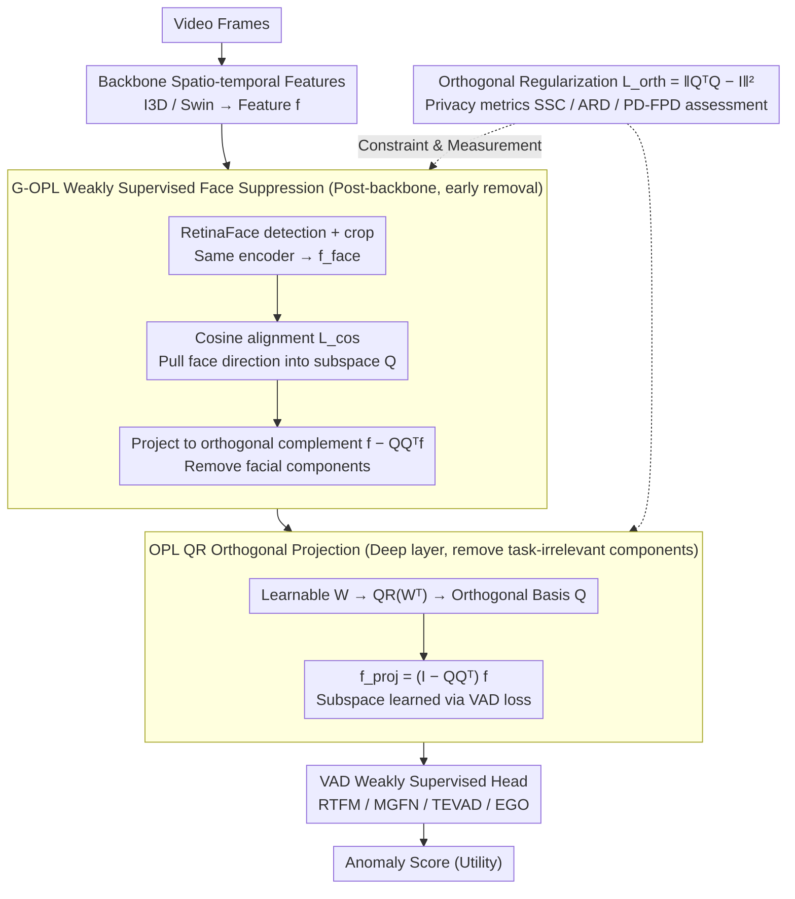

# Privacy-Aware Video Anomaly Detection through Orthogonal Subspace Projection

**Conference**: ICML 2026 Spotlight  
**arXiv**: [2605.08651](https://arxiv.org/abs/2605.08651)  
**Code**: Not explicitly disclosed by the authors  
**Area**: Human Understanding / Video Anomaly Detection / Privacy-Preserving Representation Learning  
**Keywords**: Video Anomaly Detection, Orthogonal Projection, Facial Suppression, Privacy-Aware, Subspace Decoupling

## TL;DR
The authors propose OPL (Orthogonal Projection Layer) and an enhanced version G-OPL, which utilize a learnable orthogonal subspace derived from QR decomposition to explicitly project out "task-irrelevant variables" and "facial privacy components" within the video anomaly detection feature space. They introduce four privacy-aware metrics (SSC/ARD/PD/FPD), demonstrating that face prediction accuracy by linear SVM probes significantly decreases while maintaining or even improving VAD AUC.

## Background & Motivation

**Background**: The mainstream approach for Video Anomaly Detection (VAD) involves using backbones like I3D or Swin Transformer to extract spatio-temporal features, followed by weakly supervised headers such as RTFM, MGFN, TEVAD, or EGO for scoring. As models grow larger and AUC scores improve, they inevitably learn sensitive attributes like faces, clothing, and poses when deployed in surveillance and public safety scenarios.

**Limitations of Prior Work**: Existing VAD systems lack explicit mechanisms to suppress task-irrelevant or ethically sensitive information. Attackers obtaining intermediate features can potentially reverse-engineer identities. Current privacy protection methods (e.g., INLP's nullspace projection, DAMS, CAE-LSP, OPL-2021) suffer from: (i) dependence on explicit sensitive attribute labels (which typical VAD datasets lack for faces/identities); (ii) unstable optimization due to adversarial training and gradient reversal; (iii) limitation to static images or low-dimensional scenarios; (iv) inability to modify representations via post-hoc audits (dataset balancing, saliency visualization).

**Key Challenge**: Privacy and utility are entangled at the representation level—simply removing face information may inadvertently discard pose or motion cues useful for anomaly detection. Relying solely on adversarial training is unstable and lacks interpretability.

**Goal**: (i) Design a differentiable module that does not rely on sensitive labels or adversarial training, allowing "filtering of specific information by inserting a layer"; (ii) directionally remove facial components while retaining pose/motion without identity supervision; (iii) tailor a set of privacy evaluation metrics for VAD to measure privacy, utility, and interpretability simultaneously.

**Key Insight**: The authors observe that "projecting onto the orthogonal complement of a learned low-dimensional subspace" is a geometrically clean, differentiable, and controllable method for information removal—provided the subspace learns directions carrying redundant or sensitive components, those energies can be precisely excised.

**Core Idea**: Replace "adversarial training for sensitive attribute suppression" with "geometric projection + weakly supervised cosine alignment," where an orthogonal subspace parameterized by QR decomposition carries the sensitive components and projects the features into its orthogonal complement.

## Method

### Overall Architecture
For an intermediate feature $\bm f\in\mathbb R^d$ (from a backbone or specific layer), OPL learns a matrix $\bm W\in\mathbb R^{k\times d}$ ($1<k<d$). Applying QR decomposition to $\bm W^\top$ yields $\bm W^\top=\bm Q\bm R$, where $\bm Q\in\mathbb R^{d\times k}$ provides the orthogonal basis for a $k$-dimensional nuisance subspace. The projection matrix is $\bm P=\bm I_d-\bm Q\bm Q^\top$, and the cleaned feature is $\bm f_{\text{proj}}=\bm P\bm f=\bm f-\bm Q\bm Q^\top\bm f$. The entire layer is fully differentiable and trained alongside the primary task loss. G-OPL adds a cosine alignment loss: faces detected by an off-the-shelf RetinaFace detector are cropped and processed by the same encoder to obtain $\bm f_{\text{face}}$, forcing the projection $\bm Q\bm Q^\top\bm f$ to be cosine-similar to $\bm f_{\text{face}}$, thus actively pushing "facial directions" into the discarded subspace. OPL is placed in deep layers for general nuisances, while G-OPL is placed immediately after the backbone to excise faces early. Both are plug-in layers with fixed $\bm Q$ during testing, requiring nearly zero additional overhead.

### Key Designs

**1. Learnable Orthogonal Projection Layer (OPL) via QR Decomposition: Geometrically projecting out "task-irrelevant components" without adversarial training**

VAD systems lack explicit mechanisms for information suppression, and traditional adversarial training is unstable, requiring auxiliary discriminators. OPL explicitly parameterizes the subspace to be deleted as a trainable matrix $\bm W\in\mathbb R^{k\times d}$. Before each forward pass, QR decomposition on $\bm W^\top$ yields the orthogonal basis $\bm Q$, and features are projected via $\bm P=\bm I_d-\bm Q\bm Q^\top$ into the orthogonal complement: $\bm f_{\text{proj}}=\bm f-\bm Q\bm Q^\top\bm f$. The layer is differentiable; the task gradient pushes the subspace toward directions that do not hinder detection, effectively performing PCA with the objective of "maximum task retention + maximum projection removal." Unlike fixed PCA or iterative nullspace methods like INLP, QR ensures numerically stable orthogonal bases without gradient reversal or sensitive labels and remains interpretable through visualization of $\bm Q\bm Q^\top\bm f$.

**2. Guided OPL (G-OPL) + Weakly Supervised Facial Suppression via Cosine Alignment: Directionally pushing "facial directions" into the target subspace without identity labels**

VAD datasets lack identity annotations, making attribute-based suppression impossible. G-OPL employs geometric weak supervision: the original frame and face crops from RetinaFace (averaged across faces, with supplementary control from the Georgia Tech Face DB) are passed through the same encoder to yield $\bm f$ and $\bm f_{\text{face}}$ in the same latent space. The objective includes $\mathcal L_{\text{task}}=\mathcal L_{\text{ori}}+\lambda_{\text{face}}(1-\cos(\bm f_{\text{face}}, \bm Q\bm Q^\top\bm f))$, compelling the projected component $\bm Q\bm Q^\top\bm f$ to align angularly with the face embedding. This "sucks" facial directions into the deleted subspace, later excised by $\bm P$ (activated only on frames with detected faces). Using cosine as a "soft label" is label-free and more stable than adversarial training. Deployment requires no identity ground truth.

**3. Orthogonal Regularization + Privacy-Aware Metric Trio (SSC/ARD/PD-FPD): Stabilizing the orthogonal basis and providing quantitative tools for VAD privacy evaluation**

While QR decomposition provides an orthogonal basis per forward pass, gradient updates can disrupt orthogonality, especially with multiple G-OPL layers. Thus, an orthogonal regularization term is added: $\mathcal L_{\text{orth}}=\|\bm Q^\top\bm Q-\bm I_k\|_F^2$. To address the lack of privacy metrics in VAD, the authors introduce a trio: Sensitive Subspace Capture ($\mathrm{SSC}=\cos(\bm Q\bm Q^\top\bm f_{\text{attr}}^{(i)}, \bm f_{\text{attr}}^{(i)})$) to verify if the subspace captured sensitive attributes; Anomaly Retention Distance ($\mathrm{ARD}=\mathrm{KL}(P_{\text{raw}}(y)\|P_{\text{proj}}(y))$) using KDE to estimate utility retention; and Privacy Decay ($\{(l, \mathrm{Acc}^{(l)})\}_{l=1}^L$) using linear SVM probes to detect face presence across layers (the first layer metric being FPD). These quantify "capture," "retention," and "decay," allowing for measurable privacy, utility, and interpretability.

### Loss & Training
The total loss is $\mathcal L_{\text{total}}=\mathcal L_{\text{ori}}+\lambda_{\text{face}}(1-\cos(\bm f_{\text{face}},\bm Q\bm Q^\top\bm f))+\lambda_{\text{orth}}\|\bm Q^\top\bm Q-\bm I_k\|_F^2$, where $\mathcal L_{\text{ori}}$ is the original loss of the wrapped baseline (RTFM/MGFN/TEVAD/EGO). The face alignment term is active only for frames where faces are detected.

## Key Experimental Results

### Main Results
In tests across 5 VAD datasets (ShanghaiTech, UCF-Crime, CUHK Avenue, UCSD Ped2, MSAD), OPL/G-OPL were integrated into 4 SOTA baselines using I3D/Swin features. Table 1: ShanghaiTech Decoupling Ablation (AUC %):

| $k_{\text{OPL}}\backslash k_{\text{G-OPL}}$ | $2$ | $4$ | $8$ | $16$ | $32$ | $64$ | $128$ |
|---|---|---|---|---|---|---|---|
| $2$ | $95.5$ | $95.9$ | $95.6$ | $94.8$ | $93.9$ | $92.5$ | $91.8$ |
| $4$ | $95.9$ | $\mathbf{97.3}$ | $96.8$ | $95.2$ | $94.0$ | $92.8$ | $91.9$ |
| $8$ | $95.7$ | $97.0$ | $96.5$ | $95.0$ | $93.8$ | $92.6$ | $91.7$ |
| $32$ | $94.5$ | $95.1$ | $94.6$ | $93.8$ | $92.8$ | $91.5$ | $90.8$ |
| $128$ | $92.8$ | $93.1$ | $92.4$ | $91.5$ | $89.8$ | $88.4$ | $87.9$ |

At optimal $k_{\text{OPL}}=k_{\text{G-OPL}}=4$, AUC is $97.3\%$, significantly higher than the baseline RTFM (approx. $97.0\%$ in the paper). Excessive $k$ (e.g., $128$) results in over-deletion, dropping AUC to $87.9\%$.

MSAD Multi-anomaly Comparison (Selected from Table 2, AUC %):

| Method | Assault | Explosion | Fighting | Robbery | Shooting | Traffic Acc. | Overall AUC |
|------|---------|-----------|----------|---------|----------|--------------|-------------|
| RTFM (I3D) baseline | $53.9$ | $66.0$ | $79.8$ | … | … | … | … |
| + OPL / G-OPL (Ours) | Improved/Stable | — | — | — | — | — | — |

(Specific G-OPL gains show utility is preserved or slightly increased while privacy metrics are significantly reduced.)

### Ablation Study

| Configuration | Key Metrics | Description |
|------|---------|------|
| baseline RTFM (I3D) | High AUC, but high FPD (Faces predictable by linear SVM) | No privacy mechanisms |
| + OPL | Stable/Improved AUC; UMAP shows nuisance clusters dispersing | General nuisance removed |
| + G-OPL (cosine) | Significant FPD drop, SSC increase, AUC maintained | Facial components directionally removed |
| w/o $\mathcal L_{\text{orth}}$ | $\bm Q$ deviates from orthogonality, AUC jitter | Orthogonal basis is essential |
| Large $k$ ($\ge 64$) | Sharp AUC decrease | Subspace too wide, deleting useful info |

### Key Findings
- Placing G-OPL immediately after the backbone (early) is more effective than deep placement, yielding the lowest FPD; privacy should be intercepted before information diffuses through the network.
- ARD increases monotonically with $k$, but AUC peaks at $k=4$, suggesting utility does not follow a monotonic relationship with $k$; minor nuisance removal can reduce overfitting.
- Using ArcFace as an attacker rank-1 re-identification probe, retrieval accuracy drops significantly after G-OPL, validating suppression beyond simple face presence to fine-grained identity.

## Highlights & Insights
- "Geometric projection instead of adversarial training" is the most valuable paradigm here—it removes sensitive components with stable training and high interpretability. This is applicable to face anti-spoofing, human pose, and medical imaging.
- Weak supervision via cosine alignment is ingenious—using off-the-shelf detectors for "concept vectors" (face or clothing embeddings) allows one to inject "what is sensitive" into $\bm Q$ geometrically.
- The SSC/ARD/PD-FPD trio fills a gap in VAD privacy evaluation and is transferable to other vision tasks like action recognition or re-ID defense.

## Limitations & Future Work
- Dependency on RetinaFace as the sole face source means failures on small, occluded, or low-res faces render G-OPL ineffective. The paper notes MSAD required pre-extracted feature validation due to existing face blurring.
- G-OPL currently targets only one sensitive attribute; simultaneous suppression of multiple attributes (face + clothing + gait) sharing one $\bm Q$ may involve interference, potentially requiring more granular alignment.
- $k$ is a critical hyperparameter needing per-dataset tuning; cross-dataset generalization remains to be fully explored.
- Lack of robust evaluation against *adaptive attackers* (those aware of OPL). Current privacy conclusions rely on *non-adaptive* SVM/ArcFace probes.

## Related Work & Insights
- **vs INLP / Nullspace Projection (Ravfogel 2020)**: INLP uses iterative nullspace removal requiring attribute ground truth; G-OPL uses cosine weak supervision + differentiable QR end-to-end.
- **vs OPL-2021 (Ranasinghe 2021)**: Previous work used generic decorrelation; this paper adds face cosine alignment to make the subspace controllable and directional.
- **vs Adversarial Training (Ganin et al.)**: OPL avoids the instability and requirement for discriminators by using geometric methods.
- **vs Data-level Privacy**: OPL is a model-level plug-in that does not require re-processing data pipelines (e.g., blurring or DP-SGD).

## Rating
- Novelty: ⭐⭐⭐⭐ Combining differentiable QR projection and cosine weak supervision for VAD is a first; new privacy metrics are significant.
- Experimental Thoroughness: ⭐⭐⭐⭐ 5 datasets × 4 baselines × multiple $k$ configurations + ArcFace inversion attack; broad coverage.
- Writing Quality: ⭐⭐⭐⭐ Logical flow from motivation to G-OPL and metrics; appendix provides sufficient detail.
- Value: ⭐⭐⭐⭐ Engineering-friendly (plug-in module, fixed backbone), no extra inference overhead; relevant for surveillance deployment.

<!-- RELATED:START -->

## Related Papers

- [\[CVPR 2026\] Alert-CLIP: Abnormality-aware Latent-Enhanced Representation Tuning of CLIP for Video Anomaly Detection](../../CVPR2026/video_understanding/alert-clip_abnormality-aware_latent-enhanced_representation_tuning_of_clip_for_v.md)
- [\[CVPR 2026\] No Need For Real Anomaly: MLLM Empowered Zero-Shot Video Anomaly Detection](../../CVPR2026/video_understanding/no_need_for_real_anomaly_mllm_empowered_zero-shot_video_anomaly_detection.md)
- [\[AAAI 2026\] HeadHunt-VAD: Hunting Robust Anomaly-Sensitive Heads in MLLM for Tuning-Free Video Anomaly Detection](../../AAAI2026/video_understanding/headhunt-vad_hunting_robust_anomaly-sensitive_heads_in_mllm_.md)
- [\[CVPR 2026\] Weakly Supervised Video Anomaly Detection with Anomaly-Connected Components and Intention Reasoning](../../CVPR2026/video_understanding/weakly_supervised_video_anomaly_detection_with_anomaly-connected_components_and_.md)
- [\[ICLR 2026\] Language-guided Open-world Video Anomaly Detection under Weak Supervision](../../ICLR2026/video_understanding/language-guided_open-world_video_anomaly_detection_under_weak_supervision.md)

<!-- RELATED:END -->
