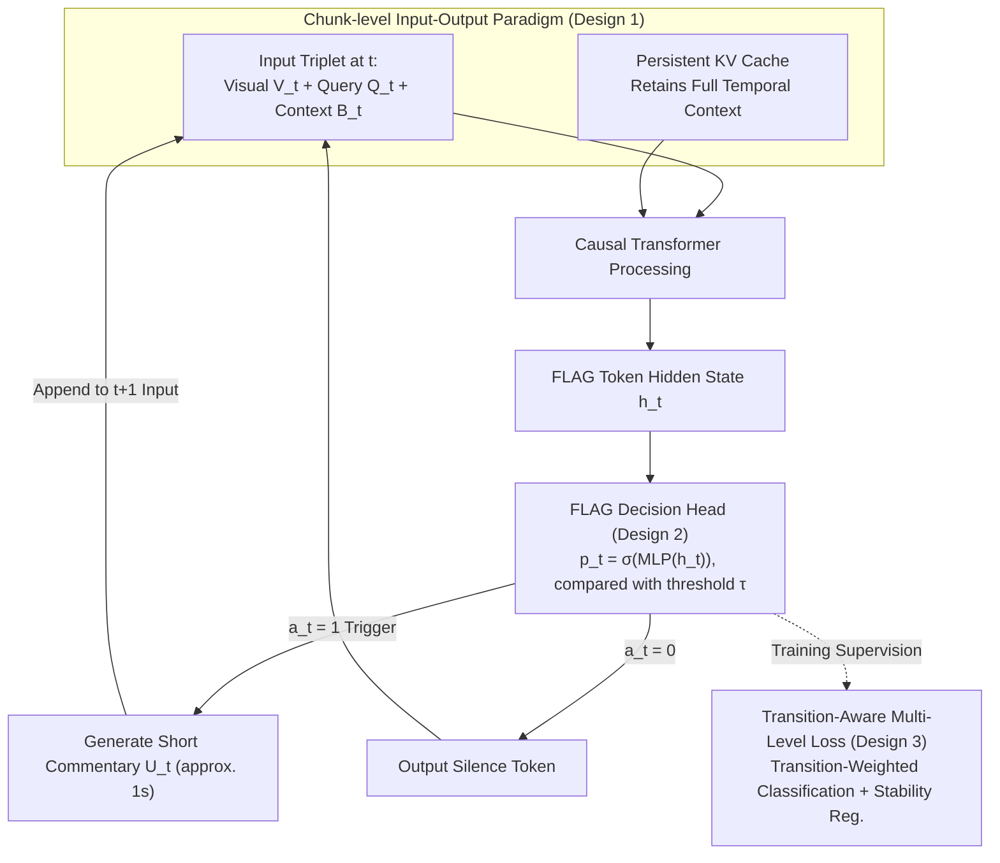

# ProAct-VL: A Proactive VideoLLM for Real-Time AI Companions

**Conference**: ICML 2026  
**arXiv**: [2603.03447](https://arxiv.org/abs/2603.03447)  
**Code**: To be confirmed  
**Area**: Video Understanding / Real-Time Multimodal Interaction  
**Keywords**: Video Large Language Model, Streaming Inference, Proactive Response, Real-Time Interaction, Game Commentary

## TL;DR
ProAct-VL enables VideoLLMs to autonomously decide **when to respond** and generate short-segment commentary under streaming input via a chunk-level I/O paradigm, a lightweight FLAG decision head, and transition-aware loss functions. It achieves ~1s low latency and strong proactivity—obtaining a TimeDiff of only 1.20s and a trigger F1 of 63.25% in game commentary tasks, significantly outperforming offline models like GPT-4o.

## Background & Motivation

**Background**: Recent developments in Video Large Language Models (VideoLLMs) support video perception and real-time user interaction. However, most existing works adopt either a passive "chunk-sequential processing" response mode or a passive streaming mode that lacks response control despite low latency.

**Limitations of Prior Work**:
- Proactive response models decide when to speak but generate complete long answers once triggered, leading to high latency and coarse temporal granularity.
- Real-time models emphasize fast generation but lack explicit control over "speaking behavior," often resulting in over-talking.
- Existing methods struggle to balance proactive timing with content quality.

**Key Challenge**: A true AI companion (e.g., a game commentator) requires coordination across three layers: (1) low-latency inference, (2) autonomous decision on when to respond, and (3) control over the quality and quantity of generated content. This "triangular" relationship is difficult to optimize simultaneously.

**Goal**: Build a unified framework to solve the issues of "when to speak," "what to say," and "how fast to speak."

**Key Insight**: Game commentary and game guidance contexts offer rich, automatically evaluable interaction patterns, making them suitable for evaluation. Large-scale annotated datasets are constructed to drive model training.

**Core Idea**: A unified modeling of streaming video understanding and proactive response using a chunk-level I/O paradigm, a FLAG token decision head, and transition-aware loss functions.

## Method

### Overall Architecture
At each timestep $t$ (1-second chunk):
1. **Input**: A triplet $(V_t, Q_t, B_t)$—current window visual content, optional user query, and environmental context (including summaries of previous commentary).
2. **Processing**: A persistent KV cache $\mathcal{K}_{t-1}$ maintains full context, processed by a causal Transformer.
3. **Decision**: Speaking probability $p_t$ is extracted from the hidden state $h_t$ of the special `<|FLAG|>` token and compared with a threshold $\tau$ to obtain a binary decision $a_t$.
4. **Output**: If $a_t = 1$, a short-segment commentary $U_t$ (approx. 1s) is generated; otherwise, a silence token is output. Generated $U_t$ is appended to the context for $t+1$.

The entire process revolves around a cyclic 1-second data flow: "Input Triplet + Persistent KV Cache → Causal Transformer → FLAG Decision → Commentary/Silence → Feed back to the next second." The three core designs correspond to these stages.

### Key Designs

**1. Chunk-level I/O Paradigm: Processing continuous video streams via 1-second chunks for online causal inference.**

Offline models wait for the entire video to be processed, making real-time interaction impossible. ProAct-VL discretizes the video stream into fixed-duration (1s) chunks. At each step $t$, the model generates $(U_t, \mathcal{K}_t)$ from triplet $(V_t, Q_t, B_t)$ and persistent KV cache $\mathcal{K}_{t-1}$. Generated commentary $U_t$ is immediately appended to the input of $t+1$, forming a continuous dialogue history. This avoids redundant computation while preserving temporal context. Long responses naturally span multiple subsequent chunks without blocking the current second.

**2. Lightweight FLAG Decision Head: Decoupling "when to speak" from "what to say."**

Proactive models often suffer from high latency due to long answers, while real-time models may over-talk. ProAct-VL inserts a special `<|FLAG|>` token at the end of each user message. A lightweight MLP calculates speaking probability $p_t = \sigma(\text{MLP}(h_t))$ from its hidden state. The binary decision is $a_t = \mathbb{I}[p_t \geq \tau]$. This head is efficient and allows for independent optimization of the "speaking policy," making training and inference cleaner.

**3. Transition-Aware + Stability Multi-Level Loss: Modeling response as sequence decision-making.**

IID frame-by-frame classification ignores the rarity of state transitions (Silence ↔ Speaking). $\mathcal{L}_{\text{resp}}$ consists of two components. The transition-aware classification loss $\mathcal{L}_{\text{cls}}$ applies weight $w_t = \gamma$ during state transitions ($y_t \neq y_{t-1}$) and $w_t = 1$ otherwise. The stability regularization $\mathcal{L}_{\text{reg}}$ includes: local temporal consistency $\mathbb{E}[(p_t - p_{t-1})^2 \mid y_t = y_{t-1}]$ to smooth probabilities within a state, and global speaking rate constraint $(\mathbb{E}[p_t] - \mathbb{E}[y_t])^2$ to align the average speaking duration with human commentators. Total loss: $\mathcal{L} = \mathcal{L}_{\text{main}} + \alpha \mathcal{L}_{\text{resp}}$.

## Key Experimental Results

### Main Results (Live Gaming Benchmark)

| Model Category | Model | CC ↑ | LiveU ↑ | FinalQ ↑ | TimeDiff ↓ | F1 ↑ |
|---------|------|------|---------|---------|----------|------|
| Offline | GPT-4o | 39.42 | 4.62 | 4.80 | 3.07 | 54.88 |
| Offline | Gemini 2.5 Pro | — | 4.70 | 4.82 | 2.59 | 49.23 |
| Proactive | VideoLLM-online | 13.78 | 3.56 | 1.74 | 12.59 | 6.54 |
| Proactive | MMDuet | 20.08 | 2.67 | 2.68 | 26.72 | 0.18 |
| Proactive | Livestar | 8.59 | 3.14 | 2.41 | 27.33 | 0.20 |
| Real-time | LiveCC-7B-Base | 38.88 | 3.85 | 3.83 | 11.35 | 36.10 |
| Real-time | StreamingVLM | 14.89 | 3.49 | 2.65 | 2.21 | 50.67 |
| **Ours** | **ProAct-VL** | **49.23** | **6.52** | **5.03** | **1.20** | **63.25** |

CC = Win rate vs. Gemini 2.5 Pro; LiveU = Streaming segment quality; FinalQ = Overall script quality; TimeDiff = Response time deviation (s); F1 = Trigger accuracy. ProAct-VL is optimal across all metrics, especially in response timing (1.20s) and trigger accuracy (63.25%).

### Ablation Study

| Config | CC | TimeDiff | P | R | F1 | Notes |
|------|-----|---------|------|-----|------|------|
| $\mathcal{L}_{\text{cls}}$ only | 45.54 | 18.50 | 12.13 | 14.00 | 11.03 | Classification loss alone |
| $\mathcal{L}_{\text{reg}}$ only | 47.53 | 8.28 | 45.20 | 67.02 | 47.39 | Stability reg. alone |
| **Full** | **50.91** | **3.41** | **65.72** | **62.41** | **60.08** | Combined losses |

### Key Findings
- Removing $\mathcal{L}_{\text{reg}}$ has the greatest impact—F1 drops by 49.05 and TimeDiff increases by 15.09, highlighting the necessity of stability regularization.
- Removing $\mathcal{L}_{\text{cls}}$ also leads to performance degradation, though less severe than regularization; the two terms are complementary.
- Long-sequence stability: Streaming Commentary increased from 73.75% to 82.03% (10-50 min videos); while response quality slightly decayed, it remained stable (F1 from 74.42% to 69.23%), significantly outperforming StreamingVLM.

## Highlights & Insights
- **Unification of Proactivity and Real-time performance**: Traditional trade-offs forced a choice between passive/fast or proactive/slow. Ours resolves this by decoupling decision and generation, achieving high proactivity at ~1s latency.
- **Transition-Aware Weighting**: Treating state transitions as rare events with high weights ($\gamma = 5$). The core insight is that transitions are more critical than persistence in sequence decision-making.
- **High-Quality Labeling Pipeline**: A three-stage process using WhisperX ASR + Qwen3 sentiment labeling + DeepSeek domain error correction ensures high-precision transcription adaptable to other multimodal datasets.

## Limitations & Future Work
- The dataset is restricted to the gaming domain (12 popular games). Generalization to sports commentary or news broadcasting is limited.
- CC/LiveU/FinalQ metrics are computed by closed-source LLMs (GPT-5.1), limiting reproducibility; cross-lingual/modal human verification is required.
- The response decision mechanism is relatively simple (FLAG hidden state + MLP), potentially ignoring fine-grained visual signals like motion intensity.
- Future work: Extension to more real-time interaction fields; integration of multimodal features (audio emotion, gestures); exploration of threshold-free decision strategies.

## Related Work & Insights
- **vs. Proactive models (VideoLLM-online/MMDuet)**: These generate full answers upon triggering, causing high latency (>10s) and low accuracy (F1 < 10%). Ours uses short segments (1s) and decoupled decisions to maintain proactivity without tail latency.
- **vs. Real-time models (LiveCC/StreamingVLM)**: These optimize inference speed but lack "when to speak" control, leading to over-generation. ProAct-VL adds "silence" capability via an explicit response head.
- **vs. Offline models (GPT-4o/Gemini)**: Strong understanding but not real-time. ProAct-VL approaches their performance (CC 49.23 vs GPT-4o 39.42) while supporting real-time deployment.

## Rating
- Novelty: ⭐⭐⭐⭐  Unified framework for proactivity and real-time; clever combination of transition-aware loss and FLAG mechanism.
- Experimental Thoroughness: ⭐⭐⭐⭐⭐  Covers 3 interaction scenarios, 2 sets, long-sequence stability, ablation, efficiency, and human validation.
- Writing Quality: ⭐⭐⭐⭐  Clear logic and intuitive charts.
- Value: ⭐⭐⭐⭐⭐  Addresses AI companion application needs; provides a deployable system and a 561-hour annotated dataset.

<!-- RELATED:START -->

## Related Papers

- [\[CVPR 2026\] StreamRAG: Enhancing Real-Time Video Understanding with Retrieval Augmentation](../../CVPR2026/video_understanding/streamrag_enhancing_real-time_video_understanding_with_retrieval_augmentation.md)
- [\[AAAI 2026\] Uncovering Zero-Shot Generalization Gaps in Time-Series Foundation Models Using Real-World Videos](../../AAAI2026/video_understanding/uncovering_zero-shot_generalization_gaps_in_time-series_foundation_models_using_.md)
- [\[ECCV 2024\] EgoPoser: Robust Real-Time Egocentric Pose Estimation from Sparse and Intermittent Observations Everywhere](../../ECCV2024/video_understanding/egoposer_robust_real-time_egocentric_pose_estimation_from_sparse_and_intermitten.md)
- [\[CVPR 2026\] Building a Precise Video Language with Human-AI Oversight](../../CVPR2026/video_understanding/building_a_precise_video_language_with_human-ai_oversight.md)
- [\[CVPR 2026\] Your One-Stop Solution for AI-Generated Video Detection](../../CVPR2026/video_understanding/your_one-stop_solution_for_ai-generated_video_detection.md)

<!-- RELATED:END -->
