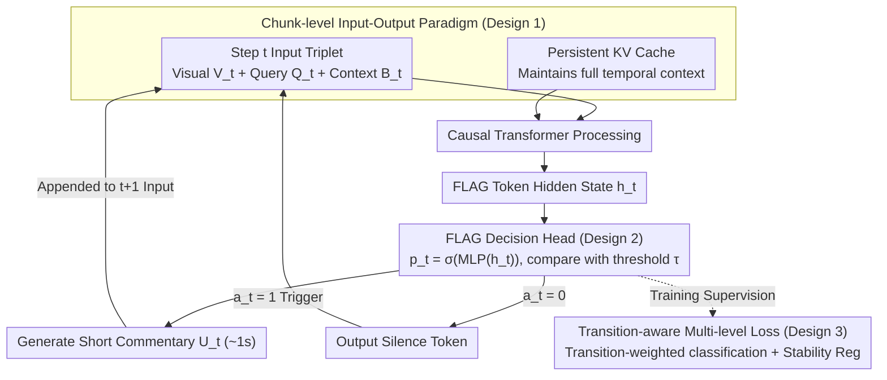

# ProAct-VL: A Proactive VideoLLM for Real-Time AI Companions

**Conference**: ICML 2026  
**arXiv**: [2603.03447](https://arxiv.org/abs/2603.03447)  
**Code**: TBD  
**Area**: Video Understanding / Real-time Multimodal Interaction  
**Keywords**: Video Large Language Model, Streaming Inference, Proactive Response, Real-time Interaction, Game Commentary

## TL;DR
ProAct-VL enables VideoLLMs to autonomously decide **when to respond** and generate short-segment commentary under streaming input through a chunk-level I/O paradigm, a lightweight FLAG decision head, and a transition-aware loss function. It achieves ~1s low latency and strong proactivity—obtaining a TimeDiff of only 1.20s and a trigger F1 of 63.25% in game commentary tasks, significantly outperforming offline models like GPT-4o.

## Background & Motivation

**Background**: Recent developments in Video Large Language Models (VideoLLMs) support video perception and real-time user interaction. However, most works adopt either a passive response pattern through "chunk-at-a-time" sequential processing or a passive streaming approach that lacks response control despite low latency.

**Limitations of Prior Work**:
- Proactive response models decide when to speak but generate complete long answers once triggered, leading to high latency and coarse temporal granularity.
- Real-time models emphasize fast generation but lack explicit control over "speaking behavior," often resulting in over-talking.
- Existing methods struggle to balance proactive timing with content quality.

**Key Challenge**: A true AI companion (e.g., a game commentator) requires coordination across three layers: (1) low-latency inference, (2) autonomous decision-making on when to respond, and (3) control over the quality and quantity of generated content. These three objectives form a "triangle" that is difficult to optimize simultaneously.

**Goal**: To construct a unified framework that addresses "when to speak," "what to say," and "how fast to speak."

**Key Insight**: Game commentary and guidance scenarios possess rich, automatically evaluable interaction patterns, making them suitable for specific evaluation. A large-scale annotated dataset is constructed to drive model training.

**Core Idea**: Unified modeling of streaming video understanding and proactive response using a chunk-level I/O paradigm, a FLAG token decision head, and transition-aware loss functions.

## Method

### Overall Architecture
At each time step $t$ (1-second chunk):
1. **Input**: A triplet $(V_t, Q_t, B_t)$—current window visual content, optional user query, and environmental context (including summaries of previous commentary).
2. **Processing**: A persistent KV cache $\mathcal{K}_{t-1}$ maintains full context, processed by a causal Transformer.
3. **Decision**: The speaking probability $p_t$ is extracted from the hidden state $h_t$ of a special `<|FLAG|>` token and compared against a threshold $\tau$ to obtain a binary decision $a_t$.
4. **Output**: If $a_t = 1$, a short-segment commentary $U_t$ (approx. 1s) is generated; otherwise, a silence token is output. The generated $U_t$ is automatically appended to the context for input at $t+1$.

The entire pipeline revolves around a per-second data flow loop: "Input triplet + Persistent KV cache → Causal Transformer → FLAG decision → Commentary/Silence → Feed back to next second." Three core designs correspond to these stages: chunk-level I/O supports the data flow and cache, the FLAG head manages "when to speak," and multi-layer losses supervise decision probabilities during training.

### Key Designs

**1. Chunk-level Input-Output Paradigm: Segmenting continuous video streams into 1s chunks for online causal processing**

Offline models must wait for the entire video to be processed before answering, precluding real-time interaction. ProAct-VL discretizes the video stream into fixed-duration (1s) chunks: at each step $t$, the model generates $(U_t, \mathcal{K}_t)$ from the current triplet $(V_t, Q_t, B_t)$ and a persistent KV cache $\mathcal{K}_{t-1}$. The generated commentary $U_t$ is immediately appended to the $t+1$ input, forming a continuous dialogue history. Relying on persistent cache rather than re-reading the entire history saves redundant computation while preserving temporal context; for long responses, the model naturally continues writing across subsequent chunks without blocking the current second.

**2. Lightweight FLAG Decision Head: Decoupling "when to speak" from "what to say" for independent learning**

Proactive models suffer from high latency due to long answers upon triggering, while low-latency models often over-talk. This stems from coupling the decision to speak with content generation. ProAct-VL inserts a special `<|FLAG|>` token at the end of each message. A lightweight MLP + sigmoid computes the speaking probability $p_t = \sigma(\text{MLP}(h_t))$ from its hidden state, with the binary decision $a_t = \mathbb{I}[p_t \geq \tau]$. The decision head is extremely lightweight and does not create an inference bottleneck. By isolating "when to speak" as an optimizable policy, the model learns more efficiently when to remain silent or start speaking, streamlining both training and inference.

**3. Transition-aware + Stability Multi-level Loss: Training response as sequential decision-making rather than independent per-frame classification**

Independent per-frame judgments of "to speak or not" ignore the fact that state transitions (silence ↔ speaking) are rare but critical events, and probabilities should be smooth within a state. Therefore, $\mathcal{L}_{\text{resp}}$ consists of two parts. The transition-aware classification loss $\mathcal{L}_{\text{cls}}$ weights samples as $w_t = \gamma$ (when $y_t \neq y_{t-1}$, i.e., at a transition) and $w_t = 1$ otherwise, focusing on these rare events. The stability regularization $\mathcal{L}_{\text{reg}}$ includes two terms: local temporal consistency $\mathbb{E}[(p_t - p_{t-1})^2 \mid y_t = y_{t-1}]$ ensures probability stability during a state, and a global speaking rate constraint $(\mathbb{E}[p_t] - \mathbb{E}[y_t])^2$ aligns the model's average speaking duration with human commentators. Total loss is $\mathcal{L} = \mathcal{L}_{\text{main}} + \alpha \mathcal{L}_{\text{resp}}$. Ablations show that removing $\mathcal{L}_{\text{reg}}$ leads to a sharp F1 drop and TimeDiff spike, proving that modeling response as a sequence problem with transition weights and smoothing constraints is vital for stable proactivity.

## Key Experimental Results

### Main Results (Live Gaming Benchmark)

| Model Category | Model | CC ↑ | LiveU ↑ | FinalQ ↑ | TimeDiff ↓ | F1 ↑ |
|:---|:---|:---|:---|:---|:---|:---|
| Offline | GPT-4o | 39.42 | 4.62 | 4.80 | 3.07 | 54.88 |
| Offline | Gemini 2.5 Pro | — | 4.70 | 4.82 | 2.59 | 49.23 |
| Proactive | VideoLLM-online | 13.78 | 3.56 | 1.74 | 12.59 | 6.54 |
| Proactive | MMDuet | 20.08 | 2.67 | 2.68 | 26.72 | 0.18 |
| Proactive | Livestar | 8.59 | 3.14 | 2.41 | 27.33 | 0.20 |
| Low Latency | LiveCC-7B-Base | 38.88 | 3.85 | 3.83 | 11.35 | 36.10 |
| Low Latency | StreamingVLM | 14.89 | 3.49 | 2.65 | 2.21 | 50.67 |
| **Ours** | **ProAct-VL** | **49.23** | **6.52** | **5.03** | **1.20** | **63.25** |

CC = Win rate vs. Gemini 2.5 Pro; LiveU = Streaming snippet commentary quality; FinalQ = Overall script quality; TimeDiff = Response time deviation (s); F1 = Trigger accuracy. ProAct-VL is optimal across all metrics, particularly in response timing (1.20s) and trigger accuracy (63.25%), far surpassing baselines.

### Ablation Study

| Config | CC | TimeDiff | P | R | F1 | Note |
|:---|:---|:---|:---|:---|:---|:---|
| $\mathcal{L}_{\text{cls}}$ only | 45.54 | 18.50 | 12.13 | 14.00 | 11.03 | Classification loss alone |
| $\mathcal{L}_{\text{reg}}$ only | 47.53 | 8.28 | 45.20 | 67.02 | 47.39 | Stability reg alone |
| **Full** | **50.91** | **3.41** | **65.72** | **62.41** | **60.08** | Combined loss terms |

### Key Findings
- Removing $\mathcal{L}_{\text{reg}}$ has the greatest impact—F1 drops by 49.05 and TimeDiff increases by 15.09, highlighting the necessity of stability regularization.
- Removing $\mathcal{L}_{\text{cls}}$ also leads to performance degradation, though less severe than removing regularization; the two terms are complementary.
- Long-sequence stability: Streaming Commentary increased from 73.75% to 82.03% (10-50 min videos); while response quality slightly decayed, it remained stable (F1 from 74.42% to 69.23%), significantly outperforming StreamingVLM in long-term stability.

## Highlights & Insights
- **Unification of Proactivity and Streaming Real-time**: Traditional trade-offs were "passive and fast" vs. "proactive but slow." By decoupling decision and generation, this work achieves strong proactivity under ~1s latency. This design can be transferred to other real-time decision interaction tasks (customer service, live subtitling).
- **Transition-aware Weighting Mechanism**: Treating state transitions as rare events with high weight ($\gamma = 5$) reflects the insight that "transitions in sequential decisions are often more important than persistence," which is instructive for any temporal classification task.
- **High-quality Annotation Pipeline for Live Gaming Dataset**: A three-stage pipeline (WhisperX ASR + Qwen3 emotional tagging + DeepSeek domain error correction) ensures high-precision transcription. This pipeline (especially LLM correction + cleaning) can be reused for other multimodal datasets.

## Limitations & Future Work
- The dataset is limited to the gaming domain (covering 12 popular games, but primarily focused on entertainment); generalization to sports commentary or news broadcasting remains limited.
- Metrics like CC/LiveU/FinalQ are computed by closed-source LLMs (GPT-5.1), limiting reproducibility; human verification across languages/modalities is still needed.
- The response decision mechanism is relatively simple—relying only on the FLAG token hidden state + MLP, potentially ignoring fine-grained visual signals (motion magnitude, scene changes).
- Future directions: Expanding to more real-time interaction fields; introducing multimodal features (audio emotion, gestures) to enhance decisions; exploring threshold-free decision strategies (directly regressing latency instead of binary classification).

## Related Work & Insights
- **vs. Proactive Models (VideoLLM-online / MMDuet)**: These generate full answers upon "speaking," leading to high latency (> 10s) and low trigger accuracy (F1 < 10%). Ours enforces short-segment (1s) generation + decoupled decisions to ensure proactivity while avoiding long-tail latency.
- **vs. Low-latency Models (LiveCC / StreamingVLM)**: These optimize inference speed but lack control over "when to speak," often over-generating. ProAct-VL adds "silence" capability via an explicit response head, enabling restrained human-like interaction.
- **vs. Offline Models (GPT-4o / Gemini)**: Strong understanding but cannot operate in real-time. ProAct-VL achieves comparable performance (CC 49.23 vs. GPT-4o 39.42) while supporting true real-time deployment.

## Rating
- Novelty: ⭐⭐⭐⭐ Unified framework for proactivity and real-time performance; transition-aware weighted loss + FLAG decision mechanism are cleverly combined.
- Experimental Thoroughness: ⭐⭐⭐⭐⭐ Covers 3 interaction scenarios + 2 test sets (in-domain + out-of-domain) + long-sequence stability + ablation + inference efficiency + human validation.
- Writing Quality: ⭐⭐⭐⭐ Clear logic and intuitive diagrams; specific technical details (ChatML format, RoPE modification) provided in appendices.
- Value: ⭐⭐⭐⭐⭐ Addresses real-world needs for AI companions; provides a deployable system + 561-hour annotated dataset; directly advances streaming/gaming/virtual assistants.

<!-- RELATED:START -->

## Related Papers

- [\[CVPR 2026\] StreamRAG: Enhancing Real-Time Video Understanding with Retrieval Augmentation](../../CVPR2026/video_understanding/streamrag_enhancing_real-time_video_understanding_with_retrieval_augmentation.md)
- [\[AAAI 2026\] Uncovering Zero-Shot Generalization Gaps in Time-Series Foundation Models Using Real-World Videos](../../AAAI2026/video_understanding/uncovering_zero-shot_generalization_gaps_in_time-series_foundation_models_using_.md)
- [\[ACL 2026\] Response-G1: Explicit Scene Graph Modeling for Proactive Streaming Video Understanding](../../ACL2026/video_understanding/response-g1_explicit_scene_graph_modeling_for_proactive_streaming_video_understa.md)
- [\[ECCV 2024\] EgoPoser: Robust Real-Time Egocentric Pose Estimation from Sparse and Intermittent Observations Everywhere](../../ECCV2024/video_understanding/egoposer_robust_real-time_egocentric_pose_estimation_from_sparse_and_intermitten.md)
- [\[CVPR 2026\] Building a Precise Video Language with Human-AI Oversight](../../CVPR2026/video_understanding/building_a_precise_video_language_with_human-ai_oversight.md)

<!-- RELATED:END -->
