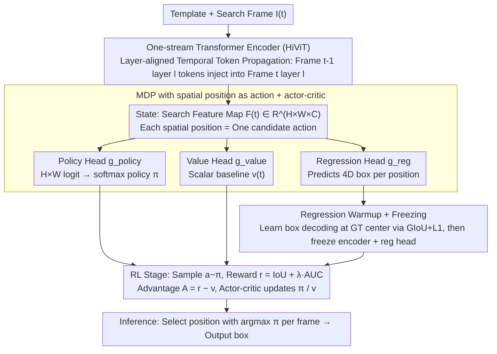

# RELO: Reinforcement Learning to Localize for Visual Object Tracking

**Conference**: ICML 2026  
**arXiv**: [2605.07379](https://arxiv.org/abs/2605.07379)  
**Code**: https://github.com/Multimedia-Analytics-Laboratory/RELO (Available)  
**Area**: Video Understanding / Visual Object Tracking / Reinforcement Learning  
**Keywords**: Visual Tracking, RL Localization, MDP, AUC Reward, Temporal Token Propagation

## TL;DR
RELO reformulates the "where is the target" problem in single object tracking as an MDP on a spatial feature map. It treats each spatial position as an action and replaces traditional manual center heatmap supervision with actor-critic + direct IoU/AUC rewards. Coupled with two stabilization designs—"regression warmup" and "layer-aligned temporal token propagation"—it achieves SOTA with 57.5% AUC on LaSOText.

## Background & Motivation

**Background**: Modern single object tracking (SOT) is largely dominated by the one-stream Transformer paradigm (e.g., OSTrack, ODTrack, ARTrack, SUTrack), which utilizes center heatmap classification and regression branches. Typically, Gaussian-smoothed center heatmaps or binary masks serve as classification supervision to indicate high-response areas, while the regression branch outputs the bounding box.

**Limitations of Prior Work**: This "prior-driven localization" suffers from two deep-seated issues: **(1) Misalignment between supervision signals and evaluation metrics**: Models are forced to fit an artificial center distribution during training, whereas evaluation only cares about IoU and AUC. The model cannot directly perceive the final IoU resulting from picking a specific position. **(2) Introduction of non-essential manual heuristics**: Parameters like Gaussian variance, binary mask thresholds, and corner expectation boundaries are sensitive across datasets and cannot be learned end-to-end.

**Key Challenge**: The fundamental goal of tracking is to "select a spatial position $\rightarrow$ its corresponding box maximizes GT IoU." However, existing pipelines insert a "center classification" proxy task, where the optimal solution for the proxy task does not coincide with the real task. This is particularly problematic in cross-category long-term tracking scenarios like LaSOText, where center priors become unreliable due to appearance drift.

**Goal**: To eliminate manual spatial priors and enable the model to learn "where to localize" directly from the ultimate feedback of tracking performance, while maintaining training stability.

**Key Insight**: The search feature map $\mathbf{F}^{(t)} \in \mathbb{R}^{H\times W \times C}$ of a one-stream tracker naturally serves as a discrete action space of size $H\times W$. Each position $(i,j)$ has a candidate box produced by the regression head. This constitutes a standard discrete action MDP where IoU/AUC are non-differentiable but quantifiable reward signals, ideal for policy gradient methods.

**Core Idea**: Use RL to learn "where to localize" without center/corner priors. Stability is ensured via a two-stage process: "warmup regression followed by policy learning." Temporal context is provided through layer-aligned temporal token propagation.

## Method

### Overall Architecture
Given a template frame $\mathbf{I}_{\text{temp}}$ and a search frame $\mathbf{I}^{(t)}$, a one-stream Transformer encoder (HiViT-T/B/L, pre-trained with Fast-iTPN) processes both to output $\mathbf{F}^{(t)} \in \mathbb{R}^{H\times W\times C}$, which serves as the state. Three parallel heads are used: the regression head $g_{\text{reg}}$ predicts 4D box coordinates $\mathbf{B}^{(t)} \in \mathbb{R}^{H\times W\times 4}$ at each position; the policy head $g_{\text{policy}}$ outputs $H\times W$ logits forming a softmax distribution $\pi(a_{ij}|\mathbf{F}^{(t)})$; and the value head $g_{\text{value}}$ provides a scalar reward estimate $v^{(t)}$. Training is split into two stages: **warmup**, where the regression head is supervised by GIoU+L1 at the GT center to learn "local feature $\rightarrow$ box" mapping and then frozen; and **RL stage**, where actions are sampled over $T=8$ frames to update the policy and value heads via actor-critic. Inference selects the argmax policy position frame-by-frame without test-time adaptation.

### Key Designs

1.  **Spatial Position as Action MDP + Actor-Critic Learning**:
    *   **Function**: Explicitly models the core decision of "which position to pick" as a policy optimized directly via IoU/AUC, bypassing the center heatmap proxy task.
    *   **Mechanism**: The action space is $\mathcal{A} = \{(i,j) | i \in \{1,...,H\}, j \in \{1,...,W\}\}$. The policy is a categorical distribution over logits. The reward is $r^{(t)} = \text{IoU}(\boldsymbol{b}^{(t)}_{a^{(t)}}, \boldsymbol{b}^{(t)}_{\text{gt}}) + \lambda \cdot \text{AUC}(\{\boldsymbol{b}^{(\tau)}_{a^{(\tau)}}, \boldsymbol{b}^{(\tau)}_{\text{gt}}\}_{\tau=1}^T)$, providing both immediate single-frame feedback and global trajectory rewards (default $\lambda=1$). The advantage is $A^{(t)} = r^{(t)} - v^{(t)}$. The loss combines REINFORCE-style policy loss $\ell_{\text{policy}} = -\frac{1}{T}\sum_t A^{(t)} \log \pi(a^{(t)}|\mathbf{F}^{(t)})$ and value MSE. Crucially, rewards do not need to be differentiable, allowing direct use of evaluation metrics.
    *   **Design Motivation**: Standard supervision suffers from "objective $\neq$ metric." RL directly aligns with the evaluation metric. With an action space of $H\times W = 256$, REINFORCE with actor-critic is sufficient without heavy frameworks like PPO.

2.  **Regression Warmup + Freezing for Stable RL**:
    *   **Function**: Prevents RL from collapsing in a 256-action space when training from scratch.
    *   **Mechanism**: Training regression and policy jointly from random weights results in noisy rewards because initial "actions" correspond to poor bounding boxes. In the warmup phase, $g_{\text{reg}}$ is supervised only at the GT center using GIoU + L1 to teach the model box decoding (not localization). Once warmup is complete, the encoder and $g_{\text{reg}}$ are frozen. In the RL stage, only $g_{\text{policy}}$ and $g_{\text{value}}$ are updated. Since the regression head now provides reasonable boxes for any action, the reward signal is clean and the policy stabilizes.
    *   **Design Motivation**: RL sample efficiency is poor in large action spaces. Decoupling "how to map" (via dense supervision) from "what to choose" (via RL) is a practical stabilization technique.

3.  **Layer-Aligned Temporal Token Propagation**:
    *   **Function**: Provides temporal context across frames while avoiding semantic misalignment between mismatched layers.
    *   **Mechanism**: Prior methods (e.g., ODTrack) often inject deep-layer temporal tokens into shallow layers of the next frame, leading to semantic mismatch. This method uses layer alignment: temporal tokens $\mathbf{T}^{(t-1)}_l$ from layer $l$ of the previous frame are passed only to layer $l$ of the current frame. The input to layer $l$ is $\mathbf{H}^{(t)}_l = [\mathbf{Z}^{(t)}_l, \mathbf{X}^{(t)}_l, \mathbf{T}^{(t)}_l, \mathbf{T}^{(t-1)}_l]$. This keeps the token count constant per layer and ensures cross-frame exchange occurs at matching semantic levels.
    *   **Design Motivation**: Different layers in a Transformer capture different levels of abstraction. Layer alignment respects the hierarchical structure of the encoder with negligible computational overhead.

### Loss & Training
*   **Warmup**: GIoU + L1, supervised only at the GT center location for several epochs.
*   **RL**: $\ell = \ell_{\text{policy}} + 0.5 \ell_{\text{value}}$. 90 epochs, 2500 sequences per epoch, sequence length $T=8$, $\lambda=1$. AdamW optimizer with $lr=10^{-4}$, decayed by 0.1 after 72 epochs.
*   **Data**: COCO + LaSOT + GOT-10k + TrackingNet + VastTrack. Template search region is $2\times$ and search region is $4\times$ the target size. Augmentations include horizontal flipping and brightness jittering.
*   **Inference**: Frame-by-frame selection of the box at the $\arg\max \pi(\cdot|\mathbf{F}^{(t)})$ position. No template update by default.

## Key Experimental Results

### Main Results

| Method | LaSOT AUC | LaSOText AUC | TrackingNet AUC | GOT-10k AO |
|---|---|---|---|---|
| OSTrack-B256 | 69.1 | 47.4 | 83.1 | 71.0 |
| SeqTrack-B256 | 69.9 | 49.5 | 83.3 | 74.7 |
| ARTrack-B256 | 70.4 | 46.4 | 84.2 | 73.5 |
| SUTrack-B224 | 73.2 | 53.1 | 85.7 | 77.9 |
| ARPTrack-B256 | 72.6 | 52.0 | 85.5 | 77.7 |
| **RELO-B256** | **73.3** | **54.2** | **86.4** | **80.5** |
| ODTrack-L384 | 74.0 | 53.9 | 86.1 | 78.2 |
| LoRAT-L224 | 74.2 | 52.8 | 85.0 | 75.7 |
| SUTrack-L224 | 73.5 | 54.0 | 86.5 | 81.0 |
| ARPTrack-L384 | 74.2 | 54.2 | 86.6 | 81.5 |
| **RELO-L256** | **75.1** | **57.5** | **87.3** | **81.8** |

### Ablation Study

| Model Variant | #Params (M) | FLOPs (G) | RTX4090 FPS | LaSOT AUC |
|---|---|---|---|---|
| RELO-T256 (HiViT-T) | 22 (+2 value) | 8 | 91 | 70.4 |
| RELO-B256 (HiViT-B) | 70 (+2) | 34 | 50 | 73.3 |
| RELO-L256 (HiViT-L) | 247 (+2) | 114 | 32 | 75.1 |

### Key Findings
*   **Significant Gain on LaSOText**: RELO-L256 achieves 57.5 AUC (+3.5 over SUTrack-L), compared to a +0.9 gain on LaSOT. This highlights the advantage of RL reward optimization in long-term, cross-category scenarios where center priors are least reliable.
*   **Effectiveness on Small Models**: RELO-T256 (22M params, 91 FPS) outperforms SUTrack-T224, suggesting that the benefits of reward-driven localization stem from the change in learning objective rather than model capacity.
*   **Template Update**: SOTA results are achieved without template updates on LaSOT/LaSOText, demonstrating the robustness of the RL-learned policy.
*   **Zero Inference Cost for Value Head**: The value head (+2M params) is only used during training and removed during inference, which is standard for actor-critic deployment.

## Highlights & Insights
*   **Training-Metric Alignment**: RELO breaks the assumption that non-differentiable metrics like AUC cannot be optimized directly. It proves that RL is highly controllable on a 256-dimensional discrete action space, a concept transferable to other tasks like segmentation (mIoU) or detection (AP).
*   **Warmup-then-Freeze Strategy**: Decoupling "feature decoding" from "decision making" is a critical engineering trick for RL in perception. It effectively provides a stable feature space for policy search.
*   **Layer-Aligned Temporal Propagation**: This design principle respects the hierarchical semantic levels of Transformers, providing stable gains with zero additional computational cost compared to cross-layer mixing.

## Limitations & Future Work
*   Focused on single object tracking; extensions to Multi-Object Tracking (MOT) association and reappearances are yet to be explored.
*   Reward shaping currently uses a fixed $\lambda=1$; adaptive scheduling for different sequence lengths could be investigated.
*   The encoder does not participate in the RL stage via end-to-end training due to stability concerns; enabling this without collapse is a future direction.
*   Comparisons with recent LLM-based or VLM trackers for open-vocabulary tracking are missing.

## Related Work & Insights
*   **vs OSTrack / SUTrack / ODTrack**: These rely on Gaussian-smoothed center maps for supervision. RELO's superior performance on LaSOText demonstrates that RL-based objectives are more robust than manual priors.
*   **vs SLT (Kim 2022)**: SLT fine-tunes an existing prior-driven tracker with RL. RELO uses RL as the fundamental localization mechanism from scratch (after warmup), avoiding post-hoc inductive biases.
*   **vs ARTrack / SeqTrack**: While these use autoregressive token sequences for box regression (supervised learning), RELO treats tracking as policy learning, aligning more closely with the evaluation metrics.

## Rating
*   Novelty: ⭐⭐⭐⭐ Successfully establishes RL as the primary localization mechanism in visual tracking.
*   Experimental Thoroughness: ⭐⭐⭐⭐⭐ Comprehensive evaluation across 7 benchmarks, 3 model scales, and edge deployment.
*   Writing Quality: ⭐⭐⭐⭐ Rigorous formulations and clear pipeline visualizations.
*   Value: ⭐⭐⭐⭐ The shift towards "Training-Metric Alignment" via RL provides significant inspiration for the perception community.

<!-- RELATED:START -->

## Related Papers

- [\[ICML 2026\] Unified Multimodal Visual Tracking with Dual Mixture-of-Experts](unified_multimodal_visual_tracking_with_dual_mixture-of-experts.md)
- [\[CVPR 2026\] Dual-Agent Reinforcement Learning for Adaptive and Cost-Aware Visual-Inertial Odometry](../../CVPR2026/video_understanding/dual-agent_reinforcement_learning_for_adaptive_and_cost-aware_visual-inertial_od.md)
- [\[CVPR 2026\] An Efficient Token Compression Framework for Visual Object Tracking](../../CVPR2026/video_understanding/an_efficient_token_compression_framework_for_visual_object_tracking.md)
- [\[ICML 2026\] AVTrack: Audio-Visual Tracking in Human-centric Complex Scenes](avtrack_audio-visual_tracking_in_human-centric_complex_scenes.md)
- [\[CVPR 2026\] TGTrack: Temporal Generative Learning for Unified Single Object Tracking](../../CVPR2026/video_understanding/tgtrack_temporal_generative_learning_for_unified_single_object_tracking.md)

<!-- RELATED:END -->
