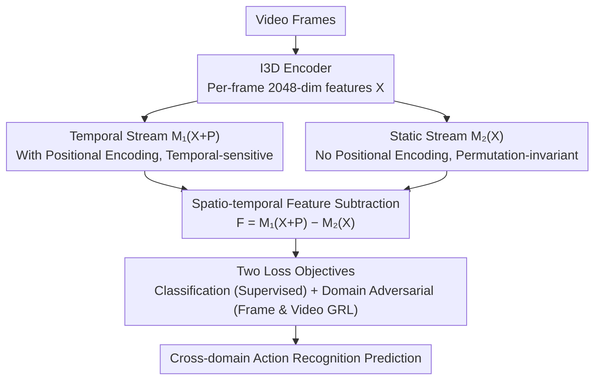

# Return of Frustratingly Easy Unsupervised Video Domain Adaptation

**Conference**: ICML 2026  
**arXiv**: [2605.19510](https://arxiv.org/abs/2605.19510)  
**Code**: TBC  
**Area**: Video Understanding / Unsupervised Domain Adaptation  
**Keywords**: Unsupervised Video Domain Adaptation (UVDA), Cross-domain Action Recognition, Spatio-temporal Feature Decoupling, Permutation Invariance

## TL;DR
This paper proposes MetaTrans—a "frustratingly easy" Unsupervised Video Domain Adaptation (UVDA) method. It decouples spatial and temporal domain gaps through spatio-temporal feature subtraction in a dual-stream Transformer. By using only two basic losses (supervised + domain adversarial), it outperforms complex SOTA methods and reduces hyperparameter search costs from exponential to linear.

## Background & Motivation

**Background**: Unsupervised Video Domain Adaptation (UVDA) aims to transfer video recognition models trained on labeled source domains to unlabeled target domains. Early works directly reused image UDA methods (e.g., DANN), ignoring temporal dependencies between video frames; recent SOTA works have only recently begun to treat temporal alignment explicitly.

**Limitations of Prior Work**: Recent methods, exemplified by TranSVAE, use VAE separation with 7 loss terms and 5 sub-modules to handle spatial and temporal differences simultaneously. While effective, the **complexity is overwhelming**—loss weights require thousands of combinations for searching, making the tuning cost far higher than the model itself.

**Key Challenge**: Can the loss function and modules be extremely simplified while maintaining the ability to "handle spatial/temporal differences separately"?

**Goal**: Design a "frustratingly easy" UVDA framework that achieves or even exceeds SOTA using only two basic losses.

**Key Insight**: The authors return to the classic UDA theory of Ben-David et al. (2006)—minimizing source risk + domain divergence is a necessary and sufficient condition. The root of the problem is not the number of loss terms, but **what kind of model architecture is used to absorb the complexity**.

**Core Idea**: Use a **spatio-temporal feature subtraction module** to explicitly subtract the "spatial domain gap" from features, such that the remaining temporal gap only needs a standard domain adversarial loss. A key observation is that the subtraction operation can only strictly decouple spatial components when the "static stream" possesses **permutation invariance**.

## Method

### Overall Architecture
MetaTrans consists of a "two-loss + two-stream architecture":

1. Use I3D to extract 2048-dimensional features per frame: $\mathbf{X} = [x_1, \ldots, x_T]$.
2. Temporal Stream $\mathcal{M}_1(\mathbf{X} + \mathbf{P})$: Adds positional encoding $\mathbf{P}$ to output temporal-sensitive features.
3. Static Stream $\mathcal{M}_2(\mathbf{X})$: No positional encoding, outputs permutation-invariant static features.
4. Subtract to obtain dynamic residuals: $\mathbf{F} = \mathcal{M}_1(\mathbf{X} + \mathbf{P}) - \mathcal{M}_2(\mathbf{X})$ (static features are replicated $T$ times along the temporal dimension before subtraction).
5. Domain adversarial loss is applied to $\mathbf{F}$ to align frame-level and video-level distributions (video-level via Frame Aggregation Network, FAN); the classifier is supervised by source labels and target pseudo-labels.

### Key Designs

**1. Permutation-invariant Static Feature Stream $\mathcal{M}_2$: Extracting "Static Semantics" with Order-Independent Structures**

To subtract the spatial domain gap from features, one must first have a feature path responsible solely for static content (background, scene style, lighting), which is inherently independent of frame order. $\mathcal{M}_2$ thus consists of self-attention without positional encoding, residual connections, LayerNorm, per-token feed-forward, and final global average pooling, ensuring identical output for any permutation of input frames (Theorem 1 provides a formal proof of permutation invariance). Ensuring invariance through the architecture itself is cleaner than adding regularization terms to "encourage" invariance and introduces no new hyperparameters.

**2. Spatio-temporal Feature Subtraction: Explicitly Removing Spatial Gaps to Simplify the Problem to Temporal Alignment**

Methods like TranSVAE rely on VAEs and 7 losses for spatial/temporal separation, resulting in extreme complexity. MetaTrans assumes per-frame features can be additively decomposed as $z_t = s + u_t$ (static + dynamic); thus, $\mathcal{M}_1(\mathbf{X}+\mathbf{P}) - \mathcal{M}_2(\mathbf{X})$ ideally leaves only the dynamic component, effectively subtracting the spatial gap. Even if $\mathcal{M}_2$ estimation is imperfect, Theorem 3 provides an upper bound for the residual Wasserstein distance—the error decreases monotonically as $\mathcal{M}_2$ improves. Compared to heavy VAE decoders, "direct subtraction" is the most economical, differentiable, and theoretically grounded decoupling method, effectively moving complexity from loss terms into the architecture.

**3. Two-loss Training Objective: Driving the Model with Only Supervision + Domain Adversarial Losses**

Since the spatial gap is removed by the architecture, the remaining temporal gap only needs a standard domain adversarial loss, eliminating the need for stacked loss terms. In the total objective $\mathcal{L} = \mathcal{L}_{cls} + \lambda_1 \mathcal{L}_{adv}$, $\mathcal{L}_{cls}$ is the cross-entropy for source labels and target pseudo-labels, while $\mathcal{L}_{adv}$ is the GRL domain adversarial loss at frame and video levels. This leaves only one hyperparameter $\lambda_1$. This directly corresponds to the theoretical lower bound in classic UDA (source risk + domain divergence), shifting the burden of "separating space and time" to the architecture rather than hard-tuning loss weights—thus reducing hyperparameter search costs from exponential to linear.

### Loss & Training
The first 100 epochs use only source labels for training; thereafter, target pseudo-labels are introduced for self-training. The optimizer is SGD with a learning rate of 1e-3. $\lambda_1$ follows a single schedule (linear warm-up to 1.0).

## Key Experimental Results

### Main Results

UCF-HMDB (Cross-domain Action Recognition):

| Method | Year | U→H | H→U | Avg |
|------|------|-----|-----|------|
| Source-only | — | 80.3 | 88.8 | 84.5 |
| DANN | 2016 | 80.8 | 88.1 | 84.5 |
| TranSVAE (7 losses) | 2023 | 87.8 | 99.0 | 93.4 |
| UNITE | 2024 | 92.5 | 95.0 | 93.8 |
| **MetaTrans (2 losses)** | **2026** | **92.2** | **99.0** | **95.4** |
| Supervised-target (Upper bound) | — | 95.0 | 96.9 | 95.9 |

Epic-Kitchens (Average across 6 cross-domain sub-tasks):

| Method | Avg Accuracy | No. of Losses |
|------|----------|---------|
| Source-only | 35.3 | — |
| TranSVAE | 52.6 | 7 |
| **MetaTrans** | 51.0 | **2** |

### Ablation Study

| Config | U→H | H→U | Avg | Note |
|------|-----|-----|------|------|
| Source-only | 80.3 | 88.8 | 84.5 | Baseline |
| MetaTrans w/o Subtraction | 84.5 | 92.8 | 88.7 | Only Temporal Alignment |
| MetaTrans w/o Adversarial | 86.3 | 95.1 | 90.7 | Only Spatial Subtraction |
| **MetaTrans (Full)** | **92.2** | **99.0** | **95.4** | Synergy +4.7~+10% |

### Key Findings
- Both modules are indispensable; their combination yields significant improvements (+4.7% to +10%) compared to individual components, indicating complementarity between spatial subtraction and temporal alignment.
- Replacing $\mathcal{M}_2$ with non-permutation-invariant structures like BiLSTM-pool (90.2%) or fixed-window fs_pool (89.3%) leads to performance drops, validating that permutation invariance is critical.
- The authors propose the RGRA (Relative Gain per Run/Cost) metric: MetaTrans achieves a "gain per run" of 6.02% (UCF-HMDB) and 10.35% (Epic-Kitchens) with only 2 loss terms, far exceeding TranSVAE / HCT.

## Highlights & Insights
- **Design Philosophy**: Complexity should be hidden within the architecture rather than stacked in loss functions. This serves as a "re-trial" for simple baselines defeated by "complex methods"—equipping a baseline with a good architecture is sufficient.
- **Formalization of Permutation Invariance**: Converting the intuition that "static semantics do not depend on frame order" into a structural guarantee in Theorem 1 is more elegant than ad-hoc regularization.
- **Theory-Experiment Loop**: The progression from Theorem 2 (UDA sufficiency) to Theorem 3 (Wasserstein bound) and Theorem 4 (Error convergence rate) is seamless, with every step corresponding to experimental results.
- **Practical Metric RGRA**: By incorporating hyperparameter search costs into the comparison, "industrial deployment friendliness" becomes an evaluation dimension for the first time.

## Limitations & Future Work
- Only RGB single modality is used; combinations with optical flow or audio were not explored.
- Theorem 3/4 relies on the additive decomposition $z_t = s + u_t$, while decomposition in actual feature spaces may not be strictly linear.
- Permutation invariance implies "completely discarding frame order for the static part," which may be an over-constraint for actions like "wrestling" that strongly depend on order.
- Validated only on UCF-HMDB and Epic-Kitchens; performance on downstream UVDA tasks like video segmentation or tracking is unknown.
- Target pseudo-labels are introduced starting at epoch 100; the optimal warm-up threshold across different datasets has not been fully studied.

## Related Work & Insights
- **vs TranSVAE (Wei et al., 2023)**: Both pursue spatio-temporal decoupling, but TranSVAE uses VAE + 7 losses, while MetaTrans uses architecture + 2 losses; the 95.4% > 93.4% result on UCF-HMDB shows that "trading losses for architecture" can positively amplify results.
- **vs UNITE (Reddy et al., 2024)**: UNITE reaches 93.8% using student-teacher self-training. This paper reaches 95.4% without it, showing that proper feature decomposition can replace training tricks.
- **vs HCT (Lin et al., 2024)**: HCT uses 5 losses specifically for human actions. MetaTrans, being more generalized, wins significantly on UCF-HMDB but falls slightly short on Epic-Kitchens, reflecting the "generalization vs specialization" trade-off.
- **Insight**: The "structural constraint" of permutation invariance can be extended to 3D point cloud recognition and multi-view learning. Metrics like RGRA that incorporate training costs deserve promotion in more fields.

## Rating
- Novelty: ⭐⭐⭐⭐ The combination of spatio-temporal subtraction and permutation invariance is elegant, though the underlying UDA framework is not inherently new; the highlight lies in the philosophical shift.
- Experimental Thoroughness: ⭐⭐⭐⭐⭐ Two datasets + detailed ablations + permutation invariance comparison + new RGRA metric + t-SNE visualization.
- Writing Quality: ⭐⭐⭐⭐ The progression through three theorems is clear, though the assumptions in Theorem 3 are somewhat formal, setting a high bar for readers without a theoretical background.
- Value: ⭐⭐⭐⭐⭐ Low hyperparameter costs are friendly for industrial deployment; the ideas of permutation invariance and RGRA are transferable to other feature decoupling tasks.

<!-- RELATED:START -->

## Related Papers

- [\[CVPR 2026\] Learnable Motion-Focused Tokenization for Effective and Efficient Video Unsupervised Domain Adaptation](../../CVPR2026/video_understanding/learnable_motion-focused_tokenization_for_effective_and_efficient_video_unsuperv.md)
- [\[ICML 2026\] SkelHCC: A Hyperbolic CLIP-Driven Cache Adaptation Framework for Skeleton-based One-Shot Action Recognition](skelhcc_a_hyperbolic_clip-driven_cache_adaptation_framework_for_skeleton-based_o.md)
- [\[CVPR 2026\] Scene-Centric Unsupervised Video Panoptic Segmentation](../../CVPR2026/video_understanding/scene-centric_unsupervised_video_panoptic_segmentation.md)
- [\[ICLR 2026\] VUDG: A Dataset for Video Understanding Domain Generalization](../../ICLR2026/video_understanding/vudg_a_dataset_for_video_understanding_domain_generalization.md)
- [\[ICML 2026\] Video-MTR: Reinforced Multi-Turn Reasoning for Long Video Understanding](video-mtr_reinforced_multi-turn_reasoning_for_long_video_understanding.md)

<!-- RELATED:END -->
