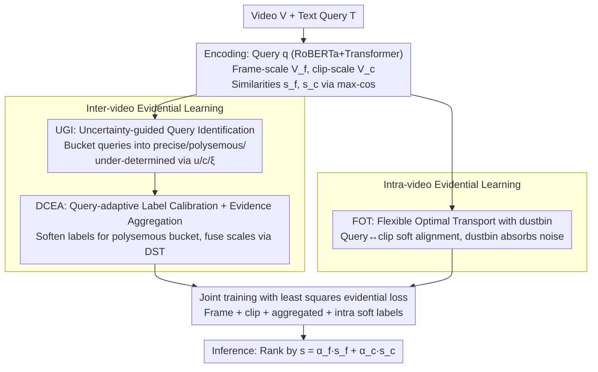

# Revisiting Uncertainty: On Evidential Learning for Partially Relevant Video Retrieval

**Conference**: ICML 2026  
**arXiv**: [2605.06083](https://arxiv.org/abs/2605.06083)  
**Code**: https://github.com/ICML26-Holmes (Available)  
**Area**: Video Understanding / Cross-modal Retrieval / Uncertainty Modeling  
**Keywords**: PRVR, Evidential Learning, Dirichlet Distribution, Optimal Transport, Query Ambiguity

## TL;DR
To address query ambiguity and temporal sparse supervision caused by "short queries vs. long videos" in Partially Relevant Video Retrieval (PRVR), this paper proposes Holmes, a hierarchical evidential learning framework based on the Dirichlet distribution. It distinguishes precise, polysemous, and under-determined queries using a three-fold principle at the inter-video level for adaptive label calibration, and achieves dense alignment at the intra-video level via flexible optimal transport with a dustbin. Holmes achieves SOTA on ActivityNet, Charades, and TVR datasets.

## Background & Motivation

**Background**: The PRVR task requires retrieving untrimmed long videos using a text query that only describes local segments. Dominant approaches, represented by MS-SL and GMMFormer, adopt multi-instance learning (MIL), treating the clip with the highest similarity to the query as the positive sample for contrastive learning and ranking by a deterministic similarity score.

**Limitations of Prior Work**: The authors identify two failure modes in Figure 1: (1) At the inter-video level, short text and rich video content inevitably lead to "under-determined queries" (insufficient semantic information, yielding low similarity for all candidates) and "polysemous queries" (ambiguous semantics, yielding high similarity for multiple candidates). If these are trained as precise queries, they are incorrectly "hard-pushed" toward a single ground truth. (2) At the intra-video level, MIL supervises only the single best clip, causing an extreme imbalance between positive and negative clips. The model is easily deceived by "coincidentally similar" local noise in globally irrelevant videos, causing spurious spiky activations.

**Key Challenge**: Existing methods treat cross-modal similarity as a deterministic output without quantifying "how reliable this score itself is." Recent methods like ARL recognize ambiguity but can only distinguish "ambiguous or not" at a coarse grain, failing to categorize ambiguity into "insufficient signal" or "conflicting signals," thus leading to incorrect calibration directions.

**Goal**: (i) Explicitly quantify the uncertainty of each query at the inter-video level and distinguish query types; (ii) break the sparse supervision bottleneck of MIL at the intra-video level to provide dense yet noise-robust alignment signals.

**Key Insight**: Treat cross-modal similarity as "evidence" rather than just a "score"—a perspective from Evidential Deep Learning (EDL). Through second-order probabilities of the Dirichlet distribution, EDL provides both epistemic and aleatoric uncertainty, which precisely correspond to the "insufficient signal" and "conflicting signal" failure modes.

**Core Idea**: Utilize Dirichlet evidential learning to simultaneously model inter-video query uncertainty and intra-video temporal supervision sparsity. A three-fold principle (epistemic uncertainty + label consistency + aleatoric uncertainty) is used to bucket queries and adaptively calibrate labels. Finally, flexible optimal transport with a dustbin replaces the hard argmax of MIL.

## Method

### Overall Architecture
Input: An untrimmed video $V$ and a text query $T$. The query is encoded as $\bm{q}\in\mathbb{R}^d$ via RoBERTa + Transformer. The video is processed in two branches: frame-scale extracting $M_f$ frame features $\bm{V}_f$, and clip-scale extracting $M_c$ clip features $\bm{V}_c$. Max-cosine similarities $s^f$ and $s^c$ are obtained for both scales. The pipeline consists of two layers: (1) **Inter-video evidential learning** maps similarity vectors of $K$ candidate videos in a batch to Dirichlet parameters, categorizes queries into precise/polysemous/under-determined buckets based on the three-fold principle, and applies soft label calibration for the polysemous bucket. (2) **Intra-video evidential learning** replaces single-point argmax with flexible optimal transport with a dustbin, treating soft alignment between one query and multiple clips as intra-video evidence. The model is trained jointly using a least squares evidential loss. During inference, ranking is performed using $s=\alpha_f s^f + \alpha_c s^c$.

### Key Designs

**1. Uncertainty-guided Query Identification (UGI): Automatically categorizing queries using three orthogonal metrics to avoid one-size-fits-all training.**

A common pain point is discarding or down-weighting all "GT not ranked first" samples as noisy correspondence, which loses signals reflecting ambiguity. UGI converts similarities to evidence $e_{ij}=\exp(\tanh(s_{ij}/\tau))$, yielding Dirichlet parameters $\alpha_{ij}=e_{ij}+1$. Three metrics are extracted: epistemic uncertainty $u_i=K/S_i$ (where $S_i=\sum_j\alpha_{ij}$; larger $u$ indicates less total evidence), label consistency $c_i=\max(0, \bm{s}_i\cdot\bm{y}_i)$ (response strength of the GT video), and aleatoric uncertainty $\xi_i$ (Dirichlet expected entropy). Identification rules: large $u_i$ indicates under-determined (thin evidence); small $u_i$ and large $c_i$ indicate precise; small $u_i$ and small $c_i$ indicate polysemous. Finally, the median of $\xi_i$ is used to reclassify high-entropy "pseudo-precise" samples back to polysemous. Thresholds $\beta_u, \beta_p$ are dynamically determined by "correctly matched" samples in the current batch. Theorem 3.2 proves that $u$ alone cannot distinguish precise from polysemous, as both have sufficient evidence; they differ in whether evidence points to one or multiple answers, requiring $c$ and $\xi$ for separation. Both scales are fused with "uncertainty priority" ($\mathcal{S}_p\prec\mathcal{S}_n\prec\mathcal{S}_u$), allowing the more uncertain estimate to dominate.

**2. Query-adaptive Label Calibration + Dynamic Co-evidence Aggregation (DCEA): Applying differential supervision and parameter-free fusion.**

Hard one-hot labels treat semantically relevant candidates of polysemous queries as negatives, creating noise. However, full softening dilutes discriminative signals for precise queries. DCEA differentiates: precise and under-determined queries retain one-hot labels, while polysemous queries use softened labels $\hat{\bm{y}}_i=(1-\gamma)\bm{y}_i+\frac{\gamma}{2}(\sigma(s_i^f)+\sigma(s_i^c))$ ($\gamma=0.2$). Evidential opinions $\mathbb{M}^f, \mathbb{M}^c$ from the two scales are fused via the Dempster–Shafer combination rule:

$$b_k^o=\frac{1}{1-\delta}\left(b_k^f b_k^c+b_k^f u^c+b_k^c u^f\right),\quad \delta=\sum_{i\neq j}b_i^f b_j^c$$

Where $\delta$ measures conflict. Using DST over simple weighting ensures that conflicting opinions between branches result in higher total uncertainty rather than averaging out contradictions.

**3. Flexible Optimal Transport with Dustbin (FOT): Providing dense alignment while discarding noisy clips.**

MIL only supervises the "most similar clip," leading to sparse supervision and extreme imbalance. FOT treats the query and $M_c$ clips as sources and sinks in optimal transport, but adds a dustbin sink to absorb irrelevant clips, solving for a flexible transport plan $\bm{\pi}\in\mathbb{R}^{1\times(M_c+1)}$. The first $M_c$ terms serve as query→clip soft alignment supervision. A larger mass in the dustbin indicates the query is less relevant to the video overall. Unlike standard OT, which forces mass into clips, the dustbin acts as an explicit "ignore button," satisfying both dense supervision and noise robustness.

### Loss & Training
The objective is the least squares Dirichlet loss derived from EDL: $L_U(\bm{\alpha}_i,\hat{\bm{y}}_i)=\sum_j(\hat y_{ij}-\alpha_{ij}/S_i)^2+\alpha_{ij}(S_i-\alpha_{ij})/(S_i^2(S_i+1))$. The total loss supervises frame, clip, and aggregated evidential opinions: $L_{\text{inter}}=L_U^f+L_U^c+L_U^o$. Soft labels from OT at the intra-video level are fed into a similar $L_U$ target. Parameters: $\tau=0.1, \gamma=0.2, \beta=0.3$. Thresholds evolve dynamically during training.

## Key Experimental Results

### Main Results
Comparison of R@1/5/10/100 + SumR on ActivityNet Captions, Charades-STA, and TVR:

| Dataset | Metric | Holmes | Prev. SOTA | Gain |
|--------|------|--------|---------------|------|
| ActivityNet | SumR | Significantly highest (>148.3) | ARL 148.3 | $\approx$ +2 SumR |
| Charades-STA | SumR | Best | MamFusion 76.5 | Further improvement |
| TVR | SumR | Best | ARL 185.9 | +1~3 SumR |

Holmes exceeds all PRVR baselines (ARL, MGAKD, ProtoPRVR, MamFusion) across all datasets, and outperforms strong VCMR (CONQUER, JSG) and T2VR baselines (CLIP4Clip, Cap4Video).

### Ablation Study

| Configuration | Effect Description |
|------|---------|
| Full Holmes | Complete model, SOTA SumR on all three datasets. |
| w/o UGI | Degenerates to uniform hard labels; polysemous queries are over-penalized. SumR drops significantly. |
| w/o Label Calibration | Bucketing is kept but labels aren't softened; performance is between w/o UGI and Full. |
| w/o DCEA | Conflict between scales cannot be explicitly modeled; uncertainty is underestimated. |
| w/o FOT (reverts to MIL) | Intra-video supervision becomes sparse; affected by spurious local responses. Largest drop in SumR. |
| w/o dustbin (Standard OT) | Noisy clips are forced to receive probability; alignment is contaminated. |

### Key Findings
- FOT + dustbin for dense intra-video supervision provides the largest contribution; its removal causes the sharpest performance drop, validating that MIL's sparse supervision is a bottleneck.
- All three metrics ($u, c, \xi$) are essential. Theorem 3.2 and Proposition 3.4 theoretically prove that no single metric can distinguish precise and polysemous samples.
- Qualitative visualization shows that Holmes correctly identifies "under-determined / polysemous" queries and significantly suppresses spiky activations for irrelevant videos on Charades.

## Highlights & Insights
- **Two-dimensional Uncertainty Decomposition**: Decomposing "short query, long video" ambiguity into "epistemic (thin signal)" and "aleatoric (multiple signals)" dimensions is a highly insightful application of EDL.
- **Provable Necessity of Three-fold Principle**: The authors demonstrate theoretically that $u$ and $c$ alone are insufficient, justifying $\xi$ not as a heuristic but as a theoretically grounded requirement.
- **Portability of Dustbin OT**: The concept of a virtual bucket to absorb irrelevant elements is applicable to any alignment task prone to noise contamination (e.g., partial retrieval, weakly supervised localization).

## Limitations & Future Work
- Thresholds depend on batch statistics of "correctly matched" samples; these might be unstable during cold start or on difficult datasets. EMA could be used for smoothing.
- The experiments use CNN/RoBERTa features; integration with stronger CLIP-style encoders remains unexplored.
- DST fusion assumes independence between scales; correlation modeling might improve $u^o$ estimates.
- Inference still relies on weighted sums; utilizing evidential opinions (like belief-based scoring) directly for ranking is a potential extension.

## Related Work & Insights
- **vs. ARL (Cho 2025)**: ARL performs binary "ambiguous/non-ambiguous" classification, whereas Holmes uses the three-fold principle to further categorize types and apply differentiated label strategies.
- **vs. GMMFormer / RAL / MSC-PRVR**: These use Gaussian attention or probabilistic embeddings for implicit ambiguity; Holmes provides interpretable, explicit uncertainty.
- **vs. MS-SL / ProtoPRVR**: These follow the MIL paradigm and lack intra-video dense supervision; FOT-dustbin provides the first truly dense and noise-resistant alignment for PRVR.
- **Cross-task Inspiration**: The EDL+OT combination could directly benefit tasks like video moment retrieval, grounded VLM training, and weakly supervised detection in "long context, short query" scenarios.

## Rating
- Novelty: ⭐⭐⭐⭐⭐ First to map EDL uncertainty types to PRVR failure modes with a dustbin OT framework; high originality.
- Experimental Thoroughness: ⭐⭐⭐⭐ Three major datasets and comprehensive ablations, though lacks comparison with large-scale CLIP backbones.
- Writing Quality: ⭐⭐⭐⭐ Intuitive motivation via Figure 1 and rigorous derivations; terminology is dense but well-structured.
- Value: ⭐⭐⭐⭐ Achieves SOTA in PRVR; uncertainty modeling and dustbin OT components are highly transferable.

<!-- RELATED:START -->

## Related Papers

- [\[ECCV 2024\] Bayesian Evidential Deep Learning for Online Action Detection](../../ECCV2024/video_understanding/bayesian_evidential_deep_learning_for_online_action_detection.md)
- [\[CVPR 2026\] VirtueBench: Evaluating Trustworthiness under Uncertainty in Long Video Understanding](../../CVPR2026/video_understanding/virtuebench_evaluating_trustworthiness_under_uncertainty_in_long_video_understan.md)
- [\[CVPR 2025\] Learning Audio-Guided Video Representation with Gated Attention for Video-Text Retrieval](../../CVPR2025/video_understanding/learning_audio-guided_video_representation_with_gated_attention_for_video-text_r.md)
- [\[CVPR 2026\] U2Flow: Uncertainty-Aware Unsupervised Optical Flow Estimation](../../CVPR2026/video_understanding/u2flow_uncertainty_aware_unsupervised_optical_flow_estimation.md)
- [\[NeurIPS 2025\] When Thinking Drifts: Evidential Grounding for Robust Video Reasoning](../../NeurIPS2025/video_understanding/when_thinking_drifts_evidential_grounding_for_robust_video_reasoning.md)

<!-- RELATED:END -->
