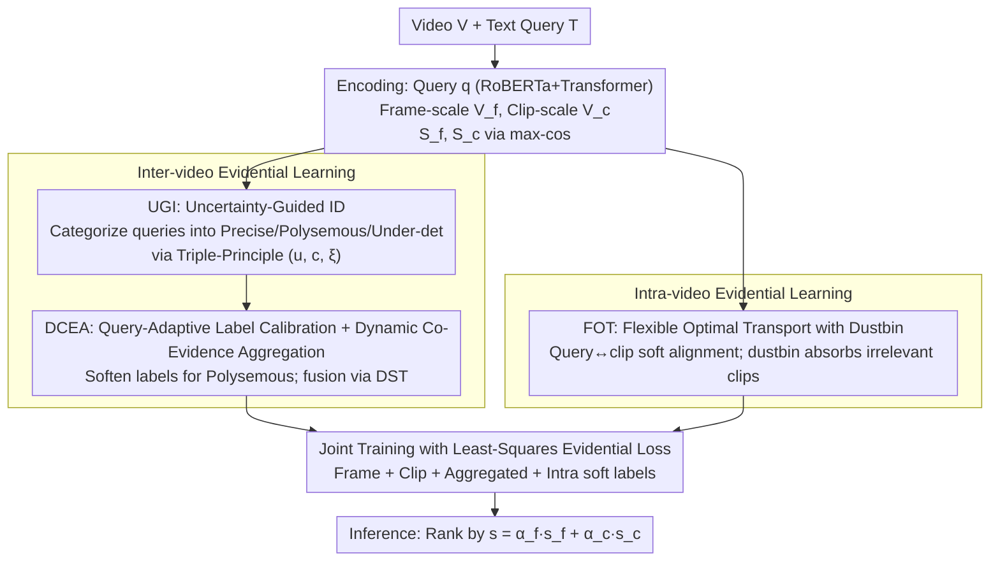

# Revisiting Uncertainty: On Evidential Learning for Partially Relevant Video Retrieval

**Conference**: ICML 2026  
**arXiv**: [2605.06083](https://arxiv.org/abs/2605.06083)  
**Code**: https://github.com/ICML26-Holmes (Available)  
**Area**: Video Understanding / Cross-modal Retrieval / Uncertainty Modeling  
**Keywords**: PRVR, Evidential Learning, Dirichlet Distribution, Optimal Transport, Query Ambiguity

## TL;DR
Addressing the issues of query ambiguity and temporally sparse supervision caused by "short queries vs. long videos" in Partially Relevant Video Retrieval (PRVR), this paper proposes Holmes, a hierarchical evidential learning framework based on the Dirichlet distribution. It employs a triple-principle approach to distinguish between precise, polysemous, and under-determined queries for adaptive label calibration at the inter-video level. At the intra-video level, it utilizes flexible optimal transport with a "dustbin" to achieve dense alignment, achieving SOTA performance on ActivityNet, Charades, and TVR datasets.

## Background & Motivation

**Background**: The PRVR task requires retrieving untrimmed long videos using text queries that describe only local video segments. Mainstream approaches, represented by MS-SL and GMMFormer, adopt multi-instance learning (MIL), treating the "clip with the highest similarity to the query" as the positive sample for contrastive learning and ranking based on a deterministic similarity score.

**Limitations of Prior Work**: The authors identify two types of failure modes in Figure 1: (1) At the inter-video level, short text paired with rich video content inevitably leads to "under-determined queries" (insufficient semantic information, yielding low similarity for all candidates) and "polysemous queries" (ambiguous semantics, yielding high similarity for multiple candidates). If these are trained uniformly as precise queries, they are incorrectly "pushed" toward a single ground truth. (2) At the intra-video level, MIL only supervises a single best clip, leading to extreme imbalance between positive and negative clips. Models are easily deceived by local noise that "happens to be similar" in globally irrelevant videos, resulting in spurious spiky activations.

**Key Challenge**: Existing methods treat cross-modal similarity as a deterministic output without quantifying "how trustworthy the score itself is." Recent methods like ARL recognize ambiguity but can only distinguish whether a pair is ambiguous in a coarse manner, failing to separate "insufficient signal" from "conflicting signals," thus leading to incorrect calibration directions.

**Goal**: (i) Explicitly quantify the uncertainty of each query and distinguish query types at the inter-video level; (ii) Break the sparse supervision bottleneck of MIL at the intra-video level to provide dense yet noise-robust alignment signals.

**Key Insight**: Treat cross-modal similarity as "evidence" rather than just a "score"—this is the perspective of Evidential Deep Learning (EDL). EDL, through the second-order probabilities of the Dirichlet distribution, can simultaneously provide epistemic and aleatoric uncertainty, which correspond precisely to the "insufficient signal" and "conflicting signal" failure modes.

**Core Idea**: Employ Dirichlet evidential learning to model both inter-video query uncertainty and intra-video temporal supervision sparsity. Use a triple-principle (epistemic uncertainty + label consistency + aleatoric uncertainty) to bucket queries and adaptively calibrate labels, while replacing the hard argmax of MIL with optimal transport involving a "dustbin."

## Method

### Overall Architecture
Input: An untrimmed video $V$ and a text query $T$. The query is encoded via RoBERTa + Transformer into $\bm{q}\in\mathbb{R}^d$. The video follows two branches: frame-scale features $\bm{V}_f$ ($M_f$ frames) and clip-scale features $\bm{V}_c$ ($M_c$ clips). Similarities $s^f$ and $s^c$ are obtained via max-cos at both scales. The pipeline consists of two layers: (1) **Inter-video evidential learning** maps similarity vectors of $K$ candidate videos in a batch to Dirichlet parameters, categorizing queries into precise/polysemous/under-determined buckets based on the triple-principle and performing soft label calibration for the polysemous bucket. (2) **Intra-video evidential learning** replaces single-point argmax with flexible optimal transport with a dustbin, treating soft alignment between one query and multiple clips as intra-video evidence. Finally, training is conducted jointly using a least-squares evidential loss, while inference still uses $s=\alpha_f s^f + \alpha_c s^c$ for ranking.

### Key Designs

**1. Uncertainty-Guided Query Identification (UGI): Automatic categorization into three types using three orthogonal metrics to avoid one-size-fits-all training.**

The limitation of previous methods was discarding or down-weighting all samples where "GT was not ranked first" as noisy correspondence, which also discarded signals representing genuine ambiguity. UGI converts similarities into evidence $e_{ij}=\exp(\tanh(s_{ij}/\tau))$, obtaining Dirichlet parameters $\alpha_{ij}=e_{ij}+1$. Three metrics are extracted: epistemic uncertainty $u_i=K/S_i$ ($S_i=\sum_j\alpha_{ij}$, where less total evidence increases $u$), label consistency $c_i=\max(0, \bm{s}_i\cdot\bm{y}_i)$ (response strength of GT video), and aleatoric uncertainty $\xi_i$ (Dirichlet expected entropy). A query is under-determined if $u_i$ is large; if $u_i$ is small, it is precise if $c_i$ is large and polysemous if $c_i$ is small. Finally, the median of $\xi_i$ is used to reclassify high-entropy "pseudo-precise" samples as polysemous. Thresholds $\beta_u, \beta_p$ are dynamically determined by correctly matched samples in the current batch. Theorem 3.2 proves that $u$ alone cannot distinguish precise from polysemous, as both have sufficient evidence; the difference lies in whether the evidence points to a single answer or multiple candidates, necessitating $c$ and $\xi$.

**2. Query-Adaptive Label Calibration + Dynamic Co-Evidence Aggregation (DCEA): Differentiated supervision for different query types and parameter-free fusion.**

Hard one-hot labels treat semantically relevant candidates of polysemous queries as negative samples, creating noise; however, complete softening dilutes discriminative signals for precise queries. DCEA applies differential treatment: precise and under-determined queries retain one-hot labels, while polysemous query labels are softened: $\hat{\bm{y}}_i=(1-\gamma)\bm{y}_i+\frac{\gamma}{2}(\sigma(s_i^f)+\sigma(s_i^c))$ ($\gamma=0.2$). This allows belief to be shared among relevant candidates. Evidential opinions $\mathbb{M}^f, \mathbb{M}^c$ from both scales are fused using the Dempster–Shafer combination rule:

$$b_k^o=\frac{1}{1-\delta}\left(b_k^f b_k^c+b_k^f u^c+b_k^c u^f\right),\quad \delta=\sum_{i\neq j}b_i^f b_j^c$$

Where $\delta$ measures conflict. Using DST over simple weighting ensures that when branches conflict, the fused result reflects higher total uncertainty rather than averaging out the contradiction.

**3. Flexible Optimal Transport (FOT) with Dustbin: Dense intra-video supervision that filters out noisy clips.**

MIL monitors only the "most similar clip," leading to sparse supervision and positive-negative imbalance, leaving the model vulnerable to "spurious spiky activations" from coincidentally similar local noise. FOT treats a query and $M_c$ clips as sources and sinks in optimal transport, but adds a "dustbin" sink to absorb irrelevant clips, solving for a flexible transport plan $\bm{\pi}\in\mathbb{R}^{1\times(M_c+1)}$. The first $M_c$ terms serve as soft alignment supervision for query→clip. A larger mass in the dustbin indicates the query is less relevant to the video overall. Unlike standard OT, which forces mass onto clips, the dustbin provides an "ignore" mechanism, satisfying both dense supervision and noise robustness.

### Loss & Training
The framework utilizes a least-squares Dirichlet loss derived from EDL: $L_U(\bm{\alpha}_i,\hat{\bm{y}}_i)=\sum_j(\hat y_{ij}-\alpha_{ij}/S_i)^2+\alpha_{ij}(S_i-\alpha_{ij})/(S_i^2(S_i+1))$. The total loss supervises frame, clip, and aggregated evidential opinions: $L_{\text{inter}}=L_U^f+L_U^c+L_U^o$. Soft labels from OT are also fed into a $L_U$-style objective for intra-video supervision. Hyperparameters: $\tau=0.1, \gamma=0.2, \beta=0.3$. Thresholds adapt during training.

## Key Experimental Results

### Main Results
Comparison of R@1/5/10/100 + SumR across ActivityNet Captions, Charades-STA, and TVR:

| Dataset | Metric | Holmes | Prev. SOTA | Gain |
|--------|------|--------|---------------|------|
| ActivityNet | SumR | **150.3** | ARL 148.3 | $\approx$ +2.0 |
| Charades-STA | SumR | **77.8** | MamFusion 76.5 | +1.3 |
| TVR | SumR | **188.1** | ARL 185.9 | +2.2 |

Holmes outperforms all PRVR baselines (including ARL, MGAKD, ProtoPRVR, MamFusion) and surpasses strong VCMR (CONQUER, JSG) and T2VR (CLIP4Clip, Cap4Video) baselines.

### Ablation Study

| Configuration | Effect |
|------|---------|
| Full Holmes | Achieves SOTA SumR on all three datasets. |
| w/o UGI | Degrades to uniform hard labels; polysemous queries are over-penalized. SumR drops significantly. |
| w/o Label Calibration | Retains bucketing but lacks polysemous softening; performance falls between w/o UGI and Full. |
| w/o DCEA | No DST fusion; unable to model opinion conflicts, leads to under-estimated uncertainty. |
| w/o FOT (revert to MIL) | Intra-video supervision becomes sparse; most significant drop in SumR due to spurious local responses. |
| w/o Dustbin (std. OT) | Noisy clips are forced to receive probability mass, polluting the alignment. |

### Key Findings
- FOT + dustbin provides the largest contribution to intra-video dense supervision; its removal results in the steepest performance decline, proving that MIL's sparse supervision is a primary bottleneck.
- The triple-principle components ($u$, $c$, $\xi$) are all essential. Theorem 3.2 and Proposition 3.4 theoretically prove that no single metric can distinguish precise from polysemous queries.
- Qualitative visualizations show Holmes correctly identifies "under-determined / polysemous" queries and suppresses spiky activations on irrelevant videos in Charades.

## Highlights & Insights
- **Two-dimensional Decomposition of Uncertainty**: The long-standing issue of "short query, long video" ambiguity is cleanly decomposed into "epistemic (sparse signal)" and "aleatoric (conflicting signal)" dimensions. Mapping these to EDL's second-order uncertainty is a highly insightful perspective.
- **Provable Necessity of the Triple-Principle**: The authors move beyond heuristic criteria by providing theoretical proofs (Theorem 3.2 / Prop 3.4) that $u$, $c$, and $\xi$ are collectively required to separate the categories in 3D space.
- **Transferability of Dustbin-OT**: The "flexible OT with a virtual bucket" approach is generalizable to any task requiring alignment supervision resistant to noisy pairings (e.g., partial retrieval, weakly-supervised localization).

## Limitations & Future Work
- While self-adaptive, thresholds depend on batch statistics of "already correctly matched" samples, which might be unstable during cold starts or on difficult datasets; EMA could be used for smoothing.
- The study relies on RoBERTa + CNN features and has not yet integrated stronger CLIP-based encoders, where evidential calibration might offer even more room for improvement.
- DST fusion assumes independence between branches; if frame and clip features are highly correlated, $u^o$ might be over-estimated.
- Inference still relies on weighted sums rather than using evidential opinions directly for ranking (e.g., belief-based scoring).

## Related Work & Insights
- **vs. ARL (Cho 2025)**: ARL performs binary "ambiguous vs. non-ambiguous" classification; Holmes uses the triple-principle for fine-grained categorization and differentiated labeling.
- **vs. GMMFormer / RAL / MSC-PRVR**: These use Gaussian attention or probabilistic embeddings for implicit modeling; Holmes provides interpretable, explicit uncertainty via Dirichlet.
- **vs. MS-SL / ProtoPRVR**: These MIL-based methods lack dense intra-video supervision; Holmes’ FOT-dustbin provides the first truly dense and noise-robust alignment scheme for PRVR.
- **Cross-task Inspiration**: The EDL+OT combination could significantly benefit video moment retrieval, grounded VLM training, and weakly-supervised detection in "long context, short query" scenarios.

## Rating
- Novelty: ⭐⭐⭐⭐⭐ First to map two types of EDL uncertainty to PRVR failure modes with a matching dustbin-OT framework.
- Experimental Thoroughness: ⭐⭐⭐⭐ Covering three major datasets with comprehensive ablations, though lacks comparison with CLIP-heavy backbones.
- Writing Quality: ⭐⭐⭐⭐ Intuitive motivation via Figure 1 and rigorous theoretical derivations; terminology is slightly dense.
- Value: ⭐⭐⭐⭐ SOTA performance on PRVR; the uncertainty modeling and dustbin-OT components are highly transferable.

<!-- RELATED:START -->

## Related Papers

- [\[ECCV 2024\] Bayesian Evidential Deep Learning for Online Action Detection](../../ECCV2024/video_understanding/bayesian_evidential_deep_learning_for_online_action_detection.md)
- [\[CVPR 2026\] VirtueBench: Evaluating Trustworthiness under Uncertainty in Long Video Understanding](../../CVPR2026/video_understanding/virtuebench_evaluating_trustworthiness_under_uncertainty_in_long_video_understan.md)
- [\[CVPR 2026\] U2Flow: Uncertainty-Aware Unsupervised Optical Flow Estimation](../../CVPR2026/video_understanding/u2flow_uncertainty_aware_unsupervised_optical_flow_estimation.md)
- [\[CVPR 2025\] Learning Audio-Guided Video Representation with Gated Attention for Video-Text Retrieval](../../CVPR2025/video_understanding/learning_audio-guided_video_representation_with_gated_attention_for_video-text_r.md)
- [\[ACL 2026\] ViLL-E: Video LLM Embeddings for Retrieval](../../ACL2026/video_understanding/vill-e_video_llm_embeddings_for_retrieval.md)

<!-- RELATED:END -->
