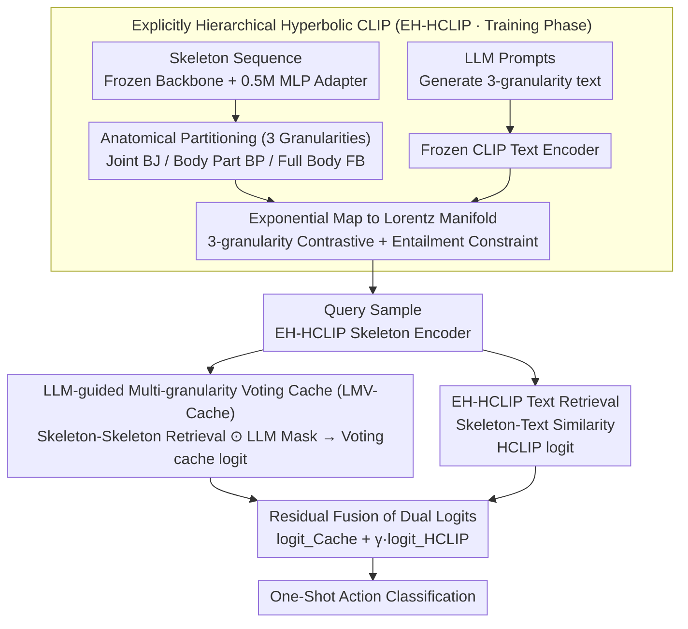

# SkelHCC: A Hyperbolic CLIP-Driven Cache Adaptation Framework for Skeleton-based One-Shot Action Recognition

**Conference**: ICML 2026  
**arXiv**: [2606.03610](https://arxiv.org/abs/2606.03610)  
**Code**: To be confirmed  
**Area**: Video Understanding / Skeleton-based Action Recognition / One-Shot Learning  
**Keywords**: Skeleton Action Recognition, One-Shot Learning, Hyperbolic CLIP, LLM Guidance, Multi-granularity Cache

## TL;DR
SkelHCC transfers CLIP to Hyperbolic space to explicitly align skeleton-language representations across three granularities: "Joints → Body Parts → Full Body." It utilizes LLM-generated body part importance masks for training-free multi-granularity voting cache inference, achieving a 9% improvement over SOTA on NTU120 one-shot action recognition with only 0.5M trainable parameters.

## Background & Motivation

**Background**: Skeleton-based action recognition understands actions from human joint sequences. One-Shot Action Recognition (OSAR) is a high-value but extremely challenging setting where each new class has only one sample, making traditional supervised learning nearly impossible to generalize.

**Limitations of Prior Work**:
- **Difficulty in Representation Alignment**: Human skeletons are naturally tree-structured (Joints → Body Parts → Full Body), but existing methods mostly model them in Euclidean space, which fails to encode these hierarchical dependencies. Furthermore, alignment between skeleton representations and high-level semantic action descriptions is insufficient.
- **Improper Adaptation Strategies**: Existing methods often update the backbone during one-shot scenarios, leading to either overfitting or complex fine-tuning pipelines. There is a lack of "context-aware" mechanisms during inference to direct the model toward critical body parts.

**Key Challenge**: The contradiction between the need for robust cross-modal representations and the requirement for fast, low-parameter inference-time adaptation. Conventional fine-tuning is infeasible under data scarcity.

**Goal**: To propose a unified framework that solves (1) cross-modal representations explicitly encoding skeleton hierarchy and (2) training-free, context-aware inference-time adaptation.

**Key Insight**: The negative curvature of Hyperbolic geometry is naturally suited for tree structures (the $\delta$-hyperbolicity of skeleton graphs has been validated in Appendix I). LLM knowledge can specify "which joints are important for which action," which can be integrated directly into similarity calculations as masks.

**Core Idea**: Use Hyperbolic CLIP to learn three-granularity aligned representations (EH-HCLIP), followed by training-free adaptation via LLM-guided Multi-granularity Voting Cache (LMV-Cache) during inference.

## Method

### Overall Architecture

SkelHCC addresses the conflict between requiring high-quality cross-modal representations and training-free adaptation by splitting the task into training and inference phases. During training, it learns an Explicitly Hierarchical Hyperbolic CLIP (EH-HCLIP) on base classes: the CLIP text encoder and skeleton backbone are frozen, and only a lightweight 0.5M parameter MLP adapter is trained to project skeleton and text features onto a Lorentz manifold for three-granularity alignment. During inference, weights are no longer updated. For a query sample of a new class, one branch calculates skeleton-skeleton cache similarity (cache logit) while the other calculates skeleton-text similarity (HCLIP logit). The results are fused via a residual connection for classification.

### Key Designs

**1. Explicitly Hierarchical Hyperbolic CLIP (EH-HCLIP): Structuring the Representation Space like the Human Body**

Human skeletons naturally follow a "Joint → Body Part → Full Body" tree structure. Existing Euclidean methods fail to capture this hierarchy. EH-HCLIP partitions skeletons into three anatomical levels: Body Joints (BJ), Body Parts (BP), and Full Body (FB), with corresponding text descriptions generated via LLM prompts. Euclidean features $S$ are projected to the Lorentz manifold via exponential mapping $\tilde{S} = \exp_M^{O}(S)$. Contrastive probabilities are derived from Lorentzian distance $d_{\mathbb{L}, c}(\cdot)$, forming the EHHC loss:

$$\mathcal{L}_{EHHC} = \sum_i \frac{\alpha_i}{2} \left( \mathcal{L}_{HCL}(\tilde{S}^{(i)}, \tilde{T}^{(i)}) + \mathcal{L}_{HCL}(\tilde{T}^{(i)}, \tilde{S}^{(i)}) \right)$$

Additionally, a Hyperbolic Entailment Loss (HEL) is employed using entailment cones to enforce a partial order: Joint $\subset$ Body Part $\subset$ Full Body. Hyperbolic space is chosen because its volume grows exponentially with radius, accommodating tree structures in low dimensions; multi-granularity contrast focuses the model on both local joints and global context.

**2. LLM-guided Multi-granularity Voting Cache (LMV-Cache): Embedding "Importance" Priors into Inference Similarity**

To avoid overfitting during one-shot adaptation, LMV-Cache stores support sample features as keys and labels as values. GPT-4 is used offline to generate binary masks $\mathcal{M}^{BJ}, \mathcal{M}^{BP}$ indicating critical joints/parts for each category. During inference, query-support similarities at the joint and part levels undergo a Hadamard product with the masks before averaging:

$$\text{Sim}^{BJ} = \alpha_2 \frac{1}{V} \sum_i \left[ \phi(S_q^{BJ}, S_s^{BJ}) \odot \mathcal{M}^{BJ} \right]_i$$

The multi-granularity similarity matrices are then merged via voting. This ensures that the semantic prior (e.g., "jumping involves legs") is persistently applied during similarity calculation rather than being lost after training distillation. 

**3. Residual Fusion of Dual Logits: Complementary Retrieval**

Skeleton-skeleton cache retrieval is sensitive to visual variations (pose differences between individuals), while skeleton-text retrieval focuses on semantics. SkelHCC fuses them via residual addition:

$$\text{logit}_{SkelHCC} = \text{logit}_{Cache} + \gamma \cdot \text{logit}_{HCLIP}$$

Here, $\gamma$ balances the signals, effectively treating EH-HCLIP as a "semantic cache" to compensate for the blind spots of visual retrieval.

### Loss & Training

The total training loss combines multi-granularity alignment, entailment constraints, and cross-entropy: $\mathcal{L}_{EH\text{-}HCLIP} = \mathcal{L}_{EHHC} + \lambda \mathcal{L}_{EHHE} + \mathcal{L}_{CE}$, where $\lambda = 0.1$. Key hyperparameters include Hyperbolic curvature $c = 0.1$, temperature $\beta = 1.0$, and granularity weights $\alpha_1 = \alpha_2 = \alpha_3 = 0.5$.

## Key Experimental Results

### Main Results

One-shot action recognition on NTU RGB+D 120/60 and PKU-MMD II (Accuracy % under different base class settings):

| Dataset | Method | 20 Base | 60 Base | 100 Base | Backbone Update | Adaptive Params |
|---------|--------|---------|---------|----------|-----------------|-----------------|
| NTU120  | CrossGLG (SOTA) | 45.3 | 62.1 | 62.6 | ✓ | 1.7M |
| NTU120  | **SkelHCC** | **52.0** | **67.4** | **71.6** | ✗ | **0.5M** |
| NTU60   | CrossGLG | — | 75.6 | — | ✓ | — |
| NTU60   | **SkelHCC** | — | **84.1** | — | ✗ | **0.5M** |
| P-MMD   | SkeletonX | — | 38.3 | — | — | — |
| P-MMD   | **SkelHCC** | — | **40.0** | — | — | **0.5M** |

**Main Observation**: On NTU120 with 100 base classes, SkelHCC reaches 71.6%, outperforming CrossGLG by 9.0% while using 1/3 of the parameters and keeping the backbone frozen.

### Ablation Study

Module Effectiveness (NTU120, 100 Base Classes):

| Method | Accuracy | Relative Gain |
|--------|----------|---------------|
| CLIP (Euclidean) + Cache | 62.9 | — |
| HCLIP + Cache | 64.8 | +1.9 |
| EH-HCLIP + Cache | 67.6 | +4.7 |
| CLIP + LMV-Cache | 66.2 | +3.3 |
| HCLIP + LMV-Cache | 68.2 | +5.3 |
| **EH-HCLIP + LMV-Cache (Full)** | **71.6** | **+8.7** |

Mask Type Comparison (NTU120, 100 Base Classes):

| Mask | Accuracy | Change |
|------|----------|--------|
| No Mask | 68.5 | — |
| Random Mask | 66.3 | -2.2 |
| Learnable Mask | 68.6 | +0.1 |
| Self-Attention Mask | 67.1 | -1.4 |
| LLM Mask (BP) | 69.9 | +1.4 |
| **LLM Mask (BP + BJ)** | **71.6** | **+3.1** |

### Key Findings
- Hyperbolic CLIP provides 1.9% gain over Euclidean; adding "Explicit Hierarchy" provides an additional 2.8%, proving structural priors are essential.
- Removing BJ + BP granularities (retaining only FB) leads to a 3-4% drop, highlighting the importance of multi-granularity for one-shot robustness.
- Random and attention-based masks degrade performance; LLM-generated semantic masks are the only strategy to provide stable improvements, indicating LLM knowledge is more reliable than self-learned "importance."

## Highlights & Insights
- **Natural Fit for Hyperbolic Space**: The paper uses $\delta$-hyperbolicity measurements of skeleton graphs to provide empirical evidence for using Hyperbolic space, rather than simply applying Hyperbolic CLIP as a black box.
- **Persistent LLM Knowledge**: Unlike methods like CrossGLG that distill LLM knowledge during training (which may diminish during inference), LMV-Cache encodes knowledge into masks for direct use during decision-making.
- **Parameter-Efficient Adaptation**: Freezing the backbone and using 0.5M MLP adapters is a pragmatic response to the scarcity of one-shot data, requiring 3.4× fewer parameters than CrossGLG.
- **Multi-granularity Soft Voting**: Converting one-shot hard classification into cross-granularity consensus significantly enhances robustness.

## Limitations & Future Work
- Limited to one-shot settings; fusion strategies for multiple support samples (e.g., weighted averaging, prototypes) in few-shot settings are not explored.
- Only tested on the skeleton modality; expansions to RGB/Depth/Multi-view are only mentioned in the conclusion.
- LLM masks require GPT-4 calls for each new class; while a one-time cost, scalability concerns remain for massive action libraries.
- The Hyperbolic curvature was fixed at $c = 0.1$; optimal values for different datasets were not systematically explored.

## Related Work & Insights
- **vs APSR / uDTW / SL-DML**: Traditional metric learning methods operate in Euclidean space and fail to encode skeleton tree structures; this work modifies the representation space itself.
- **vs GAP / CrossGLG**: Both use LLM priors, but GAP is for full supervision, and CrossGLG's LLM knowledge is not "online" during inference. This work uses masks to keep LLM knowledge involved in the final decision.
- **vs HyperbolicCLIP / Hyperbolic Segmentation**: This work is not a simple reuse of Hyperbolic CLIP; it is specifically designed for three-granularity skeleton alignment with an entailment loss.
- **Insight**: The "triad" of Geometric Priors (Tree → Hyperbolic) + High-level Semantic Priors (LLM) + Parameter-efficient Adaptation (MLP) can be extended to tasks like keypoint detection and tree-structured scene graphs.

## Rating
- Novelty: ⭐⭐⭐⭐⭐  The combination of Hyperbolic space, explicit hierarchy, and LLM mask voting is pioneering in OSAR.
- Experimental Thoroughness: ⭐⭐⭐⭐⭐  Comprehensive tests across three datasets with detailed ablation on mask types.
- Writing Quality: ⭐⭐⭐⭐  Clear logic and detailed methodology, though the Hyperbolic background is slightly lengthy.
- Value: ⭐⭐⭐⭐⭐  Strong potential for data-scarce scenarios in rehabilitation and medical fields; parameter-efficient and deployable.

<!-- RELATED:START -->

## Related Papers

- [\[ECCV 2024\] CrossGLG: LLM Guides One-Shot Skeleton-Based 3D Action Recognition in a Cross-Level Manner](../../ECCV2024/video_understanding/crossglg_llm_guides_one-shot_skeleton-based_3d_action_recognition_in_a_cross-lev.md)
- [\[CVPR 2026\] SkeletonContext: Skeleton-side Context Prompt Learning for Zero-Shot Skeleton-based Action Recognition](../../CVPR2026/video_understanding/skeletoncontext_skeleton-side_context_prompt_learning_for_zero-shot_skeleton-bas.md)
- [\[AAAI 2026\] SUGAR: Learning Skeleton Representation with Visual-Motion Knowledge for Action Recognition](../../AAAI2026/video_understanding/sugar_learning_skeleton_representation_with_visual-motion_knowledge_for_action_r.md)
- [\[CVPR 2026\] SpikeTrack: A Spike-driven Framework for Efficient Visual Tracking](../../CVPR2026/video_understanding/spiketrack_a_spike-driven_framework_for_efficient_visual_tracking.md)
- [\[CVPR 2026\] One-Shot Flow, Any-Time Frame: A Bidirectional Warping Framework for Event-Based Video Frame Interpolation](../../CVPR2026/video_understanding/one-shot_flow_any-time_frame_a_bidirectional_warping_framework_for_event-based_v.md)

<!-- RELATED:END -->
