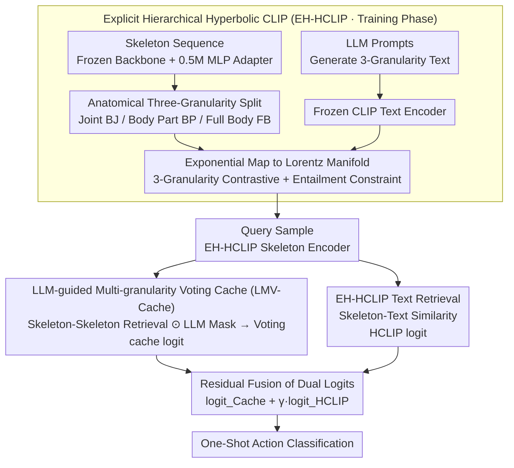

# SkelHCC: A Hyperbolic CLIP-Driven Cache Adaptation Framework for Skeleton-based One-Shot Action Recognition

**Conference**: ICML 2026  
**arXiv**: [2606.03610](https://arxiv.org/abs/2606.03610)  
**Code**: To be confirmed  
**Area**: Video Understanding / Skeleton-based Action Recognition / One-Shot Learning  
**Keywords**: Skeleton-based Action Recognition, One-Shot Learning, Hyperbolic CLIP, LLM-guided, Multi-granularity Cache

## TL;DR
SkelHCC maps CLIP to Hyperbolic space to explicitly align skeleton-language representations across three granularities: "Joint → Body Part → Full Body." It utilizes LLM-generated body part importance masks for training-free multi-granularity voting cache inference, achieving a 9% improvement over Prev. SOTA on NTU120 one-shot action recognition with only 0.5M trainable parameters.

## Background & Motivation

**Background**: Skeleton-based action recognition understands actions from human joint sequences. One-Shot Action Recognition (OSAR) is a high-value but extremely difficult setting where each new class has only one sample, making traditional supervised learning nearly impossible to generalize.

**Limitations of Prior Work**:
- **Difficulty in Representation Alignment**: Human skeletons are naturally tree-structured (Joint → Body Part → Full Body), but existing methods mostly model in Euclidean space, failing to encode such hierarchical dependencies. There is insufficient alignment between skeleton representations and high-level semantic action descriptions.
- **Inappropriate Adaptation Strategies**: Updating backbones during one-shot learning leads to either overfitting or complex fine-tuning pipelines. There is a lack of "context-aware" mechanisms during inference to inform the model which body parts are critical.

**Key Challenge**: The one-shot setting requires both robust cross-modal representations and fast, low-parameter inference-time adaptation; conventional fine-tuning is infeasible under data scarcity.

**Goal**: To propose a unified framework that simultaneously addresses (1) cross-modal representations that explicitly encode skeleton hierarchies and (2) training-free, context-aware inference-time adaptation.

**Key Insight**: The negative curvature of Hyperbolic geometry is naturally suited for tree structures (the $\delta$-hyperbolicity of the joint graph was verified in Appendix I). LLM knowledge can identify "which joints are important for which action," which can be directly incorporated into similarity calculations as masks.

**Core Idea**: Use Hyperbolic CLIP to learn three-granularity aligned representations (EH-HCLIP) and employ LLM-guided Multi-granularity Voting Cache (LMV-Cache) for training-free adaptation during inference.

## Method

### Overall Architecture

SkelHCC resolves the conflict between needing high-quality cross-modal skeleton representations and training-free inference adaptation in one-shot scenarios by splitting the task into training and inference phases. In the training phase, a hierarchical Hyperbolic CLIP (EH-HCLIP) is learned on base classes: the CLIP text encoder and skeleton backbone are frozen, and only a lightweight MLP adapter with 0.5M parameters is trained to project skeleton and text features onto the Lorentz manifold for three-granularity alignment. In the inference phase, weights are no longer updated—for a query sample of a new class, the skeleton-skeleton cache similarity (cache logit) and the skeleton-text similarity using text prompts (HCLIP logit) are calculated. The classification result is produced by the residual fusion of both logits.

### Key Designs

**1. Explicit Hierarchical Hyperbolic CLIP (EH-HCLIP): Growing the representation space into a human tree structure**

The human skeleton is inherently a tree of "Joint → Body Part → Full Body," but existing Euclidean methods fail to encode this hierarchy, leading to weak alignment with action semantics. EH-HCLIP first splits the skeleton into three granularities: Body Joints (BJ), Body Parts (BP), and Full Body (FB) based on anatomical priors, then uses carefully designed LLM prompts to generate corresponding text descriptions for each. Euclidean features for each granularity are projected to the Lorentz manifold via the exponential map $\tilde{S} = \exp_{M}^{O}(S)$. Contrastive probabilities are calculated using the Lorentzian distance $d_{\mathbb{L}, c}(\cdot)$ via softmax, and the weighted sum forms the EHHC loss:

$$\mathcal{L}_{EHHC} = \sum_i \frac{\alpha_i}{2} \left( \mathcal{L}_{HCL}(\tilde{S}^{(i)}, \tilde{T}^{(i)}) + \mathcal{L}_{HCL}(\tilde{T}^{(i)}, \tilde{S}^{(i)}) \right)$$

Additionally, a Hyperbolic Entailment Loss (HEL) is applied using entailment cones to enforce the partial order relationship: "Joint ⊂ Body Part ⊂ Full Body." Hyperbolic space is chosen because its volume grows exponentially with radius, accommodating a tree in few dimensions, fitting the skeleton graph's $\delta$-hyperbolicity. Multi-granularity contrastive learning allows the model to focus on both local key joints and global context simultaneously, which is essential for one-shot generalization.

**2. LLM-guided Multi-granularity Voting Cache (LMV-Cache): Embedding "importance" priors directly into inference similarity**

Updating the backbone in one-shot settings often leads to overfitting. LMV-Cache provides a training-free inference adaptation that guides the model on which parts to observe. Support samples' three-granularity skeleton features are stored as keys and labels as values. GPT-4 is used offline to generate binary masks $\mathcal{M}^{BJ}, \mathcal{M}^{BP}$ indicating critical joints/parts for each class. During inference, joint-level and part-level similarities between query and support are Hadamard-multiplied with the masks and then averaged:

$$\text{Sim}^{BJ} = \alpha_2 \frac{1}{V} \sum_i \left[ \phi(S_q^{BJ}, S_s^{BJ}) \odot \mathcal{M}^{BJ} \right]_i$$

Similarity matrices from multiple granularities are combined through voting into the final cache logit. The key benefit is that the LLM's semantic prior (e.g., "jumping uses legs") is not just distilled during training but persists as a mask during every similarity calculation. Furthermore, multi-granularity voting softens hard classification into cross-granularity consensus, improving robustness.

**3. Residual Fusion Dual-Logit Inference: Complementing skeleton and semantic retrieval**

Skeleton-skeleton cache retrieval is sensitive to visual variance (different people performing the same action), while skeleton-text retrieval focuses on semantics. SkelHCC combines them residually:

$$\text{logit}_{SkelHCC} = \text{logit}_{Cache} + \gamma \cdot \text{logit}_{HCLIP}$$

Where $\gamma$ balances the signals. EH-HCLIP itself can be viewed as a special "textual cache," making the inference a weighted combination of "cache retrieval + text retrieval" where the blind spots of both signals complement each other.

### Loss & Training

The total training loss combines multi-granularity alignment, entailment constraints, and cross-entropy classification: $\mathcal{L}_{EH\text{-}HCLIP} = \mathcal{L}_{EHHC} + \lambda \mathcal{L}_{EHHE} + \mathcal{L}_{CE}$, with $\lambda = 0.1$. Key hyperparameters include Hyperbolic curvature $c = 0.1$, similarity temperature $\beta = 1.0$, and granularity weights $\alpha_1 = \alpha_2 = \alpha_3 = 0.5$.

## Key Experimental Results

### Main Results

One-shot action recognition on NTU RGB+D 120 / 60 and PKU-MMD II (accuracy under different base class counts):

| Dataset | Method | 20 Base | 60 Base | 100 Base | Backbone Update | Adapter Params |
| :--- | :--- | :--- | :--- | :--- | :--- | :--- |
| NTU120 | CrossGLG (Prev. SOTA) | 45.3 | 62.1 | 62.6 | ✓ | 1.7M |
| NTU120 | **Ours (SkelHCC)** | **52.0** | **67.4** | **71.6** | ✗ | **0.5M** |
| NTU60 | CrossGLG | — | 75.6 | — | ✓ | — |
| NTU60 | **Ours (SkelHCC)** | — | **84.1** | — | ✗ | **0.5M** |
| P-MMD | SkeletonX | — | 38.3 | — | — | — |
| P-MMD | **Ours (SkelHCC)** | — | **40.0** | — | — | **0.5M** |

**Key Findings**: On NTU120 with 100 base classes, the model reaches 71.6%, which is 9.0% higher than CrossGLG, using only 1/3 of the parameters and a frozen backbone.

### Ablation Study

Module Effectiveness (NTU120, 100 Base classes):

| Method | Accuracy | Gain |
| :--- | :--- | :--- |
| CLIP (Euclidean) + Cache | 62.9 | — |
| HCLIP + Cache | 64.8 | +1.9 |
| EH-HCLIP + Cache | 67.6 | +4.7 |
| CLIP + LMV-Cache | 66.2 | +3.3 |
| HCLIP + LMV-Cache | 68.2 | +5.3 |
| **EH-HCLIP + LMV-Cache (Full)** | **71.6** | **+8.7** |

Mask Type Comparison (NTU120, 100 Base classes):

| Mask | Accuracy | Change |
| :--- | :--- | :--- |
| No Mask | 68.5 | — |
| Random Mask | 66.3 | -2.2 |
| Learnable Mask | 68.6 | +0.1 |
| Self-Attention Mask | 67.1 | -1.4 |
| LLM Mask (BP) | 69.9 | +1.4 |
| **LLM Mask (BP + BJ)** | **71.6** | **+3.1** |

### Key Findings
- Hyperbolic space improves over Euclidean CLIP by 1.9%, and adding "Explicit Hierarchy" gains another 2.8%, proving structural priors are necessary.
- Removing BJ + BP multi-granularity (keeping only FB) leads to a 3-4% drop, highlighting the importance of multi-granularity for one-shot robustness.
- Random or attention masks degrade performance; LLM-generated semantic masks are the only strategy providing stable improvements, indicating LLM knowledge is more reliable than self-learned "importance."

## Highlights & Insights
- **Natural Fit of Hyperbolic Geometry**: The paper uses $\delta$-hyperbolicity measurements of skeleton graphs to provide hard evidence for using Hyperbolic space rather than just blindly applying Hyperbolic CLIP.
- **Inference-time LLM Knowledge**: Unlike policies that only "distill LLM during training," LMV-Cache encodes LLM knowledge directly into masks that remain active during inference, preventing knowledge "disappearance."
- **Parameter-efficient One-shot Adaptation**: Freezing the backbone and using a 0.5M MLP adapter is a pragmatic response to data scarcity, using 3.4× fewer parameters than CrossGLG.
- **Multi-granularity Soft Voting**: Converting one-shot hard classification into soft voting across granularities significantly enhances robustness, a concept transferable to other structured data tasks.

## Limitations & Future Work
- Limited to the one-shot setting; how to fuse multiple support samples (weighted average? prototypes?) for few-shot scenarios is not addressed.
- Only skeleton modalities were tested; extensions to RGB, depth, or multi-view are only mentioned in the conclusion.
- LLM masks require querying GPT-4 for each new action class; although a one-time cost, scalability concerns remain for massive action libraries.
- Hyperbolic curvature was only tested at $c = 0.1$; optimal values for different datasets were not systematically explored.

## Related Work & Insights
- **vs APSR / uDTW / SL-DML**: Traditional metric learning occurs in Euclidean space and cannot encode skeleton tree structures; this work rewrites this from the representation space level.
- **vs GAP / CrossGLG**: Both use LLM priors, but GAP is for full supervision, and CrossGLG lacks online LLM knowledge during inference. This work uses masks to keep LLM involved in decision-making.
- **vs HyperbolicCLIP / Hyperbolic Segmentation**: This work is not a simple reuse of Hyperbolic CLIP but is specifically designed for three-granularity skeletons with added entailment losses to force partial ordering.
- **Insights**: The combination of Geometric Priors (Tree → Hyperbolic) + High-level Semantic Priors (LLM) + Parameter-Efficient Adaptation (MLP) can be generalized to tasks like keypoint detection and tree-structured scene graphs.

## Rating
- Novelty: ⭐⭐⭐⭐⭐ (The combination of Hyperbolic + Explicit Hierarchy + LLM Mask Voting is pioneering in OSAR).
- Experimental Thoroughness: ⭐⭐⭐⭐⭐ (Three authoritative datasets + extensive ablations + mask comparison provide a complete chain of evidence).
- Writing Quality: ⭐⭐⭐⭐ (Clear logic and detailed methods; Hyperbolic basics are slightly lengthy).
- Value: ⭐⭐⭐⭐⭐ (Strong real-world demand in data-scarce scenarios like rehabilitation; parameter efficiency makes it easy to deploy).

<!-- RELATED:START -->

## Related Papers

- [\[ECCV 2024\] CrossGLG: LLM Guides One-Shot Skeleton-Based 3D Action Recognition in a Cross-Level Manner](../../ECCV2024/video_understanding/crossglg_llm_guides_one-shot_skeleton-based_3d_action_recognition_in_a_cross-lev.md)
- [\[CVPR 2026\] SkeletonContext: Skeleton-side Context Prompt Learning for Zero-Shot Skeleton-based Action Recognition](../../CVPR2026/video_understanding/skeletoncontext_skeleton-side_context_prompt_learning_for_zero-shot_skeleton-bas.md)
- [\[AAAI 2026\] SUGAR: Learning Skeleton Representation with Visual-Motion Knowledge for Action Recognition](../../AAAI2026/video_understanding/sugar_learning_skeleton_representation_with_visual-motion_knowledge_for_action_r.md)
- [\[CVPR 2026\] One-Shot Flow, Any-Time Frame: A Bidirectional Warping Framework for Event-Based Video Frame Interpolation](../../CVPR2026/video_understanding/one-shot_flow_any-time_frame_a_bidirectional_warping_framework_for_event-based_v.md)
- [\[CVPR 2026\] SpikeTrack: A Spike-driven Framework for Efficient Visual Tracking](../../CVPR2026/video_understanding/spiketrack_a_spike-driven_framework_for_efficient_visual_tracking.md)

<!-- RELATED:END -->
