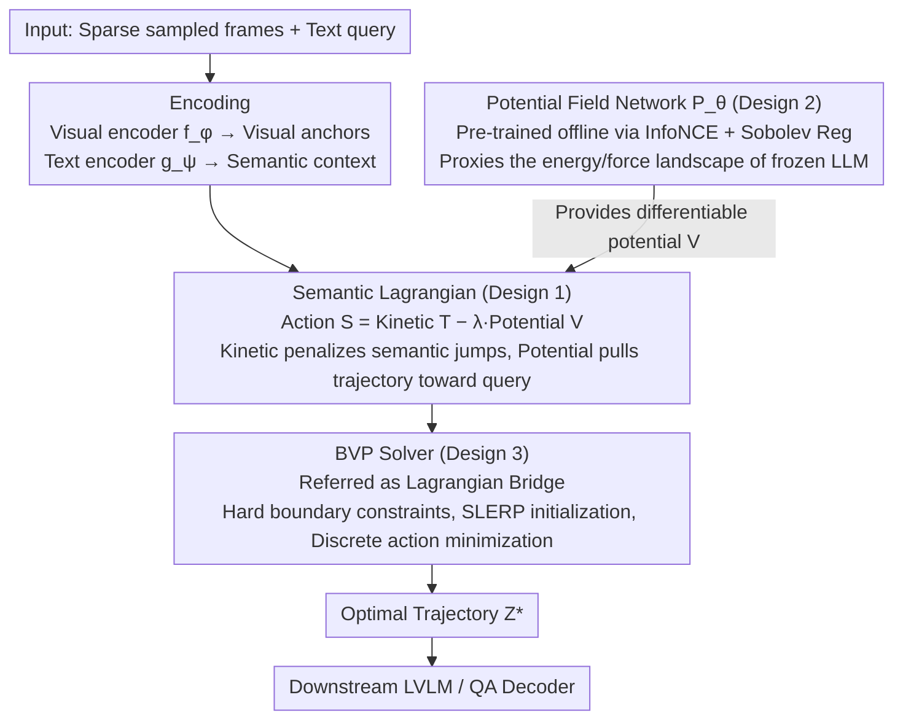

# SLAP: The Semantic Least Action Principle for Variational Video-Language Modeling

**Conference**: ICML 2026  
**arXiv**: [2605.30750](https://arxiv.org/abs/2605.30750)  
**Code**: To be confirmed  
**Area**: Multimodal VLM / Long Video Understanding  
**Keywords**: Video-Language Models, Temporal Interpolation, Least Action Principle, Variational Methods, Object Permanence

## TL;DR
SLAP transplants the "Least Action Principle of classical mechanics" onto the video semantic manifold, modeling the completion of missing frames in sparsely sampled videos as a two-point boundary value problem on a Riemannian manifold. By replacing probabilistic generation with semantic dynamics to enforce object permanence, it achieves 83.9% accuracy on tunnel occlusion tests (outperforming diffusion models by 12 points) with a 177× inference speedup.

## Background & Motivation

**Background**: Contemporary Large Video-Language Models (LVLMs) such as Video-LLaMA and LLaVA-Video are proficient in static scene QA. however, limited by the $O(n^2)$ complexity of self-attention during long video processing, aggressive sparse sampling (typically < 0.5 fps) is required, leaving the model with significant temporal "blind spots."

**Limitations of Prior Work**: These blind spots lead to two failure modes:
- **Implicit Pooling** (mean-pool / Q-Former): Directly compressing frame sequences into a single token, which destroys the temporal causal structure.
- **Generative Hallucinations** (Frame interpolation via Stable Video Diffusion, etc.): While visually realistic, these rely on statistical texture priors and violate object permanence—for example, when a car enters a tunnel, diffusion models may cause the car to vanish because "empty tunnels" are more common in the training set.

**Key Challenge**: Current LVLMs are "kinematically naive," treating video frames as a bag-of-words of independent tokens. They lack "semantic entity conservation" constraints and cannot spontaneously reject physically impossible trajectories, such as object teleportation or disappearance.

**Goal**: To shift "missing frame completion" from a probabilistic framework (maximizing $P(x_t \mid x_{t-1})$) to a physical framework (minimizing action), replacing statistical learning with the elegant constraints of classical mechanics.

**Key Insight**: The Least Action Principle of classical mechanics governs phenomena ranging from planetary orbits to quantum field theory—it naturally guarantees path smoothness and energy optimality. By analogizing this principle to the semantic manifold, "semantic inertia" (kinetic) and "semantic force fields" (potential) are introduced to constrain embedding trajectories.

**Core Idea**: Replace probabilistic generation with variational mechanics; model the missing interval as a two-point boundary value problem (BVP) solved via discrete Euler-Lagrange equations. Object permanence is obtained "for free" without the need for pixel-wise rendering.

## Method

### Overall Architecture
Given the starting and ending frames $t_{\text{start}}, t_{\text{end}}$, the goal is to find the missing embedding sequence $\{z_t\}$ that minimizes the total action. The process involves three steps:

1. **Encoding**: The visual encoder $f_\phi$ and text encoder $g_\psi$ map both frames and queries into the same $d$-dimensional latent space. The former provides fixed visual anchor embeddings, while the latter provides semantic condition embeddings, inducing a Riemannian geometry on this space (Assumption 3.1: semantic isometry).
2. **Learning the Potential Field**: A lightweight MLP $P_\theta$ fits the "energy landscape excited by text queries in the latent space," trained using Noise Contrastive Estimation (offline).
3. **Inference-time Action Minimization**: The discrete sequence is substituted into the action functional defined by the semantic Lagrangian (where the kinetic term comes from the trajectory itself and the potential term is provided by $P_\theta$). The starting and ending frames serve as hard constraints for gradient descent to find the optimal trajectory $Z^*$, which is then fed to the downstream LVLM/QA decoder. It does not require frame-by-frame autoregressive prediction, avoiding error accumulation.

The following architecture diagram illustrates this pipeline—encoding and decoding serve as the scaffolding, while the potential field network (Design 2), semantic Lagrangian (Design 1), and boundary value problem solver (Design 3) collaboratively complete the missing frames:

### Key Designs

**1. Semantic Lagrangian (Kinetic + Potential Energy terms): Entrusting "object disappearance" to the Least Action Principle rather than probabilistic generation**

Diffusion-based frame interpolation relies on statistical texture priors, causing a car to vanish inside a tunnel. SLAP adopts a physical framework: defining the total action $S[z] = \int (T(z) - \lambda V(z, q)) dt$, where kinetic energy $T = \frac{1}{2}\|\dot{z}\|^2$ represents the inertial cost of semantic velocity, and potential energy $V(z, q) = 1 - \text{sim}(z, g_\psi(q))$ is the attraction of the text query. The discrete form is $S_{\text{disc}} = \sum_t [\frac{1}{2}\|\frac{z_{t+1} - z_t}{\Delta t}\|^2 - \lambda P_\theta(z_t, q)]$. The kinetic term naturally penalizes "semantic jumps"—the instantaneous disappearance of an object would require infinite semantic velocity, which is disallowed under the least action principle. Thus, object permanence is provided "for free" by conservation laws without pixel-level supervision; the potential term acts like a gravitational field, pulling the trajectory toward the correct semantic direction. The coupling coefficient $\lambda \approx 0.5$ was experimentally found to be the optimal "resonance point" balancing smoothness and alignment.

**2. Potential Field Network + NCE + Sobolev Regularization: Using a lightweight MLP as a proxy for the "True Semantic Potential defined by a frozen LLM"**

Calculating the potential using a large LLM at every optimization step is astronomically expensive. SLAP uses a differentiable lightweight MLP $P_\theta$ as a proxy, converting the problem into density ratio estimation for an energy-based model, trained via InfoNCE:

$$\mathcal{L}_{NCE} = -\mathbb{E} \log \frac{\exp(P_\theta(z, q) / \tau)}{\exp(P_\theta(z, q)/\tau) + \sum_j \exp(P_\theta(z_j, q)/\tau)}$$

As $K \to \infty$, the optimal proxy satisfies $P_\theta^*(z, q) = \log \frac{p(z\mid q)}{p(z)} + C(q)$, implying that maximizing the proxy is equivalent to minimizing the true potential (with theoretical guarantees). Sobolev regularization $\mathcal{L}_{\text{reg}} = \mathbb{E}\|\nabla_z P_\theta\|^2$ and spectral normalization are further applied to ensure "gentle semantic gravity." This smoothness constraint is necessary because the subsequent Euler-Lagrange solver requires a smooth potential gradient to avoid divergence in discrete steps. Theorem 3.7 provides an explicit upper bound for trajectory deviation $\frac{T^2}{\mu}\epsilon$ relative to the gradient error $\epsilon$.

**3. Boundary Value Problem Solver (Lagrangian Bridge): Optimizing the entire missing interval simultaneously with hard constraints at start and end frames to avoid autoregressive drift**

Frame-by-frame autoregression prone to context drift in long sequences (e.g., forgetting the car entered the tunnel and hallucinating streetlights instead). SLAP does not perform step-by-step prediction; instead, it formulates the missing interval as a two-point boundary value problem: the start and end frames are fixed hard constraints, while the intermediate sequence is initialized via SLERP and optimized by gradient descent to minimize the discrete action. The two ends act like "future constraints," pulling the intermediate trajectory back toward the correct semantic path globally, preventing drift at the source. Theorem 3.6 proves that the action functional is strictly convex with a unique global optimum when $\lambda \cdot \max \|\nabla^2 P_\theta\| < \frac{2}{\lambda \Delta t^2}$, ensuring both stability and convergence.

### Loss & Training
The potential network $P_\theta$ is pre-trained on WebVid-10M with the objective $\mathcal{L}_{\text{total}} = \mathcal{L}_{NCE} + \gamma \mathcal{L}_{\text{reg}}$. The encoders are frozen.

## Key Experimental Results

### Main Results: Tunnel Test (Object Permanence)

| Method | Accuracy ↑ | Permanence Score (1-5) ↑ | Semantic Drift ↓ |
|------|---------|----------------|----------|
| ZOH (Zero-Order Hold) | 24.3 | 1.2 | 0.45 |
| SLERP (Linear) | 41.5 | 2.1 | 0.38 |
| Latent ODE | 58.2 | 3.4 | 0.29 |
| Video-LLaMA 3 (Autoregressive) | 68.1 | 3.9 | 0.25 |
| Stable Video Diffusion | 71.4 | 3.5 | 0.28 |
| **SLAP (Ours)** | **83.9** | **4.7** | **0.14** |

### Ablation Study (Tunnel Test)

| Configuration | Accuracy | Description |
|------|--------|------|
| Full SLAP | 83.9 | $\lambda \approx 0.5$ |
| $\mu \to 0$ (Pure Potential) | 62.0 | Loss of inertia, objects flicker/disappear frequently |
| $\mu \to \infty$ (Pure Inertia) | 41.5 | Degenerates to SLERP, text query ignored |
| Static Potential (Fixed Cosine) | 70.5 | Learned $P_\theta$ is indispensable |

### MSR-VTT Video QA (Robustness vs. Sampling Rate)

| Method | 50% Frames ↑ | 25% Frames ↑ | 10% Frames ↑ | Drop ↓ |
|------|--------|--------|--------|------|
| ZOH | 38.4 | 31.2 | 22.5 | -15.9 |
| Linear | 40.1 | 35.8 | 30.1 | -10.0 |
| Video-LLaMA 3 | 44.5 | 41.2 | 34.7 | -9.8 |
| SVD | 43.8 | 39.5 | 35.2 | -8.6 |
| **SLAP** | **45.2** | **43.9** | **41.8** | **-3.4** |

### Computation Efficiency

| Method | TFLOPs ↓ | Latency (s) ↓ | Memory (GB) ↓ | Speedup |
|------|---------|---------|---------|------|
| Stable Video Diffusion | 185.0 | 14.20 | 22.5 | 1.0× |
| Video-LLaMA 3 | 45.2 | 3.80 | 16.0 | 3.7× |
| Neural ODE | 12.5 | 1.10 | 8.4 | 12.9× |
| **SLAP** | **0.15** | **0.08** | **0.8** | **177.5×** |

### Key Findings
- SLAP significantly outperforms SVD in object permanence (+12.5 points) and halves semantic drift. This is because "replacing an object with an empty tunnel" requires massive semantic velocity under the kinetic term, which is automatically rejected by the least action principle.
- Under extreme sparsity (10% frames), the performance drop is only 3.4%, much lower than Video-LLaMA 3's 9.8%, indicating that the semantic action defined by boundary frames and text queries is often sufficient for QA tasks.
- On "action-centric" questions, it scores 12 points higher than Video-LLaMA 3, as the least action principle naturally recovers geodesics in the verb space (e.g., standing → falling → lying down).
- 0.15 TFLOPs per inference (approx. 0.5 Joules) compared to SVD's approx. 150 Joules, reducing carbon emissions by three orders of magnitude.
- A $\lambda$ scan reveals a clear "resonance regime": Ballistic ($\lambda \to 0$, 41.5%) → Weakly Coupled ($\lambda = 0.1$, 65.2%) → Resonance ($\lambda = 0.5$, 83.9%) → Strongly Coupled ($\lambda = 1.0$, 79.1%) → Chaotic ($\lambda > 5$, 31%).

## Highlights & Insights
- **Elegant Transfer of Physical Intuition**: Mapping conservation laws and the least action principle from classical mechanics to semantic manifolds is a philosophical innovation, suggesting that future architectures can be designed based on "symmetry + conservation laws."
- **BVP vs. Autoregression**: The dual-ended constraint "pulls" the intermediate trajectory back to the correct path globally, providing a general solution for drift in long sequences that can be transferred to long-document or long-trajectory prediction.
- **Lightweight Proxy with Theoretical Guarantees**: Learning potential via InfoNCE + Sobolev regularization provides explicit upper bounds for trajectory deviation relative to gradient error, a technique applicable to RL reward models and EBM training.
- **Discovery of the Resonance Regime**: The $\lambda$ hyperparameter scan exhibits typical physical phase transitions (ballistic—resonance—chaos), a phenomenological result rarely seen so clearly in deep learning.

## Limitations & Future Work
- When the missing interval is too long, the trajectory error bound $\frac{T^2}{\mu}\epsilon$ grows quadratically, requiring multi-level solvers or denser anchors.
- Heavily relies on Assumption 3.1 (Riemannian geometry induced by the encoder is proportional to pixel distance); performance may degrade with different encoders.
- Experiments focus on shorter videos like MSR-VTT / ActivityNet (10–20s); generalization to minute-long videos or audio-visual multimodality is unknown.
- The potential network is pre-trained on WebVid-10M, leading to limited robustness against domain shifts in fields like medical or scientific imaging.

## Related Work & Insights
- **vs. Implicit Pooling**: Pooling destroys causal structure; SLAP preserves continuous evolution via the kinetic term.
- **vs. Diffusion Interpolation (e.g., SVD)**: Diffusion tends to generate statistically likely pixels, leading to hallucinations of object disappearance in rare scenes; SLAP favors the "most economical trajectory," naturally conserving object identity.
- **vs. Autoregressive Transformer**: Autoregression suffers from context drift in long sequences; SLAP's dual-ended constraints mitigate this.
- **Insight**: For tasks requiring "physical common sense," drawing inspiration from classical physical dualities and conservation laws can be more effective than pure statistical learning.

## Rating
- Novelty: ⭐⭐⭐⭐⭐  Mapping the Least Action Principle to the video semantic manifold breaks the monopoly of generative models.
- Experimental Thoroughness: ⭐⭐⭐⭐⭐  Covering three scenarios (Tunnel + MSR-VTT + ActivityNet) with detailed ablation and computation/energy analysis.
- Writing Quality: ⭐⭐⭐⭐  Clear physical analogies and rigorous mathematics; discussion of Assumption 3.1 could be deeper.
- Value: ⭐⭐⭐⭐⭐  177× speedup + 3 orders of magnitude lower carbon emissions; provides a direct remedy for the object permanence problem; the methodology is transferable to multimodal long-sequences and RL energy models.

<!-- RELATED:START -->

## Related Papers

- [\[ICCV 2025\] Frequency-Semantic Enhanced Variational Autoencoder for Zero-Shot Skeleton-based Action Recognition](../../ICCV2025/video_understanding/frequency-semantic_enhanced_variational_autoencoder_for_zero-shot_skeleton-based.md)
- [\[AAAI 2026\] Explicit Temporal-Semantic Modeling for Dense Video Captioning via Context-Aware Cross-Modal Interaction](../../AAAI2026/video_understanding/explicit_temporal-semantic_modeling_for_dense_video_captioning_via_context-aware.md)
- [\[CVPR 2026\] Beyond Explicit Language: Plug-and-Play Visual-to-Linguistic Modeling Toward General Object Tracking](../../CVPR2026/video_understanding/beyond_explicit_language_plug-and-play_visual-to-linguistic_modeling_toward_gene.md)
- [\[CVPR 2026\] Polyphony: Diffusion-based Dual-Hand Action Segmentation with Alternating Vision Transformer and Semantic Conditioning](../../CVPR2026/video_understanding/polyphony_diffusion-based_dual-hand_action_segmentation_with_alternating_vision_.md)
- [\[ECCV 2024\] SA-DVAE: Improving Zero-Shot Skeleton-Based Action Recognition by Disentangled Variational Autoencoders](../../ECCV2024/video_understanding/sa-dvae_improving_zero-shot_skeleton-based_action_recognition_by_disentangled_va.md)

<!-- RELATED:END -->
