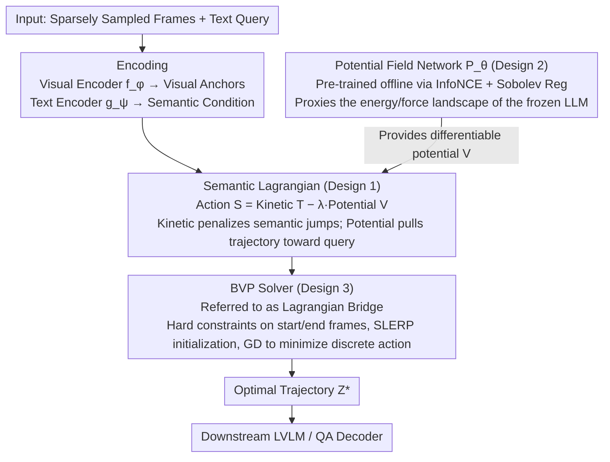

# SLAP: The Semantic Least Action Principle for Variational Video-Language Modeling

**Conference**: ICML 2026  
**arXiv**: [2605.30750](https://arxiv.org/abs/2605.30750)  
**Code**: TBD  
**Area**: Multimodal VLM / Long Video Understanding  
**Keywords**: Video-Language Models, Temporal Interpolation, Principle of Least Action, Variational Methods, Object Permanence

## TL;DR
SLAP applies the "Principle of Least Action" from classical mechanics to the video semantic manifold, modeling the completion of missing frames from sparsely sampled videos as a two-point boundary value problem on a Riemannian manifold. By replacing probabilistic generation with semantic dynamics to enforce object permanence, it achieves 83.9% accuracy on tunnel occlusion tests (outperforming diffusion models by 12 points) with a 177× inference speedup.

## Background & Motivation

**Background**: Contemporary Large Video-Language Models (LVLMs) such as Video-LLaMA and LLaVA-Video perform strongly in static scene QA. However, limited by the $O(n^2)$ complexity of self-attention during long video processing, they must employ aggressive sparse sampling (typically < 0.5 fps), leaving significant temporal "blind spots" for the model.

**Limitations of Prior Work**: Blind spots lead to two failure modes:
- **Implicit Pooling** (mean-pool / Q-Former): Methods directly compress frame sequences into a single token, causing the loss of temporal causal structures.
- **Generative Hallucination** (e.g., frame interpolation via Stable Video Diffusion): These produce visually realistic results based on statistical texture priors but violate object permanence. For example, when a car enters a tunnel, a diffusion model might make the car disappear because "empty tunnels" are more common in the training set.

**Key Challenge**: Current LVLMs are "kinematically naive." They treat video frames as a bag-of-tokens, lacking "semantic entity conservation" constraints. Consequently, they cannot spontaneously reject physically impossible trajectories like object teleportation or disappearance.

**Goal**: To shift "missing frame completion" from a probabilistic framework (maximizing $P(x_t \mid x_{t-1})$) to a physical framework (minimizing action), replacing statistical learning with the elegant constraints of classical mechanics.

**Key Insight**: The Principle of Least Action governs phenomena from planetary orbits to quantum field theory, naturally ensuring path smoothness and energy optimality. By analogizing this principle to the semantic manifold, "semantic inertia" (kinetic) and "semantic force fields" (potential) are introduced to constrain embedding trajectories.

**Core Idea**: Replace probabilistic generation with variational mechanics. Model missing intervals as two-point boundary value problems (BVP) solved via discrete Euler-Lagrange equations. Object permanence is gained "for free" without requiring pixel-wise rendering.

## Method

### Overall Architecture
Given start and end frames $t_{\text{start}}, t_{\text{end}}$, the goal is to find the missing embedding sequence $\{z_t\}$ that minimizes the total action. Three steps:

1. **Encoding**: A visual encoder $f_\phi$ and a text encoder $g_\psi$ map both frames and queries into the same $d$-dimensional latent space. The former provides fixed visual anchor embeddings, while the latter provides semantic condition embeddings, inducing a Riemannian geometry on the space (Assumption 3.1: semantic isometry).
2. **Learning the Potential Field**: A lightweight MLP $P_\theta$ fits the "energy landscape excited by text queries in the latent space," trained via noise contrastive estimation (performed offline).
3. **Inference-time Action Minimization**: The discrete sequence is substituted into the action functional defined by a semantic Lagrangian (where the kinetic term comes from the trajectory itself and the potential term is provided by $P_\theta$). The start and end frames serve as hard constraints for gradient descent to find the optimal trajectory $Z^*$, which is then fed into the downstream LVLM/QA decoder. This avoids frame-by-frame autoregressive prediction and error accumulation.

The flowchart below illustrates this pipeline—encoding and decoding serve as the scaffolding, while the potential field network (Design 2), semantic Lagrangian (Design 1), and BVP solver (Design 3) collaborate to complete the missing frames:

### Key Designs

**1. Semantic Lagrangian (Kinetic + Potential Terms): Entrusting object persistence to least action rather than probabilistic generation**

Diffusion-based interpolation relies on statistical texture priors, which may cause a car to disappear in a tunnel. SLAP adopts a physical framework: define the total action as $S[z] = \int (T(z) - \lambda V(z, q)) dt$, where kinetic energy $T = \frac{1}{2}\|\dot{z}\|^2$ is the inertial cost of semantic velocity, and potential energy $V(z, q) = 1 - \text{sim}(z, g_\psi(q))$ represents the attraction of the text query. The discrete form is $S_{\text{disc}} = \sum_t [\frac{1}{2}\|\frac{z_{t+1} - z_t}{\Delta t}\|^2 - \lambda P_\theta(z_t, q)]$. The kinetic term naturally penalizes "semantic jumps"—instantaneous disappearance would require infinite semantic velocity, which is forbidden under least action. Thus, object permanence is a "free gift" from conservation laws without pixel-level supervision. The potential term acts like a gravitational field, pulling the trajectory in the correct semantic direction. The coupling coefficient $\lambda$ balances smoothness and alignment; experiments find the "resonance point" at $\lambda \approx 0.5$ is optimal.

**2. Potential Field Network + NCE + Sobolev Regularization: Using a lightweight MLP as a proxy for the energy landscape defined by a frozen LLM**

Backpropagating through a large LLM to calculate potential at every step would be computationally astronomical. SLAP uses a differentiable lightweight MLP $P_\theta$ as a proxy, transforming the problem into density ratio estimation for an energy-based model trained via InfoNCE:

$$\mathcal{L}_{NCE} = -\mathbb{E} \log \frac{\exp(P_\theta(z, q) / \tau)}{\exp(P_\theta(z, q)/\tau) + \sum_j \exp(P_\theta(z_j, q)/\tau)}$$

As $K \to \infty$, the optimal proxy satisfies $P_\theta^*(z, q) = \log \frac{p(z\mid q)}{p(z)} + C(q)$, making the maximization of the proxy equivalent to the minimization of the true potential. Sobolev regularization $\mathcal{L}_{\text{reg}} = \mathbb{E}\|\nabla_z P_\theta\|^2$ and spectral normalization are added to ensure "gentle semantic gravity." This smoothness constraint is necessary because the subsequent Euler-Lagrange solver requires a smooth potential gradient to prevent divergence in discrete steps. Theorem 3.7 provides an explicit upper bound for trajectory deviation $\frac{T^2}{\mu}\epsilon$ relative to gradient error $\epsilon$.

**3. BVP Solver (Lagrangian Bridge): Optimizing the entire interval simultaneously with boundary constraints to avoid autoregressive drift**

Frame-by-frame autoregression is prone to context drift in long sequences (e.g., forgetting a car entered a tunnel and hallucinating streetlights inside). SLAP avoids step-by-step prediction by modeling the missing interval as a two-point boundary value problem. Start and end frames are fixed as hard constraints, and the intermediate sequence is initialized via SLERP before undergoing gradient descent to minimize discrete action. The two ends act as "future constraints," pulling the intermediate trajectory back to the globally correct semantic path. Theorem 3.6 proves that when $\lambda \cdot \max \|\nabla^2 P_\theta\| < \frac{2}{\lambda \Delta t^2}$, the action functional is strictly convex, ensuring a unique and stable global optimum.

### Loss & Training
The potential network $P_\theta$ is pre-trained on WebVid-10M with the objective $\mathcal{L}_{\text{total}} = \mathcal{L}_{NCE} + \gamma \mathcal{L}_{\text{reg}}$. The encoders are frozen.

## Key Experimental Results

### Main Results: Tunnel Test (Object Permanence)

| Method | Accuracy ↑ | Permanence Score (1-5) ↑ | Semantic Drift ↓ |
|------|---------|----------------|----------|
| ZOH (Zero-Order Hold) | 24.3 | 1.2 | 0.45 |
| SLERP (Linear) | 41.5 | 2.1 | 0.38 |
| Latent ODE | 58.2 | 3.4 | 0.29 |
| Video-LLaMA 3 (Autoregressive) | 68.1 | 3.9 | 0.25 |
| Stable Video Diffusion | 71.4 | 3.5 | 0.28 |
| **SLAP (Ours)** | **83.9** | **4.7** | **0.14** |

### Ablation Study (Tunnel Test)

| Configuration | Accuracy | Description |
|------|--------|------|
| Full SLAP | 83.9 | $\lambda \approx 0.5$ |
| $\mu \to 0$ (Potential Only) | 62.0 | Loss of inertia; frequent object appearances/disappearances |
| $\mu \to \infty$ (Inertia Only) | 41.5 | Degenerates to SLERP; ignores text |
| Static Potential (Fixed Cosine) | 70.5 | Learned $P_\theta$ is indispensable |

### MSR-VTT Video QA (Robustness vs. Sampling Rate)

| Method | 50% Frames ↑ | 25% Frames ↑ | 10% Frames ↑ | Gain/Drop ↓ |
|------|--------|--------|--------|------|
| ZOH | 38.4 | 31.2 | 22.5 | -15.9 |
| Linear | 40.1 | 35.8 | 30.1 | -10.0 |
| Video-LLaMA 3 | 44.5 | 41.2 | 34.7 | -9.8 |
| SVD | 43.8 | 39.5 | 35.2 | -8.6 |
| **SLAP** | **45.2** | **43.9** | **41.8** | **-3.4** |

### Computational Efficiency

| Method | TFLOPs ↓ | Latency (s) ↓ | Memory (GB) ↓ | Speedup |
|------|---------|---------|---------|------|
| Stable Video Diffusion | 185.0 | 14.20 | 22.5 | 1.0× |
| Video-LLaMA 3 | 45.2 | 3.80 | 16.0 | 3.7× |
| Neural ODE | 12.5 | 1.10 | 8.4 | 12.9× |
| **SLAP** | **0.15** | **0.08** | **0.8** | **177.5×** |

### Key Findings
- SLAP significantly outperforms SVD in object permanence (+12.5 points) and halves semantic drift. This is because replacing an object with an empty tunnel requires high semantic velocity under the kinetic term, which is rejected by the least action principle.
- Under extreme sparsity (10% frames), performance drops by only 3.4%, compared to 9.8% for Video-LLaMA 3, indicating that semantic action defined by boundary frames and text queries is often sufficient for QA tasks.
- On "action-centric" questions, it scores 12 points higher than Video-LLaMA 3, as least action naturally restores geodesics in verb space (e.g., standing → falling → lying down).
- 0.15 TFLOPs per inference (~0.5 Joules) vs. ~150 Joules for SVD reduces carbon emissions by three orders of magnitude.
- A $\lambda$ scan reveals a clear "resonance regime": Ballistic ($\lambda \to 0$, 41.5%) → Weak Coupling ($\lambda = 0.1$, 65.2%) → Resonance ($\lambda = 0.5$, 83.9%) → Strong Coupling ($\lambda = 1.0$, 79.1%) → Chaos ($\lambda > 5$, 31%).

## Highlights & Insights
- **Elegant Transfer of Physical Intuition**: Porting conservation laws and the principle of least action from classical mechanics to the semantic manifold is a philosophical innovation, suggesting that future architectures could be designed based on "symmetry and conservation laws."
- **BVP vs. Autoregression**: Boundary constraints "pull" the intermediate trajectory back to the correct path globally, providing a general solution for drift in long sequences that could be transferred to long documents or trajectory prediction.
- **Lightweight Proxy with Theoretical Guarantees**: Using InfoNCE and Sobolev regularization to learn potentials provides explicit bounds on trajectory deviation, a method applicable to RL reward models and EBM training.
- **Discovery of Resonance Regimes**: The $\lambda$ scan reveals a physical phase diagram (ballistic-resonance-chaos), a clean phenomenological result rarely seen in deep learning.

## Limitations & Future Work
- For excessively long missing intervals, the trajectory error bound $\frac{T^2}{\mu}\epsilon$ grows quadratically, requiring multi-stage solvers or denser anchors.
- Heavily dependent on Assumption 3.1 (Riemannian geometry induced by the encoder is proportional to pixel distance); performance may vary with different encoders.
- Experiments focused on 10–20 second videos (MSR-VTT / ActivityNet); generalization to minute-long videos or audio-visual multimodality is unknown.
- The potential network is pre-trained on WebVid-10M; robustness to domain shifts (e.g., medical/scientific) may be limited.

## Related Work & Insights
- **vs. Implicit Pooling**: Pooling destroys causal structures; SLAP preserves continuous evolution via the kinetic term.
- **vs. Diffusion Interpolation**: Diffusion tends to generate statistically likely pixels, causing objects to vanish in rare scenes; SLAP favors the "most economical trajectory," naturally conserving object identity.
- **vs. Autoregressive Transformer**: Autoregression suffers from context drift in long sequences; SLAP's dual-ended constraints mitigate this.
- **Insight**: When handling tasks requiring "physical common sense," seeking inspiration from classical physics dualities/conservation laws is more effective than pure statistical learning.

## Rating
- Novelty: ⭐⭐⭐⭐⭐  Applies the principle of least action to semantic manifolds, breaking the monopoly of generative models.
- Experimental Thoroughness: ⭐⭐⭐⭐⭐  Covers tunnel tests, MSR-VTT, and ActivityNet across three scenarios with detailed ablation and efficiency/energy analysis.
- Writing Quality: ⭐⭐⭐⭐  Clear physical analogies and rigorous math; discussion of Assumption 3.1 could be deeper.
- Value: ⭐⭐⭐⭐⭐  177× speedup + 3 orders of magnitude reduction in carbon footprint; a direct solution for object permanence that is transferable to long-sequence multimodal and RL energy models.

<!-- RELATED:START -->

## Related Papers

- [\[ICCV 2025\] Frequency-Semantic Enhanced Variational Autoencoder for Zero-Shot Skeleton-based Action Recognition](../../ICCV2025/video_understanding/frequency-semantic_enhanced_variational_autoencoder_for_zero-shot_skeleton-based.md)
- [\[AAAI 2026\] Explicit Temporal-Semantic Modeling for Dense Video Captioning via Context-Aware Cross-Modal Interaction](../../AAAI2026/video_understanding/explicit_temporal-semantic_modeling_for_dense_video_captioning_via_context-aware.md)
- [\[CVPR 2026\] Beyond Explicit Language: Plug-and-Play Visual-to-Linguistic Modeling Toward General Object Tracking](../../CVPR2026/video_understanding/beyond_explicit_language_plug-and-play_visual-to-linguistic_modeling_toward_gene.md)
- [\[CVPR 2026\] Prototypical Action Reasoning Facilitated by Vision-Language Alignment for Egocentric Action Anticipation](../../CVPR2026/video_understanding/prototypical_action_reasoning_facilitated_by_vision-language_alignment_for_egoce.md)
- [\[CVPR 2026\] Polyphony: Diffusion-based Dual-Hand Action Segmentation with Alternating Vision Transformer and Semantic Conditioning](../../CVPR2026/video_understanding/polyphony_diffusion-based_dual-hand_action_segmentation_with_alternating_vision_.md)

<!-- RELATED:END -->
