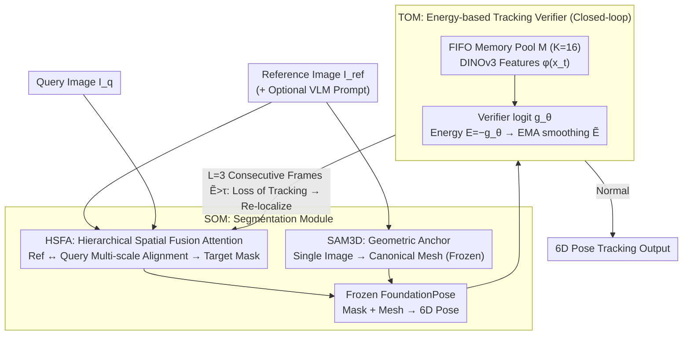

# STORM: Segment, Track, and Object Re-Localization from a Single Image

**Conference**: ICML 2026  
**arXiv**: [2511.09771](https://arxiv.org/abs/2511.09771)  
**Code**: https://github.com/YuDeng321/STORM  
**Area**: Video Understanding / 6D Pose Tracking / Referring Segmentation / Embodied Perception  
**Keywords**: Reference-conditioned 6D tracking, HSFA, Tracking verifier, Energy-like score, Zero-shot registration

## TL;DR
STORM proposes a "reference-image-only" 6D pose tracking framework: it uses Hierarchical Spatial Fusion Attention (HSFA) for reference-query feature alignment (producing segmentation masks + SAM3D meshes) and trains a Tracking Verifier with BCE binary classification. The negative logit is treated as an energy score $E=-g_\theta$, and an automatic re-localization is triggered when the score exceeds a threshold for $L=3$ consecutive frames, pushing unannotated 6D tracking accuracy on LM-O / YCB-V close to the ground-truth mask upper bound.

## Background & Motivation

**Background**: Current SOTA 6D pose estimation and tracking (FoundationPose, SAM-6D, Pos3R, etc.) mostly rely on CAD models, manual masks, or per-object fine-tuning. These methods require tedious object-specific preparation during deployment. Although general foundation models (SAM3, DINOv3) provide strong semantics, they lack a reference-conditioned mechanism and cannot specify a particular instance based on a single image.

**Limitations of Prior Work**: (1) Reference-query template matching mostly uses shallow cosine similarity; non-linear manifold distortion under occlusion, motion blur, or rapid view changes causes these metrics to fail. (2) Existing trackers "track blindly"—they lack internal signals to determine when a target has drifted out of the local neighborhood, leading to silent drift. (3) Even with recovery heuristics (particle filters, histogram matching), false positives are common, preventing a robust closed-loop system.

**Key Challenge**: There is a dual gap of distribution shift and occlusion uncertainty between the reference and query images. Pure geometric matching fails to solve the former, while pure semantic matching is insufficient for the latter. Furthermore, tracking is a self-feedback system that cannot perform closed-loop recovery without a "self-evaluation signal."

**Goal**: (i) Achieve single-reference 6D tracking without relying on CAD models or per-object training; (ii) Formalize "tracking failure detection" as a learnable module; (iii) Enable automatic recovery under heavy occlusion and rapid viewpoint changes.

**Key Insight**: Reconstruct segmentation and tracking from "independent engineering modules" into "coupled learning modules." The former compresses the reference view into an object-centric representation via hierarchical attention, while the latter formalizes whether tracking is still compatible with the initial memory as a binary verification problem, utilizing energy scoring (Liu 2020) for smooth thresholding.

**Core Idea**: A compatibility verifier trained with BCE handles both "instance matching loss supervision" and "tracking validity energy scoring." This unifies invariance, robustness, and closed-loop recovery into a single logit scalar.

## Method

### Overall Architecture
STORM consists of two coupled modules. **SOM (Segmenting Object Module)**: Takes one or more reference images $I_{ref}$ and the current query image $I_q$ (with optional VLM semantic prompts), outputs the target mask on the query image via HSFA, and generates a canonical 3D mesh $\mathcal{P}_{ref}$ from the reference image via SAM3D. These are fed into a frozen FoundationPose to obtain the 6D pose. **TOM (Tracking Object Module)**: Maintains a FIFO memory pool $\mathcal{M}$ of size $K=16$ containing successful tracking crops. In each frame, DINOv3 features $\phi(x_t)$ are paired with $\mathcal{M}$ to calculate the logit $g_\theta(x_t,\mathcal{M})$. Energy is defined as $E(x_t,\mathcal{M})\triangleq -g_\theta(x_t,\mathcal{M})$. If the EMA-smoothed value $\tilde E_{t-k}>\tau$ for $L=3$ consecutive frames, re-localization is triggered ($\tau$ is calibrated at the 95th percentile of the validation set). Frozen components: DINOv3, CLIP/VLM, SAM3D, FoundationPose; Trainable components: SOM (HSFA + segmentation head) + TOM (lightweight attention verifier).

### Key Designs

**1. HSFA: Hierarchical Spatial Fusion Attention: Converting reference-to-query matching into learnable multi-scale alignment instead of fragile cosine templates.**

Traditional template matching relies on shallow cosine similarity, which fails under occlusion or rapid viewpoint changes. HSFA makes alignment learnable, hierarchical, and conditional: first, self-attention aggregates any number of reference views into an object-centric latent representation $\mathcal{Z}_{ref}$. Then, query features $\mathcal{Z}_{query}$ retrieve from it via cross-attention. Shallow layers perform global semantic anchoring, while deep layers perform local geometric alignment. When a VLM provides a text description $T$, zero-initialized AdaLN/FiLM use its CLIP embedding $e_t$ to modulate visual token statistics:

$$\hat F_{i,c}=(1+s_c(e_t))(F_{i,c}-\mu_i)/(\sigma_i+\epsilon)+b_c(e_t)$$

Sigmoid gating in cross-attention suppresses irrelevant reference channels. The softmax weights of the cross-attention serve as the alignment matrix $W$, projecting reference objectness onto the query to obtain the mask. This avoids fragile keypoint alignment by using only mask loss without explicit correspondence supervision.

**2. Energy-like Tracking Verifier (TOM): Providing a self-evaluation signal for tracking failure.**

Existing trackers assume the target is always in a local neighborhood and suffer from silent drift. TOM formalizes "whether the current observation belongs to the initial object" as a binary classification. During training, BCE is applied to triplets $(x_t, \mathcal{M}, y)$:

$$\mathcal{L}_{TOM}=-\mathbb{E}[y\log\sigma(g_\theta)+(1-y)\log(1-\sigma(g_\theta))]$$

Positive samples are real compatible pairs; negative samples are synthesized via identity confusion (different objects in the same scene) and drift-like random cropping. During inference, borrowing from OOD detection, energy is defined as $E=-g_\theta$. Tracking failure is declared only if the EMA value $\tilde E_t$ exceeds $\tau$ for $L=3$ consecutive frames. This provides the stability of BCE during training and the flexibility of energy thresholding during inference.

**3. SAM3D Geometric Anchor + Frozen/Trainable boundaries: Using single-image meshes as structural scaffolds for rigid registration.**

To obtain 6D poses without CAD models, a 3D reference is necessary. STORM uses SAM3D to generate a canonical mesh $\mathcal{P}_{ref}$ once from the reference image. Instead of hard texture/geometry matching, the mesh acts as a soft latent geometric constraint for FoundationPose. At runtime, SAM3D, DINOv3, FoundationPose, and CLIP are frozen; only SOM and TOM are trained. This boundary is chosen because single-view mesh quality is unstable; using it as a scaffold rather than exact geometry allows the downstream pose registration to tolerate noise while maintaining zero-shot generalization.

### Loss & Training
SOM uses standard segmentation loss (mask supervision, implicit correspondence). TOM uses BCE (Eq. 3). Inference: DINOv3 features → TOM logit → EMA → Thresholding → Closed-loop. The memory pool uses a FIFO size of 16, cleared after re-localization and updated only with high-confidence frames.

## Key Experimental Results

### Main Results
6D tracking accuracy without annotations on LM-O / YCB-V ($\mathrm{ADD}_\mathrm{AUC}$ / $\mathrm{ADD\text{-}S}_\mathrm{AUC}$ / AR):

| Dataset | Method | $\mathrm{ADD}_\mathrm{AUC}$ | $\mathrm{ADD\text{-}S}_\mathrm{AUC}$ | AR |
|---|---|---|---|---|
| LM-O | FP + CNOS | 57.0 | 68.0 | 41.0 |
| LM-O | **Ours (STORM)** | **74.0 ± 1.28** | **89.0 ± 1.25** | **53.0 ± 2.02** |
| LM-O | FP + Ground Truth | 78.0 | 93.0 | 56.0 |
| YCB-V | FP + CNOS | 73.0 | 92.0 | 69.0 |
| YCB-V | **Ours (STORM)** | **77.0 ± 1.25** | **98.0 ± 1.20** | **73.0 ± 1.23** |
| YCB-V | FP + Ground Truth | 78.0 | 99.0 | 74.0 |

BOP instance segmentation (Mean AP across 5 datasets, annotation-free category):

| Method | LM-O | T-LESS | TUD-L | HB | YCB-V | Mean ↑ | Time (s) |
|---|---|---|---|---|---|---|---|
| **Ours (SOM)** | **57.8** | **53.0** | **73.3** | **74.1** | **80.3** | **67.7** | **0.046** |
| NOCTIS | 48.9 | 47.9 | 58.3 | 60.7 | 68.4 | 56.8 | 0.990 |
| SAM6D | 46.0 | 45.1 | 56.9 | 59.3 | 60.5 | 53.6 | 2.795 |
| CNOS (FastSAM) | 39.7 | 37.4 | 48.0 | 51.1 | 59.9 | 47.2 | 0.221 |

### Ablation Study

| Configuration | Key Change | Conclusion |
|---|---|---|
| Full STORM | mean AP 67.7 | Baseline framework. |
| w/o HSFA Depth Iteration | Significant degradation | Multi-scale cross-attention is core to segmentation robustness. |
| w/o VLM Semantics | Increased multi-instance confusion | Text conditions help resolve ambiguous scenes. |
| TOM with fixed Cosine | Tracking-loss detection AUC ↓ | Learned logits distinguish true drift better than fixed metrics. |
| w/o EMA & Consecutive $L$ | Significant increase in false triggers | 3-frame gating suppresses single-frame noise effectively. |

### Key Findings
- STORM improves annotation-free pipelines on LM-O from 57.0 to 74.0, only 4 points away from the ground-truth mask upper bound (78.0), suggesting mask quality is the current bottleneck.
- SOM takes only 0.046s per inference on H100, which is 20–60× faster than NOCTIS/SAM6D.
- The learned TOM verifier is more stable than fixed metric baselines on Tracking Failure Benchmarks.

## Highlights & Insights
- **Dual learned alignment**: Both "how to segment" and "how to verify" are treated as learned alignment tasks, avoiding fragile engineering choices like cosine templates.
- **Energy score = negative logit**: This mathematical equivalence combines the stable training of BCE with the flexible thresholding of energy, applicable to tasks like ReID or semi-supervised tracking.
- **Minimal training surface**: Freezing foundation models while training two small modules allows STORM to benefit from the zero-shot generalization of DINOv3 and FoundationPose with low fine-tuning costs.
- **VLM via zero-initialized AdaLN**: Treating semantics as a "identity-preserving statistic correction" rather than hard concatenation prevents text channels from interfering with visual learning in early training stages.

## Limitations & Future Work
- Zero-shot here refers to "no test-time mask/box/tuning"; BOP train/test object identities may overlap, so it is not truly category-disjoint generalization.
- SAM3D single-image reconstruction quality limits the pose ceiling and remains sensitive to reflective, transparent, or textureless objects.
- The calibration of $\tau$ comes from synthetic drift; it may not be robust against real-world long-tail occlusion. Future work could involve Bayesian uncertainty estimation.
- A single reference image only covers one viewpoint; active learning to request new reference views is an open problem.

## Related Work & Insights
- **vs FoundationPose (Wen 2024)**: STORM reuses the pose head but fills the gap for "self-evaluation of tracking validity" and "mask generation without CAD."
- **vs CNOS / PerSAM**: These use shallow cosine matching; STORM uses hierarchical attention for learned alignment, which is more robust to occlusion.
- **vs SAM-6D / Pos3R**: These work at the frame level with explicit 2D-3D matching; STORM introduces temporal closed-loop via the verifier.
- **vs Energy scores in OOD (Liu 2020)**: STORM systematically adapts energy thresholding for 6D tracking failure detection.

## Rating
- Novelty: ⭐⭐⭐⭐ The combination of HSFA and an energy-like verifier is a new attempt in 6D tracking.
- Experimental Thoroughness: ⭐⭐⭐⭐ Comprehensive coverage across LM-O/YCB-V, 5 BOP datasets, and error bars.
- Writing Quality: ⭐⭐⭐⭐ Clear module boundaries and intuitive energy score derivations.
- Value: ⭐⭐⭐⭐ High practical utility for robotics and embodied perception with open-source code and near-GT accuracy.

<!-- RELATED:START -->

- **FoundationPose**: Wen et al., "FoundationPose: Unified 6D Pose Estimation and Tracking of Novel Objects," CVPR 2024.
- **SAM-6D**: Wang et al., "SAM-6D: Segment and Assemble Models for 6D Object Pose Estimation," CVPR 2024.
- **Energy-based OOD**: Liu et al., "Energy-based Out-of-distribution Detection," NeurIPS 2020.

<!-- RELATED:END -->

## Related Papers

- [\[CVPR 2026\] STORM: End-to-End Referring Multi-Object Tracking in Videos](../../CVPR2026/video_understanding/storm_referring_multi_object_tracking.md)
- [\[CVPR 2026\] TGTrack: Temporal Generative Learning for Unified Single Object Tracking](../../CVPR2026/video_understanding/tgtrack_temporal_generative_learning_for_unified_single_object_tracking.md)
- [\[CVPR 2026\] Temporally Consistent Long-Term Memory for 3D Single Object Tracking](../../CVPR2026/video_understanding/chronotrack_temporally_consistent_long_term_memory_for_3d_single_object_tracking.md)
- [\[CVPR 2026\] UETrack: A Unified and Efficient Framework for Single Object Tracking](../../CVPR2026/video_understanding/uetrack_a_unified_and_efficient_framework_for_single_object_tracking.md)
- [\[CVPR 2026\] Out of Sight, Out of Track: Adversarial Attacks on Propagation-based Multi-Object Trackers via Query State Manipulation](../../CVPR2026/video_understanding/out_of_sight_out_of_track_adversarial_attacks_on_propagation-based_multi-object_.md)

<!-- RELATED:END -->
