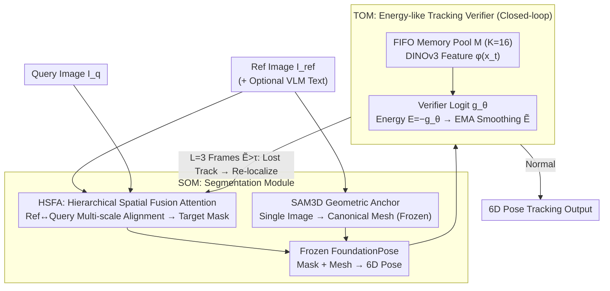

# STORM: Segment, Track, and Object Re-Localization from a Single Image

**Conference**: ICML 2026  
**arXiv**: [2511.09771](https://arxiv.org/abs/2511.09771)  
**Code**: https://github.com/YuDeng321/STORM  
**Area**: Video Understanding / 6D Pose Tracking / Referring Segmentation / Embodied Perception  
**Keywords**: Reference-conditioned 6D tracking, HSFA, Tracking verifier, Energy-like score, Zero-shot registration

## TL;DR
STORM proposes a 6D pose tracking framework that "runs with only a single reference image": it utilizes Hierarchical Spatial Fusion Attention (HSFA) for reference-query feature alignment (producing segmentation masks + SAM3D meshes) and trains a Tracking Verifier using BCE binary classification. The negative logit is defined as the energy score $E=-g_\theta$, and re-localization is automatically triggered when the score exceeds a threshold for $L=3$ consecutive frames, pushing zero-shot 6D tracking accuracy on LM-O/YCB-V close to the ground-truth mask upper bound.

## Background & Motivation

**Background**: Current SOTA 6D pose estimation and tracking (FoundationPose, SAM-6D, Pos3R, etc.) mostly transition between CAD models, manual masks, or per-object fine-tuning, requiring cumbersome object-specific preparation during deployment. Although general foundation models (SAM3, DINOv3) provide strong semantics, they lack a reference-conditioned mechanism to specify which particular instance to track using a single image.

**Limitations of Prior Work**: (1) Reference-query template matching often relies on shallow cosine similarity, where non-linear manifold distortions caused by occlusion, motion blur, and drastic viewpoint changes lead to metric collapse; (2) Existing trackers track "blindly"—once the target leaves the local neighborhood, there is no internal signal to determine "I am lost," leading to silent drift; (3) Even with recovery heuristics (particle filters, histogram matching), false positives are common, preventing a closed-loop system.

**Key Challenge**: There exists a dual gap of **distribution shift** and **occlusion uncertainty** between the reference and query images. Pure geometric matching fails to solve the former, while pure semantic matching is insufficient for the latter. Simultaneously, tracking is a **self-feedback system**, and the absence of a "self-assessment signal" prevents closed-loop recovery.

**Goal**: (i) Achieve single-reference 6D tracking without relying on CAD or per-object training; (ii) Transform "tracking failure detection" into a learnable module; (iii) Enable automatic recovery under heavy occlusion and rapid viewpoint changes.

**Key Insight**: Reconstruct segmentation and tracking from "independent engineering modules" into "coupled learning modules"—the former compresses the reference view into an object-centric representation via hierarchical attention, while the latter formalizes whether the tracking remains compatible with the initial memory as a binary verification problem, utilizing energy scoring (Liu 2020) from OOD detection for smoothed thresholding.

**Core Idea**: Utilize a BCE-trained compatibility verifier to simultaneously handle "instance matching loss supervision" and "tracking validity energy scoring," unifying invariance, robustness, and closed-loop recovery into a single logit scalar.

## Method

### Overall Architecture
STORM consists of two coupled modules. **SOM (Segmenting Object Module)**: Takes one or more reference images $I_{ref}$ + the current query image $I_q$ (plus optional VLM semantic prompts), outputs the target mask on the query image via HSFA, generates a canonical 3D mesh $\mathcal{P}_{ref}$ from the reference image via SAM3D, and feeds both into a frozen FoundationPose to obtain the 6D pose. **TOM (Tracking Object Module)**: Maintains a FIFO memory pool $\mathcal{M}$ of size $K=16$ containing successful tracking crops. For each frame, it pairs the DINOv3 feature $\phi(x_t)$ with $\mathcal{M}$ to calculate the logit $g_\theta(x_t,\mathcal{M})$. The energy is defined as $E(x_t,\mathcal{M})\triangleq -g_\theta(x_t,\mathcal{M})$. After EMA smoothing, if $\tilde E_{t-k}>\tau$ for $L=3$ consecutive frames, re-localization is triggered ($\tau$ is calibrated using the 95th percentile of the validation set). Frozen components: DINOv3, CLIP/VLM, SAM3D, FoundationPose; Trainable components: SOM (HSFA + segmentation head) + TOM (lightweight attention verifier).

### Key Designs

**1. HSFA Hierarchical Spatial Fusion Attention: Learning "how to map reference to query" via multi-scale alignment instead of fragile cosine templates**

Traditional template matching relies on shallow cosine similarity, which collapses under occlusion or motion blur due to non-linear manifold warping. HSFA makes alignment learnable, hierarchical, and conditional: it first aggregates an arbitrary number of reference views into an object-centric latent representation $\mathcal{Z}_{ref}$ via self-attention, then allows query features $\mathcal{Z}_{query}$ to retrieve it via cross-attention. Shallow layers perform global semantic anchoring on raw reference features, while deep layers perform local geometric alignment on fine spatial features. When a VLM provides a text description $T$, zero-initialized AdaLN/FiLM use its CLIP embedding $e_t$ as a condition to refine visual token statistics:

$$\hat F_{i,c}=(1+s_c(e_t))(F_{i,c}-\mu_i)/(\sigma_i+\epsilon)+b_c(e_t)$$

Sigmoid gating is applied in cross-attention to suppress irrelevant reference channels. The softmax weights of the cross-attention are used as the alignment matrix $W$ to project reference objectness onto the query to obtain the mask. This avoids fragile keypoint alignment by not explicitly supervising correspondences.

**2. Energy-like Tracking Verifier (TOM): Providing a self-assessment signal for "Have I lost the track?"**

Existing trackers assume the target is always in the local neighborhood, leading to silent drift if it leaves. TOM formalizes "whether the current observation still belongs to the initial tracked object" as binary classification: during training, BCE is applied to triplets $(x_t, \mathcal{M}, y)$:

$$\mathcal{L}_{TOM}=-\mathbb{E}[y\log\sigma(g_\theta)+(1-y)\log(1-\sigma(g_\theta))]$$

Positive samples come from real compatible observation-memory pairs, while negative samples are synthesized using identity confusion and drift-like random cropping. During inference, borrowing from OOD detection, the energy is defined as $E=-g_\theta$. Tracking failure is declared only if $\tilde E_t > \tau$ for $L=3$ consecutive frames. This temporal gating filters out single-frame jitter.

**3. SAM3D Geometric Anchors + Frozen/Trainable Boundaries: Using single-image meshes as "structural scaffolds" for rigid registration**

To obtain 6D poses without CAD, a 3D reference is needed. STORM uses SAM3D to generate a canonical mesh $\mathcal{P}_{ref}$ from the reference image. Instead of hard texture/geometry matching, the mesh acts as a soft latent geometric constraint for the frozen FoundationPose. SAM3D, DINOv3, FoundationPose, and CLIP are all frozen; only SOM (HSFA + head) and TOM (verifier) are trained. This boundary is set because single-view mesh predictions are unstable; by treating them as scaffolds rather than precise geometry, downstream pose registration can tolerate noise while ensuring zero-shot generalization via frozen foundation models.

### Loss & Training
SOM uses standard segmentation loss (supervised masks, implicit correspondence); TOM uses BCE (Eq. 3). Inference: DINOv3 features $\rightarrow$ TOM logit $\rightarrow$ EMA $\rightarrow$ Thresholding $\rightarrow$ Closed-loop. The memory pool uses FIFO size 16 and is cleared after re-localization, appending only high-confidence frames.

## Key Experimental Results

### Main Results
Annotation-free 6D tracking accuracy ($\mathrm{ADD}_\mathrm{AUC}$ / $\mathrm{ADD\text{-}S}_\mathrm{AUC}$ / AR) on LM-O / YCB-V:

| Dataset | Method | $\mathrm{ADD}_\mathrm{AUC}$ | $\mathrm{ADD\text{-}S}_\mathrm{AUC}$ | AR |
|---|---|---|---|---|
| LM-O | FP + CNOS | 57.0 | 68.0 | 41.0 |
| LM-O | **STORM** | **74.0 ± 1.28** | **89.0 ± 1.25** | **53.0 ± 2.02** |
| LM-O | FP + Ground Truth | 78.0 | 93.0 | 56.0 |
| YCB-V | FP + CNOS | 73.0 | 92.0 | 69.0 |
| YCB-V | **STORM** | **77.0 ± 1.25** | **98.0 ± 1.20** | **73.0 ± 1.23** |
| YCB-V | FP + Ground Truth | 78.0 | 99.0 | 74.0 |

BOP instance segmentation (Mean AP across 5 datasets, annotation-free segment):

| Method | LM-O | T-LESS | TUD-L | HB | YCB-V | Mean ↑ | Time (s) |
|---|---|---|---|---|---|---|---|
| **STORM (SOM)** | **57.8** | **53.0** | **73.3** | **74.1** | **80.3** | **67.7** | **0.046** |
| NOCTIS | 48.9 | 47.9 | 58.3 | 60.7 | 68.4 | 56.8 | 0.990 |
| SAM6D | 46.0 | 45.1 | 56.9 | 59.3 | 60.5 | 53.6 | 2.795 |
| CNOS (FastSAM) | 39.7 | 37.4 | 48.0 | 51.1 | 59.9 | 47.2 | 0.221 |

### Ablation Study

| Configuration | Change | Conclusion |
|---|---|---|
| Full STORM | mean AP 67.7 | Full framework |
| w/o HSFA Depth Iteration | Significant degradation | Multi-scale cross-attention is core to robust segmentation |
| w/o VLM Semantics | Multi-instance confusion rises | Text conditioning helps resolve ambiguity |
| TOM w/ Fixed Cosine | Tracking-loss AUC ↓ | Learned logit is superior to fixed metrics for drift detection |
| w/o EMA & $L$-check | False positive rate rises | 3-frame gating significantly suppresses false triggers |

### Key Findings
- STORM pushes the annotation-free pipeline from 57.0 to 74.0 on LM-O, leaving only a 4-point gap to the ground-truth mask upper bound (78.0), suggesting mask quality is the current bottleneck.
- SOM takes only 0.046s per inference on H100, 20–60× faster than NOCTIS/SAM6D.
- The TOM verifier is more stable than fixed-metric baselines on the Tracking Failure Benchmark.

## Highlights & Insights
- **Both segmentation and verification are treated as learned alignment**, avoiding fragile engineering options like cosine templates.
- **Energy score = negative logit**: This mathematical equivalence provides the training stability of BCE and the inference flexibility of energy thresholds, transferable to tasks like ReID or semi-supervised tracking.
- **Minimal training surface**: Freezing foundation models while training two small modules allows STORM to leverage DINOv3/FoundationPose generalization with low fine-tuning costs.
- **Zero-init AdaLN for VLM conditioning**: Treating semantics as a statistical correction rather than hard concatenation avoids text channel interference during early training.

## Limitations & Future Work
- Zero-shot refers to "no test-time mask/box/tuning"; however, BOP train/test object identities may overlap, meaning it is not truly category-disjoint generalization.
- SAM3D single-view reconstruction quality limits pose accuracy, especially for reflective or transparent objects.
- The $\tau$ calibration depends on synthetic negative samples, which may not be robust against real long-tail occlusion distributions.

## Related Work & Insights
- **vs FoundationPose (Wen 2024)**: This paper reuses its pose head but fills the gaps of "self-assessment of tracking validity" and "how to obtain masks without CAD."
- **vs CNOS / PerSAM**: These use shallow cosine template matching; STORM uses hierarchical attention for learned alignment, which is more stable.
- **vs OOD Energy Score (Liu 2020)**: Systematically transfers energy thresholding from OOD classification to 6D tracking failure detection for the first time.

## Rating
- Novelty: ⭐⭐⭐⭐ The combination of HSFA + Energy-like verifier is a new attempt in 6D tracking.
- Experimental Thoroughness: ⭐⭐⭐⭐ Coverage of multiple datasets (LM-O, YCB-V, BOP) and ablation studies.
- Writing Quality: ⭐⭐⭐⭐ Clear boundaries between frozen/trainable modules.
- Value: ⭐⭐⭐⭐ Highly practical for robotics and embodied perception.

<!-- RELATED:START -->

## Related Papers

- [\[CVPR 2026\] TGTrack: Temporal Generative Learning for Unified Single Object Tracking](../../CVPR2026/video_understanding/tgtrack_temporal_generative_learning_for_unified_single_object_tracking.md)
- [\[CVPR 2026\] UETrack: A Unified and Efficient Framework for Single Object Tracking](../../CVPR2026/video_understanding/uetrack_a_unified_and_efficient_framework_for_single_object_tracking.md)
- [\[CVPR 2026\] Out of Sight, Out of Track: Adversarial Attacks on Propagation-based Multi-Object Trackers via Query State Manipulation](../../CVPR2026/video_understanding/out_of_sight_out_of_track_adversarial_attacks_on_propagation-based_multi-object_.md)
- [\[CVPR 2025\] MUST: The First Dataset and Unified Framework for Multispectral UAV Single Object Tracking](../../CVPR2025/video_understanding/must_the_first_dataset_and_unified_framework_for_multispectral_uav_single_object.md)
- [\[CVPR 2025\] FC-Track: Overlap-Aware Post-Association Correction for Online Multi-Object Tracking](../../CVPR2025/video_understanding/fc-track_overlap-aware_post-association_correction_for_online_multi-object_track.md)

<!-- RELATED:END -->
