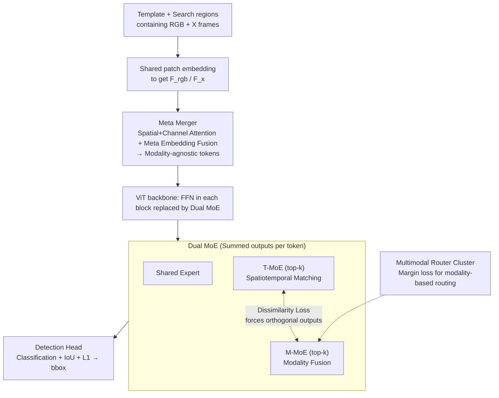

# Unified Multimodal Visual Tracking with Dual Mixture-of-Experts

**Conference**: ICML 2026  
**arXiv**: [2605.03716](https://arxiv.org/abs/2605.03716)  
**Code**: None  
**Area**: Video Understanding / Multimodal Visual Tracking / Mixture-of-Experts  
**Keywords**: Visual Tracking, RGB+X, Mixture-of-Experts, Feature Decoupling, Modality-Loss Robustness

## TL;DR
OneTrackerV2 unifies five tracking tasks (RGB, RGB+D, RGB+T, RGB+E, RGB+N) into a single network for end-to-end training. It utilizes a Meta Merger for modality fusion and a Dual MoE to explicitly decouple heterogeneous features—spatiotemporal matching and modality fusion—into T-MoE and M-MoE blocks, maintaining distinct subspaces via dissimilarity loss and router clustering.

## Background & Motivation
**Background**: Visual object tracking is categorized into RGB and RGB+X (X=Depth/Thermal/Event/Language) based on input modalities. Three main paradigms exist: (a) independent architecture design and training for each X-task; (b) fine-tuning pre-trained RGB trackers for adaptation (e.g., OneTracker); (c) preliminary unified models like SUTrack, which concatenate multimodal tokens within a shared backbone.

**Limitations of Prior Work**: (1) Multi-step training where pre-training followed by fine-tuning often leads to sub-optimal convergence; (2) Lack of unified architectures, requiring manual task-specific branches; (3) Parameters in shared architectures are often grouped by task rather than being truly "unified"; (4) Performance collapse when a modality is missing during inference; (5) Feature conflict—simple token concatenation forces the same parameter space to learn both spatiotemporal motion matching and modality-specific patterns simultaneously, causing interference.

**Key Challenge**: Tracking fundamentally requires two distinct capabilities: spatiotemporal matching (template ↔ search cross-frame motion) and modality fusion (complementary RGB ↔ X cues). Forcing both into a single backbone or a single MoE leads to zero-sum parameter contention.

**Goal**: (1) Single-step end-to-end training with shared parameters and architecture; (2) Modality-agnostic fusion robust to missing inputs via "meta embedding"; (3) Structural decoupling to resolve feature conflicts between matching and fusion; (4) Scalable capacity without exploding inference costs.

**Key Insight**: Utilize a learnable meta embedding as a central hub; introduce Dual MoE to assign spatiotemporal and modality tasks to separate sets of experts, enforced by explicit decoupling loss to maintain orthogonality.

**Core Idea**: Meta Merger + Dual MoE = A single network, trained once, using one set of parameters to handle 5 tracking tasks while remaining robust to modality loss and model compression.

## Method

### Overall Architecture
The model takes template and search regions as input, each containing RGB and an X-modality frame (for RGB-only tasks, RGB is duplicated). Shared patch embeddings yield $F_{rgb}$ and $F_x$. These are fused by the Meta Merger using a learnable meta embedding $F_{meta}$ via spatial/channel attention and centralized convolution to produce modality-agnostic tokens. The sequence enters a Vision Transformer backbone where the FFN in each block is replaced by a Dual MoE: each token is processed through a shared expert, T-MoE (top-$k$), and M-MoE (top-$k$), with outputs summed. Finally, a SUTrack-style head performs classification, IoU, and L1 regression. Four versions (B224/B384/L224/L384) are provided, with 80M–271M parameters and 23.4–72.4 FPS.

### Key Designs

**1. Meta Merger: Learnable meta embedding as a "modality translator" to project heterogeneous inputs into a unified space.**

Simply concatenating RGB and X tokens (as in SUTrack) doubles computation and causes failure when a modality is missing. Meta Merger first enhances $F_{rgb}$ and $F_x$ with spatial and channel attention ($W^{spatial}=\sigma(\mathrm{Conv}(F^{avg})+\mathrm{Conv}(F^{max}))$, $W^{channel}=\sigma(\mathrm{Linear}(F^{avg})+\mathrm{Linear}(F^{max}))$). It then introduces a global learnable variable $F_{meta}$ as a cross-modal mediator: $F_{meta}'=\mathrm{Conv}(\mathrm{Conv}(F_{meta}+F'_{rgb})+\mathrm{Conv}(F_{meta}+F'_x)+F_{meta})$. This outputs globally aligned, modality-agnostic tokens. If X is missing, the meta embedding naturally degrades to interact only with RGB—modality robustness is inherent to the structure rather than requiring specialized training.

**2. Dual MoE: Decoupling "spatiotemporal matching" and "modality fusion" into separate expert sets via orthogonal loss.**

Tracking requires both template ↔ search motion matching and RGB ↔ X complementary cue fusion. DMoE processes each token as $y=E_{shared}(x)+\sum_{i\in S^T_k}\hat g_i^T(x)E_i^T(x)+\sum_{i\in S^M_k}\hat g_i^M(x)E_i^M(x)$, where T-MoE and M-MoE experts are selected via top-$k$ gating. An expert decoupling loss $\mathcal L_{dis}=(\cos(y^T,y^M))^2$ forces the two paths to be orthogonal. As T-MoE is pushed away from the M-MoE subspace, it naturally gravitates toward motion features while M-MoE absorbs modality-specific signals.

**3. Multimodal Router Cluster: Forcing modality-specific clustering within M-MoE routing.**

While $\mathcal L_{dis}$ ensures T/M orthogonality, it doesn't guarantee that specific M-MoE experts specialize in specific modalities (e.g., Depth vs. Thermal). Router Cluster utilizes in-batch routing similarity $S_{ij}=\langle g^M(x_i),g^M(x_j)\rangle$ with a margin $\delta$. It constructs $\mathcal L_{same}=\frac{1}{|M_{same}|}\sum_{(i,j)\in M_{same}}\max(0,(1/K+\delta)-S_{ij})$ for same-modality pairs and $\mathcal L_{diff}=\frac{1}{|M_{diff}|}\sum_{(i,j)\in M_{diff}}\max(0,S_{ij}-(\delta-1/K))$ for cross-modality pairs. The resulting $\mathcal L_{cluster}=\mathcal L_{same}+\mathcal L_{diff}$ provides hierarchical modality-level preferences for M-MoE.

### Loss & Training
The total loss is $\mathcal L=\mathcal L_{class}+\lambda_G\mathcal L_{IoU}+\lambda_{L_1}\mathcal L_{L_1}+\mathcal L_{task}+\lambda_{dis}\mathcal L_{dis}+\lambda_{cluster}\mathcal L_{cluster}+\lambda_{balance}\mathcal L_{balance}$, with defaults $\lambda_G\!=\!2,\lambda_{L_1}\!=\!5,\lambda_{dis}\!=\!0.1,\lambda_{cluster}\!=\!1$. $\mathcal L_{balance}$ ensures MoE load balancing. The network is trained end-to-end in a single stage.

## Key Experimental Results

### Main Results

| Task / Benchmark | Metric | OneTrackerV2-L384 | SUTrack-L384 (Strong Baseline) | Note |
|-------------|------|--------------------|----------------------------|------|
| LaSOT | AUC | 76.1 | 75.2 | Long-term SOT, unified architecture leads |
| LaSOT_ext | AUC | 55.2 | 53.6 | Significant Gain on OOD classes |
| TrackingNet | AUC / P | 88.6 / 89.0 | 87.7 / 88.7 | Large-scale online tracking |
| GOT-10k | AO | 81.3 | 81.5 | Comparable, but with unified parameters |
| UAV123 | AUC | 71.0 | 70.4 | Drone perspective |
| Model Specs | Params (M) / FLOPs (G) / FPS | 80.2 / 23.8 / 72.4 (B224) | — | DMoE adds minimal cost |

### Ablation Study

| Design | Key Discovery | Interpretation |
|------|----------|------|
| Full OneTrackerV2 | SOTA across 5 tasks/12 benchmarks | Single model unifies RGB + RGB+X |
| W/O Dual MoE / Using Single MoE | Significant drop (Table 4) | Heterogeneous objectives must be decoupled |
| W/O $\mathcal L_{dis}$ | Increased T/M similarity, lower performance | Orthogonal constraint is key to decoupling |
| W/O Router Cluster | M-MoE degrades to generic FFN | Loss of modality-specific expert selection |
| Missing Modality Inference | Performance remains stable | Meta Merger provides modality robustness |
| Model Compression | Maintains high accuracy after compression | Structural redundancy in DMoE allows sparsity |

### Key Findings
- T-MoE expert selection patterns correlate highly with target motion intensity, proving it learns motion-related features. M-MoE experts show distinct preferences for different X-modalities, validating the router cluster.
- A single MoE attempting both tasks collapses into a representative but poorly discriminative feature extractor. Decoupling allows experts to specialize, improving both performance and robustness.
- In engineering scenarios like model compression and modality loss, OneTrackerV2's advantage widens, suggesting the unified/decoupled design possesses a natural robustness budget.

## Highlights & Insights
- **Explicit optimization of feature conflict**: Using $\cos^2$ dissimilarity—a simple orthogonalization loss—to specialize Dual MoEs is a high-ROI design.
- **Modality-level inductive bias**: Using "routing similarity" as an observable variable for margin loss constrains routing behavior more precisely than basic expert capacity losses.
- **Meta embedding as a "modality mediator"**: This design is naturally robust to missing modalities and represents a transferable pattern for RGB+X detection, segmentation, or multimodal reasoning.
- **Deployment-ready**: Single-stage training + shared parameters + SOTA on 12 benchmarks makes it one of the most practical multimodal tracking solutions for industry.

## Limitations & Future Work
- Reliance on ImageNet-style ViT backbones; performance on modalities with large domain gaps (e.g., pure Event, Radar, Lidar) remains to be fully explored.
- While FLOPs are controlled, Dual MoE increases GPU memory usage and training time, which may be challenging for smaller labs.
- Dependence on manual weights for dissimilarity and router clusters; lacks an automated scheduling mechanism.
- Multimodal data is aggregated by task; cross-task positive/negative transfer requires deeper investigation.

## Related Work & Insights
- **vs. SUTrack (Chen et al. 2025)**: SUTrack uses naive token concatenation and fails during modality loss; OneTrackerV2 uses Meta Merger and Dual MoE for explicit decoupling and superior performance.
- **vs. OneTracker (Hong et al. 2024)**: The original used multi-stage pre-training/fine-tuning; this version achieves true parameter unification and single-stage training.
- **vs. MoE Trackers (Tan et al. 2025, Cai et al. 2025)**: Previous works used MoE for capacity expansion or domain adaptation; this work uses MoE as a "structural container for task decoupling," a novel application in tracking.

## Rating
- **Novelty**: ⭐⭐⭐⭐ Dual MoE + router cluster turns feature conflict into a structural solution.
- **Experimental Thoroughness**: ⭐⭐⭐⭐⭐ Covers 5 tasks, 12 benchmarks, 4 model sizes, compression, and modality loss.
- **Writing Quality**: ⭐⭐⭐⭐ Clear diagrams and well-organized loss formulations.
- **Value**: ⭐⭐⭐⭐ A robust unified baseline for multimodal tracking with transferable structural patterns.

<!-- RELATED:START -->

## Related Papers

- [\[ICML 2026\] RELO: Reinforcement Learning to Localize for Visual Object Tracking](relo_reinforcement_learning_to_localize_for_visual_object_tracking.md)
- [\[CVPR 2026\] UTPTrack: Towards Simple and Unified Token Pruning for Visual Tracking](../../CVPR2026/video_understanding/utptrack_towards_simple_and_unified_token_pruning_for_visual_tracking.md)
- [\[ECCV 2024\] Occluded Gait Recognition with Mixture of Experts: An Action Detection Perspective](../../ECCV2024/video_understanding/occluded_gait_recognition_with_mixture_of_experts_an_action_detection_perspectiv.md)
- [\[ICML 2026\] AVTrack: Audio-Visual Tracking in Human-centric Complex Scenes](avtrack_audio-visual_tracking_in_human-centric_complex_scenes.md)
- [\[CVPR 2026\] Joint Learning of General and Diverse Patterns with Mixture of Memory Experts for Weakly-Supervised Video Anomaly Detection](../../CVPR2026/video_understanding/joint_learning_of_general_and_diverse_patterns_with_mixture_of_memory_experts_fo.md)

<!-- RELATED:END -->
