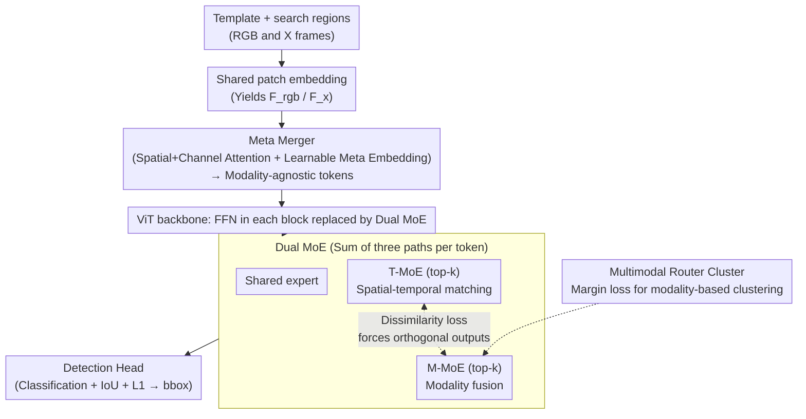

# Unified Multimodal Visual Tracking with Dual Mixture-of-Experts

**Conference**: ICML 2026  
**arXiv**: [2605.03716](https://arxiv.org/abs/2605.03716)  
**Code**: None  
**Area**: Video Understanding / Multimodal Visual Tracking / Mixture-of-Experts  
**Keywords**: Visual Tracking, RGB+X, Mixture-of-Experts, Feature Decoupling, Modality-Missing Robustness

## TL;DR
OneTrackerV2 unifies five tracking tasks (RGB / RGB+D / RGB+T / RGB+E / RGB+N) into a single network for end-to-end training. It utilizes a Meta Merger for modality fusion and a Dual MoE to explicitly decouple heterogeneous features—"spatial-temporal matching" and "modality fusion"—into T-MoE and M-MoE blocks. A dissimilarity loss and router clustering are employed to prevent these features from collapsing into the same subspace.

## Background & Motivation
**Background**: Visual object tracking is categorized into RGB and RGB+X (X=Depth/Thermal/Event/Language) based on input modalities. Major approaches include: (a) designing independent architectures and training for each X task; (b) fine-tuning pretrained RGB trackers (e.g., OneTracker); (c) preliminary unified models that concatenate multimodal tokens within a shared backbone (e.g., SUTrack).

**Limitations of Prior Work**: (1) Multi-step training (pretrained → finetune) often converges to sub-optimal solutions; (2) Lack of a unified architecture necessitates manually designed task branches; (3) Shared architectures still group parameters by task, rather than achieving truly "unified params"; (4) Performance collapses if a modality is missing during inference; (5) Feature conflict—simple token concatenation forces the same parameter space to learn both spatial-temporal motion matching and modality-specific patterns simultaneously, leading to mutual interference.

**Key Challenge**: Tracking essentially requires two distinct capabilities: spatial-temporal matching (template ↔ search cross-frame motion) and modality fusion (RGB ↔ X complementary cues). Cramming these into a single backbone or a single MoE leads to zero-sum parameter competition.

**Goal**: (1) Achieve single-step end-to-end training with shared parameters and architecture; (2) Develop a modality-agnostic, missing-robust "meta embedding" for fusion; (3) Resolve feature conflicts between spatial-temporal matching and modality fusion via structural decoupling; (4) Maintain scalable capacity without exploding inference costs.

**Key Insight**: A learnable meta embedding can serve as a central modality hub. By introducing a Dual MoE, two sets of experts can independently handle spatial-temporal and modality tasks, with an explicit decoupling loss forcing them to be orthogonal.

**Core Idea**: Meta Merger + Dual MoE = one network, one training session, and one set of parameters to handle 5 tracking tasks, while remaining robust to modality absence and model compression.

## Method

### Overall Architecture
Input template and search regions each contain an RGB frame and a corresponding X modality frame (for RGB-only tasks, the X frame is the RGB frame itself). Shared patch embeddings yield $F_{rgb}$ and $F_x$. The Meta Merger utilizes a learnable meta embedding $F_{meta}$ alongside spatial + channel attention and centralized convolutions to produce a sequence of modality-agnostic tokens. This sequence is fed into a Vision Transformer backbone, where the FFN in each block is replaced by a Dual MoE. Each token is computed through three paths: a shared expert, T-MoE (top-$k$), and M-MoE (top-$k$), which are then summed. Finally, an SUTrack-style detection head performs classification + IoU + L1 regression to output the bbox. The architecture offers four versions (B224 / B384 / L224 / L384), with parameters ranging from 80M to 271M and inference speeds of 23.4–72.4 FPS.

### Key Designs

**1. Meta Merger: A learnable meta embedding as a "modality translator" to compress heterogeneous modalities into a unified space**

Simply concatenating RGB and X tokens (as in SUTrack) doubles computation and causes failure when a modality is missing. The Meta Merger first enhances $F_{rgb}$ and $F_x$ with spatial and channel attention ($W^{spatial}=\sigma(\mathrm{Conv}(F^{avg})+\mathrm{Conv}(F^{max}))$ and $W^{channel}=\sigma(\mathrm{Linear}(F^{avg})+\mathrm{Linear}(F^{max}))$). It then introduces a global learnable variable $F_{meta}$ as a cross-modal intermediary: $F_{meta}'=\mathrm{Conv}(\mathrm{Conv}(F_{meta}+F'_{rgb})+\mathrm{Conv}(F_{meta}+F'_x)+F_{meta})$, outputting aligned, modality-agnostic tokens. This design allows the meta embedding to naturally degrade to interacting only with RGB when X is missing, without requiring changes to the fusion pipeline. Modality robustness is inherent to the structure.

**2. Dual MoE: Decoupling "spatial-temporal matching" and "modality fusion" into separate expert sets with orthogonal constraints**

Tracking must handle both template ↔ search motion matching and RGB ↔ X complementary cue fusion. Assigning these to the same parameter space creates competition. DMoE calculates each token's output as $y=E_{shared}(x)+\sum_{i\in S^T_k}\hat g_i^T(x)E_i^T(x)+\sum_{i\in S^M_k}\hat g_i^M(x)E_i^M(x)$, where T-MoE and M-MoE select top-$k$ experts using weights $\hat g$. Each expert follows a "rank-$r$ reduction → non-linearity → expansion to $d$" bottleneck. An expert decoupling loss $\mathcal L_{dis}=(\cos(y^T,y^M))^2$ forces the outputs of the two branches to be orthogonal. This separation allows T-MoE to focus on motion features while M-MoE absorbs modality-specific signals.

**3. Multimodal Router Cluster: modality-specific clustering for M-MoE routing**

$\mathcal L_{dis}$ ensures orthogonal branch outputs but does not guarantee that specific M-MoE experts specialize in specific modalities (e.g., Depth or Thermal). The router cluster addresses this by constructing a similarity matrix $S_{ij}=\langle g^M(x_i),g^M(x_j)\rangle$ within a batch. It employs a margin $\delta$ to define $\mathcal L_{same}=\frac{1}{|M_{same}|}\sum_{(i,j)\in M_{same}}\max(0,(1/K+\delta)-S_{ij})$ for same-modality samples and $\mathcal L_{diff}=\frac{1}{|M_{diff}|}\sum_{(i,j)\in M_{diff}}\max(0,S_{ij}-(\delta-1/K))$ for cross-modality samples, combined as $\mathcal L_{cluster}=\mathcal L_{same}+\mathcal L_{diff}$. This provides hierarchical preferences, ensuring expert selection strategies align with specific modalities, enhancing cross-modal generalization.

### Loss & Training
The total loss is $\mathcal L=\mathcal L_{class}+\lambda_G\mathcal L_{IoU}+\lambda_{L_1}\mathcal L_{L_1}+\mathcal L_{task}+\lambda_{dis}\mathcal L_{dis}+\lambda_{cluster}\mathcal L_{cluster}+\lambda_{balance}\mathcal L_{balance}$. Defaults are $\lambda_G\!=\!2,\lambda_{L_1}\!=\!5,\lambda_{dis}\!=\!0.1,\lambda_{cluster}\!=\!1$. $\mathcal L_{balance}$ maintains MoE load balancing. The network is trained end-to-end in a single stage without separate pretraining or finetuning phases.

## Key Experimental Results

### Main Results

| Task / Benchmark | Metric | OneTrackerV2-L384 | SUTrack-L384 (Strong Baseline) | Description |
|------------------|--------|--------------------|----------------------------|-------------|
| LaSOT | AUC | 76.1 | 75.2 | Long-term single object; unified architecture leads |
| LaSOT_ext | AUC | 55.2 | 53.6 | Significant gains on OOD classes |
| TrackingNet | AUC / P | 88.6 / 89.0 | 87.7 / 88.7 | Large-scale online tracking |
| GOT-10k | AO | 81.3 | 81.5 | Comparable, but with unified parameters |
| UAV123 | AUC | 71.0 | 70.4 | Drone perspective |
| Model Specs | Params (M) / FLOPs (G) / FPS | 80.2 / 23.8 / 72.4 (B224) | — | DMoE adds minimal cost |

### Ablation Study

| Design | Key Observation | Insight |
|--------|----------------|---------|
| Full OneTrackerV2 | SOTA across 5 tasks and 12 benchmarks | Single model unifies RGB and RGB+X |
| Removing Dual MoE / Single MoE | Significant performance drop | Heterogeneous objectives must be explicitly decoupled |
| Removing $\mathcal L_{dis}$ | T/M similarity increases, performance decreases | Orthogonal constraint is critical for decoupling |
| Removing Router Cluster | M-MoE degrades to a general FFN | Modality-specific expert selection is lost |
| Missing Modality Inference | Performance remains stable, far better than SUTrack | Meta Merger provides inherent modality robustness |
| Model Compression | Retains major accuracy after compression | DMoE structural redundancy allows for sparsity |

### Key Findings
- T-MoE expert selection patterns correlate highly with target motion intensity (Fig. 5), proving it learns motion-related features. M-MoE experts show clear preferences for specific X modalities, validating the router cluster.
- A single MoE attempting to handle both tasks results in a collapse toward generative but less discriminative features. Decoupling allows experts to specialize, improving both performance and robustness.
- OneTrackerV2 shows a wider advantage in engineering-critical scenarios like model compression and missing modalities, indicating that the unified and decoupled design has a natural robustness budget.

## Highlights & Insights
- **Explicit Optimization of "Feature Conflict"**: Using the simplest orthogonalization loss ($\cos^2$ dissimilarity) to let Dual MoE specialize is a high-ROI design.
- **Inductive Bias via Router Cluster**: Applying a margin loss directly to routing similarity provides more precise control than standard expert capacity losses.
- **Meta Embedding as "Modality Intermediary"**: Inherently robust to missing modalities, this design pattern is applicable to other RGB+X tasks like detection or segmentation.
- **Single-stage training + Shared Parameters + SOTA across 12 benchmarks**: This represents one of the most practical "industrial-grade" solutions for multimodal tracking.

## Limitations & Future Work
- Dependency on ImageNet-style ViT backbones; whether it remains "plug-and-play" for modalities with larger domain gaps (e.g., pure event streams or LiDAR) is not fully discussed.
- Replacing FFNs with multiple experts increases memory usage and training time, which may be challenging for smaller teams despite limited FLOP increases.
- The use of manual weights for dissimilarity and router clusters lacks an automatic scheduling mechanism (e.g., dynamic adjustment based on task difficulty).
- Multimodal training data is aggregated by task; cross-task positive/negative transfer has not been explored in depth.

## Related Work & Insights
- **vs. SUTrack (Chen et al. 2025)**: SUTrack uses naive token concatenation and fails in modality-missing scenarios. OneTrackerV2 outperforms it through the Meta Merger hub and explicit DMoE decoupling.
- **vs. OneTracker (Hong et al. 2024)**: The original used a pretrain → finetune path with task-grouped parameters; this work achieves truly unified parameters in a single training session.
- **vs. MoE Trackers (Tan et al. 2025, Cai et al. 2025)**: While others use MoE for capacity expansion or domain adaptation, this work treats MoE as a "structural container for task decoupling," a novel application in tracking.
- **Modality Fusion Comparison**: The Meta Merger is a general-purpose module transferable to any task requiring "primary + auxiliary" modality fusion.

## Rating
- Novelty: ⭐⭐⭐⭐ Dual MoE + router cluster turns "feature conflict" into a structural solution.
- Experimental Thoroughness: ⭐⭐⭐⭐⭐ Covers 5 tasks, 12 benchmarks, 4 model scales, compression, and missing modalities.
- Writing Quality: ⭐⭐⭐⭐ Clear diagrams and organized loss formulas explain the design logic well.
- Value: ⭐⭐⭐⭐ A highly practical unified baseline for multimodal tracking; the dual MoE pattern is extensible to other multimodal vision tasks.

<!-- RELATED:START -->

## Related Papers

- [\[ICML 2026\] RELO: Reinforcement Learning to Localize for Visual Object Tracking](relo_reinforcement_learning_to_localize_for_visual_object_tracking.md)
- [\[CVPR 2026\] VidPrism: Heterogeneous Mixture of Experts for Image-to-Video Transfer](../../CVPR2026/video_understanding/vidprism_heterogeneous_mixture_of_experts_for_image-to-video_transfer.md)
- [\[CVPR 2026\] UTPTrack: Towards Simple and Unified Token Pruning for Visual Tracking](../../CVPR2026/video_understanding/utptrack_towards_simple_and_unified_token_pruning_for_visual_tracking.md)
- [\[ICML 2026\] AVTrack: Audio-Visual Tracking in Human-centric Complex Scenes](avtrack_audio-visual_tracking_in_human-centric_complex_scenes.md)
- [\[ECCV 2024\] Occluded Gait Recognition with Mixture of Experts: An Action Detection Perspective](../../ECCV2024/video_understanding/occluded_gait_recognition_with_mixture_of_experts_an_action_detection_perspectiv.md)

<!-- RELATED:END -->
