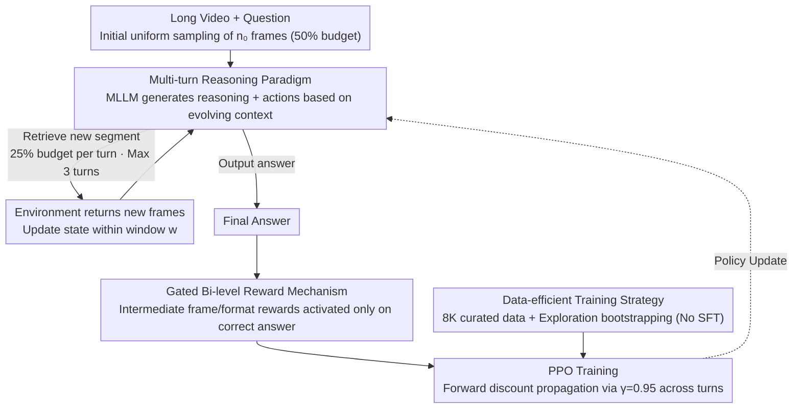

# Video-MTR: Reinforced Multi-Turn Reasoning for Long Video Understanding

**Conference**: ICML 2026  
**arXiv**: [2508.20478](https://arxiv.org/abs/2508.20478)  
**Code**: TBD  
**Area**: Video Understanding / Reinforcement Learning / Multimodal Reasoning  
**Keywords**: Reinforcement Learning, Multi-turn Reasoning, Long Video Understanding, Keyframe Retrieval

## TL;DR
Video-MTR is a reinforcement learning-based **multi-turn reasoning** framework. By guiding MLLMs through a **gated bi-level reward mechanism** to iteratively select key video segments, it achieves SOTA performance in long video understanding using only **8K data**, improving data efficiency by two orders of magnitude compared to methods requiring 257K–4.4M samples.

## Background & Motivation

**Background**: Long video understanding is a critical application for MLLMs. Current approaches primarily fall into two categories: (1) Instruction-tuning paradigms, which rely on uniform sampling and large-scale data; (2) Agent paradigms, which integrate external VLM tools and introduce complex heterogeneous components.

**Limitations of Prior Work**:
- Uniform sampling strategies suffer from information loss in long videos and fail to adaptively locate key segments.
- Dependence on external VLMs leads to high system complexity, suboptimal tool utilization strategies, and a lack of end-to-end training.
- Existing RL methods often employ single-turn reasoning or sparse rewards based only on the final answer, making it difficult to guide multi-turn intermediate behaviors.

**Key Challenge**: Long videos contain multiple events and long-term temporal dependencies. Existing methods either suffer information loss due to fixed sampling or sacrifice efficiency by relying on external tools. How can adaptive, multi-turn key segment retrieval be achieved within a limited computational budget?

**Goal**:
1. Propose a pure RL post-training paradigm without the need for large-scale supervised fine-tuning (SFT).
2. Design a fine-grained multi-turn reward mechanism to guide intermediate frame retrieval.
3. Reach SOTA performance with minimal data (8K vs. 257K–4.4M).

**Key Insight**: Reframe long video understanding as a **multi-turn interactive decision process**, where the MLLM acts as an agent and the video as the environment. In each iteration, the model retrieves key segments and updates the context, simulating the natural human process of watching long videos: global understanding followed by targeted reviews of details for final synthesis.

**Core Idea**: Utilize a **gated bi-level reward** (coupling target rewards with intermediate frame rewards) and **exploration bootstrapping** (eliminating cold-start SFT) to enable the MLLM to learn multi-turn evidence seeking via pure RL while significantly reducing data requirements.

## Method

### Overall Architecture
Long video understanding is reframed as a Markov Decision Process (MDP):
- **State** $s_k = (\mathcal{F}_{k-w}, x_{k-w}, \ldots, \mathcal{F}_k, x_k)$: Past $w$ interaction turns + current set of observed frames.
- **Action** $a_k$: Retrieve a new segment (specifying a timestamp range) or output the final answer.
- **Environment Response**: Returns a new set of sampled frames $\mathcal{F}_{k+1}$ based on the retrieval action, or a reward based on the correctness of the answer.
- **Trajectory** $\tau = \{(\mathcal{F}_k, x_k, y_k)\}_{k=0}^K$.

The process initializes with $n_0$ uniformly sampled frames, followed by a maximum of $K_{\max} = 3$ retrieval turns. The model generates reasoning text + executable actions; after parsing, the system decides whether to continue retrieval or provide the answer.

### Key Designs

**1. Multi-turn Reasoning Paradigm: Replacing fixed uniform sampling with "turn-based on-demand key segment retrieval"**

Uniform sampling inevitably misses key details in long videos, and single-turn processing of fixed frames lacks adaptive positioning. Video-MTR allows the MLLM to actively retrieve new segments in each turn based on evolving context (processed frames + reasoning progress). It uses 50% of the sampling budget for a global overview in the first turn and 25% for each subsequent turn, ensuring total frames do not exceed the limit. This enables dense sampling in complex areas and sparse sampling in simple ones, mimicking the human process of global understanding followed by targeted detail review. Its benefits scale with task complexity and video length (e.g., +8.1% on multi-detail tasks; +6.3% on long videos in VideoMME vs. +1.7% on short videos).

**2. Gated Bi-level Reward Mechanism: Guiding intermediate retrieval behaviors while preventing reward hacking**

Pure terminal rewards fail to guide which intermediate segments to retrieve, while unconstrained intermediate rewards encourage models to optimize for turn count rather than accuracy. Video-MTR categorizes rewards into three layers: Trajectory layer $R_{\text{acc}}$ (1 for correct, 0 otherwise); Turn layer $R_{\text{fms}}^k$ (rewarding IoU improvements between retrieved frames and ground truth, capped at 0.5 to encourage marginal gains and forbid redundancy); and Format layer $R_{\text{format}}^k=0.1$ for compliant output. Crucially, intermediate rewards $\sum_{k=0}^{K-1}(R_{\text{fms}}^k+R_{\text{format}}^k)$ are activated only if $R_{\text{acc}}>0$, synthesized as:

$$R(\tau)=\mathbb{1}_{\{R_{\text{acc}}>0\}}\cdot\sum_{k=0}^{K-1}(R_{\text{fms}}^k+R_{\text{format}}^k)+R_{\text{acc}}+R_{\text{format}}^K$$

Retrieval behavior is reinforced only if the final answer is correct, binding "retrieval" to "accuracy" and preventing the model from farming rewards through excessive turns.

**3. Data-efficient Training Strategy: Precise curation + exploration bootstrapping for SFT-free RL post-training**

Video-MTR addresses the scarcity of SFT data through two methods. First, data curation: repurposing existing temporal localization datasets (e.g., NExT-GQA with QA + timestamps, and QVHighlights converted via GPT-4o) into an 8K compact set focusing on "quality over quantity." Second, cold-start resolution: Pre-trained MLLMs typically do not initiate retrieval. Instead of SFT warm-up, exploration bootstrapping is used—if the retrieval rate in a mini-batch falls below a threshold, a small auxiliary reward is applied to stimulate retrieval. Once retrieval becomes a regular behavior, this signal is disabled, returning control to the bi-level reward.

### Loss & Training
Using the PPO algorithm, multi-turn trajectories are treated as single token sequences with two discount factors: $\gamma_{\text{turn}} = 0.95$ across turns (propagating the final answer signal backward to encourage early correct decisions) and $\gamma_{\text{token}} = 1.0$ within turns. Training uses a batch size of 32, actor lr $1 \times 10^{-6}$, critic lr $1 \times 10^{-5}$, on 8x A800-80GB GPUs.

## Key Experimental Results

### Main Results

| Model | Params | Frames | VideoMME | MLVU | LongVideoBench | LVBench | EgoSchema |
|------|------|----|--------|------|----------------|---------|-----------|
| GPT-4o | — | 384 | 71.9 | 54.9 | 66.7 | 48.9 | 72.2 |
| Gemini-1.5-Pro | — | 0.5fps | 75.0 | — | 64.0 | 33.1 | 71.1 |
| LongVA-7B | 7B | 256 | 52.6 | 41.1 | 47.8 | 37.9 | — |
| Video-R1-7B | 7B | 32 | 59.3 | 45.4 | — | 35.9 | 48.8 |
| Video-R1-7B | 7B | 64 | 61.4 | 47.6 | — | 38.0 | 51.8 |
| **Video-MTR** | 7B | 32 | 59.0 | 48.4 | 52.3 | 38.2 | 62.4 |
| **Video-MTR** | 7B | 64 | 62.2 | 49.8 | 54.8 | 41.8 | 63.4 |
| **Video-MTR** | 7B | 80 | **62.7** | **50.4** | **57.1** | **42.3** | **68.8** |

Under the same frame budget, Video-MTR consistently outperforms the Qwen2.5-VL-7B baseline (+5.4 to +6.3% with 32 frames). Video-MTR with 80 frames nearly matches the performance of Qwen2.5-VL-7B using 768 frames. **Data efficiency is exceptional**, requiring only 8K data vs. 2M for VideoChat2 or 260K for Video-R1.

### Ablation Study

| Configuration | VideoMME Short | Medium | Long | Total | LVBench |
|------|-----------|-----|-----|-----|---------|
| **Full Model** | 74.8 | 60.6 | 52.7 | 62.7 | 42.3 |
| w/o Bi-level Reward | 69.4 | 56.2 | 49.4 | 58.3 | 37.7 |
| **Drop** | -5.4 | -4.4 | -3.3 | -4.4 | **-4.6** |
| Single-turn Baseline | 68.8 | 54.8 | 47.9 | 57.2 | 35.3 |
| **Drop** | -6.0 | -5.8 | -4.8 | -5.5 | **-7.0** |

### Key Findings
- **Differential impact of multi-turn reasoning**: On MLVU, gains correlate linearly with task difficulty: +3.8% Overall, +7.5% Single-detail, +8.1% Multi-detail.
- **Video length scalability**: On VideoMME (32-frame budget), gains are +4.6% for short, +5.3% for medium, and **+6.3% for long videos**, highlighting superiority in long-duration scenarios.
- **Prevention of reward hacking**: Without gating, the model learns a false strategy of "accumulating rewards by increasing turns" (turns increase but QA accuracy does not); with gating, it learns to retrieve based on actual need.
- **Effectiveness of exploration bootstrapping**: RL achieves multi-turn capabilities directly without SFT warm-up. This is also effective on smaller models (Qwen2.5-VL-3B).

## Highlights & Insights
- **Paradigm Innovation**: First to formulate long video understanding as a multi-turn MDP, breaking the single-turn sampling bottleneck. Gains over single-turn RL are significantly larger in complex tasks.
- **Clever Reward Design**: The combination of bi-level rewards and gating is elegant—preventing hacking while maintaining fine-grained supervision.
- **Efficiency Breakthrough**: Achieving parity with million-scale methods using 8K data proves that "high-quality data + refined rewards" trumps "large-scale low-quality" datasets.
- **Human Cognitive Alignment**: Iterative reasoning aligns with natural human viewing processes, enhancing interpretability (demonstrated via 3-turn reasoning trajectories in case studies).

## Limitations & Future Work
- Training is constrained to an 80-frame setting due to compute limits; future goals aim for hundreds of frames.
- Focus is currently on Video QA; expansion to video captioning or event detection remains unexplored.
- RL training instability: Despite the bi-level reward and gating, inherent RL variance may still affect stability across different seeds.
- Dependence on localization labels: Bi-level rewards require frame-level ground truth; transferability may drop in domains with poor localization annotations.
- Future improvements: Explore weak supervision for bi-level rewards; study multi-task RL; analyze marginal returns of maximum turn limits.

## Related Work & Insights
- **vs. Uniform Sampling** (VideoChat2 / Video-LLaVA): These lack adaptive capacity. Video-MTR achieves dynamic localization through multi-turn retrieval and fine-grained rewards, increasing long video accuracy by 17.8pp (39.3% → 57.1%).
- **vs. External Tools** (VideoAgent / VideoMemAgent): These require complex integration of multiple VLMs and lack end-to-end training. Video-MTR unifies reasoning within the model, eliminating tool coupling with comparable performance and much higher efficiency.
- **vs. RL Methods** (Video-R1): While both use RL, Video-R1 requires 260K SFT samples for multi-turn capability. Video-MTR utilizes pure RL with only 8K samples, demonstrating the multiplier effect of bi-level rewards and gating on data efficiency.

## Rating
- Novelty: ⭐⭐⭐⭐⭐  First to combine multi-turn reasoning with gated bi-level rewards for video understanding; ingenious anti-hacking mechanisms.
- Experimental Thoroughness: ⭐⭐⭐⭐⭐  Full coverage of five major benchmarks (VideoMME / MLVU / LongVideoBench / LVBench / EgoSchema) plus detailed ablations.
- Writing Quality: ⭐⭐⭐⭐  Clear logic and precise method descriptions; related work could be more extensive.
- Value: ⭐⭐⭐⭐⭐  8K data makes industrial application viable; the paradigm is transferable to other long-sequence RL tasks. Data efficiency improved by two orders of magnitude.

<!-- RELATED:START -->

## Related Papers

- [\[CVPR 2026\] Thinking with Drafts: Speculative Temporal Reasoning for Efficient Long Video Understanding](../../CVPR2026/video_understanding/thinking_with_drafts_speculative_temporal_reasoning_for_efficient_long_video_und.md)
- [\[AAAI 2026\] ReaSon: Reinforced Causal Search with Information Bottleneck for Video Understanding](../../AAAI2026/video_understanding/reason_reinforced_causal_search_with_information_bottleneck_for_video_understand.md)
- [\[CVPR 2026\] VideoARM: Agentic Reasoning over Hierarchical Memory for Long-Form Video Understanding](../../CVPR2026/video_understanding/videoarm_agentic_reasoning_over_hierarchical_memory_for_long-form_video_understa.md)
- [\[CVPR 2026\] Towards Sparse Video Understanding and Reasoning](../../CVPR2026/video_understanding/towards_sparse_video_understanding_and_reasoning.md)
- [\[CVPR 2026\] A Multi-Agent Perception-Action Alliance for Efficient Long Video Reasoning](../../CVPR2026/video_understanding/a_multi-agent_perception-action_alliance_for_efficient_long_video_reasoning.md)

<!-- RELATED:END -->
