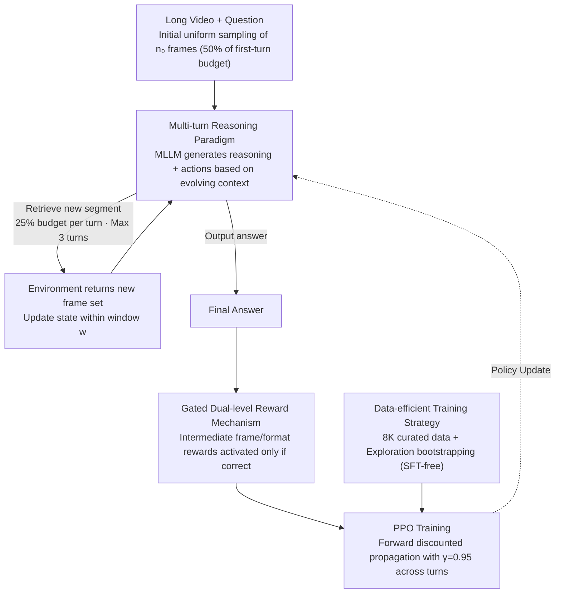

# Video-MTR: Reinforced Multi-Turn Reasoning for Long Video Understanding

**Conference**: ICML 2026  
**arXiv**: [2508.20478](https://arxiv.org/abs/2508.20478)  
**Code**: TBD  
**Area**: Video Understanding / Reinforcement Learning / Multimodal Reasoning  
**Keywords**: Reinforcement Learning, Multi-turn Reasoning, Long Video Understanding, Keyframe Retrieval

## TL;DR
Video-MTR is an RL-based **multi-turn reasoning** framework that guides MLLMs to iteratively select key video segments through a **gated dual-level reward mechanism**. It achieves SOTA performance in long video understanding using only **8K data**, outperforming methods that require 257K to 4.4 million samples (improving data efficiency by two orders of magnitude).

## Background & Motivation

**Background**: Long video understanding has become a vital application for MLLMs. Existing methods primarily fall into two categories: (1) Instruction fine-tuning paradigms, which rely on uniform sampling and large-scale data; (2) Agentic paradigms, which integrate external VLM tools, introducing complex heterogeneous components.

**Limitations of Prior Work**:
- Uniform sampling strategies fail to address information loss in long videos, as they cannot adaptively locate key segments.
- Reliance on external VLMs leads to high system complexity, suboptimal tool utilization strategies, and a lack of end-to-end training.
- Existing RL methods mostly use single-turn reasoning or sparse rewards based on the final answer, making it difficult to guide multi-turn intermediate behaviors.

**Key Challenge**: Long videos contain multiple events and long-term temporal dependencies. However, current methods either suffer from information loss due to fixed sampling or sacrifice efficiency by relying on external tools. How can adaptive, multi-turn key segment retrieval be achieved within a limited computational budget?

**Goal**:
1. Propose a pure RL post-training paradigm that eliminates the need for large-scale supervised fine-tuning (SFT).
2. Design a fine-grained multi-turn reward mechanism to guide intermediate frame retrieval behavior.
3. Achieve SOTA performance with minimal data (8K vs. 257K–4.4M).

**Key Insight**: Reframe long video understanding as a **multi-turn interactive decision-making process**—where the MLLM acts as an agent and the video as the environment. In each iteration, the agent retrieves key segments and updates the context, simulating the natural human process of watching long videos: initial global understanding followed by targeted reviews of details, and finally, synthesizing evidence.

**Core Idea**: By combining a **gated dual-level reward** (coupling terminal rewards with intermediate frame rewards) and **exploration bootstrapping** (avoiding cold-start SFT), the MLLM learns multi-turn evidence seeking through pure RL while significantly reducing data requirements.

## Method

### Overall Architecture
Long video understanding is reframed as an MDP:
- **State** $s_k = (\mathcal{F}_{k-w}, x_{k-w}, \ldots, \mathcal{F}_k, x_k)$: The past $w$ turns of interaction plus the current set of observed frames.
- **Action** $a_k$: Retrieving a new segment (specifying a time range) or outputting the final answer.
- **Environmental Response**: Returns a new set of sampled frames $\mathcal{F}_{k+1}$ based on the retrieval action, or returns a reward based on answer correctness.
- **Trajectory** $\tau = \{(\mathcal{F}_k, x_k, y_k)\}_{k=0}^K$.

At initialization, $n_0$ frames are uniformly sampled. Subsequent iterations allow up to $K_{\max} = 3$ retrievals. The model generates reasoning text alongside executable actions; after parsing, the system decides whether to continue retrieval or output the answer.

### Key Designs

**1. Multi-turn Reasoning Paradigm: Replacing fixed uniform sampling with "turn-by-turn on-demand retrieval of key segments"**

Uniform sampling in long videos inevitably misses key details, and single-turn processing of fixed frames cannot adaptively locate information. Video-MTR allows the MLLM to actively retrieve new segments based on the evolving context (processed frames + reasoning progress) in each turn. The first turn uses 50% of the sampling budget for a global overview, and subsequent turns use 25% each, ensuring the total budget is not exceeded. This allows for dense sampling in complex regions and sparse sampling in simple ones, mimicking the human viewing process. The benefits scale with task complexity and video length (e.g., +8.1% on multi-detail tasks and +6.3% on VideoMME long videos vs. +1.7% on short videos), proving specifically valuable for the most challenging scenarios.

**2. Gated Dual-level Reward Mechanism: Guiding intermediate retrieval while preventing reward hacking**

Terminal rewards alone cannot guide which intermediate segments to retrieve (as seen in the 4.6% drop on LVBench in ablation studies), but unconstrained intermediate rewards might encourage the model to optimize for turn count rather than accuracy. Video-MTR categorizes rewards into three layers: trajectory level $R_{\text{acc}}$ (1 for correct, 0 for incorrect); turn level $R_{\text{fms}}^k$, which rewards IoU improvements between retrieved frames and ground truth annotations (capped at 0.5, half of $R_{\text{acc}}$) to encourage marginal improvement and penalize redundancy; and format level $R_{\text{format}}^k=0.1$ for compliant output. Crucially, intermediate rewards $\sum_{k=0}^{K-1}(R_{\text{fms}}^k+R_{\text{format}}^k)$ are only activated if $R_{\text{acc}}>0$. The composite reward is:

$$R(\tau)=\mathbb{1}_{\{R_{\text{acc}}>0\}}\cdot\sum_{k=0}^{K-1}(R_{\text{fms}}^k+R_{\text{format}}^k)+R_{\text{acc}}+R_{\text{format}}^K$$

Consequently, frame retrieval is only reinforced if the final answer is correct, binding "retrieval" and "accuracy" together and preventing the model from farming rewards through unnecessary retrievals.

**3. Data-efficient Training Strategy: Precise data curation + exploration bootstrapping to reduce RL post-training to 8K samples without cold-start SFT**

Large-scale SFT data is expensive and difficult to obtain. Video-MTR employs data curation by repurposing existing temporal localization datasets (e.g., NExT-GQA with QA + temporal tags, QVHighlights converted via GPT-4o). It selects samples with short key segments to form a compact 8K set, prioritizing quality over quantity. To solve the cold-start problem where a pre-trained MLLM might not naturally retrieve segments, the model uses exploration bootstrapping instead of SFT warm-up. If the retrieval rate in a mini-batch falls below a threshold, a small auxiliary reward is applied to stimulate retrieval. Once retrieval becomes a regular behavior, this reward is deactivated, and the gated dual-level signal takes over.

### Loss & Training
The PPO algorithm is used, treating multi-turn trajectories as single token sequences. It utilizes two discount factors: $\gamma_{\text{turn}} = 0.95$ (propagating the final answer signal backward to encourage early correct decisions) and $\gamma_{\text{token}} = 1.0$ within turns. Training features a batch size of 32, actor lr $1 \times 10^{-6}$, and critic lr $1 \times 10^{-5}$ on 8 A800-80GB GPUs.

## Key Experimental Results

### Main Results

| Model | Params | Frames | VideoMME | MLVU | LongVideoBench | LVBench | EgoSchema |
|------|------|----|--------|------|----------------|---------|-----------|
| GPT-4o | — | 384 | 71.9 | 54.9 | 66.7 | 48.9 | 72.2 |
| Gemini-1.5-Pro | — | 0.5fps | 75.0 | — | 64.0 | 33.1 | 71.1 |
| LongVA-7B | 7B | 256 | 52.6 | 41.1 | 47.8 | 37.9 | — |
| Video-R1-7B | 7B | 32 | 59.3 | 45.4 | — | 35.9 | 48.8 |
| Video-R1-7B | 7B | 64 | 61.4 | 47.6 | — | 38.0 | 51.8 |
| **Video-MTR** | 7B | 32 | 59.0 | 48.4 | 52.3 | 38.2 | 62.4 |
| **Video-MTR** | 7B | 64 | 62.2 | 49.8 | 54.8 | 41.8 | 63.4 |
| **Video-MTR** | 7B | 80 | **62.7** | **50.4** | **57.1** | **42.3** | **68.8** |

Under equal frame budgets, Video-MTR significantly outperforms the Qwen2.5-VL-7B baseline (+5.4 to +6.3% at 32 frames). Video-MTR at 80 frames nearly matches the performance of Qwen2.5-VL-7B at 768 frames. **Data efficiency is exceptional**: only 8K samples versus 2M for VideoChat2, 257K for Video-XL, and 260K for Video-R1.

### Ablation Study

| Configuration | VideoMME Short | Med | Long | Total | LVBench |
|------|-----------|-----|-----|-----|---------|
| **Full Model** | 74.8 | 60.6 | 52.7 | 62.7 | 42.3 |
| w/o Dual-level Reward | 69.4 | 56.2 | 49.4 | 58.3 | 37.7 |
| **Gain** | -5.4 | -4.4 | -3.3 | -4.4 | **-4.6** |
| Single-turn Baseline | 68.8 | 54.8 | 47.9 | 57.2 | 35.3 |
| **Gain** | -6.0 | -5.8 | -4.8 | -5.5 | **-7.0** |

### Key Findings
- **Impact of Multi-turn Reasoning**: Gains on MLVU correlate linearly with task difficulty: +3.8% overall, +7.5% for single details, and +8.1% for multiple details.
- **Scalability with Video Length**: On VideoMME with a 32-frame budget, improvements were +4.6% for short, +5.3% for medium, and **+6.3% for long videos**, highlighting that multi-turn advantages are most prominent in long video scenarios.
- **Prevention of Reward Hacking**: Without gating, the model learns a spurious strategy of "increasing turns to accumulate rewards" without improving QA accuracy. With gating, the model learns to retrieve based on actual needs.
- **Effectiveness of Exploration Bootstrapping**: Multi-turn capability is achieved directly via RL without SFT warm-up. This paradigm is scalable and also works on smaller models like Qwen2.5-VL-3B.

## Highlights & Insights
- **Paradigm Innovation**: Reframes long video understanding as a multi-turn MDP for the first time, breaking the single-turn sampling bottleneck. Gains for multi-turn RL are significantly larger on complex tasks.
- **Clever Reward Design**: The combination of dual-level rewards and a gating mechanism is elegant, preventing reward hacking while maintaining fine-grained supervision; ablations show both are essential (drops of 4%+ each).
- **Breakthrough in Data Efficiency**: Demonstrates that "high-quality data + refined rewards" can vastly outperform "large-scale low-quality" data, using 8K samples to compete with millions.
- **Alignment with Human Cognition**: Multi-turn iterative reasoning aligns with how humans naturally watch long videos, enhancing interpretability (demonstrated via 3-turn reasoning trajectory case studies).

## Limitations & Future Work
- Due to computational constraints, training was limited to 80 frames; the long-term goal is to scale to hundreds of frames.
- Currently focused on Video QA; its extension to video captioning, event detection, and other long video tasks remains unexplored.
- RL training instability: While the dual-level reward and gating help, inherent RL variance may still affect stability across different seeds.
- Dependency on temporal localization labels: The dual-level reward requires frame-level ground truth; transferability may decrease in domains with poor localization label quality.
- Future work: Explore dual-level rewards for weak-supervision frame labels; research multi-task RL (QA + captioning + detection); analyze marginal effects of turn limits.

## Related Work & Insights
- **vs. Uniform Sampling Methods** (VideoChat2 / Video-LLaVA): These use fixed sampling and lack adaptive capabilities. Video-MTR achieves dynamic localization through multi-turn retrieval and fine-grained rewards, improving long video accuracy by +23pp (39.3% → 57.1%).
- **vs. Agentic Methods** (VideoAgent / VideoMemAgent): These integrate multiple external VLMs (captioning + tracking), leading to system complexity and insufficient end-to-end training. Video-MTR unifies reasoning within the model, achieving comparable performance with several times higher efficiency.
- **vs. RL Methods** (Video-R1): While both use RL, Video-R1 requires 260K SFT samples to achieve multi-turn capability. Video-MTR uses pure RL with only 8K samples and sees larger gains, proving the multiplier effect of multi-layer rewards and gating on data efficiency.

## Rating
- Novelty: ⭐⭐⭐⭐⭐  Combines multi-turn reasoning with dual-level rewards and gating for the first time in long video understanding.
- Experimental Thoroughness: ⭐⭐⭐⭐⭐  Full coverage of five major benchmarks (VideoMME / MLVU / LongVideoBench / LVBench / EgoSchema) plus detailed ablations and stratified analysis.
- Writing Quality: ⭐⭐⭐⭐  Clear logic and precise description; the related work section is somewhat brief.
- Value: ⭐⭐⭐⭐⭐  8K data makes it ready for industrial application; the dual-level reward + gating paradigm is transferable to other long-sequence RL tasks.

<!-- RELATED:START -->

## Related Papers

- [\[AAAI 2026\] ReaSon: Reinforced Causal Search with Information Bottleneck for Video Understanding](../../AAAI2026/video_understanding/reason_reinforced_causal_search_with_information_bottleneck_for_video_understand.md)
- [\[CVPR 2025\] MLVU: Benchmarking Multi-task Long Video Understanding](../../CVPR2025/video_understanding/mlvu_benchmarking_multi-task_long_video_understanding.md)
- [\[CVPR 2026\] WorldMM: Dynamic Multimodal Memory Agent for Long Video Reasoning](../../CVPR2026/video_understanding/worldmm_dynamic_multimodal_memory_agent_for_long_video_reasoning.md)
- [\[CVPR 2026\] Efficient Frame Selection for Long Video Understanding via Reinforcement Learning](../../CVPR2026/video_understanding/efficient_frame_selection_for_long_video_understanding_via_reinforcement_learnin.md)
- [\[CVPR 2026\] Video Panels for Long Video Understanding](../../CVPR2026/video_understanding/video_panels_for_long_video_understanding.md)

<!-- RELATED:END -->
