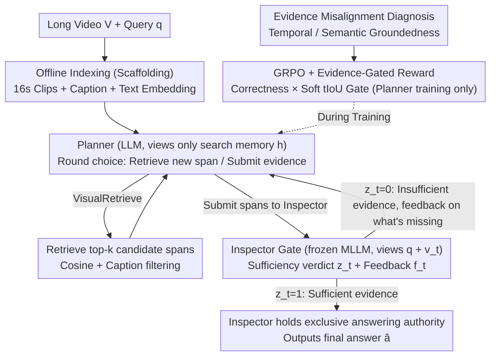

# VideoSEAL: Mitigating Evidence Misalignment in Agentic Long Video Understanding by Decoupling Answer Authority

**Conference**: ICML 2026  
**arXiv**: [2605.12571](https://arxiv.org/abs/2605.12571)  
**Code**: <https://github.com/Echochef/VideoSEAL>  
**Area**: Video Understanding / Agentic RL / Long Video QA  
**Keywords**: Evidence Misalignment, Planner-Inspector Decoupling, Inspector Gate, GRPO, Temporal/Semantic Groundedness

## TL;DR
VideoSEAL identifies the "evidence misalignment" problem in existing agentic long video QA systems—where agents answer correctly without actually seeing the evidence—and attributes the root cause to "coupled agents conflating planning and answering authority." It proposes a planner-inspector decoupling framework: the planner handles long-horizon evidence search, while the inspector holds exclusive answering authority and only releases the answer when pixel-level evidence is sufficient. This improves accuracy on LVBench from 48.2% to 55.1% (↑20.5%) and on LongVideoBench from 52.2% to 62.0%.

## Background & Motivation
**Background**: Long video QA (LVU) is significantly more challenging than short video QA due to sparse evidence and temporal dispersion, where the vast majority of video content is irrelevant to the query. The current mainstream approach is the agentic paradigm: using a monolithic planner to iteratively retrieve candidate clips, call tools to inspect visual evidence, and output an answer after multiple rounds of interaction. Representative methods include VideoAgent, DrVideo, Video-MTR, GenS, and Conan.

**Limitations of Prior Work**: Through diagnostic experiments, the authors discovered a hidden but pervasive failure mode—"evidence misalignment." This occurs when the agent's final answer is correct, but its trace does not provide sufficient evidence to support it. In other words, the agent "guesses correctly" rather than "answering based on what it saw." This undermines the verifiability and interpretability of agents and implies that current SOTA accuracies are partially achieved by "prior-based guessing."

**Key Challenge**: Two diagnostic metrics reveal the issue: (i) Reward Pressure (during training): outcome-only rewards solely reward the correct answer, making it more efficient for the agent to take shortcuts via parametric priors than to rigorously find evidence; (ii) Prompt Pressure (during inference): as the trace grows longer and noisier, the planner is forced to make decisions within a shared context, shifting from "searching for evidence" to "fitting the evidence," ultimately resorting to general plausibility templates. Both stem from the same structural pathology: coupled agents conflate "long-horizon planning" and "final answering authority" within a shared context.

**Goal**: (i) Formalize "evidence misalignment" and provide temporal/semantic grounding diagnostic metrics; (ii) eliminate both reward and prompt pressures through architectural decoupling; (iii) simultaneously improve accuracy and grounding across four major long video benchmarks.

**Key Insight**: The authors' key insight is that "answering authority" is a structural resource, and whoever holds it is shaped by these two pressures. If answering authority is taken from the planner and given to an inspector that only views raw visual evidence (rather than the lengthy trace)—allowing the inspector to speak only when evidence is sufficient—the two types of misalignment can be structurally broken.

**Core Idea**: Decompose the monolithic agent into a "planner (responsible for tool calls/evidence searching, viewing only structured search memory)" and an "inspector (frozen MLLM, viewing only the currently submitted pixel evidence, holding exclusive termination and answering authority)." Only the planner is trained using GRPO, with the inspector gate acting as a plug-and-play module.

## Method
The method section of VideoSEAL consists of four components: diagnosis, architecture, tools, and training.

### Overall Architecture
Input: Long video $\mathcal{V}$ and query $q$. The system consists of two roles: a planner $P$ (LLM) and an inspector $I$ (frozen MLLM, accessed via the `VisualInspect` tool). In each round $t$, the planner produces a rationale-action pair $(r_t,u_t)\sim P(\cdot\mid h_{t-1},q)$ based on the query and search memory $h_{t-1}$. The environment returns observation $o_t$, and the inspector evaluates the evidence $v_t=E(o_t)$: $(z_t,f_t)\sim I(\cdot\mid v_t,q)$, where $z_t\in\{0,1\}$ is the sufficiency verdict and $f_t$ is the feedback. Only when $z_t=1$ does the inspector output the final answer $\hat a_t$; otherwise, the planner continues searching. This inspector gate is the core of the architecture.

Tools: (i) Offline indexing segments the video into 16s clips, using Qwen3-VL-8B for captions and text-embedding-3-large for dense embedding indexing; (ii) `VisualRetrieve` uses cosine similarity to retrieve top-$k$ candidate spans and filters with DeepSeek-V3.2 captions to reduce semantic drift; (iii) `VisualInspect(v_t,q)` is the inspector interface, returning $(z_t,f_t)$ and the candidate answer $\hat a_t$.

### Key Designs

**1. Misalignment Diagnosis (Temporal + Semantic Groundedness): Auditing "Answering Correctly" and "Seeing Evidence" separately**

Existing evaluations only look at accuracy, failing to expose dangerous shortcuts where agents "guess right" using priors. VideoSEAL defines outcome correctness $C\in\{0,1\}$ and trace groundedness $G\in\{0,1\}$, focusing on the $(C=1, G=0)$ quadrant (correct answer without traceable evidence). It introduces two complementary metrics: temporal groundedness $G_t=\mathbb{I}[\max_{\tau\in\mathcal{E}(\xi),\tau^*\in\mathcal{E}^*}\mathrm{tIoU}(\tau,\tau^*)\ge\gamma]$ ($\gamma=0.05$) to judge if the agent actually visited the relevant time intervals, and semantic groundedness $G_s=1-J_{\text{judge}}(q,\xi,\hat a)$ using an LLM judge to check if the answer is logically supported by the tool outputs in the trace. The corresponding hallucination rates are $H_t=\mathbb{P}(G_t=0\mid C=1)$ and $H_s=\mathbb{P}(G_s=0\mid C=1)$. By auditing the trace from both "temporal access" and "semantic support" perspectives, structural pathologies like reward/prompt pressure are quantified for the first time.

**2. Planner-Inspector Decoupling + Inspector Gate: Stripping "Answering Authority" from the Planner and giving it to a pixel-only Inspector**

Diagnosis points to a common origin for both pressures: prompt pressure arises from "long traces forcing the planner to make premature decisions," and reward pressure arises from "outcome rewards leading the planner to take shortcuts via priors." The root is the role conflation of "planning and answering" in the same planner. VideoSEAL splits the agent into two roles: the planner is an LLM-only policy that maintains a compact search memory (submitted spans + inspector feedback), choosing either to retrieve new spans or submit a set of spans; the inspector is a frozen MLLM that only sees $(q, v_t)$ per call, completely isolated from the planner's intermediate reasoning or full history. It outputs a sufficiency verdict $z_t$ and feedback $f_t$. Only when $z_t=1$ is the final answer $\hat a_t$ released. After decoupling, the planner lacks answering authority and cannot bypass searching via priors, while the inspector does not see the trace and cannot be assimilated by lengthy contexts. Both shortcuts are structurally closed. The inspector is a plug-and-play module that can be upgraded during inference without retraining the planner.

**3. GRPO + Evidence-Gated Reward: Training the planner with a soft gate to align rewards with "visiting the right place"**

Decoupling alone isn't enough to stop reward pressure—even with an inspector gate, the planner might learn a "lazy" strategy of submitting random spans and letting the inspector figure it out. During training, only the planner is optimized using GRPO while the inspector remains frozen. Two rewards are used: the baseline outcome-only $R_{\text{ans}}(\xi)=\mathbb{I}[\hat a=a^*]$, and an evidence-gated reward $R_{\text{evd}}(\xi)=R_{\text{ans}}(\xi)\cdot g_{\text{evd}}(\xi)$. The soft gate $g_{\text{evd}}(\xi)=\min\{1, \tfrac{1}{\gamma}\max_{\tau\in\mathcal{E}(\xi),\tau^*\in\mathcal{E}^*}\mathrm{tIoU}(\tau,\tau^*)\}$ ensures that "more aligned visits lead to higher rewards," with $\gamma$ set to the mean max-tIoU of the training set for normalization. A soft gate is necessary because real tIoU averages only ~0.05; a hard gate would be too sparse to provide usable gradients. The soft gate stably feeds the signal "to get the inspector to open the gate, I must find the key evidence" to the planner. Keeping the inspector frozen ensures training does not pollute the verification module, keeping the gate reliable despite policy drift.

### Loss & Training
The GRPO objective is applied only to the planner $P$, while the inspector $I$ remains frozen. Reward $R_{\text{evd}}$ is used on datasets with ground-truth temporal intervals (e.g., CG-Bench), falling back to $R_{\text{ans}}$ when labels are unavailable. Each candidate inspection window is limited to 64 frames (see Frames column in Main Results), and the search budget $K$ can be adjusted to balance accuracy and cost.

## Key Experimental Results

### Main Results
On four LVU benchmarks (MLVU, VideoMME w/o sub, LongVideoBench, LVBench), compared to the coupled baseline using the same backbone (Qwen3-8B planner + Qwen2.5-VL-7B inspector, 64 frames/inspection):

| Framework | Answer Authority | MLVU | VideoMME | LongVideoBench | LVBench |
| :--- | :--- | :--- | :--- | :--- | :--- |
| Qwen2.5-VL-Instruct (Single MLLM, 64f) | Model | 63.9 | 58.4 | 55.3 | 34.6 |
| VideoAgent (coupled, GPT-4o) | LLM | 55.8 | 59.4 | 50.3 | 42.3 |
| Video-MTR (coupled, MLLM) | MLLM | 58.4 | 62.7 | 57.3 | 42.0 |
| Coupled baseline (Ours, same backbone) | LLM | 64.6 | 59.9 | 52.2 | 48.2 |
| **VideoSEAL (decoupled)** | **MLLM (inspector)** | **68.2** (↑4.3) | **62.9** (↑4.5) | **62.0** (↑6.7) | **55.1** (↑20.5) |

With consistent backbones, simply switching to the decoupled architecture yields gains of 4–10+ points across all four benchmarks, with LVBench jumping from 48.2 to 55.1 (relative ↑20.5%).

### Ablation Study

| Configuration | Key Metric | Description |
| :--- | :--- | :--- |
| Full VideoSEAL | Optimal | Decoupled Planner-Inspector + GRPO + Soft Evidence Gate |
| w/o Inspector Gate (coupled) | Significant drop | Reverts to monolithic paradigm; prompt + reward pressure return |
| Outcome-only reward (no gate) | Small Acc drop + Large Grounding drop | Confirms existence of reward pressure |
| Increase search budget $K$ | Monotonic Acc gain | Scaling is sustainable after decoupling; coupled baseline plateaus |
| Inspector 7B → 72B | Significant Acc jump | Modular and plug-and-play; no planner retraining required |

LVBench grounding evaluation (Table 2) shows that VideoSEAL not only outperforms LongVT on $R@\{0.05,0.10,0.20\}$ but also significantly reduces temporal hallucination $H_t$, while increasing semantic groundedness $G_s$ and decreasing $H_s$, verifying that "as answers improve, traces become more evidence-backed."

### Key Findings
- Coupled agents improve accuracy during training, but grounding growth stagnates, causing the outcome-grounding gap to widen (Fig 1). This is direct evidence of reward pressure: the model learns to "get the answer right" rather than "find evidence."
- During inference, as traces lengthen, $G_t$ saturates early while $G_s$ monotonically decreases and $H_s$ increases (Fig 2). This indicates that later-stage agents tend to rely on hedging templates like "might suggest" (Fig 3), proving the existence of prompt pressure.
- After decoupling, the model benefits more from larger search budgets (Fig 6a), whereas the coupled baseline is dragged down by context saturation. Upgrading the inspector from 7B to 72B directly boosts accuracy (Fig 6b), proving the inspector can scale independently as a verification module.
- Even though hard gates are too sparse ($\gamma \approx 0.05$) on evidence-gated rewards, the soft gate $\min\{1,\mathrm{tIoU}/\gamma\}$ provides a stable training signal, serving as the key engineering trick to make grounding-aware RL work.

## Highlights & Insights
- Viewing "answering authority" as a resource that can be manipulated through architecture is the deepest insight of this work. Both prompt pressure (inference) and reward pressure (training) stem from "the same model trying to both find evidence and provide answers." Segregating answering authority to a pixel-only module is equivalent to appointing a "fact-checker" within the agent, institutionalizing the principle of "no evidence, no answer." This principle can be generalized to any agentic system: RAG, code agents, and tool-use agents can all implement an "inspector gate" for final adjudication.
- The dual metrics of temporal and semantic groundedness provide actionable tools where accuracy fails to tell the whole story. Separating answer correctness from evidence support moves evaluation from "win/loss" back to "why we won." Such grounding-aware evaluation could become standard for future agentic systems.
- The frozen inspector allows the verification module to scale independently without retraining the planner, serving as a model for modular agent design. This means the system's verification capabilities can upgrade with zero training cost as stronger MLLMs emerge.
- Using a soft evidence gate $\min\{1,\mathrm{tIoU}/\gamma\}$ to solve sparse rewards is a generalizable trick: "when hard signals are too sparse, use a normalized soft surrogate." This is useful for any RL task requiring alignment with sparse ground-truth signals.

## Limitations & Future Work
- Decoupling adds the overhead of inspector calls; end-to-end latency and total token consumption are higher than coupled systems, though a detailed cost analysis is not provided.
- The inspector is completely frozen, meaning it only makes judgments within its distribution; for cases where the inspector itself is wrong (e.g., visual details beyond its capability), the planner cannot recover no matter how much evidence is found. Evidence-gated rewards cannot fix verifier errors.
- Evidence-gated rewards depend on ground-truth temporal interval labels (e.g., CG-Bench), which are unavailable for many LVU datasets, forcing a fallback to outcome-only rewards.
- Using an LLM judge to calculate semantic groundedness may introduce bias or risks of jailbreaking; the reliability of this evaluation tool is not discussed in depth.
- Experiments focus on multiple-choice QA; effectiveness for open-ended generation (e.g., long-form summarization, video captioning) remains to be verified, as "evidence support" is not clearly defined for such tasks.

## Related Work & Insights
- **vs VideoAgent / DrVideo (coupled)**: These use a single planner to sequentially plan and answer in a shared context, inevitably suffering from prompt/reward pressure; VideoSEAL eliminates these pressures at the source via architectural decoupling.
- **vs Video-MTR / LongVT (RL trained, coupled)**: These also use RL for multi-round interaction, but planner and answerer roles are not separated. Outcome-only rewards reinforce the "cheapest path to the answer," leading to shortcuts via priors. VideoSEAL restricts training to search behavior and uses an evidence gate to correct the path.
- **vs GenS / FrameThinker / Conan (coupled MLLM)**: These combine inspection and answering within the same MLLM; the inspector is not independent, and authority is not decoupled. VideoSEAL extracts the inspector as a plug-and-play module.
- **vs self-RAG / verifier ideas in RAG**: The concept is similar, but VideoSEAL architectures the "retrieve-reason-verify" steps for video temporal scenarios, elevates the verifier to an "inspector with veto power," and quantifies effects via grounding metrics.
- **Insights**: (i) Any agent system should carefully examine the ownership of "answering authority," as incorrect ownership introduces reward/prompt misalignment; (ii) Evaluating agents must go beyond win/loss and look at "evidence-conclusion consistency"; (iii) Modular frozen verifiers are a low-cost path to scaling agent performance during inference.

## Rating
- Novelty: ⭐⭐⭐⭐ Formalizing "Evidence Misalignment" + Planner-Inspector decoupling + Inspector Gate is a systematic first for LVU agents; the dual-pressure diagnostic framework is highly insightful.
- Experimental Thoroughness: ⭐⭐⭐⭐⭐ Four LVU benchmarks + direct coupled/decoupled comparison + grounding evaluation + scaling experiments for both budget and inspector backbone.
- Writing Quality: ⭐⭐⭐⭐⭐ The narrative from Section 3 diagnosis to structural remedy is exceptionally clear, making the case for decoupling highly logical.
- Value: ⭐⭐⭐⭐⭐ The paradigm of decoupling answering authority is transferable to any agentic system (RAG, code, tool-use), and the plug-and-play upgrade path for the frozen inspector has strong practical engineering value.

<!-- RELATED:START -->

## Related Papers

- [\[ICML 2026\] VideoTemp-o3: Harmonizing Temporal Grounding and Video Understanding in Agentic Thinking](videotemp-o3_harmonizing_temporal_grounding_and_video_understanding_in_agentic_t.md)
- [\[CVPR 2026\] StreamReady: Learning What to Answer and When in Long Streaming Videos](../../CVPR2026/video_understanding/streamready_learning_what_to_answer_and_when_in_long_streaming_videos.md)
- [\[ICML 2026\] Foresee-to-Ground: From Predictive Temporal Perception to Evidence-Driven Reasoning](foresee-to-ground_from_predictive_temporal_perception_to_evidence-driven_reasoni.md)
- [\[ICML 2026\] Video-MTR: Reinforced Multi-Turn Reasoning for Long Video Understanding](video-mtr_reinforced_multi-turn_reasoning_for_long_video_understanding.md)
- [\[CVPR 2026\] LensWalk: Agentic Video Understanding by Planning How You See in Videos](../../CVPR2026/video_understanding/lenswalk_agentic_video_understanding_by_planning_how_you_see_in_videos.md)

<!-- RELATED:END -->
