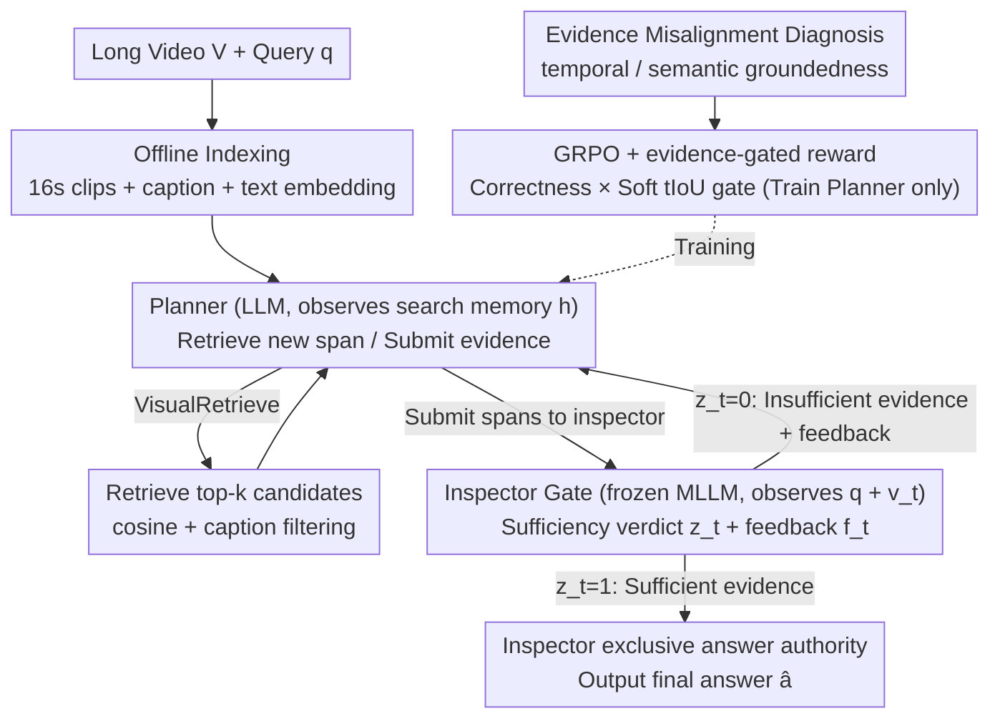

# VideoSEAL: Mitigating Evidence Misalignment in Agentic Long Video Understanding by Decoupling Answer Authority

**Conference**: ICML 2026  
**arXiv**: [2605.12571](https://arxiv.org/abs/2605.12571)  
**Code**: <https://github.com/Echochef/VideoSEAL>  
**Area**: Video Understanding / Agentic RL / Long Video QA  
**Keywords**: Evidence Misalignment, Planner-Inspector Decoupling, Inspector Gate, GRPO, Temporal/Semantic Groundedness

## TL;DR
VideoSEAL identifies the "evidence misalignment" issue in existing agentic long video QA systems, where models answer correctly without observing sufficient evidence. This is attributed to the "coupled agent conflating planning and answering authority." The proposed planner-inspector decoupling framework assigns exclusive answering authority to an inspector, which only responds when pixel-level evidence is sufficient. On LVBench, the accuracy improved from 48.2% to 55.1% (↑20.5%), and on LongVideoBench from 52.2% to 62.0%.

## Background & Motivation
**Background**: Long Video QA (LVU) is significantly more challenging than short video QA due to sparse evidence and temporal dispersion, where the vast majority of content is irrelevant to the query. Current mainstream approaches adopt the agentic paradigm: a monolithic planner iteratively retrieves candidate clips and calls tools to inspect visual evidence, outputting an answer after multiple interaction rounds. Representative methods include VideoAgent, DrVideo, Video-MTR, GenS, and Conan.

**Limitations of Prior Work**: Diagnostic experiments reveal a subtle but ubiquitous failure mode—"evidence misalignment." The agent's final answer is correct, but the trace does not provide sufficient evidence for support. In other words, the agent "guesses correctly" rather than "answering based on observation." This undermines verifiability and interpretability, implying that SOTA accuracies are partially derived from parametric priors.

**Key Challenge**: Two diagnostic metrics reveal the cause: (i) Reward Pressure (training phase): outcome-only rewards solely incentivize correct answers, making it more efficient for the agent to take shortcuts via priors than searching for evidence; (ii) Prompt Pressure (inference phase): as traces grow longer and noisier, the planner is forced to make decisions within a shared context, sliding from "searching for evidence" to "fitting evidence" based on general plausibility templates. Both stem from a structural pathology: the coupled agent conflates "long-horizon planning" and "final answer authority" within a shared context.

**Goal**: (i) Formalize "evidence misalignment" and provide temporal/semantic grounding diagnostic metrics; (ii) eliminate both reward and prompt pressures via architectural decoupling; (iii) improve both accuracy and grounding across four major long video benchmarks.

**Key Insight**: Answer authority is a structural resource; whoever possesses it is shaped by these two pressures. If answer authority is removed from the planner and given to an inspector that observes only raw visual evidence (rather than the entire trace), it will only speak when evidence is sufficient. This architecturally breaks both types of misalignment.

**Core Idea**: Decompose the monolithic agent into a "Planner (responsible for tool invocation/searching, observing structured search memory)" and an "Inspector (frozen MLLM, observing only the submitted pixel evidence, holding exclusive termination and answer authority)." Only the planner is trained using GRPO, while the inspector gate serves as a plug-and-play module.

## Method
The methodology consists of "Diagnosis → Architecture → Tools → Training."

### Overall Architecture
Input: Long video $\mathcal{V}$ and query $q$. Roles: Planner $P$ (LLM) and Inspector $I$ (frozen MLLM, accessed via `VisualInspect`). In each round $t$, the planner generates a rationale-action pair $(r_t,u_t)\sim P(\cdot\mid h_{t-1},q)$. The environment returns observation $o_t$, and the inspector evaluates the evidence $v_t=E(o_t)$: $(z_t,f_t)\sim I(\cdot\mid v_t,q)$, where $z_t\in\{0,1\}$ is the sufficiency verdict and $f_t$ is the feedback. Only if $z_t=1$ does the inspector output the final answer $\hat a_t$; otherwise, the planner continues searching. This inspector gate is the core of the architecture.

Three primary tools: (i) Offline indexing partitions video into 16s clips, using Qwen3-VL-8B for captions and text-embedding-3-large for dense indexing; (ii) `VisualRetrieve` uses cosine similarity for top-$k$ candidates with DeepSeek-V3.2 caption filtering; (iii) `VisualInspect(v_t,q)` is the inspector interface, returning $(z_t,f_t)$ and the candidate answer $\hat a_t$.

### Key Designs

**1. Evidence Misalignment Diagnosis (Temporal + Semantic Groundedness): Auditing "Correctness" and "Observation" separately**

Existing evaluations only consider accuracy, failing to expose "correct guesses" via priors. VideoSEAL defines result correctness $C\in\{0,1\}$ and trace groundedness $G\in\{0,1\}$, focusing on the $(C=1, G=0)$ quadrant. Two metrics are introduced: Temporal Groundedness $G_t=\mathbb{I}[\max_{\tau\in\mathcal{E}(\xi),\tau^*\in\mathcal{E}^*}\mathrm{tIoU}(\tau,\tau^*)\ge\gamma]$ ($\gamma=0.05$) to check if the agent visited relevant segments, and Semantic Groundedness $G_s=1-J_{\text{judge}}(q,\xi,\hat a)$ via LLM judge to check if the answer is logically supported by the tool outputs in the trace. Hallucination rates are $H_t=\mathbb{P}(G_t=0\mid C=1)$ and $H_s=\mathbb{P}(G_s=0\mid C=1)$.

**2. Planner-Inspector Decoupling + Inspector Gate: Transferring "Answer Authority" to a pixel-evidence-only Inspector**

Diagnosis shows that both pressures share a common root: the role mix where the planner both plans and answers. VideoSEAL splits the agent: the planner is an LLM-only strategy maintaining compact search memory (submitted spans + feedback), choosing between retrieving more spans or submitting to the inspector; the inspector is a frozen MLLM that only sees $(q, v_t)$ per call—completely ignoring the planner's internal reasoning or full trace history. It outputs verdict $z_t$ and feedback $f_t$. Decoupling ensures the planner cannot bypass evidence search via priors (it lacks answer authority), and the inspector cannot be biased by noisy context (it doesn't see the trace).

**3. GRPO + Evidence-Gated Reward: Training the planner with soft-gated alignment to correct visitation**

Decoupling alone does not stop reward pressure—planners might still learn lazy strategies like submitting random content. During training, GRPO is run only on the planner. Rewards include the baseline outcome-only $R_{\text{ans}}(\xi)=\mathbb{I}[\hat a=a^*]$ and an evidence-gated reward $R_{\text{evd}}(\xi)=R_{\text{ans}}(\xi)\cdot g_{\text{evd}}(\xi)$. The soft gate $g_{\text{evd}}(\xi)=\min\{1, \tfrac{1}{\gamma}\max_{\tau\in\mathcal{E}(\xi),\tau^*\in\mathcal{E}^*}\mathrm{tIoU}(\tau,\tau^*)\}$ provides denser signals than a hard gate, reinforcing the behavior of "finding key evidence to satisfy the inspector."

### Loss & Training
The GRPO objective applies only to the planner $P$; the inspector $I$ is frozen. $R_{\text{evd}}$ is used for datasets with ground-truth temporal intervals (e.g., CG-Bench), falling back to $R_{\text{ans}}$ otherwise. Inspection windows are limited to 64 frames.

## Key Experimental Results

### Main Results
Comparison on four benchmarks with a unified backbone (Qwen3-8B planner + Qwen2.5-VL-7B inspector):

| Framework | Answer Authority | MLVU | VideoMME | LongVideoBench | LVBench |
|------|--------|------|----------|----------------|---------|
| Qwen2.5-VL-Instruct (Single MLLM, 64f) | Model | 63.9 | 58.4 | 55.3 | 34.6 |
| VideoAgent (coupled, GPT-4o) | LLM | 55.8 | 59.4 | 50.3 | 42.3 |
| Video-MTR (coupled, MLLM) | MLLM | 58.4 | 62.7 | 57.3 | 42.0 |
| Coupled baseline (Ours backbone) | LLM | 64.6 | 59.9 | 52.2 | 48.2 |
| **VideoSEAL (decoupled)** | **MLLM (inspector)** | **68.2** (↑4.3) | **62.9** (↑4.5) | **62.0** (↑6.7) | **55.1** (↑20.5) |

Switching to the decoupled architecture yielded 4–10+ point gains across all benchmarks without changing the backbone, with a 20.5% relative improvement on LVBench.

### Ablation Study

| Configuration | Key Metrics | Note |
|------|---------|------|
| Full VideoSEAL | Best | Decoupling + GRPO + Soft evidence gate |
| w/o Inspector Gate (coupled) | Significant drop | Returns to monolithic paradigm; pressures re-emerge |
| Outcome-only reward | Accuracy drop + Grounding decrease | Confirms existence of reward pressure |
| Increased budget $K$ | Monotonic accuracy gain | Sustained scaling; coupled baseline plateaus |
| Inspector 7B → 72B | Significant accuracy jump | Confirms modular plug-and-play capability |

### Key Findings
- Coupled agents improve in accuracy through training while grounding stagnates, widening the outcome-grounding gap—direct evidence of reward pressure.
- During inference, as traces lengthen, $G_s$ (semantic groundedness) decreases while $H_s$ (hallucination) increases, confirming prompt pressure.
- Decoupled systems benefit more from larger search budgets, whereas coupled baselines are hindered by context saturation.
- A soft evidence gate $\min\{1,\mathrm{tIoU}/\gamma\}$ is a crucial engineering trick for grounding-aware RL when hard signals are too sparse.

## Highlights & Insights
- Identifying "answer authority" as a manipulable structural resource is the core insight. Separating it enforces a "fact-checker" role within the agent.
- The dual-metric diagnostic (temporal + semantic) allows evaluation to move beyond "win/loss" to "why it won," making grounding-aware evaluation a potential standard for agentic systems.
- The use of a frozen inspector allows the verification module to scale independently, enabling zero-training upgrades as stronger MLLMs emerge.

## Limitations & Future Work
- Decoupling adds the overhead of inspector calls, increasing latency and token consumption.
- If the inspector itself fails (e.g., visual details beyond its capacity), the planner's efforts are wasted; evidence-gated rewards cannot fix verifier inherent errors.
- Dependency on ground-truth temporal labels for $R_{\text{evd}}$ limits its applicability to datasets without grounding annotations.
- Effectiveness on open-ended generation (e.g., long-form summarization) remains to be verified as "evidence support" is harder to define.

## Related Work & Insights
- **vs VideoAgent/DrVideo**: These use a single planner in a shared context; VideoSEAL eliminates both pressures via structural decoupling.
- **vs Video-MTR/LongVT**: While these use RL, the lack of role separation leads to shortcut learning via outcome-only rewards.
- **vs RAG (Self-RAG/Verifiers)**: VideoSEAL formalizes "retrieve-reason-verify" for temporal video contexts, elevating the verifier to a "veto-wielding inspector."

## Rating
- Novelty: ⭐⭐⭐⭐
- Experimental Thoroughness: ⭐⭐⭐⭐⭐
- Writing Quality: ⭐⭐⭐⭐⭐
- Value: ⭐⭐⭐⭐⭐

<!-- RELATED:START -->

## Related Papers

- [\[ICML 2026\] VideoTemp-o3: Harmonizing Temporal Grounding and Video Understanding in Agentic Thinking](videotemp-o3_harmonizing_temporal_grounding_and_video_understanding_in_agentic_t.md)
- [\[CVPR 2026\] VideoARM: Agentic Reasoning over Hierarchical Memory for Long-Form Video Understanding](../../CVPR2026/video_understanding/videoarm_agentic_reasoning_over_hierarchical_memory_for_long-form_video_understa.md)
- [\[CVPR 2026\] StreamReady: Learning What to Answer and When in Long Streaming Videos](../../CVPR2026/video_understanding/streamready_learning_what_to_answer_and_when_in_long_streaming_videos.md)
- [\[ICML 2026\] Video-MTR: Reinforced Multi-Turn Reasoning for Long Video Understanding](video-mtr_reinforced_multi-turn_reasoning_for_long_video_understanding.md)
- [\[ICML 2026\] Foresee-to-Ground: From Predictive Temporal Perception to Evidence-Driven Reasoning](foresee-to-ground_from_predictive_temporal_perception_to_evidence-driven_reasoni.md)

<!-- RELATED:END -->
