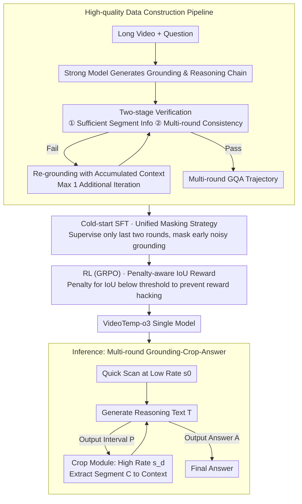

# VideoTemp-o3: Harmonizing Temporal Grounding and Video Understanding in Agentic Thinking

**Conference**: ICML 2026  
**arXiv**: [2602.07801](https://arxiv.org/abs/2602.07801)  
**Code**: TBD  
**Area**: Video Understanding / Agent / Multimodal VLM  
**Keywords**: Long Video Understanding, Temporal Grounding, Agentic Thinking, Multi-round Tool Use, Penalty-aware RL

## TL;DR
VideoTemp-o3 is a unified agentic video understanding framework. By joint modeling of temporal grounding and video QA through a **unified masking strategy for cold-start SFT** and a **penalty-aware IoU reward**, it achieves high-quality multi-round iterative grounding and precise answering in long video understanding. It reaches an mIoU of 15.6% on ultra-long videos (> 20 minutes), surpassing Gemini-2.5-Pro's 14.8%.

## Background & Motivation

**Background**: Existing methods in long video understanding typically use uniform sampling at a fixed frame rate to control computational costs. However, this leads to sparse sampling and often misses key frames related to the question. The recently emerged "thinking-with-videos" paradigm borrows from "thinking-with-images," employing a "grounding-crop-answer" workflow that allows the model to actively locate relevant video segments.

**Limitations of Prior Work**: Although frameworks like VideoExplorer, VITAL, and REVISOR have explored this paradigm, three key issues remain: (1) **High workflow complexity**, where multiple specialized models handle grounding and QA separately, leading to large inference overhead; (2) **Low grounding precision**, with a lack of evaluation and optimization mechanisms for grounding results; (3) **Rigid pipelines**, following a fixed "crop once, answer immediately" pattern that cannot support iterative grounding optimization in long videos.

**Key Challenge**: The primary obstacle is the lack of training strategies for learning precise grounding and multi-round iterative behavior. Existing labeled data is often low quality and lacks long video samples, leaving models without high-quality multi-round trajectories to learn agentic video understanding patterns.

**Goal**: To build a unified framework that simultaneously optimizes temporal grounding and video QA within a single model, supporting on-demand cropping and multi-round iterative optimization, while designing dedicated training strategies and data construction schemes.

**Key Insight**: Address the problem through three dimensions: (1) a construction pipeline for high-quality multi-round data; (2) a unified masking strategy for cold-start SFT to encourage exploration while filtering noise; and (3) a penalty-aware IoU reward to prevent reward hacking.

**Core Idea**: Use a unified multi-round dialogue framework to enable a single model to learn precise grounding and accurate answering in long videos through iterative tool usage, facilitated by carefully designed mask supervision and reward mechanisms.

## Method

### Overall Architecture
At **inference time**, the model operates in a multi-round interactive "grounding-crop-answer" loop. Given a video-question pair $(V, Q)$, the model first scans the video quickly at a low sampling rate $s_0$. Then it iterates: each round generates reasoning text $T$, and then outputs either a time interval $P$ or the final answer $A$. If a time interval $P = [t_s, t_e]$ is predicted, an external cropping module extracts the corresponding segment $C = \text{Crop}(V, P, s_d)$ at a higher sampling rate $s_d > s_0$ and appends it to the context for the next round. The interaction terminates when the model outputs an answer or reaches the maximum number of rounds $T_{max}$. Each trajectory can be represented as $\tau_i = \{(V, Q); ([T_{i,1}, P_{i,1}, C_{i,1}], \ldots, [T_{i,t}, A_i])\}$.

This "on-demand cropping, iterative optimization" reasoning capability is not inherent in off-the-shelf models but is learned by VideoTemp-o3 through a **training pipeline**. Thus, the overall approach follows two paths: the inference loop described above, and the training side that teaches the model this behavior. The latter involves **cold-start SFT** using specifically constructed high-quality multi-round GQA data (with a unified masking strategy), followed by **RL** to further refine grounding precision (using a penalty-aware IoU reward). The three key designs are detailed below following this training pipeline.

### Key Designs

**1. High-quality Data Construction Pipeline: Creating multi-round GQA data with highly aligned grounding and answers using strong models and two-stage verification.**

Existing annotations suffer from temporal shifts and inconsistent quality, and long video samples are scarce, preventing models from acquiring high-quality trajectories to learn agentic behavior. This work constructs data in two categories: single-round data without tool use is generated using Qwen3-VL-235B to produce reasoning chains and answers, keeping only samples where predictions match ground truth; multi-round tool-use data uses Gemini-2.5-Pro for candidate grounding, followed by two-stage verification. In the first stage, the segment is cropped, and the model is forced to answer based only on the segment; a correct answer indicates "sufficient information in the segment." In the second stage, the full context (original video + question + grounding process + segment) is provided; a correct answer indicates "self-consistency of the multi-round process." If a sample fails either stage, it is re-grounded using the accumulated context of the previous failure (only for videos > 3 mins, max one extra iteration). Samples passing both stages serve as multi-round multi-tool data. This rigorous model-assisted annotation and verification ensure grounding accuracy and answer stability, providing clean fuel for SFT and RL.

**2. Unified Masking Strategy: Masking early noisy grounding labels during cold-start SFT to supervise only the final two rounds.**

In multi-round "grounding-crop-answer" trajectories, early-round grounding is often inaccurate. If all rounds are supervised like traditional methods, the model learns these erroneous groundings. The unified masking approach supervises only the model outputs of the last two rounds (where the penultimate contains the correct interval and the final contains the answer). Outputs from early rounds and user inputs are masked and do not contribute to gradients. By selectively retaining reliable signals, the model learns multi-round grounding behavior without having the training process contaminated by noisy paths from early coarse groundings. Ablations show that replacing this with "supervising all rounds" drops VideoMMMU by 5.3% and mIoU by 10.7%.

**3. Penalty-aware IoU Reward: Simultaneously rewarding precise grounding and closing the "reward hacking via random intervals" loophole during RL.**

RL is optimized via GRPO, with the reward consisting of "answer correctness + format + temporal grounding." The grounding component is the key design. Pure IoU reward has a loophole: the model might output arbitrary intervals to gamble for a lucky overlap and positive reward, eventually leading to degenerate behavior (ablation observed a spike in tool use rate but a drop in grounding quality). This method adds a threshold penalty to the IoU $R_{\text{IoU}} = \frac{|[t_s, t_e]| \cap |[t_s', t_e']|}{|[t_s, t_e]| \cup |[t_s', t_e']|}$: when $R_{\text{IoU}} < \sigma$, a penalty $\lambda$ is subtracted, i.e., $R_{\text{penalty-IoU}} = R_{\text{IoU}} - \lambda$, otherwise it remains $R_{\text{IoU}}$ (using $\lambda = 0.1, \sigma = 0.1$). Extremely poor grounding is thus penalized, forcing the model to ensure both precision and rationality to gain rewards. Removing this penalty in ablations caused performance to collapse, proving this anti-cheating mechanism is essential.

## Key Experimental Results

### Main Results

| Method | MLVU | VideoMMMU | VideoMME (w/o Subtitle) | LVBench | Average |
|------|------|-----------|------------------|---------|------|
| Gemini-1.5-Pro | 49.3 | 53.3 | 59.0 | 33.1 | 48.7 |
| GPT-4o | 55.6 | 62.0 | 66.0 | 30.8 | 53.6 |
| Video-R1-7B | 48.0 | 46.0 | 67.3 | 40.1 | 50.4 |
| Qwen2.5-VL-7B | 45.2 | 36.1 | 57.6 | 39.2 | 44.5 |
| **VideoTemp-o3-7B-SFT** | 49.5 | 46.4 | 60.4 | 39.6 | 49.0 |
| **VideoTemp-o3-7B-RL** | **54.2** | **47.8** | **69.0** | **43.0** | **53.5** |

VideoTemp-o3-RL outperforms the best baseline by 6.2% / 1.7% / 2.9% on MLVU / VideoMME / LVBench respectively, with an average overall gain of 3.1%.

### Ablation Study

| ID | Method Variant | VideoMMMU | VideoMME | LVBench | ReXTime mIoU | ReXTime Acc |
|----|---------|-----------|----------|---------|------------|----|
| (a) | Full Model | 53.2 | 64.5 | 43.0 | 29.5 | 74.4 |
| (b) | w/o Grounding Data | 52.5 | 63.0 | 42.0 | **13.0** | 73.3 |
| (c) | w/o Unified Masking | 47.9 | 61.5 | 41.2 | 18.8 | 70.6 |
| (d) | w/o IoU Reward | 51.6 | 63.3 | 41.7 | 26.2 | 73.7 |
| (e) | w/o Penalty-awareness | 44.2 | 63.7 | 40.7 | 23.8 | 73.6 |

### Long Video Performance Across Durations (VideoTemp-Bench)

| Method | 0-3 min | 3-10 min | 10-20 min | > 20 min | Average |
|------|--------|--------|---------|--------|------|
| Gemini-2.5-Pro | 39.1 | 46.1 | 36.1 | 14.8 | 34.0 |
| VideoChat-R1-7B | 25.2 | 6.7 | 4.7 | 1.8 | 9.6 |
| **VideoTemp-o3-RL** | **35.3** | **32.0** | **24.8** | **15.6** | **27.0** |

Data represents mIoU. Temporal grounding benchmark for long videos.

### Key Findings
- Removing grounding data leads to a sharp mIoU drop from 29.5 to 13.0, proving that grounding supervision is critical for internalizing grounding capabilities.
- Removing the unified masking strategy results in a 5.3% drop in VideoMMMU and a 10.7% drop in mIoU, validating the effectiveness of selective supervision.
- Performance collapses without the penalty-aware term (mIoU 29.5 → 23.8, VideoMME 64.5 → 63.7), highlighting the necessity of preventing reward hacking.
- On ultra-long videos (> 20 min), the model achieves an mIoU of 15.6% (vs Gemini-2.5-Pro's 14.8%), demonstrating the most stable performance; while baselines collapse on > 20 min videos (mIoU < 2%), this framework shows excellent generalization for long videos.

## Highlights & Insights
- **Ingenuity of Unified Architecture**: By unifying temporal grounding and video QA inside the same model through a shared representation space and consistent multi-round dialogue format, the model optimizes both tasks simultaneously. This is more efficient than serial multi-module designs, reducing inference latency and improving performance through task orthogonality.
- **Effectiveness of Selective Supervision**: The unified masking strategy applies loss only to the last two rounds, masking early noisy groundings. This cleverly balances effective learning of multi-round trajectories with robustness. This technique for handling multi-round agentic data is transferable to other multi-step reasoning tasks.
- **Guardrails in Reward Design**: The penalty-aware IoU reward prevents blind guessing through explicit penalties, avoiding common reward hacking in RL. This constrained design is a valuable reference for other long video tasks like temporal action localization or event detection.
- **Practice of Data-Quality-First**: Through a rigorous multi-stage verification pipeline, the GQA data ensures high alignment between grounding and answers. Compared to using low-quality annotations, this investment brings significant performance dividends.

## Limitations & Future Work
- The framework is designed for specific multi-round formats; generalization to ultra-long videos (> 60 min) with super-many interaction rounds or complex reasoning paths has not been fully explored.
- The upper bound of temporal precision is limited by video frame rates and the discreteness of the cropping phase, making sub-second grounding difficult.
- The data construction pipeline relies on high-quality VL models (like Gemini-2.5) for annotation; feasibility for other domains or low-resource languages needs evaluation.
- Improvements: Exploring continuous temporal grounding representations instead of discrete intervals; introducing more flexible round-limit strategies; designing lightweight data annotation schemes to reduce reliance on high-end VL models.

## Related Work & Insights
- **vs VideoExplorer**: While VideoExplorer uses multi-agent collaboration (separate planner/grounder/understander), this work integrates them into a single model to reduce inference complexity and achieves more flexible iterative refinement through a unified dialogue format and end-to-end training.
- **vs VITAL / REVISOR**: These works also use a two-stage SFT-RL training process but lack explicit handling of multi-round noise and specialized anti-reversal reward designs. VideoTemp-o3's unified masking and penalty-aware rewards further stabilize multi-round learning.
- **vs LongVT**: LongVT proposes a three-stage SFT-RL-RFT strategy. This work achieves similar or better performance through a more compact SFT-RL framework and high-quality data construction, suggesting that data quality and training strategy design may be more important than simply increasing the number of training stages.

## Rating
- Novelty: ⭐⭐⭐⭐⭐ The combination of a unified framework, penalty-aware rewards, and a high-quality data construction pipeline is a first; the anti-reversal reward design is instructive for the RL community.
- Experimental Thoroughness: ⭐⭐⭐⭐⭐ Covers long video understanding, temporal grounding, and video GQA, including a new benchmark VideoTemp-Bench, detailed ablations, and in-depth duration-based analysis.
- Writing Quality: ⭐⭐⭐⭐ Method is clear, and the data construction pipeline visualization is intuitive; theoretical motivation for some reward designs could be further expanded.
- Value: ⭐⭐⭐⭐⭐ Establishes an efficient and reliable paradigm for agents in long video understanding; penalty-aware rewards and unified masking have clear reuse value; the new benchmark provides a standard for future evaluations.

<!-- RELATED:START -->

## Related Papers

- [\[ICML 2026\] VideoSEAL: Mitigating Evidence Misalignment in Agentic Long Video Understanding by Decoupling Answer Authority](videoseal_mitigating_evidence_misalignment_in_agentic_long_video_understanding_b.md)
- [\[ICCV 2025\] VTimeCoT: Thinking by Drawing for Video Temporal Grounding and Reasoning](../../ICCV2025/video_understanding/vtimecot_thinking_by_drawing_for_video_temporal_grounding_and_reasoning.md)
- [\[CVPR 2025\] T*: Re-thinking Temporal Search for Long-Form Video Understanding](../../CVPR2025/video_understanding/re-thinking_temporal_search_for_long-form_video_understanding.md)
- [\[CVPR 2026\] LensWalk: Agentic Video Understanding by Planning How You See in Videos](../../CVPR2026/video_understanding/lenswalk_agentic_video_understanding_by_planning_how_you_see_in_videos.md)
- [\[ICML 2026\] Video-MTR: Reinforced Multi-Turn Reasoning for Long Video Understanding](video-mtr_reinforced_multi-turn_reasoning_for_long_video_understanding.md)

<!-- RELATED:END -->
