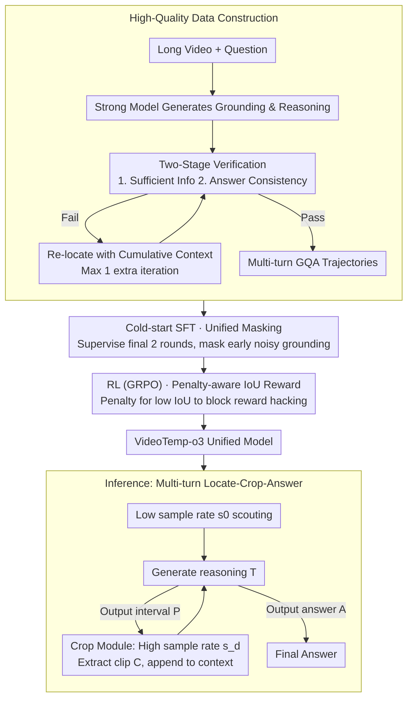

# VideoTemp-o3: Harmonizing Temporal Grounding and Video Understanding in Agentic Thinking

**Conference**: ICML 2026  
**arXiv**: [2602.07801](https://arxiv.org/abs/2602.07801)  
**Code**: TBD  
**Area**: Video Understanding / Agent / Multimodal VLM  
**Keywords**: Long Video Understanding, Temporal Grounding, Agentic Thinking, Multi-turn Tool Calling, Reward-aware RL  

## TL;DR
VideoTemp-o3 is a unified Agent video understanding framework—jointly modeling video temporal grounding and question answering (QA) through a **unified masking strategy for cold-start SFT** and **penalty-aware IoU rewards**. It achieves high-quality multi-turn iterative grounding and precise answers in long video understanding, with an mIoU of 15.6% on ultra-long videos (> 20 minutes), surpassing Gemini-2.5-Pro's 14.8%.

## Background & Motivation

**Background**: In long video understanding, existing methods typically use uniform sampling at a fixed frame rate to control computational costs. However, this leads to sparse sampling and missing key frames relevant to the question. The recently emerged "thinking-with-videos" paradigm borrows from "thinking-with-images," employing a "locate-crop-answer" workflow to let the model proactively ground relevant video segments.

**Limitations of Prior Work**: Although frameworks like VideoExplorer, VITAL, and REVISOR have explored this paradigm, three key problems remain: (1) **High workflow complexity**, where multiple specialized models handle grounding and QA separately, leading to high inference overhead; (2) **Low grounding precision**, making it difficult to locate accurately due to a lack of evaluation and optimization mechanisms for grounding results; (3) **Rigid processes**, often following a fixed "crop once, answer immediately" pattern that fails to support iterative grounding optimization in long videos.

**Key Challenge**: The primary obstacle is that training strategies are insufficient for learning precise grounding and multi-turn iterative behavior. Existing annotated data is of low quality and long-form video samples are scarce, leaving models without high-quality multi-turn trajectories to learn Agentic video understanding patterns.

**Goal**: Build a unified framework to simultaneously optimize temporal grounding and video QA within a single model, supporting demand-driven cropping and multi-turn iterative optimization, while designing specialized training strategies and data construction schemes.

**Key Insight**: Address the problem through three dimensions: (1) A construction pipeline for high-quality multi-turn data; (2) A unified masking strategy for cold-start SFT to encourage exploration while filtering noise; (3) A penalty-aware IoU reward to prevent reward hacking.

**Core Idea**: Utilize a unified multi-turn dialogue framework where, through meticulously designed masking supervision and reward mechanisms, a single model learns to achieve precise grounding and accurate answers via iterative tool calling in long videos.

## Method

### Overall Architecture
At **inference time**, the model operates in a multi-turn interactive "locate-crop-answer" closed loop. Given a video-question pair $(V, Q)$, the model first quickly browses the video at a low sampling rate $s_0$. It then iterates—each round generating reasoning text $T$, followed by either a predicted time interval $P$ or a final answer $A$. If a time interval $P = [t_s, t_e]$ is predicted, an external cropping module extracts the corresponding segment $C = \text{Crop}(V, P, s_d)$ from the original video at a higher sampling rate $s_d > s_0$ and appends it to the context for the next round. The interaction terminates when the model outputs an answer or reaches the maximum number of turns $T_{max}$. Each trajectory can be represented as $\tau_i = \{(V, Q); ([T_{i,1}, P_{i,1}, C_{i,1}], \ldots, [T_{i,t}, A_i])\}$.

This "crop-on-demand, iterative optimization" inference capability is not inherent in off-the-shelf models but is acquired by VideoTemp-o3 through a **training pipeline**. The overall approach follows two paths: the inference loop mentioned above, and the training side that teaches the model this behavior—starting with **cold-start SFT** using specially constructed high-quality multi-turn GQA data (with a unified masking strategy), followed by **RL** to further refine grounding precision (using penalty-aware IoU rewards).

### Key Designs

**1. High-quality data construction: Using strong models + two-stage verification to create multi-turn GQA data with highly aligned grounding and answers.**

Existing annotations suffer from temporal shifts and varying quality, while long video samples are scarce. This prevents models from obtaining sufficient multi-turn trajectories to learn Agent behavior. This paper constructs data in two categories: single-turn data without tool calling (using Qwen3-VL-235B to generate reasoning chains and answers, keeping only correct ones) and multi-turn tool-calling data (using Gemini-2.5-Pro to generate candidate grounding). The latter undergoes two-stage verification: in stage one, a segment is cropped and the model is forced to answer based *only* on that segment—a correct answer indicates "sufficient information"; in stage two, the model re-answers given the full context (original video + question + grounding process + segment)—consistency with the ground truth indicates "process consistency." If a sample fails either stage, it re-locates using the cumulative failure context (for videos > 3 min, max one extra iteration). This rigorous verification ensures that both grounding and answering are precise, providing clean fuel for SFT and RL.

**2. Unified Masking Strategy: During cold-start SFT, only the last two rounds are supervised, masking early noisy grounding labels.**

In multi-turn "locate-crop-answer" trajectories, grounding in early rounds is often accurate. If all rounds are supervised like traditional methods, the model learns these erroneous grounding paths. The Unified Masking strategy addresses this: in multi-turn data, the second-to-last round contains the correct time interval and the final round outputs the answer. Thus, the training loss only applies to the model outputs of these last two rounds. All early generated content and user inputs are masked and do not contribute to gradients. By selectively retaining only reliable signals, the model learns multi-turn grounding behavior without being contaminated by noisy paths—replacing this with "supervise all rounds" results in a 5.3% drop in VideoMMMU and a 10.7% drop in mIoU.

**3. Penalty-aware IoU Reward: During RL, both reward precise grounding and block the loophole of "stealing rewards via random intervals."**

The RL phase uses GRPO optimization with a reward composed of answer correctness, format, and temporal grounding. The grounding component is the key design. Pure IoU rewards have a loophole: the model might output arbitrary intervals to gamble for a slight overlap and a positive reward, leading to sub-optimal behavior (ablation shows tool-calling rates skyrocket while grounding quality drops). This paper adds a threshold penalty to the IoU $R_{\text{IoU}} = \frac{|[t_s, t_e]| \cap |[t_s', t_e']|}{|[t_s, t_e]| \cup |[t_s', t_e']|}$: if $R_{\text{IoU}} < \sigma$, a penalty $\lambda$ is subtracted ($R_{\text{penalty-IoU}} = R_{\text{IoU}} - \lambda$), otherwise $R_{\text{IoU}}$ is kept (using $\lambda = 0.1, \sigma = 0.1$). This punishes poor grounding, forcing the model to ensure both precision and rationality to gain rewards. Removing this penalty term caused performance to collapse in ablation studies.

## Key Experimental Results

### Main Results

| Method | MLVU | VideoMMMU | VideoMME (w/o Sub) | LVBench | Average |
|------|------|-----------|------------------|---------|------|
| Gemini-1.5-Pro | 49.3 | 53.3 | 59.0 | 33.1 | 48.7 |
| GPT-4o | 55.6 | 62.0 | 66.0 | 30.8 | 53.6 |
| Video-R1-7B | 48.0 | 46.0 | 67.3 | 40.1 | 50.4 |
| Qwen2.5-VL-7B | 45.2 | 36.1 | 57.6 | 39.2 | 44.5 |
| **VideoTemp-o3-7B-SFT** | 49.5 | 46.4 | 60.4 | 39.6 | 49.0 |
| **VideoTemp-o3-7B-RL** | **54.2** | **47.8** | **69.0** | **43.0** | **53.5** |

VideoTemp-o3-RL outperforms the best baseline by 6.2%, 1.7%, and 2.9% on MLVU, VideoMME, and LVBench, respectively, with an average gain of 3.1%.

### Ablation Study

| ID | Variant | VideoMMMU | VideoMME | LVBench | ReXTime mIoU | ReXTime Acc |
|----|---------|-----------|----------|---------|------------|----|
| (a) | Full Model | 53.2 | 64.5 | 43.0 | 29.5 | 74.4 |
| (b) | w/o Grounding Data | 52.5 | 63.0 | 42.0 | **13.0** | 73.3 |
| (c) | w/o Unified Masking | 47.9 | 61.5 | 41.2 | 18.8 | 70.6 |
| (d) | w/o IoU Reward | 51.6 | 63.3 | 41.7 | 26.2 | 73.7 |
| (e) | w/o Penalty-aware | 44.2 | 63.7 | 40.7 | 23.8 | 73.6 |

### Performance by Video Duration (VideoTemp-Bench)

| Method | 0-3 min | 3-10 min | 10-20 min | > 20 min | Average |
|------|--------|--------|---------|--------|------|
| Gemini-2.5-Pro | 39.1 | 46.1 | 36.1 | 14.8 | 34.0 |
| VideoChat-R1-7B | 25.2 | 6.7 | 4.7 | 1.8 | 9.6 |
| **VideoTemp-o3-RL** | **35.3** | **32.0** | **24.8** | **15.6** | **27.0** |

Note: mIoU metric, temporal grounding benchmark for long videos.

### Key Findings
- Removing grounding data caused mIoU to drop sharply from 29.5 to 13.0, proving that grounding supervision is vital for internalizing localization capabilities.
- Removing Unified Masking led to a 5.3% drop in VideoMMMU and a 10.7% drop in mIoU, verifying the effectiveness of selective supervision.
- Performance collapsed without the penalty-aware term (mIoU 29.5 → 23.8), highlighting its necessity in preventing reward hacking.
- On ultra-long videos (> 20 min), the model achieved 15.6% mIoU (vs Gemini-2.5-Pro 14.8%); while baselines collapsed below 2% mIoU, this framework demonstrated superior generalization.

## Highlights & Insights
- **Elegance of Unified Architecture**: By unifying temporal grounding and video QA in a single model with a shared representation space and consistent multi-turn format, the model optimizes both tasks simultaneously. This is more efficient than multi-module series designs and boosts performance through task orthogonality.
- **Effectiveness of Selective Supervision**: The Unified Masking strategy's focus on the final two rounds is a clever way to balance multi-turn trayectory learning with robustness against noise. This generalized technique for multi-round Agent data can be transferred to other multi-step reasoning tasks.
- **Safety in Reward Design**: The penalty-aware IoU reward prevents blind guessing via explicit punishment, avoiding common RL reward hacking. This constrained design is a valuable reference for other long video tasks like action localization or event detection.
- **Data-First Practice**: Through a rigorous multi-stage verification process, the paper ensures high alignment between grounding and answers. This investment in data quality yielded significant performance gains compared to using raw, low-quality annotations.

## Limitations & Future Work
- The framework is designed for specific multi-turn formats; generalization to ultra-long videos (> 60 min) with many interaction rounds or complex reasoning paths remains under-explored.
- Temporal precision is limited by video frame rates and the discreteness of the cropping stage, making sub-second grounding difficult.
- Data construction relies on high-quality VL models (Gemini-2.5) for annotation; feasibility in specialized domains or low-resource languages needs evaluation.
- Future work: Exploring continuous temporal grounding representations; introducing flexible round-limit strategies; designing lightweight annotation schemes to reduce dependence on high-end VL models.

## Related Work & Insights
- **vs VideoExplorer**: VideoExplorer uses multi-Agent collaboration (Planner/Grounder/Understander). Ours integrates these into a single model to reduce inference complexity and gain flexible iterative refinement via a unified dialogue format.
- **vs VITAL / REVISOR**: While these also use SFT-RL, they lack explicit handling of multi-turn noise and specific anti-gamification reward designs. VideoTemp-o3’s masking and penalty-aware rewards further stabilize multi-turn learning.
- **vs LongVT**: LongVT uses a three-stage SFT-RL-RFT strategy. Ours achieves similar or better performance with a more compact SFT-RL framework and high-quality data construction, suggesting that data quality and strategy design may be more crucial than increasing training stages.

## Rating
- Novelty: ⭐⭐⭐⭐⭐ (Unified framework + Penalty-aware RL + specialized data construction is pioneering; reward design is insightful for the RL community).
- Experimental Thoroughness: ⭐⭐⭐⭐⭐ (Covers long video understanding, grounding, and GQA; includes new benchmark VideoTemp-Bench; detailed ablation and duration analysis).
- Writing Quality: ⭐⭐⭐⭐ (Clear methodology; intuitive data construction diagrams; theoretical motivation for some rewards could be further expanded).
- Value: ⭐⭐⭐⭐⭐ (Establishes an efficient Agent paradigm for long videos; rewards and masking strategies are highly reusable; new benchmark provides a standard for evaluation).

<!-- RELATED:START -->

## Related Papers

- [\[CVPR 2026\] Thinking with Drafts: Speculative Temporal Reasoning for Efficient Long Video Understanding](../../CVPR2026/video_understanding/thinking_with_drafts_speculative_temporal_reasoning_for_efficient_long_video_und.md)
- [\[ICML 2026\] VideoSEAL: Mitigating Evidence Misalignment in Agentic Long Video Understanding by Decoupling Answer Authority](videoseal_mitigating_evidence_misalignment_in_agentic_long_video_understanding_b.md)
- [\[ICCV 2025\] VTimeCoT: Thinking by Drawing for Video Temporal Grounding and Reasoning](../../ICCV2025/video_understanding/vtimecot_thinking_by_drawing_for_video_temporal_grounding_and_reasoning.md)
- [\[CVPR 2025\] T*: Re-thinking Temporal Search for Long-Form Video Understanding](../../CVPR2025/video_understanding/re-thinking_temporal_search_for_long-form_video_understanding.md)
- [\[CVPR 2026\] VideoARM: Agentic Reasoning over Hierarchical Memory for Long-Form Video Understanding](../../CVPR2026/video_understanding/videoarm_agentic_reasoning_over_hierarchical_memory_for_long-form_video_understa.md)

<!-- RELATED:END -->
