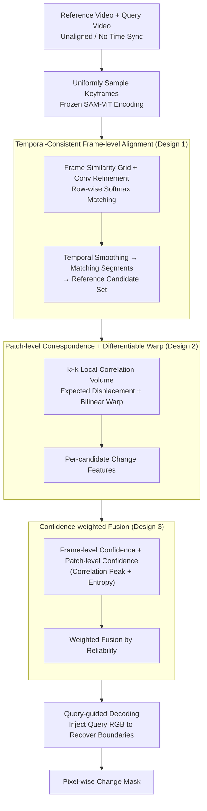

# VSCD: Video Scene Change Detection in Unaligned Scenarios

**Conference**: ICML 2026  
**arXiv**: [2605.20821](https://arxiv.org/abs/2605.20821)  
**Code**: https://github.com/AutoCompSysLab/VSCD  
**Area**: Video Understanding / Video Comparison  
**Keywords**: Scene Change Detection, Video Alignment, Multi-reference Matching, Multi-view Geometry, Long-term Autonomy

## TL;DR
This paper introduces the VSCD task—detecting object-level changes pixel-by-pixel between two video sequences of the same environment recorded at different times through a query-centric multi-reference model. It utilizes temporal consistency, patch-level correspondence, and confidence-weighted fusion to handle unconstrained camera motion and severe viewpoint mismatch.

## Background & Motivation

**Background**: Change detection is a classic computer vision problem. Existing methods are categorized into two types: image-based (RSCD, SCD), which assume basically fixed viewpoints; and video-based (AOD), which assume reference and query videos move along identical or opposite trajectories.

**Limitations of Prior Work**: These methods fail to address three real-world challenges: (1) unconstrained camera motion; (2) severe viewpoint changes; and (3) simultaneous appearance or disappearance of multiple objects. These problems frequently coexist when mobile robots must detect environmental changes during long-term autonomous operations.

**Key Challenge**: Frame-level registration is infeasible—comparing any two frames individually results in numerous misalignments because the viewpoints are entirely different. However, the temporal structure of video sequences contains sufficient regularity.

**Goal**: Define the new VSCD task; construct a large-scale annotated dataset (over 1.1 million frames + a real-world test set); and propose a method that leverages temporal structure for change detection without explicit trajectory alignment.

**Key Insight**: While mismatches between individual frames are severe, the **temporal coherence and multi-view geometric constraints of video sequences are sufficient for reliable reasoning**.

**Core Idea**: **Multi-reference matching + temporal alignment + patch-level correspondence + confidence-weighted fusion**—implicitly learning robust change detection capabilities from video sequences without prior knowledge of camera motion or trajectory alignment.

## Method

### Overall Architecture
VSCDNet is a query-centric multi-reference architecture divided into three stages: (1) **Frame-level alignment**: Uniformly sample keyframes, encode them with a ViT, calculate a frame-level similarity grid, and find candidate reference frame combinations through soft matching; (2) **Patch-level correspondence**: Calculate local correlation volumes at the patch scale for each reference candidate and perform geometric compensation via differentiable warping; (3) **Confidence-weighted fusion**: Combine frame-level confidence (derived from frame matching distributions) and patch-level confidence (derived from local matching sharpness and entropy) to fuse multi-reference change features weighted by reliability. Finally, high-resolution change masks are solved frame-by-frame by a query-guided decoder (which injects query RGB data to recover boundaries).

### Key Designs

**1. Temporal-Consistent Frame-level Alignment: Finding corresponding segments at the frame scale to provide a coarse correspondence for subsequent patch matching**

Since viewpoints between individual frames are entirely different, arbitrary pairing causes massive misalignment; thus, direct frame-to-frame comparison is avoided. Instead, this step utilizes the temporal coherence of video: for each keyframe pair $(t, s)$, the cosine similarity of frame features is calculated as $S_{t,s} = \cos(v_t^q, v_s^r)$, refined through a shallow convolutional head to obtain $A = S + h_\psi(S)$, and normalized via row-wise softmax as $P_{\text{frame}}(t,s) = \text{softmax}_s(A_{t,s}/\tau_f)$. Temporal smoothing priors are used to cluster frames into matching segments. The benefit is that no explicit pose estimation or SLAM is required—only the temporal constraint that "correspondences of adjacent frames should also be adjacent" is used to converge chaotic frame-to-frame matches into orderly segment-level correspondences, drastically narrowing the search range for the next step.

**2. Patch-level Correspondence + Differentiable Warp: Compensating for viewpoint changes and occlusions locally in the feature space**

Frame-level alignment only provides coarse correspondence. Under severe viewpoint mismatch, alignment must occur at a finer scale. For each reference candidate $s$, the dot-product correlation between query and reference patches is calculated within a $k \times k$ local window: $P_{\text{patch},i}^{(t,s)}(x,y) = \text{softmax}(\text{dots})$. The expected displacement is determined via a weighted average $\Delta^{(t,s)}(x,y) = \sum_i P_{\text{patch},i}^{(t,s)} \delta_i$, followed by bilinear sampling to warp reference features to the query perspective. Finally, change features are fused by a lightweight convolutional head $F_{t,s} = g_\phi(E_t^q, E_{t,s}^{r(w)})$. Local correlation is significantly more robust than global matching, and differentiable warping allows geometric compensation without explicit camera pose estimation, while the soft distribution of correlations propagates uncertainty about alignment quality.

**3. Confidence-weighted Fusion: Reliability voting among multi-reference results to suppress candidates with failed registration**

Since a single query frame corresponds to multiple reference candidates, simple averaging is easily corrupted by poor registration. VSCDNet calculates two layers of confidence for each candidate: frame-level $C_f(t,s) = P_{\text{frame}}(t,s)$, reflecting the strength of the segment correspondence, and patch-level $C_{sp}^{(t,s)}(x,y) = c_p \cdot p_{\max}^{(t,s)} + c \cdot (1 - e^{(t,s)})$, which considers both the correlation peak and normalized entropy. The final fusion is $F_t = \sum_s C_f(t,s) \cdot C_{sp}^{(t,s)} \cdot F_{t,s} / \text{norm}$. Incorporating entropy is a critical design: when the probability distribution of a patch's offset is flat (multiple displacements are nearly equally probable), the entropy is high, indicating the patch cannot be accurately aligned and its weight should be suppressed—an ambiguity that peak value alone cannot detect.

## Key Experimental Results

### Main Results

| Method | Synthetic F1 | Real-world F1 | vs SOTA |
|------|-------------|-------------|---------|
| TCF-LMO (AOD) | 19.7% | 10.3% | -44.5% |
| PBCD-MC (AOD) | 26.8% | 16.1% | -28.4% |
| CSCDNet (SCD) | 19.8% | 9.1% | -45.4% |
| DR-TANet (SCD) | 20.6% | 11.6% | -43.1% |
| C-3PO (SCD) | 24.1% | 11.7% | -39.9% |
| GeSCF (SOTA) | 29.5% | 17.3% | baseline |
| **VSCDNet (Ours)** | **36.6%** | **25.4%** | **+7.1% / +8.1%** |

### Layered Evaluation

| Video Length | Low | Med | High | Graphics Quality | Low | Med | High | Obj Changes | Few | Med | Many |
|---------|-----|-----|-----|----------|-----|-----|----------|-----|-----|-----|
| F1 | 38.1% | 36.9% | 33.9% | - | 40.7% | 31.7% | 32.1% | - | 37.7% | 39.0% | 36.6% |

### Key Findings
- Temporal-consistent frame-level alignment transforms chaotic frame-to-frame matches into ordered sequence correspondences via segment proposals—serving as the cornerstone of model performance.
- Patch-level correspondence is more robust than global features, maintaining a 31-40% F1 even in scenarios with high viewpoint variation.
- Entropy-regularized confidence is crucial; normalized entropy provides additional detection of "flat distributions" where multiple offsets are equally likely.
- Generalization to real-world data is strong—the performance drop from synthetic to real data is approximately 11%, compared to other methods which drop by over 50%.

## Highlights & Insights
- **Paradigm shift from frame-level to sequence-level**: Groundbreaking use of the video sequence's temporal structure as an alignment prior, eliminating the need for SLAM or motion estimation.
- **Elegance of implicit geometric learning**: Avoids explicit camera pose estimation, instead implicitly learning multi-view correspondences through patch-level correlation and differentiable warping.
- **Ingenious two-layer confidence mechanism**: Combining peak values and entropy detects both "certain matches" and "ambiguous matches."
- **New benchmark for unconstrained video understanding**: The scale of 1.1 million frames and real-world authenticity exceeds existing change detection datasets by an order of magnitude.

## Limitations & Future Work
- The method depends on video temporal length; segmentation and streaming for extremely long videos have not yet been explored.
- The real-world dataset size is only 8 video pairs, with limited environmental diversity.
- It assumes that object states within the scene remain fixed during the recording of a single video.
- Improvements: Implement sliding windows or hierarchical temporal encoding for ultra-long videos; collect more real-world data; introduce adaptive hyperparameter adjustment; and optimize the inference pipeline.

## Related Work & Insights
- **vs RSCD**: Aerial/satellite focus assuming fixed viewpoints; Ours targets indoor environments with severe mismatch.
- **vs SCD**: Handles isolated image pairs; Ours utilizes temporal coherence.
- **vs AOD**: Assumes identical or opposite trajectories; Ours handles unconstrained motion, which is more challenging.
- **vs Video Copy Localization**: Shared ideas in frame similarity graphs, but applied here to pixel-level change detection.
- **Insights**: Multi-reference fusion + confidence weighting can be transferred to video frame interpolation, stereo matching, and optical flow estimation.

## Rating
- Novelty: ⭐⭐⭐⭐⭐ The VSCD task definition fills a critical gap; the shift in thinking + implicit geometric learning is an industry first.
- Experimental Thoroughness: ⭐⭐⭐⭐ 1.1M synthetic frames + 8 pairs of real data + 4 baseline comparisons + layered evaluation.
- Writing Quality: ⭐⭐⭐⭐⭐ Clear logic, standardized formulas, and informative diagrams.
- Value: ⭐⭐⭐⭐⭐ Addresses frontier needs in long-term autonomous navigation; provides a practical solution + high-quality dataset + open-source implementation.

<!-- RELATED:START -->

## Related Papers

- [\[ICML 2026\] Video-MTR: Reinforced Multi-Turn Reasoning for Long Video Understanding](video-mtr_reinforced_multi-turn_reasoning_for_long_video_understanding.md)
- [\[ICML 2026\] Return of Frustratingly Easy Unsupervised Video Domain Adaptation](return_of_frustratingly_easy_unsupervised_video_domain_adaptation.md)
- [\[ICML 2026\] AVTrack: Audio-Visual Tracking in Human-centric Complex Scenes](avtrack_audio-visual_tracking_in_human-centric_complex_scenes.md)
- [\[ICML 2026\] Foresee-to-Ground: From Predictive Temporal Perception to Evidence-Driven Reasoning](foresee-to-ground_from_predictive_temporal_perception_to_evidence-driven_reasoni.md)
- [\[ICML 2026\] RELO: Reinforcement Learning to Localize for Visual Object Tracking](relo_reinforcement_learning_to_localize_for_visual_object_tracking.md)

<!-- RELATED:END -->
