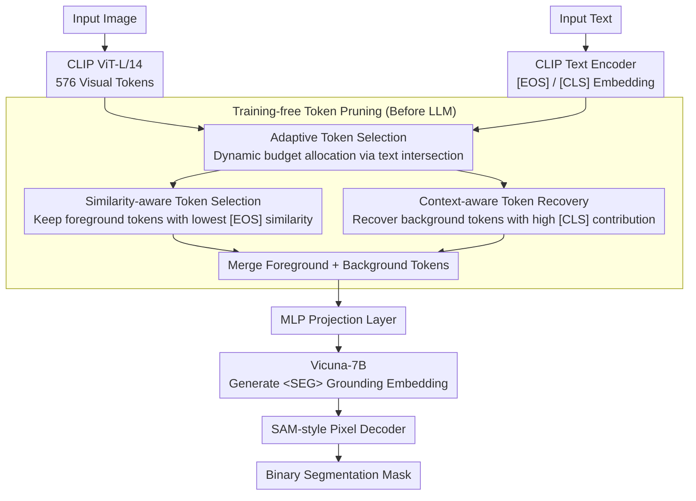

# CLIP Tricks You: Training-free Token Pruning for Efficient Pixel Grounding in Large Vision-Language Models

**Conference**: ICML2026  
**arXiv**: [2605.13178](https://arxiv.org/abs/2605.13178)  
**Code**: https://github.com/sejong-rcv/LiteLVLM  
**Area**: Multimodal VLM  
**Keywords**: Visual Token Pruning, CLIP Similarity Reversal, Pixel-level Grounding, Training-free Inference Acceleration, Large Vision-Language Models  

## TL;DR

This work identifies an anti-intuitive "similarity reversal" phenomenon in CLIP, where visual tokens of referring regions exhibit the lowest similarity with [EOS] text tokens. Based on this observation, the authors propose LiteLVLM—a training-free, text-guided visual token pruning method. It retains 90.3% of the original pixel grounding performance even after discarding 66.7% of tokens, while achieving a 22% inference acceleration and 2.3× VRAM savings.

## Background & Motivation

**Background**: The inference overhead of Large Vision-Language Models (LVLMs) primarily stems from visual tokens—LLaVA generates 576 visual tokens, while text tokens typically do not exceed 100; high-resolution versions (LLaVA-NeXT) reach up to 2880 tokens. Consequently, visual token pruning is a critical approach for enhancing inference efficiency.

**Limitations of Prior Work**: Existing pruning methods (e.g., LLaVA-PruMerge, VisionZip, FastV) rely mainly on text-agnostic global importance metrics. While effective for image understanding, they perform poorly in pixel-level grounding tasks. This is because token importance in grounding highly depends on the input text (e.g., "player" vs. "ball" requires preserving distinct spatial regions), and global metrics fail to capture such text-conditional differences.

**Key Challenge**: The only method utilizing text information, TRIM, preserves tokens based on high CLIP vision-text similarity. However, the authors discover a **similarity reversal** in CLIP—visual tokens in referring regions actually have the lowest similarity with [EOS] text tokens. Consequently, TRIM preserves tokens unrelated to the target object, performing 10-20% worse than random pruning.

**Goal**: Design a text-guided, training-free token pruning strategy that significantly reduces visual tokens while maintaining segmentation accuracy in pixel-level grounding tasks.

**Key Insight**: The authors analyze the attention distribution of the CLIP [EOS] token and identify a **text attention sink** phenomenon—68% of the [EOS] token's attention is concentrated on the non-semantic [SOS] token, with only 14% allocated to the referring word ([RES] token) that carries actual semantics. This causes the [EOS] embedding to lack rich semantics, leading to abnormally low similarity with visual tokens of referring regions.

**Core Idea**: Reverse the CLIP vision-text similarity ranking—retaining low-similarity tokens (covering referring regions) and recovering high [CLS] contribution tokens (providing background context) to achieve clear foreground-background separation.

## Method

### Overall Architecture

LiteLVLM is built upon the GLaMM architecture: an input image is encoded into 576 visual tokens by CLIP ViT-L/14, and the input text is processed by a CLIP text encoder to extract the [EOS] embedding. LiteLVLM executes pruning before the visual tokens enter the LLM. The pruning mechanism is based on three synergistic designs: adaptive token selection dynamically allocates foreground/background budgets based on text intersections; similarity-aware token selection preserves foreground tokens with the lowest similarity to [EOS]; and context-aware token recovery reinstates background tokens that contribute significantly to [CLS]. The merged tokens are passed through an MLP projection layer into Vicuna-7B to generate a `<SEG>` grounding embedding, which is finally decoded into a binary segmentation mask by a SAM-style pixel decoder. Since pruning occurs before the LLM, it is fully compatible with efficient attention mechanisms like FlashAttention.

### Key Designs

**1. Similarity-aware Token Selection: Retaining tokens with the lowest similarity to [EOS]**

Intuitively, "high similarity = important." TRIM follows this by preserving tokens with high CLIP vision-text similarity, yet performs 10–20% worse than random pruning. The root cause is that CLIP contrastive learning only aligns the global [CLS] and [EOS] tokens. Visual tokens in referring regions receive weak gradient signals and end up with the lowest similarity to [EOS] (similarity reversal). Ours reverses this sorting: the dot product similarity $s_{i,j} = E_i^{\mathcal{T}} \cdot E_j^{v\top}$ is calculated between each visual token $E_j^v$ and the [EOS] embedding $E_i^{\mathcal{T}}$, and the $k$ **lowest** similarity tokens are selected. While these tokens are weakly aligned with global semantics, they preserve rich local referring information—turning a CLIP "deficiency" into a tool for precise foreground localization.

**2. Context-aware Token Recovery: Reinstating background tokens for boundary determination**

Retaining only foreground tokens lacks background references, leading to blurred segmentation boundaries. For the set of unselected tokens $S$ from the first step, the context contribution score for each token is calculated: $s_i' = \| \frac{\exp(Q^{\mathcal{I}} K_i^\top / \sqrt{d})}{\sum_{j \in S} \exp(Q^{\mathcal{I}} K_j^\top / \sqrt{d})} \cdot V_i \|_2$. The tokens with the highest scores are recovered. This score considers both attention weights and the information content of the Value vector (L2 norm), identifying background tokens that carry global semantics and spatial references. This allows the pixel decoder to clearly distinguish between foreground and background. Ablations show that "Context Recovery only" performs worse than random, "Low Similarity only" is slightly better than random, and combining both is optimal, proving foreground and background tokens are complementary.

**3. Adaptive Token Selection: Dynamic foreground/background ratio via text intersection**

Fixed ratios (e.g., 75%/25%) exhibit inconsistent performance across scenarios. Given a budget $\mathcal{B}$ and $N$ input texts, potential candidates $\mathcal{S}_i$ of size $\mathcal{B}$ are independently selected for each text. The intersection $\mathcal{S} = \bigcap_{i=1}^{N} \mathcal{S}_i$ is used as the similarity-aware tokens (for $N=1$, it is empirically set to 50% of the budget), and the remaining budget $\mathcal{B} - |\mathcal{S}|$ is filled via context recovery. The intersection size naturally scales with the text input—regions focused on by multiple texts are more reliable and thus more tokens are preserved. Consequently, the foreground/background ratio adjusts dynamically, outperforming the best fixed ratio by 2.0% on average.

## Key Experimental Results

### Main Results: Referring Expression Segmentation (192/576 tokens kept, ↓66.7%)

| Method | RefCOCO-val | RefCOCO-testA | RefCOCO+-val | RefCOCOg-val | Avg. | Rel. |
|------|------------|---------------|-------------|-------------|------|------|
| GLaMM (Upper Bound) | 79.5 | 83.2 | 72.6 | 74.2 | 75.5 | 100% |
| TRIM | 55.5 | 58.5 | 40.6 | 45.2 | 47.3 | 62.6% |
| FastV | 69.5 | 73.9 | 57.9 | 61.5 | 62.6 | 82.9% |
| LLaVA-PruMerge | 68.8 | 74.6 | 58.2 | 61.2 | 63.1 | 83.5% |
| VisionZip | 71.1 | 76.4 | 59.7 | 64.7 | 65.5 | 86.7% |
| VisPruner | 72.4 | 75.5 | 61.5 | 65.4 | 66.0 | 87.4% |
| **LiteLVLM** | **74.4** | **78.7** | **64.1** | **66.0** | **68.1** | **90.3%** |

### Ablation Study (RefCOCO-val, different token budgets)

| Configuration | 29 tokens | 58 tokens | 144 tokens | 288 tokens | Avg. | Description |
|------|----------|----------|-----------|-----------|------|------|
| Random Pruning | 57.2 | 62.7 | 68.2 | 72.0 | 65.0 | Baseline |
| Context Recovery Only | 54.5 | 59.9 | 67.4 | 71.6 | 63.3 | Worse than random |
| High Sim Selection (↑) | 48.1 | 49.4 | 53.8 | 59.5 | 52.7 | Severe degradation |
| Low Sim Selection (↓) | 59.8 | 63.6 | 68.4 | 72.8 | 66.1 | Reversal verified |
| **LiteLVLM (↓ + Recovery)** | **62.5** | **65.2** | **72.9** | **75.2** | **68.9** | Complementary |

### Efficiency Analysis (192 tokens / 64 tokens)

| Method | FLOPs (TB) | Prefill (ms) | CUDA Time (ms) | VRAM (GB) |
|------|-----------|-------------|----------------|----------|
| GLaMM (Upper Bound) | 4.66 | 166.25 | 340.89 | 0.81 |
| FastV (192) | 2.65 | 162.88 | 340.25 | 0.81 |
| VisPruner (192) | 2.17 | 75.65 | 276.09 | 0.37 |
| **LiteLVLM (192)** | **2.11** | **74.88** | **265.83** | **0.35** |
| **LiteLVLM (64)** | **1.27** | **54.02** | **237.35** | **0.21** |

### Key Findings

- TRIM (selecting by high similarity) is the worst performing method across all budgets, confirming the universality of the CLIP similarity reversal phenomenon.
- Adaptive token selection outperforms the best fixed ratio (50/50) by 2.0% (70.9% vs 68.9%), demonstrating that dynamic allocation is crucial for different text inputs.
- In video grounding (Ref-DAVIS-17 / Refer-YouTube-VOS), retaining 196/576 tokens results in only a 0.5% performance loss, surpassing VisPruner by 4.9-6.7%.
- Pruning before the LLM reduces prefilling time from 166ms to 75ms and maintain compatibility with FlashAttention; FastV, which prunes inside the LLM, fails to gain these benefits.

## Highlights & Insights

- **Discovery of CLIP Similarity Reversal**: The insight that contrastive learning only aligns global tokens, causing local tokens to be inversely correlated with global representations due to weak gradient signals, is a major contribution. This not only explains TRIM's failure but also provides a new perspective on understanding CLIP's internal representations.
- **Text Attention Sink Phenomenon**: The finding that [EOS] directs 68% of its attention to semantic-free [SOS] positions mirrors the attention sink phenomenon in LLMs, suggesting a universal impact of positional bias on special tokens in Transformers.
- **"Inverse Thinking" Methodology**: When intuition (high similarity = important) fails, reversing the sorting converts a CLIP "flaw" into a precise tool. This approach could be transferred to other tasks relying on CLIP for spatial selection, such as region selection in open-vocabulary detection.

## Limitations & Future Work

- The method depends heavily on LVLM architectures using CLIP as a visual encoder; whether similarity reversal holds for models using SigLIP or other non-contrastive encoders requires verification.
- Currently validated only on GLaMM/VideoGLaMM; potential generalization to other grounding architectures like LISA or PixelLM remains untested.
- The 50% empirical ratio in the adaptive strategy for $N=1$ lacks theoretical grounding; a more refined budget allocation strategy could further improve performance.
- Optimization is currently focused on the inference phase; the potential for token pruning during the training phase has not been explored.

## Related Work & Insights

- **LLaVA-PruMerge (ICCV25)**: Text-agnostic pruning based on [CLS] token similarity; effective for image understanding but fails in grounding.
- **TRIM (COLING25)**: The only text-aware method, but incorrectly selects based on high similarity, serving as a negative example.
- **VisPruner (ICCV25)**: Current SOTA token pruning method; LiteLVLM surpasses it by 2.9-10.2% across all settings.
- **FastV (ECCV24)**: Pruning based on attention inside the LLM; incompatible with FlashAttention.

<!-- RELATED:START -->

## Related Papers

- [\[CVPR 2026\] ZOO-Prune: Training-Free Token Pruning via Zeroth-Order Gradient Estimation in Vision-Language Models](../../CVPR2026/vlm_efficiency/zoo-prune_training-free_token_pruning_via_zeroth-order_gradient_estimation_in_vi.md)
- [\[CVPR 2026\] TransPrune: Token Transition Pruning for Efficient Large Vision-Language Model](../../CVPR2026/vlm_efficiency/transprune_token_transition_pruning_for_efficient_large_vision-language_model.md)
- [\[ICLR 2026\] Enhancing Visual Token Representations for Video Large Language Models via Training-free Spatial-Temporal Pooling and Gridding](../../ICLR2026/vlm_efficiency/enhancing_visual_token_representations_for_video_large_language_models_via_train.md)
- [\[ICLR 2026\] VisionTrim: Unified Vision Token Compression for Training-Free MLLM Acceleration](../../ICLR2026/vlm_efficiency/visiontrim_unified_vision_token_compression_for_training-free_mllm_acceleration.md)
- [\[CVPR 2026\] IF-Prune: Information-Flow Guided Token Pruning for Efficient Vision-Language Models](../../CVPR2026/vlm_efficiency/if-prune_information-flow_guided_token_pruning_for_efficient_vision-language_mod.md)

<!-- RELATED:END -->
