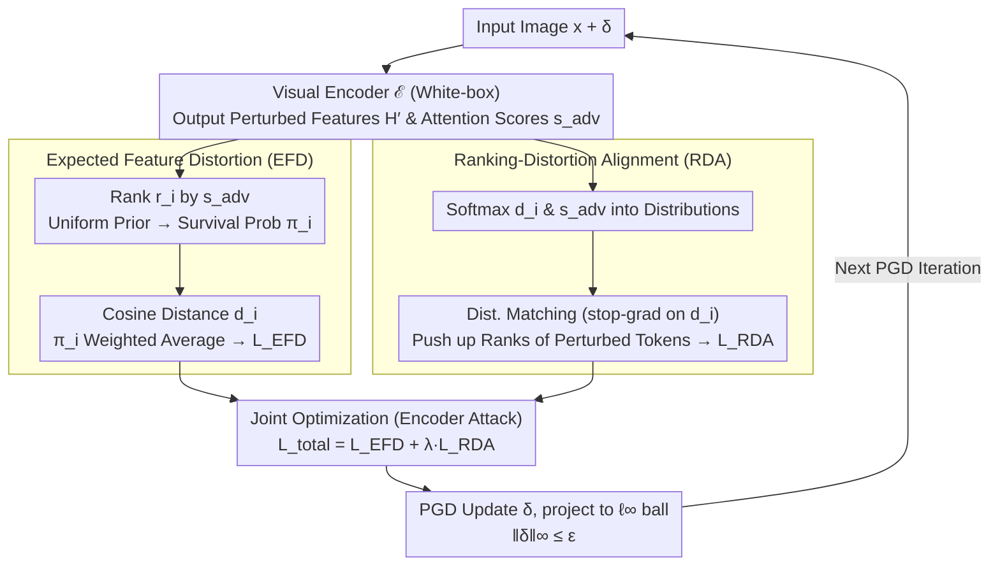

# On the Adversarial Robustness of Large Vision-Language Models under Visual Token Compression

**Conference**: ICML 2026  
**arXiv**: [2601.21531](https://arxiv.org/abs/2601.21531)  
**Code**: https://github.com/XinweiZhang1998/CAGE (Yes)  
**Area**: Multimodal VLM / AI Safety / Adversarial Robustness  
**Keywords**: Visual Token Compression, Adversarial Attack, Robustness Evaluation, LVLM, Encoder Attack

## TL;DR
This paper presents the first systematic study of the adversarial robustness of Large Vision-Language Models (LVLMs) under visual token compression. It identifies an "optimization-inference space mismatch" in existing encoder attacks and proposes the CAGE attack. By utilizing Expected Feature Distortion (EFD) and Ranking-Distortion Alignment (RDA), CAGE significantly reduces the robust accuracy of compressed LVLMs under conditions where the compression mechanism and token budget are unknown.

## Background & Motivation

**Background**: Mainstream LVLMs like LLaVA-NeXT and InternVL process hundreds to thousands of visual tokens per image, leading to high deployment costs. Consequently, "plug-and-play" visual token compression methods—such as VisionZip, VisPruner, DivPrune, FlowCut, and PruMerge—have become deployment standards. These methods typically select the Top-K most informative tokens based on attention scores and optionally merge secondary tokens, reducing the visual sequence length from $N=576$ to $K \ll N$ to achieve significant speedups with minimal performance loss.

**Limitations of Prior Work**: As compressed LVLMs are increasingly deployed in safety-critical scenarios like autonomous driving and robotics, their adversarial robustness after compression has remained largely unassessed. Existing evaluations generally reuse encoder attacks (e.g., VEAttack), optimizing perturbations in the full $N$-token representation space and then applying them to the compressed model, which results in potentially distorted evaluations.

**Key Challenge**: Perturbations are optimized for the "full-token representation," but inference only utilizes the "compressed representation." This leads to two specific failure paths: (i) **Budget Dilution**: A significant portion of the optimization signal is allocated to tokens that are pruned and do not participate in inference; (ii) **Dependency Fracture**: Pruning removes context/background tokens, disrupting the cross-token interactions that the attack originally relied on during global optimization. Combined, these factors cause a significant overestimation of robust accuracy.

**Goal**: (1) Establish the robustness of compressed LVLMs as an independent research problem; (2) Design an attack that aligns with the compression bottleneck under grey-box conditions where the deployment budget $K_{\text{model}}$ and specific mechanism $\mathcal{C}$ are unknown.

**Key Insight**: The authors observe two complementary phenomena: ① After sorting tokens by attention, the cosine shift of perturbed features monotonically decreases as $K$ increases—indicating that perturbations naturally concentrate on high-importance tokens that tend to "survive" compression; ② Attacks are strongest when $K_{\text{attack}} = K_{\text{model}}$ (e.g., under a 16-token deployment, the robustness of a full-token attack is 49.7%, which drops to 44.4% when aligned to 16 tokens).

**Core Idea**: Instead of distributing perturbations across all tokens, use a probabilistic framework to concentrate perturbation energy on tokens that "survive across various potential budgets," while actively pushing the attention scores of these tokens higher to ensure they are selected.

## Method

### Overall Architecture
CAGE maintains the grey-box premise of encoder attacks (white-box access to the visual encoder $\mathcal{E}$, black-box access to the compression module $\mathcal{C}$ and LLM $\mathcal{F}$, with $K_{\text{model}}$ unknown). A single PGD iteration of the optimization pipeline is as follows: (1) Input image $\mathbf{x}+\boldsymbol{\delta}$ passes through the encoder to obtain perturbed features $\mathbf{H}'$ and perturbed attention scores $s_i^{\mathrm{adv}}$; (2) Survival probabilities $\pi_i$ for each token are calculated based on the rank $r_i$ derived from $s_i^{\mathrm{adv}}$ and a prior distribution $P(K_{\text{model}})$; (3) The EFD loss is calculated as the $\pi_i$-weighted cosine distance $d_i$; (4) The RDA objective maximizes the alignment by treating $d_i$ and $s_i^{\mathrm{adv}}$ as distributions via softmax; (5) Joint backpropagation updates $\boldsymbol{\delta}$, projected onto the $\ell_\infty$ ball $\|\boldsymbol{\delta}\|_\infty \le \epsilon$. The target is always the encoder, independent of text prompts or knowledge of $K_{\text{model}}$ and $\mathcal{C}$.

### Key Designs

**1. Expected Feature Distortion (EFD): Concentrating Perturbation Energy on Tokens that Survive Across Budgets**

The root of budget dilution and dependency fracture is that the attacker does not know which tokens the deployment will retain. EFD addresses this by treating the deployment budget $K_{\text{model}}$ as an unknown discrete random variable with a uniform prior $K_{\text{model}} \sim \mathcal{U}[K_{\min}, K_{\max}]$. The survival probability of token $i$ is defined as $\pi_i = P(K_{\text{model}} > r_i)$, acting as a soft mask that decays with rank. The loss is then the weighted average perturbation: $\mathcal{L}_{\text{EFD}} = \sum_i \pi_i d_i / \sum_i \pi_i$. Using $\pi_i$ integrated across budgets is more effective than directly using $s_i$ because it avoids the gradient sparsity caused by the sharp softmax of attention scores, ensuring mid-range tokens also receive optimization signals.

**2. Ranking-Distortion Alignment (RDA): Explicitly Recovering the Buried Gradient Path**

Concentrating perturbations is insufficient if heavily perturbed tokens are not ranked high enough to enter the LLM input. Theoretically, the gradient of $\mathcal{L}_{\text{EFD}}$ consists of "increasing perturbation on selected tokens" and "pushing high-perturbation tokens up the rank." However, the latter term is often pathological or sparse due to the piece-wise constant nature of Top-K selection. RDA compensates for this via differentiable distribution matching: it treats $d_i$ and $s_i^{\mathrm{adv}}$ as probability distributions $p_i^{(d)}$ and $p_i^{(s)}$ via softmax and maximizes $\mathcal{L}_{\text{RDA}} = \sum_i p_i^{(d)} \log p_i^{(s)}$. By applying a stop-gradient to $p^{(d)}$, high-perturbation tokens are actively pushed to the front of the attention ranking.

**3. Joint Optimization and Encoder Attack: Targeting the Top-K Interface**

The objectives are combined as $\mathcal{L}_{\text{total}} = \mathcal{L}_{\text{EFD}} + \lambda \cdot \mathcal{L}_{\text{RDA}}$ under the constraint $\|\boldsymbol{\delta}\|_\infty \le \epsilon$. EFD manages the "payload" (how much perturbation is in the set), while RDA manages the "delivery" (who is in the set). This approach decouples the attack from specific compression mechanisms because almost all mainstream methods rely on Top-K selection as their first step, making it a unified interface for attack.

### Loss & Training
The attack remains an encoder attack (no text or LLM forward pass required), using PGD iterations with $\ell_\infty$ projection. Survival probabilities $\pi_i$ are recalculated at each step. $\lambda$ and $\epsilon$ are the primary hyperparameters. The uniform prior $[K_{\min}, K_{\max}]$ allows for coverage across a reasonable range of deployment budgets without prior knowledge.

## Key Experimental Results

### Main Results
Evaluation was conducted on LLaVA using 5 representative compression methods across 3 datasets. The table below compares the average robust accuracy at $K_{\text{model}}=192$ (lower values indicate stronger attacks).

| Dataset | Clean | Robust (Base Attack) | Robust (CAGE) | Robust Gain |
|---------|-------|----------------------|---------------|-------------|
| GQA | 56.1 | 40.8 | 36.2 | ↓11.3% |
| TextVQA | 56.7 | 33.5 | 23.4 | ↓30.1% |
| VQA-v2 | 73.4 | 55.4 | 47.2 | ↓14.8% |
| Upper Bound (576 Tokens, No Comp.) | 60.3 / 57.5 / 74.5 | 42.3 / 34.7 / 55.8 | 39.4 / 26.5 / 49.4 | ↓6.9 / 23.6 / 11.4% |

**Key Observations**: (1) CAGE consistently outperforms the baseline across all compression methods, particularly on TextVQA, which suggests that OCR-VQA tasks are more sensitive to token loss and localized perturbations; (2) Even in the "no compression" setting, CAGE is superior, proving that the EFD/RDA mechanism is a fundamentally stronger encoder attack.

### Ablation Study

| Configuration | Robust Accuracy at $K_{\text{model}}=16$ (%, ↓) | Conclusion |
|---------------|-------------------------------------------------|------------|
| $K_{\text{attack}}=576$ (Full-token, VEAttack) | 49.7 | Mismatch yields weak results |
| $K_{\text{attack}}=192$ | 45.3 | Strengthening via partial alignment |
| $K_{\text{attack}}=64$ | 44.7 | Further alignment |
| $K_{\text{attack}}=16$ (Perfect Alignment) | 44.4 | Strongest, but requires $K_{\text{model}}$ |
| CAGE (EFD only) | Between the above | Concentration alone is insufficient |
| CAGE (EFD + RDA, Full) | Outperforms fixed $K_{\text{attack}}$ across budgets | Robust across budgets |

### Key Findings
- **Compression "Retains" Heavily Perturbed Tokens**: The cosine shift under attention ranking decreases monotonically with $K$, indicating that perturbations naturally target Top-K tokens. Thus, compression provides no "automatic immunity" and may even preserve the "noisiest" evidence.
- **Budget Alignment Effect**: For a fixed attack budget, the strongest attack occurs when it aligns with the deployment budget $K_{\text{model}}$, explaining why traditional full-token attacks overestimate robustness.
- **Defense Exploration**: Initial attempts at defense show some mitigation but are insufficient to close the security gap, highlighting the need for compression-aware defenses.

## Highlights & Insights
- **Compression as an Attack Surface**: Re-characterizes an architectural acceleration trick as a security vulnerability. The method is clean, requiring only a prior and a KL-style alignment term.
- **Probabilistic unknown budgets**: Using a uniform prior to integrate out $K_{\text{model}}$ allows the attack to function without guessing the exact deployment config, which is highly practical for grey-box environments.
- **Gradient-driven RDA**: Identifies why the distribution-shifting term fails due to discrete Top-K selection and recovers it through differentiable matching—a methodology applicable to any module with Top-K operations.

## Limitations & Future Work
- The study is limited to LLaVA and 5 plug-and-play methods, excluding training-time compression (e.g., Token Merging), cross-modal compression, or multi-image agent settings.
- As an encoder attack, it does not compare against the upper bound of end-to-end LLM backpropagation and cannot leverage task-specific textual clues.
- Defenses are preliminary; future work should explore "compression-aware" defenses such as randomized budgets, attention reshuffling, or robust training for compression.

## Related Work & Insights
- **vs VEAttack (Mei et al., 2026)**: VEAttack maximizes cosine shift on full tokens; this work shows that such an approach systematically underestimates attack strength on compressed models.
- **vs Encoder Attacks (Cui et al., 2024; Wang et al., 2024c)**: While using a similar grey-box premise, CAGE explicitly models the "inference-time compression bottleneck."
- **vs Compression Methods**: Most methods focus on the "performance-efficiency" trade-off; this paper reveals that more aggressive compression leads to more severe distortion in robustness evaluation.

## Rating
- Novelty: ⭐⭐⭐⭐⭐ First to systematically reveal the mismatch between token compression and robustness evaluation.
- Experimental Thoroughness: ⭐⭐⭐⭐ Covers various methods and datasets, though limited to a single LVLM backbone.
- Writing Quality: ⭐⭐⭐⭐ Clear motivation and solid gradient-based derivation.
- Value: ⭐⭐⭐⭐⭐ Strongly indicates that industrial LVLM deployments must reconsider security evaluations.

<!-- RELATED:START -->

## Related Papers

- [\[AAAI 2026\] Rethinking Visual Token Reduction in LVLMs under Cross-Modal Misalignment](../../AAAI2026/vlm_efficiency/rethinking_visual_token_reduction_in_lvlms_under_cross-modal_misalignment.md)
- [\[CVPR 2026\] Hybrid Token Compression for Vision-Language Models](../../CVPR2026/vlm_efficiency/hybrid_token_compression_for_vision-language_models.md)
- [\[CVPR 2026\] EvoComp: Learning Visual Token Compression for Multimodal Large Language Models via Semantic-Guided Evolutionary Labeling](../../CVPR2026/vlm_efficiency/evocomp_learning_visual_token_compression_for_multimodal_large_language_models_v.md)
- [\[ECCV 2024\] IVTP: Instruction-Guided Visual Token Pruning for Large Vision-Language Models](../../ECCV2024/vlm_efficiency/ivtp_instruction-guided_visual_token_pruning_for_large_vision-language_models.md)
- [\[CVPR 2026\] Accelerating Streaming Video Large Language Models via Hierarchical Token Compression](../../CVPR2026/vlm_efficiency/accelerating_streaming_video_large_language_models_via_hierarchical_token_compre.md)

<!-- RELATED:END -->
