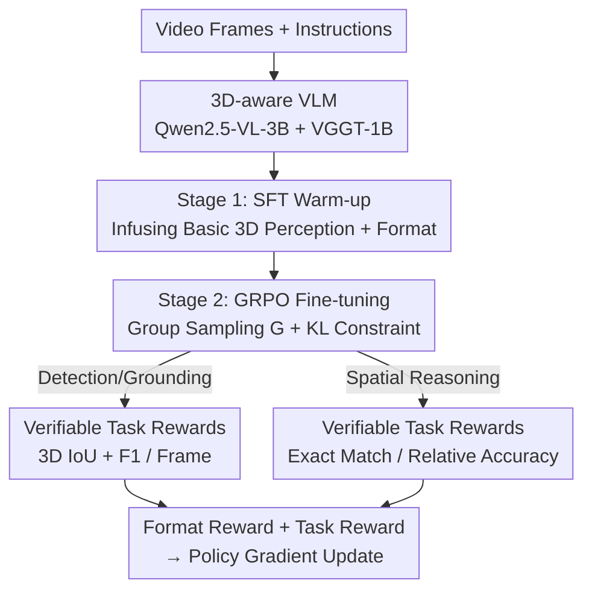

# 3D-RFT: Reinforcement Fine-Tuning for Video-based 3D Scene Understanding

**Conference**: ICML 2026  
**arXiv**: [2603.04976](https://arxiv.org/abs/2603.04976)  
**Code**: See project page (Paper states "Code is available on project page")  
**Area**: Multimodal VLM / 3D Vision / Reinforcement Learning  
**Keywords**: RLVR, GRPO, Verifiable Reward, Video 3D Perception, Spatial Reasoning

## TL;DR
This work adapts the LLM-oriented "Reinforcement Learning with Verifiable Rewards (RLVR)" to video-driven 3D scene understanding. By using GRPO to fine-tune a 4B 3D-aware VLM directly with evaluation metrics (such as 3D IoU, F1, and accuracy) as rewards, the training objectives are aligned with evaluation criteria. Consequently, the 4B model outperforms an 8B baseline on 3D video detection, 3D visual grounding, and spatial reasoning tasks.

## Background & Motivation

**Background**: Treating 3D scenes as RGB video streams for Multimodal Large Language Models (MLLMs) is becoming a mainstream approach—accomplishing detection, grounding, and spatial Q&A using standard cameras and the temporal capabilities of MLLMs without specialized sensors like LiDAR or depth cameras. Representative work such as VG LLM has verified that "pure video input can perform cross-frame detection and 3D visual grounding."

**Limitations of Prior Work**: These methods almost exclusively rely on Supervised Fine-Tuning (SFT). In 3D perception tasks, the model outputs 3D bounding boxes as strings of text-formatted floating-point numbers, and SFT fits these using per-token Cross-Entropy (CE) loss. The problem is: **optimization occurs in a discrete token space, while evaluation occurs in a continuous 3D coordinate system**. Output tokens must be decoded and parsed into geometric structures before calculating metrics like 3D IoU—CE loss is merely an "indirect proxy" for evaluation and cannot characterize the true geometric quality of predictions. Even if token-level fitting is accurate, 3D IoU may be poor.

**Key Challenge**: Why not use 3D IoU directly as a loss function? Because the evaluation pipeline is **non-differentiable**: converting text to 3D boxes requires discrete string parsing, and IoU contains step-wise judgments (e.g., $\text{IoU} > 0.25$). Directly feeding these into backpropagation would generate zero or undefined gradients, causing training to fail. Thus, a natural barrier exists between "metric-driven supervision signals" and "differentiable SFT."

**Goal**: To enable the model to **optimize directly toward evaluation metrics** for 3D perception (detection, grounding) and 3D spatial reasoning without requiring a differentiable evaluation pipeline.

**Key Insight**: RLVR does not require a differentiable loss—it only needs a **deterministic verifier** to provide a scalar reward for the output. Models like GPT-o1 and DeepSeek-R1 have proven that RLVR can break the SFT ceiling in mathematics and code reasoning. The authors' hypothesis is that 3D evaluation metrics (IoU, F1, accuracy) are natural verifiable rewards that bridge this gap.

**Core Idea**: Replace "token fitting" with "metrics as rewards"—wrapping 3D IoU / F1 / accuracy into verifiable rewards that strictly follow evaluation protocols. GRPO is used for reinforcement fine-tuning, shifting the learning paradigm from "sequence imitation" to "metric-driven policy optimization."

## Method

### Overall Architecture
3D-RFT addresses the misalignment between training objectives and evaluation metrics via a **two-stage pipeline**: first, SFT is used to "warm up" the model with basic 3D perception capabilities and output formats for a 3D-aware VLM; then, GRPO with verifiable rewards is applied for reinforcement fine-tuning to push the model toward evaluation metrics.

The 3D-RFT-4B model is built upon VG LLM-4B: the MLLM backbone is Qwen2.5-VL-3B-Instruct, and the geometric backbone is VGGT-1B. Geometric features extracted by VGGT are aligned with Qwen visual features and added element-wise to form a hybrid visual representation for the LLM. All tasks use a unified output format: a reasoning chain is written within `<think>...</think>`, followed by the final prediction in `<answer>...</answer>` (in perception tasks, the 3D box is a 9-DoF tuple $b=(x,y,z,w,h,d,\psi,\theta,\phi)$ normalized to the first-frame coordinate system).

### Key Designs

**1. Two-stage Training: SFT Warm-up followed by GRPO Reinforcement**

Off-the-shelf MLLMs lack native 3D perception capabilities; starting RL directly would fail to sample effective reward signals due to a poor initial strategy. The first stage uses SFT to maximize the log-likelihood of ground-truth sequences $\mathcal{L}_{\text{SFT}}(\theta) = -\sum_{t=1}^{T}\log\pi_\theta(y^*_t \mid x, I, y^*_{<t})$ to instill basic 3D scene understanding and the `<think>/<answer>` format. Only in the second stage is GRPO used for metric-driven refinement. Ablations reveal this warm-up is essential: replacing the second stage with continued SFT (SFT→SFT) only increases ScanRefer Acc@0.25 from 31.9 to 34.2, whereas SFT→RL reaches 38.2, indicating gains come from RL rather than extended training.

**2. GRPO + KL Constraint: Intra-group Relative Optimization without a Critic**

3D output sequences are long and video contexts consume significant VRAM; traditional PPO requires an additional critic network, which is costly. GRPO is a memory-efficient PPO variant that samples a group of $G$ outputs $\{y_1,\dots,y_G\}$ for each input $(I, x)$ and uses **intra-group statistics** as the baseline to calculate advantage: $A_i = \frac{R_i - \text{mean}(\{R_1,\dots,R_G\})}{\text{std}(\{R_1,\dots,R_G\})}$. This eliminates the value network. The objective maximizes expected advantage while pulling the policy toward the reference model $\pi_{\text{ref}}$ using KL divergence:

$$\mathcal{L}_{\text{GRPO}}(\theta) = -\frac{1}{\sum_i T_i}\sum_{i=1}^{G}\sum_{t=1}^{T_i}\min\!\big(r_{i,t}A_i,\ \text{clip}(r_{i,t},1-\epsilon,1+\epsilon)A_i\big) + \beta\,\mathbb{D}_{\text{KL}}[\pi_\theta \| \pi_{\text{ref}}]$$

where $r_{i,t}$ is the token probability ratio between new and old policies. Loss chunking is also employed to further reduce VRAM for long video contexts.

**3. Task-Specific Verifiable Rewards: Direct Mapping to Metrics**

The core of this method is that rewards are not manually tuned proxies, but are calculated by **strictly following evaluation protocols**. Reward = Format Reward (JSON syntax, box tuple validity, $R_{\text{Format}}\in\{0,1\}$) + Task Reward, designed for three task categories:

- **3D Video Detection**: Mean IoU reward $R_{\text{IoU}}^{(\text{Det})}=\frac{1}{N}\sum_{i=1}^{N}\mathcal{I}_i$ provides dense signals; F1 reward $R_{\text{F1}}=\frac{2\cdot\text{TP}}{2\cdot\text{TP}+\text{FP}+\text{FN}}$ (TP if IoU with an unmatched GT box exceeds $\tau_{F1}=0.25$) aligns with final metrics. Total: $R_{\text{Det}}=R_{\text{IoU}}^{(\text{Det})}+R_{\text{F1}}$.
- **3D Visual Grounding**: Requires spatiotemporal precision. Temporally, a smooth linear decay $R_{\text{frame}}=\max\!\big(0, 1-\frac{|f_{\text{pred}}-f_{\text{gt}}|}{\tau_{\text{frame}}}\big)$ ($\tau_{\text{frame}}=5$) provides a dense signal for frame indices; spatially, predicted boxes are projected to global coordinates $b'_{\text{pred}}=M_{\text{align}}M^{(f_{\text{pred}})}_{c\to g}b_{\text{pred}}$ to calculate global 3D IoU $R_{\text{IoU}}^{(\text{Grd})}$. Total: $R_{\text{Grd}}=R_{\text{frame}}+R_{\text{IoU}}^{(\text{Grd})}$.
- **3D Spatial Reasoning**: Multi-choice uses exact match $R_{\text{MC}}=\mathbb{1}(y=y^*)$; numerical questions (e.g., counting) use average relative accuracy $R_{\text{num}}=\frac{1}{10}\sum_{\tau\in\mathcal{C}}\mathbb{1}\!\big(\frac{|y-y^*|}{|y^*|}<1-\tau\big)$, where $\mathcal{C}=\{0.50,0.55,\dots,0.95\}$.

The significance lies in the "reward = metric" alignment—bypassing the non-differentiable wall and eliminating the SFT misalignment where "token fitting is precise but IoU is poor."

### Loss & Training
Two stages: Stage 1 minimizes SFT log-likelihood $\mathcal{L}_{\text{SFT}}$; Stage 2 minimizes the GRPO objective $\mathcal{L}_{\text{GRPO}}$ (including KL penalty with coefficient $\beta$). Perception SFT uses ScanRefer / Scan2Cap / ScanNetDetection; RFT uses ScanNetDetection (Detection) and ScanRefer (Grounding). Spatial reasoning SFT uses a mix of VSI-298K (DA) + CoT-10K (TA); RFT uses VSI-298K under the "Thought-Augmented (TA)" setting.

## Key Experimental Results

### Main Results
3D-RFT-4B shows comprehensive improvements across all tasks and outperforms the 8B VG LLM with only 4B parameters. The following table summarizes representative comparisons (ScanNetDetection uses 4-frame setting; ScanRefer parentheses indicate proposal refinement):

| Task / Dataset | Metric | SFT Baseline (VG LLM-4B) | 3D-RFT-4B | VG LLM-8B | Gain (vs SFT) |
|--------------|------|----------------------|-----------|-----------|--------------|
| 3D Detection / ScanNetDetection | F1@0.25 | 38.2 | 43.7 | 41.2 | +5.5 |
| 3D Detection / ScanNetDetection | Precision@0.25 | 41.7 | 54.2 | 43.4 | +12.5 |
| 3D Detection / ScanNetDetection | Recall@0.25 | 35.7 | 38.2 | 39.6 | +2.5 |
| 3D Grounding / ScanRefer | Acc@0.25 | 36.4 | 42.9 | 41.6 | +6.5 |
| 3D Grounding / ScanRefer | Acc@0.5 | 11.8 | 15.9 | 14.9 | +4.1 |
| Spatial Reasoning / VSI-Bench | Avg | 47.3 | 62.8 | — | +15.5 |

On VSI-Bench, 3D-RFT-4B achieves an average of 62.8, reaching SOTA by surpassing VLM-3R (60.9, 7B) and VST-RL (57.7, 3B), with significant leads in numerical reasoning (e.g., counting 71.2, absolute distance 53.5). In detection, gains are largest for large objects (e.g., bathtub +16.5, table +6.9), while gains for small objects like "trash can" are limited, likely due to visual resolution.

### Ablation Study

| Training Strategy | 3D Prior | ScanRefer Acc@0.25 | ScanRefer Acc@0.5 |
|----------|---------|--------------------|--------------------|
| SFT | None | 31.9 | 9.3 |
| SFT → SFT | None | 34.2 | 10.4 |
| SFT → RL | None | 38.2 | 12.1 |
| SFT | VGGT | 36.4 | 11.8 |
| SFT → RL | VGGT | 42.9 | 15.9 |

### Key Findings
- **Gains Stem from RL, Not Data Repetition**: SFT→SFT only reaches 34.2, while SFT→RL reaches 38.2, proving that metric-driven optimization is the driver, not multiple data passes.
- **Robust to Visual Input**: RFT consistently improves performance regardless of the VGGT geometric prior (31.9→38.2 without prior, 36.4→42.9 with prior).
- **RFT Foundations Rely on DA+TA Data**: Using both "Direct Answer (DA)" and "Thought-Augmented (TA/CoT)" data during SFT yields the highest RFT accuracy and rewards; low-quality CoT degrades performance.
- **RFT Generalization**: Performing RFT on TA tasks also improves DA task performance, whereas continued SFT often results in slight performance declines.

## Highlights & Insights
- **"Reward = Metric" is the Cleanest Alignment Logic**: It identifies the fundamental weakness of SFT in structured geometric output—the misalignment between token space and coordinate space. Treating the non-differentiable evaluation pipeline as a verifiable reward effectively uses the whole evaluation process as a supervision signal.
- **4B Outperforming 8B is Compelling**: Under the same backbone, switching only the learning paradigm (SFT→RFT) allows a model with half the parameters to outperform an 8B SFT baseline, strongly suggesting that the optimization objective is more valuable than parameter count.
- **Transferable Verifiable Reward Template**: The formula of "Format Reward + Dense Task Reward (continuous) + Thresholded Metric Reward (F1/Acc)" can be applied to other structured output tasks like layout generation or trajectory prediction.
- **Pairing Dense and Sparse Rewards**: Using both mean IoU (dense, continuous) and F1 (sparse, thresholded) in detection ensures that geometric precision has gradient guidance while explicitly anchoring the final performance metrics.

## Limitations & Future Work
- **Small Objects Remain a Weakness**: Detection gains for small objects are limited, attributed by the authors to insufficient visual resolution, meaning this paradigm does not solve fundamental perception bottlenecks.
- **Dependence on SFT Warm-up and High-quality CoT**: The ceiling of RFT is significantly limited by the SFT starting point and CoT quality; low-quality CoT can ruin training, implying high data construction costs.
- **Task-Specific Reward Engineering**: Each task category requires manual alignment of verifiers and thresholds ($\tau_{F1}=0.25, \tau_{\text{frame}}=5$), requiring redesign for new tasks.
- **Unaddressed Reward Hacking**: Using metrics as rewards may lead the model to exploit metrics (e.g., sacrificing recall for higher precision); the paper provides minimal discussion on such phenomena.

## Related Work & Insights
- **vs. VG LLM (SFT Baseline)**: Uses the same Qwen2.5-VL-3B + VGGT backbone. VG LLM fits tokens with SFT; this work switches to GRPO + metric rewards, surpassing the 8B version with 4B parameters by changing the objective from "sequence likelihood" to "evaluation metrics."
- **vs. Math/Code RLVR (GPT-o1, DeepSeek-R1)**: While they validated RLVR on text-based verifiable tasks, this work systematically extends it to multimodal tasks like video 3D perception and spatial reasoning involving geometric decoding.
- **vs. VST (Concurrent Work)**: VST also uses RLVR for general video spatial models, but this work provides a more systematic study across 3D perception, spatiotemporal grounding, and spatial reasoning, along with multi-dimensional analysis of objectives and training dynamics.

## Rating
- Novelty: ⭐⭐⭐⭐ It does not invent a new algorithm, but systematically bringing RLVR to video 3D understanding with rewards strictly aligned to metrics is a precise and effective application.
- Experimental Thoroughness: ⭐⭐⭐⭐⭐ Covers three task categories with complete main results, ablations, and training dynamics. The 4B vs. 8B comparison is very persuasive.
- Writing Quality: ⭐⭐⭐⭐ Motivation (token vs. coordinate space misalignment) is clearly explained with complete reward formulas.
- Value: ⭐⭐⭐⭐ Provides a reusable RFT paradigm for 3D scene understanding; the reward "recipe" has transfer value for other structured output tasks.

<!-- RELATED:START -->

- **VG LLM**: Video-grounded Large Language Model for 3D Scene Understanding.
- **VST**: Video Spatial Transformer for 3D Video Perception.
- **DeepSeek-V3/R1**: For advancements in GRPO and RLVR architectures.

<!-- RELATED:END -->

## Related Papers

- [\[ACL 2026\] CAPruner: Conceptual-Adjacent Scene Graph Pruner for Enhancing 3D Spatial Reasoning of Large Language Models](../../ACL2026/vlm_reasoning/capruner_conceptual-adjacent_scene_graph_pruner_for_enhancing_3d_spatial_reasoni.md)
- [\[ICML 2026\] R$^3$L: Reasoning 3D Layouts from Relative Spatial Relations](r3l_reasoning_3d_layouts_from_relative_spatial_relations.md)
- [\[NeurIPS 2025\] To Think or Not To Think: A Study of Explicit Thinking in Rule-Based Visual Reinforcement Fine-Tuning](../../NeurIPS2025/vlm_reasoning/think_or_not_think_a_study_of_explicit_thinking_in_rule-based_visual_reinforceme.md)
- [\[NeurIPS 2025\] AffordBot: 3D Fine-grained Embodied Reasoning via Multimodal Large Language Models](../../NeurIPS2025/vlm_reasoning/affordbot_3d_fine-grained_embodied_reasoning_via_multimodal_large_language_model.md)
- [\[CVPR 2026\] Beyond 3D VQAs: Injecting 3D Spatial Priors into Vision-Language Models for Enhanced Geometric Reasoning](../../CVPR2026/vlm_reasoning/beyond_3d_vqas_injecting_3d_spatial_priors_into_vision-language_models_for_enhan.md)

<!-- RELATED:END -->
