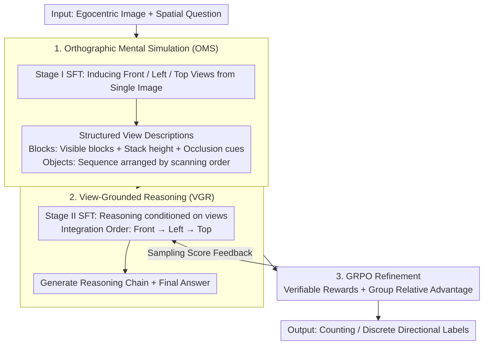

# 3ViewSense: Spatial and Mental Perspective Reasoning from Orthographic Views in Vision-Language Models

**Conference**: ICML 2026  
**arXiv**: [2603.07751](https://arxiv.org/abs/2603.07751)  
**Code**: https://github.com/Jasaxion/3ViewSense  
**Area**: Multi-modal VLM / Spatial Reasoning  
**Keywords**: Orthographic views, Spatial reasoning, Mental simulation, VLM, GRPO

## TL;DR
3ViewSense argues that the bottleneck of VLM spatial reasoning is not insufficient visual features or weak linguistic reasoning, but the lack of a stable 3D intermediate representation. Consequently, it requires the model to first induce front, left, and top views from a single image before reasoning based on these orthographic views, significantly outperforming same-scale VLMs in occlusion counting and view-consistent spatial reasoning.

## Background & Motivation
**Background**: Large vision-language models can handle complex visual QA, symbolic logic, and multi-step reasoning, yet remain fragile in spatial understanding. A typical example is block stacking counting: while human children can count by imagining occluded parts, VLMs often struggle and guess repeatedly under occlusion, perspective, and depth ambiguity.

**Limitations of Prior Work**: The paper conducts two diagnostics. First, training a lightweight MLP probe after freezing VLM visual features achieves 55.8% block counting accuracy, indicating the image encoder retains substantial geometric information. Second, providing textual descriptions of the front/left/top orthographic views directly to models like Gemini-3-pro significantly boosts spatial reasoning. This suggests the issue is not just "not seeing" or "not being able to reason," but that visual features are not organized into a spatial structure usable by the reasoner.

**Key Challenge**: A single egocentric image collapses 3D structures into 2D projections, naturally introducing occlusion and depth ambiguity. When end-to-end VLMs directly model $P(a \mid I_{ego}, q)$, they must simultaneously perform 3D completion, perspective transformation, and answer reasoning in the latent space; if the intermediate state is unstable, the subsequent linguistic reasoning suffers from drift and hallucinations.

**Goal**: The authors aim to explicitize the process of "recovering reason-able 3D mental representations from 2D images" by having the model generate a set of canonical orthographic views first, then answer counting, position, and attribute questions based on these views.

**Key Insight**: Engineering drawings use orthographic projections to decompose 3D objects into front, left, and top views, thereby reducing perspective-induced ambiguity. The paper transfers this idea to VLMs, using orthographic views as an interface between egocentric perception and allocentric spatial reasoning.

**Core Idea**: Replace the single-stage black-box image QA with a "Simulate-and-Reason" pipeline that first simulates three views and then reasons based on them.

## Method
The key to 3ViewSense is not the introduction of additional 3D sensors, but the decomposition of the VLM internal reasoning into two supervisable capabilities: Orthographic Mental Simulation (OMS) converts single-view images into structured orthographic views, and View-Grounded Reasoning (VGR) integrates these views with the original question into an answer. Formally, the answer distribution is formulated as a two-stage process via latent orthographic views $\mathcal{V}=\{v_{front}, v_{left}, v_{top}\}$: first estimate $\hat{\mathcal{V}}=\arg\max_{\mathcal{V}}P_{\theta_{sim}}(\mathcal{V}\mid I_{ego},q)$, then output the answer with $P_{\theta_{reason}}(a\mid \hat{\mathcal{V}},I_{ego},q)$.

### Overall Architecture
The input is a single egocentric image and a spatial question, and the output is a count or discrete directional label. The pipeline is "Simulate-and-Reason": first, OMS induces three orthographic views, and then VGR integrates these views to generate the answer. Training follows three steps: Stage I SFT on procedural OrthoMind-3D data to learn structured view generation; Stage II SFT to generate reasoning chains based on views; and finally, reinforcement learning from the Stage II model using GRPO with verifiable rewards to improve accuracy and stability.

### Key Designs
**1. Orthographic Mental Simulation (OMS): Reducing 3D completion to planar recognition.** This step addresses the primary pain point: egocentric images collapse 3D structures into 2D, causing inherent depth ambiguity. OMS requires the model to induce structured descriptions of three orthographic views. For block counting, each view encodes visible blocks, stacking height, and occlusion cues; for object reasoning, views are sequences of objects in scanning order (e.g., left-to-right). Stage I uses ~19.5k annotated samples for maximum likelihood training. This essentially transforms implicit 3D completion into a 2D planar problem akin to symbolic pattern recognition, minimizing the "depth guessing" space for subsequent reasoning.

**2. View-Grounded Reasoning (VGR): Supervising reasoning processes rather than labels.** While orthographic views provide structural priors, tasks like occlusion counting still require integrating multiple projections into a consistent 3D mental model. Stage II forces the model to explicitly read the induced views and generate reasoning trajectories following a fixed "Front → Left → Top" order. Key findings show that supervision of the reasoning process, rather than "Direct QA" (which only supervises labels), is what allows "multi-view integration" to settle as a transferable capability.

**3. GRPO Refinement and Verifiable Rewards: Stability optimization atop VGR warm start.** To further improve accuracy and mitigate generalization decay, reinforcement learning is performed starting from the Stage II model. For each question, a group of responses is sampled and scored using verifiable rewards (integer counts or discrete labels), optimized with a clipped GRPO objective and group-normalized advantage $\hat{A}_i=(R_i-\mu_R)/(\sigma_R+\delta)$. Starting from a VGR-SFT checkpoint is critical, as starting directly from OMS-SFT leads to high-variance reward oscillation.

### Loss & Training
Stage I and Stage II use standard sequence maximum likelihood training. The RL stage employs 30k instances (10k resampled from Stage II, 20k new). The base model is Qwen3-VL-4B-Instruct. Reward configurations include "strict" and "slack" modes, with the latter offering tolerance for counting errors.

## Key Experimental Results

### Main Results
Main experiments on OrthoMind-3D show that general VLMs are weak at occluded block counting, whereas 3ViewSense achieves high accuracy after GRPO.

| Model | Block Count | Block Count (Attr.) | Object Count | Object Position | Object Count (Attr.) | Object Position (Attr.) |
|------|-------------|---------------------|--------------|-----------------|----------------------|-------------------------|
| GPT-4o | 15.8 | 53.2 | 68.3 | 39.3 | 71.2 | 47.2 |
| Gemini-3-pro | 13.8 | 80.2 | 83.3 | 71.6 | 93.2 | 93.6 |
| SpaceOm-4B | 10.4 | 47.2 | 63.6 | 17.6 | 60.2 | 25.4 |
| Qwen3-VL-4B-Instruct | 6.2 | 43.4 | 59.0 | 41.0 | 74.8 | 45.6 |
| 3ViewSense-4B-SFT | 33.4 | 63.1 | 97.0 | 91.0 | 95.4 | 91.8 |
| 3ViewSense-4B-RL-strict | 95.0 | 88.2 | 98.7 | 93.3 | 97.4 | 93.2 |
| 3ViewSense-4B-RL-slack | 94.4 | 88.6 | 98.7 | 92.3 | 98.4 | 93.4 |

On OOD and external benchmarks, the gains are more modest but still demonstrate the transfer benefits of orthographic reasoning. Using Qwen3-VL-4B-Instruct as a baseline, RL-slack improves OOD Block Count from 21.2 to 38.7 and MindCube-Tiny from 27.2 to 38.9.

| Model | OOD Block Count | OOD Object Position | MindCube-Tiny | CV-Bench 2D | SPBench-SI | ViewSpatial |
|------|-----------------|--------------------|---------------|-------------|------------|-------------|
| Qwen3-VL-4B-Instruct | 21.2 | 46.7 | 27.2 | 77.9 | 22.2 | 35.5 |
| 3ViewSense-4B-SFT | 31.1 | 72.5 | 34.9 | 74.3 | 20.6 | 34.4 |
| 3ViewSense-4B-RL-strict | 33.2 | 74.3 | 36.7 | 78.1 | 23.2 | 36.6 |
| 3ViewSense-4B-RL-slack | 38.7 | 76.1 | 38.9 | 79.9 | 25.4 | 37.1 |

### Ablation Study
Ablations focus on proving that gains come from the "view-conditioned reasoning process" rather than just more data.

| Configuration | OrthoMind-3D ID | OrthoMind-3D OOD | SPBench-SI | ViewSpatial | Description |
|------|----------------|-----------------|------------|-------------|------|
| Direct QA | 80.3 | 49.8 | 1.3 | 7.2 | Same input/hyperparams, but only labels supervised |
| 3ViewSense Reasoning | 70.3 | 46.6 | 21.2 | 34.1 | Supervised view-conditioned reasoning chain |

Direct QA scores higher on in-distribution data, suggesting it fits the dataset better, but collapses on external benchmarks like SPBench-SI. 3ViewSense Reasoning maintains transferable spatial capabilities despite lower ID scores.

| Stage | OrthoMind-3D ID | OrthoMind-3D OOD | MindCube-Tiny | ViewSpatial | Description |
|-------|----------------|-----------------|---------------|-------------|------|
| OMS-SFT only | 48.7 | 41.3 | 29.6 | 33.4 | Only induces views; insufficient for queries |
| VGR-SFT only | 70.3 | 46.6 | 32.4 | 34.1 | Direct view-conditioned reasoning |
| OMS→VGR two-stage | 78.6 | 49.5 | 34.9 | 34.4 | Sequential induction and reasoning; most stable |

### Key Findings
- Attribute-conditioned counting is significantly easier than pure counting because distinctive attributes transform 3D enumeration into local retrieval.
- ICL cannot reliably teach orthographic reasoning; while strong closed-source models show limited improvement, most open-source models degrade.
- Base models produce verbose reasoning (>10k tokens) for block counting; 3ViewSense produces shorter, more stable outputs due to the view sketches.
- GRPO curves rise stably when initialized from Stage II VGR-SFT, whereas initialization from Stage I OMS-SFT leads to high variance.

## Highlights & Insights
- The paper's primary value is diagnosing VLM spatial failure: visual probes and explicit view prompting rule out the "cannot see" and "cannot reason" arguments, pinpointing the lack of an intermediate spatial interface.
- Orthographic projection is a simple yet effective inductive bias. It avoids heavy 3D modules while explicitly decoupling depth ambiguity in occlusion counting.
- The Direct QA ablation is insightful: higher ID answer accuracy does not equate to better spatial ability. Transferability lies in supervising intermediate representations and reasoning processes.

## Limitations & Future Work
- Three fixed orthographic views do not cover all spatial problems. Tasks involving mechanical support, affordance, or physical stability require richer representations than geometric projections.
- OMS relies on procedurally synthesized data; obtaining high-quality orthographic annotations for open-world images remains difficult.
- OOD gains are relatively modest, indicating data domain limitations. Future work could involve uncertainty estimation for view induction.
- The current approach increases reasoning chain length and training overhead, necessitating a trade-off between latency and spatial gains.

## Related Work & Insights
- **vs Spatial-MLLM / External 3D Encoders**: Unlike methods relying on extra visual modules or 3D features, 3ViewSense learns interpretable spatial representations within the language interface.
- **vs SpatialLadder / RL Self-Correction**: While curriculum learning optimizes strategies, 3ViewSense changes the reasoning object to view-consistent representations.
- **vs MindCube / Mental Imagery**: MindCube performs implicit 3D imagining, while 3ViewSense constrains this via canonical orthographic projections, making the process more checkable and supervisable.

## Rating
- Novelty: ⭐⭐⭐⭐⭐ Introducing engineering-style orthographic views to VLM spatial reasoning with diagnostic support is concise yet impactful.
- Experimental Thoroughness: ⭐⭐⭐⭐ Main experiments and ablations are comprehensive, though open-world task analysis is limited.
- Writing Quality: ⭐⭐⭐⭐⭐ The logic from diagnosis to method to ablation is very clear.
- Value: ⭐⭐⭐⭐⭐ Highly insightful for multimodal spatial reasoning, demonstrating that explicit intermediate representations outperform simple answer fitting.

<!-- RELATED:START -->

## Related Papers

- [\[ICML 2026\] Active Exploring like a Pigeon: Reinforcing Spatial Reasoning via Agentic Vision-Language Models](active_exploring_like_a_pigeon_reinforcing_spatial_reasoning_via_agentic_vision-.md)
- [\[ICCV 2025\] Perspective-Aware Reasoning in Vision-Language Models via Mental Imagery Simulation](../../ICCV2025/vlm_reasoning/perspective-aware_reasoning_in_vision-language_models_via_mental_imagery_simulat.md)
- [\[ICML 2026\] Learning GUI Grounding with Spatial Reasoning from Visual Feedback](learning_gui_grounding_with_spatial_reasoning_from_visual_feedback.md)
- [\[ICML 2026\] Bad Seeing or Bad Thinking? Rewarding Perception for Vision-Language Reasoning](bad_seeing_or_bad_thinking_rewarding_perception_for_vision-language_reasoning.md)
- [\[CVPR 2026\] Think with 3D: Geometric Imagination Grounded Spatial Reasoning from Limited Views](../../CVPR2026/vlm_reasoning/think_with_3d_geometric_imagination_grounded_spatial_reasoning_from_limited_view.md)

<!-- RELATED:END -->
