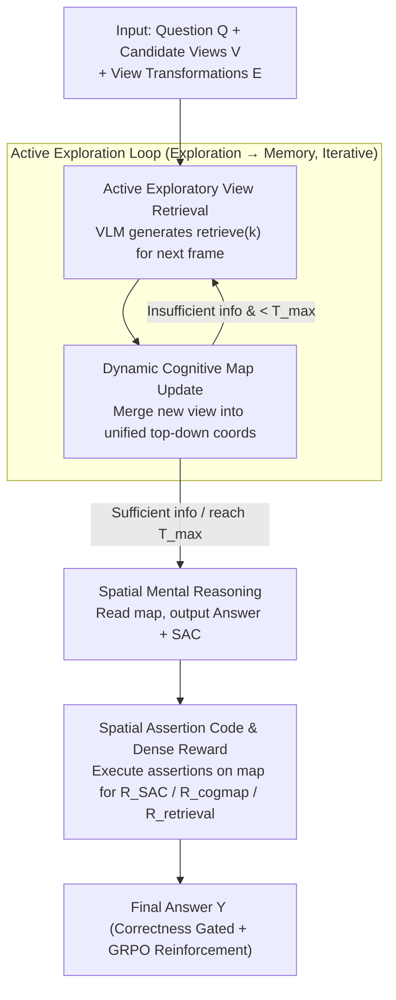

# Active Exploring like a Pigeon: Reinforcing Spatial Reasoning via Agentic Vision-Language Models

**Conference**: ICML 2026  
**arXiv**: [2606.02459](https://arxiv.org/abs/2606.02459)  
**Code**: https://github.com/dw-dengwei/active-spatial-reasoning.git  
**Area**: Multimodal VLM / Spatial Reasoning  
**Keywords**: Active Visual Exploration, Spatial Reasoning, Dynamic Cognitive Map, Spatial Assertion Code, GRPO  

## TL;DR
This work transforms VLM spatial reasoning from a "passive observation" approach into an agentic workflow that actively selects views based on questions, updates a cognitive map, and verifies reasoning using executable spatial assertions. By fine-tuning Qwen2.5-VL-3B with dense rewards, it achieves 80.5% overall accuracy on MindCube-Tiny, specifically improving the Rotation subset to 85.0%.

## Background & Motivation
**Background**: Multimodal VLMs can handle image-text understanding, VQA, and basic spatial relationship tasks. However, most methods still feed all images into the context at once, forcing the model to reason over static inputs. Spatial VLMs such as MindCube and 3DThinker have introduced cognitive maps or 3D reconstruction auxiliary tasks, but their perception remains largely passive.

**Limitations of Prior Work**: In real embodied scenarios, an agent rarely sees the complete environment simultaneously. It must select views based on the problem and assemble fragmented observations into a continuous spatial memory. Passive input of all views is not only costly but also risks the model getting lost in irrelevant visual information. Furthermore, existing RLVR/GRPO training typically relies on final answer correctness, providing rewards that are too sparse to identify exactly which spatial relationship went wrong.

**Key Challenge**: Spatial reasoning requires verifiable intermediate processes, but VLM natural language reasoning is open-ended text, making it difficult to judge whether each intermediate relationship is correct. Relying solely on final answer rewards may lead the model to learn superficial patterns; using an LLM judge may introduce hallucinations and overconfidence into the reward signal.

**Goal**: The authors aim to simultaneously solve three sub-problems: enabling the VLM to actively select relevant views, allowing multiple observations to form an updatable spatial memory, and making intermediate spatial relationships programmatically checkable to provide finer feedback for RL training than simple 0/1 correctness.

**Key Insight**: Drawing inspiration from cognitive maps in biological navigation, the paper integrates observed objects, camera positions, and orientations into a unified top-down coordinate system. It then translates natural language relationships (e.g., "object X is to the left of the viewpoint") into Python expressions that can be executed against the cognitive map.

**Core Idea**: Utilize a dynamic cognitive map to carry spatial memory and Spatial Assertion Code (SAC) to turn intermediate reasoning into executable assertions. This combines retrieval, map updates, and SAC correctness into dense rewards to reinforce active spatial reasoning.

## Method
The key to this paper is not just adding memory, but reframing spatial QA as a sequential decision process. At each step, the model exists within the current cognitive map state and decides the next view to observe based on the question and view transformation relationships. After observation, it updates the map. The process stops when information is sufficient. During training, the model is required to output SAC alongside natural language explanations, allowing the system to verify if intermediate relationships are consistent with the current map.

### Overall Architecture
The input consists of a question $\mathcal{Q}$, a set of candidate views $V=\{v_n\}$, and view transformation descriptions $E$. The system state $s_t$ is a dynamic cognitive map, and the action $a_{t+1}$ is retrieval code generated by the VLM, such as `retrieve(3)`. After execution, the model observes the corresponding view $v_{t+1}$ and updates the map: $s_{t+1}=\mathcal{P}_\theta(s_t,v_{t+1},a_{t+1})$. This loop continues until the model decides to stop and output an answer based on the accumulated map.

The dynamic cognitive map maintains two sets in a unified top-down coordinate system: an object set $\mathcal{O}_t=\{(o_i,\mathbf{p}_i,\mathbf{d}_i)\}$ recording object classes, positions, and orientations; and a view set $\mathcal{V}_t=\{(v_j,\mathbf{c}_j,\mathbf{f}_j)\}$ recording camera positions and orientations. Thus, new views are integrated into a single spatial coordinate system rather than just being appended to the text context.

Training involves two stages. The first stage is SFT using three types of cold-start data to teach the model view retrieval, map updating, and SAC-based reasoning. The second stage is RFT, which uses GRPO for reinforcement fine-tuning on the SFT model. The reward is gated by final correctness and includes three intermediate terms: retrieval, cognitive map, and SAC.

### Key Designs
1. **Active Exploratory View Retrieval**: Framing views based on the question rather than observing all images at once. Passive input is costly, and in sub-problems like "Rotation" where common visual anchors are scarce across views, models easily lose track. By using Python-like actions (e.g., `retrieve(k)`), the VLM actively selects bits of information. This breaks down the difficult task of "aligning all views at once" into several manageable steps along an egocentric reference frame.

2. **Dynamic Cognitive Map as Structured Long-term Memory**: Spatial reasoning is difficult because of view transformations and coordinate alignment; pure text history often loses precise positional structure. This method uses map states $s_t=\{\mathcal{O}_t,\mathcal{V}_t\}$ as memory in a unified top-down coordinate system. Subsequent reasoning no longer re-reads a long multimodal history but directly queries the coordinates to retrieve geometry, effectively distilling cross-view observations into an accumulated state.

3. **Spatial Assertion Code (SAC) and Dense Rewards**: Relying only on final answer rewards creates sparse feedback where the model knows it was "wrong" but not "why." SAC translates natural language spatial relationships into Boolean Python expressions—e.g., "From view 4, object 1 is to the left of object 0" corresponds to `obj1 in obj0.left(view=v4)`. This is then executed against the cognitive map context to calculate $R_{SAC}=\frac{1}{M}\sum_i \mathbb{1}(\text{eval}(\text{code}_i,s_t)=\texttt{True})$. Combined with $R_{cogmap}$ and $R_{retrieval}$, and gated by final correctness (total reward is 0 if the answer is wrong to prevent reward hacking), this turns uncontrollable natural language intermediate steps into calculable signals.

### Loss & Training
The SFT stage uses standard autoregressive cross-entropy: $\mathcal{L}_{SFT}=-\mathbb{E}_{(x,y)\sim\mathcal{D}_{SFT}}[\log p_\theta(y|x)]$, where training data covers retrieval, cognitive map updates, and SAC reasoning.

The RFT stage employs GRPO. The reward function is gated by final answer correctness: if the final answer is wrong, the total reward is 0. If correct, intermediate dense rewards for $R_{retrieval}$, $R_{cogmap}$, and $R_{SAC}$ are added. The structure is $R=\mathbb{1}_{correct}[\mathbb{1}_{correct}+w(R_{retrieval}+R_{cogmap}+R_{SAC})]$.

## Key Experimental Results

### Main Results
On MindCube-Tiny, the proposed method (based on Qwen2.5-VL-3B-Instruct) is compared against random baselines, general VLMs, and specialized spatial VLMs. The most significant improvement is in the Rotation subset, which most closely resembles embodied spatial reasoning.

| Method | Perception/Memory | Overall ↑ | Rotation ↑ | Among ↑ | Around ↑ |
|------|---------------|-----------|------------|---------|----------|
| Qwen2.5-VL-3B-Instruct | Passive | 33.21 | 37.37 | 33.26 | 30.34 |
| GPT-4o | Passive | 38.81 | 32.65 | 40.17 | 29.16 |
| MindCube-Qwen2.5-VL-3B | Passive + Static Map | 70.7 | 48.0 | 79.2 | 68.4 |
| 3DThinker-Qwen2.5-VL-3B | Passive + 3D Aux | 75.2 | 55.5 | 81.8 | 75.2 |
| **Ours** | **Active + Dynamic Map** | **80.5** | **85.0** | **81.0** | **75.6** |

### Ablation Study
The paper analyzes the perception paradigm, reward components, memory forms, and training stages. The gains mainly come from the combination of SAC dense rewards and SFT+RL.

| Configuration | Key Metric | Description |
|------|---------|------|
| Passive RFT | Rotation Acc. 27.5 | No active framing; processes views directly |
| Active RFT | Rotation Acc. 38.5 | Active perception provides +11.0 gain from base |
| Full reward | Overall Acc. 80.4 | Complete dense reward combination |
| w/o $R_{retrieval}$ | Overall Acc. 72.5 | Performance drops 7.9 without retrieval reward |
| w/o $R_{cogmap}$ | Overall Acc. 72.6 | Map correctness not supervised; drops 7.8 |
| w/o $R_{SAC}$ | Overall Acc. 70.2 | Intermediate spatial assertions are most critical; drops 10.2 |
| Context memory | Acc. 50.9 | Accumulating history as raw context |
| Cognitive map | Acc. 54.2 | Structured map provides +3.3 gain |

### Key Findings
- **Rotation** is the most convincing subset: prior SOTA was 55.5, while this work reaches 85.0, proving that active exploration and dynamic coordinate memory resolve view stitching issues.
- The ablation of **SAC reward** caused the largest drop, indicating that making intermediate spatial reasoning executable is more valuable than just adding text explanations.
- **SFT is a prerequisite for RL**: The paper reports that the base model pass@1 is only 25.4, SFT improves it to 67.2, and Base+SFT+RL reaches 80.5. This suggests RL primarily reinforces existing agentic behaviors rather than learning formats from scratch.

## Highlights & Insights
- The decomposition of spatial reasoning into trainable "Exploration-Memory-Verification" interfaces is very clear.
- SAC is a practical design: it doesn't require the model to output full programs, only key spatial relationships checkable by Boolean expressions, making it more focused than general program-of-thought.
- Final correctness gating prevents the common side effects of dense rewards (reward hacking).
- The dynamic cognitive map concept can be migrated to robot navigation, indoor QA, and multi-view video understanding.

## Limitations & Future Work
- The method depends on available view transformation relationships and cognitive map supervision from MindCube. In real robot scenarios, pose estimation, occlusion, and detection errors would disrupt map updates.
- SAC's expressive power covers explicit spatial relationships; for tasks involving continuous geometry or deformable objects, hand-written APIs might be insufficient.
- High training costs: SFT takes ~22 hours and RL ~1 day on 8 A100 GPUs. Scaling requires more efficient reward computation.
- Validation is limited to MindCube-Tiny; there is a lack of real embodied benchmarks or closed-loop robot execution experiments.

## Related Work & Insights
- **vs MindCube**: MindCube also uses cognitive maps but is passive; this work places the map within a sequential decision loop and provides dense rewards via SAC.
- **vs 3DThinker**: 3DThinker uses 3D reconstruction but processes inputs all at once; this work emphasizes active retrieval for sequential information acquisition.
- **vs RLVR/GRPO Spatial Methods**: Previous methods mostly use the final answer as a verifiable reward; this work pushes verifiability into intermediate steps, showing that "structured reward design" is more critical than just increasing rollouts.

## Rating
- **Novelty**: ⭐⭐⭐⭐⭐ Clear design using SAC + Dynamic Cognitive Map to turn spatial reasoning into verifiable RL signals.
- **Experimental Thoroughness**: ⭐⭐⭐⭐ Complete primary and ablation experiments on MindCube, though real embodied validation is missing.
- **Writing Quality**: ⭐⭐⭐⭐ Logic is clear, though some formulas and tables are slightly crowded.
- **Value**: ⭐⭐⭐⭐⭐ High reuse value for agentic VLM, spatial reasoning, and verifiable reward design.

<!-- RELATED:START -->

## Related Papers

- [\[ICML 2026\] 3ViewSense: Spatial and Mental Perspective Reasoning from Orthographic Views in Vision-Language Models](3viewsense_spatial_and_mental_perspective_reasoning_from_orthographic_views_in_v.md)
- [\[ICML 2026\] From Correspondence to Actions: Human-Like Multi-Image Spatial Reasoning in Multi-modal Large Language Models](from_correspondence_to_actions_human-like_multi-image_spatial_reasoning_in_multi.md)
- [\[ICML 2026\] The Perceptual Bandwidth Bottleneck in Vision-Language Models: Active Visual Reasoning via Sequential Experimental Design](the_perceptual_bandwidth_bottleneck_in_vision-language_models_active_visual_reas.md)
- [\[ICLR 2026\] MIMIC-Bench: Exploring the User-Like Thinking and Mimicking Capabilities of Multimodal Large Language Models](../../ICLR2026/vlm_reasoning/mimic-bench_exploring_the_user-like_thinking_and_mimicking_capabilities_of_multi.md)
- [\[ICLR 2026\] SpatialLadder: Building Spatial Reasoning Capabilities for Vision-Language Models via Progressive Training](../../ICLR2026/vlm_reasoning/spatialladder_progressive_training_for_spatial_reasoning_in_vision-language_mode.md)

<!-- RELATED:END -->
