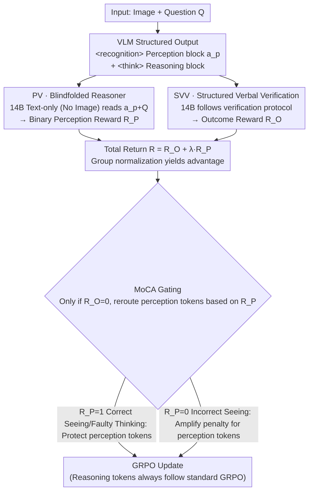

# Bad Seeing or Bad Thinking? Rewarding Perception for Vision-Language Reasoning

**Conference**: ICML 2026 Oral  
**arXiv**: [2605.14054](https://arxiv.org/abs/2605.14054)  
**Code**: To be open-sourced (authors committed to releasing data/code/models)  
**Area**: Multimodal VLM / Vision-Language Reasoning / Reinforcement Learning  
**Keywords**: VLM, RL, Modality Credit Assignment, GRPO, Structured Verbal Verification

## TL;DR
This paper enforces a split in VLM output into `<recognition>` perception blocks and `<think>` reasoning blocks. It introduces a perception reward $R_P$ determined by whether a "blindfolded" text reasoning agent (which only sees the VLM's perception text without the image) can correctly answer the question, paired with Structured Verbal Verification (SVV) as an outcome reward $R_O$. MoCA uses $R_P$ as a gate for modality-level credit assignment, enabling a 7B model to improve across 9 perception/reasoning/rich-modality benchmarks simultaneously, surpassing GPT-4o on multiple metrics.

## Background & Motivation

**Background**: Advanced VLMs aiming for "perception-reasoning synergy" typically follow two paths: (a) implicit fusion of visual tokens and text embeddings in latent space (e.g., Qwen-VL), handled via static text reasoning; (b) agentic "thinking with images" workflows (e.g., Pixel Reasoner, DeepEyes) using multi-turn function-calling to invoke external tools for active re-observation.

**Limitations of Prior Work**: Path (a) is limited by static reasoning and fails on fine-grained details. Path (b) involves heavy engineering—multi-turn RL, asynchronous long-tail episodes, and external tool integration—and often suffers from the "seesaw effect": perception metrics improve while reasoning drops, or vice versa. This leads to high investment with low marginal gains and internal competition between modalities.

**Key Challenge**: The authors attribute the core issue to an overlooked fundamental problem—**ambiguity in modality credit assignment**. When a VLM provides a wrong answer, is it due to "bad seeing" (inaccurate visual evidence) or "bad thinking" (faulty logical chain)? Existing training paradigms only provide outcome rewards, distributing penalties uniformly across the entire trajectory, making it impossible to distinguish between the two. Consequently, a model might "unlearn" correct perception behaviors due to reasoning failures, and vice versa.

**Goal**: (1) Extract "perception" from the latent black box into explicit, supervisable tokens; (2) Design a perception reward that does not rely on human annotation or ground-truth captions; (3) Pair free-form answers with a low-variance, high-fidelity outcome verifier; (4) Use modality-level credit assignment to separate penalties for "seeing wrong" versus "thinking wrong."

**Key Insight**: In explicit visual reasoning, the product of perception serves as the "discrete premises" required for logical deduction. Therefore, the "sufficiency" of perception does not require a ground-truth caption; it only needs to be tested by whether a text-only reasoner—given only the VLM's perception text and the question—can reach the correct answer. If it can, perception is sufficient; otherwise, it is "bad seeing." This approach bypasses the bottleneck of missing perception labels.

**Core Idea**: Replace holistic outcome supervision with a **"Blindfolded Reasoner + Structured Verbal Verification (SVV) + Modality-level Credit Assignment (MoCA)"** framework, upgrading VLM training from vague end-to-end supervision to precise module-level credit assignment.

## Method

### Overall Architecture
The training objective is based on Group Relative Policy Optimization (GRPO). Under system prompt instructions, the VLM alternately outputs `<recognition>...</recognition>` (perception action $a_p$) and `<think>...</think>` (reasoning action). For each trajectory $\tau$, two rewards are calculated: (i) **Perception Verification (PV)**: All $\{a_p\}$ plus the question $Q$ are fed to a strong text-only reasoner (e.g., Qwen2.5-Instruct-14B, without the image) to see if it outputs the correct answer, yielding a binary $R_P \in \{0, 1\}$; (ii) **Structured Verbal Verification (SVV)**: The same LLM follows a universal "verification protocol" to execute steps (identifying answer type $\rightarrow$ extracting content $\rightarrow$ reconstructing reference $\rightarrow$ semantic comparison by type) to output an outcome reward $R_O$. The total return is $R(\tau) = R_O(\tau) + \lambda R_P(\tau)$, and the advantage is obtained via within-group normalization $A_{\tau,t} = R(\tau) - \frac{1}{k} \sum R(\tau_j)$. **MoCA** reroutes the advantage based on $R_P$ for failed trajectories ($R_O = 0$), precisely sending gradients for "seeing wrong" or "thinking wrong" to the corresponding tokens.

### Key Designs

**1. Perception Verification via "Blindfolded Reasoner" (PV): Binary reward for perception without caption labels**

The main difficulty with perception is the lack of ground truth. The authors observe that perception results are essentially "discrete premises" for downstream reasoning. Thus, whether a blindfolded agent can answer correctly based solely on the VLM's perception text is a natural functional metric for perception sufficiency. All $\{a_p\}$ generated by the VLM and the question $Q$ are fed to a text-only reasoner. If the agent answers correctly, $R_P = 1$; otherwise, $R_P = 0$. This functional proxy is theoretically equivalent to an Information Bottleneck objective:

$$\min_{p(A_p|V)} I(V;A_p)-\beta I(A_p;Y),$$

which rewards perception expressions that are most informative for the answer and least redundant relative to the image. To enforce minimalism, an explicit penalty is added for perception blocks exceeding 800 tokens. Advantages include zero reliance on human labels and zero tolerance for "hallucinatory captions"—no matter how well-written a caption is, it receives no reward if the information is incorrect or prevents the agent from answering correctly. Human evaluation (N=979) shows PV achieves 86.31% consistency with human majority voting (Cohen's $\kappa = 0.707$), and failure modes lean toward "conservative False Negatives" (9.19% FN vs 4.49% FP), which are buffered by the MoCA protection mechanism.

**2. Structured Verbal Verification (SVV): Transforming outcome judgment into a step-by-step algorithm**

Free-form answers are difficult to judge: rigid regex has poor recall for semantic rewrites, while direct LLM judging ("Are these two answers equivalent?") is too subjective—achieving only 78.6% consistency over five repetitions at $T=0.7$. Such high-variance rewards invite reward hacking. SVV requires the judge to execute a universal linguistic verification algorithm: identify answer type (number / set / expression / multiple-choice / free text), extract content, reconstruct reference form, and perform semantic comparison by type. By decomposing subjective judgment into deterministic execution steps, consistency rises to 92.3%, with 91.9% accuracy and 92.7% F1 (VP-Challenge-Set, N=273), yielding low-variance outcome rewards $R_O$.

**3. MoCA: Precise penalty routing for failed trajectories**

Standard GRPO applies negative advantage uniformly across all tokens in a failed trajectory, which causes the seesaw effect: when a model "sees correctly but thinks incorrectly," uniform negative gradients unlearn correct visual grounding. MoCA uses $R_P$ as a gate to reroute perception tokens $\tau_P$ during failure ($R_O = 0$): **Case 1 (bad thinking)** occurs when $R_O = 0$ but $R_P = 1$ (correct perception, faulty reasoning), adding a positive protection term $A_{\tau,t} + \alpha_{\text{protect}} \cdot |A_{\tau,t}|$ to perception tokens. **Case 2 (bad seeing)** occurs when $R_O = 0$ and $R_P = 0$, amplifying the penalty for perception tokens to $A_{\tau,t} - \alpha_{\text{punish}} \cdot |A_{\tau,t}|$. Reasoning tokens always follow standard GRPO. This gate reduces trajectory-level signals to precise token-segment signals, eliminating the seesaw effect.

### Loss & Training
The framework uses GRPO with group baseline, using modified modality perception advantages. Qwen2.5-VL-Instruct-7B serves as the base model. Both the PV reasoner and SVV judge utilize Qwen2.5-Instruct-14B. Training data is a mixture of ViRL39K (STEM reasoning), VisualWebInstruct-Verified (general visual instructions), Pixel Reasoner data (perception-intensive), and rich-modality data crawled from arXiv, newspapers, and infographics.

## Key Experimental Results

### Main Results
Across 9 benchmarks (perception-intensive / rich-modality / reasoning-intensive), MoCA-7B shows across-the-board improvements, surpassing GPT-4o on multiple metrics.

| Model | V* | HRBench | DUDE | MMLong | MMMU | EMMA | MathVista |
|------|-----|---------|------|--------|------|------|-----------|
| GPT-4o | 45.0 | 65.0 | 52.7 | 42.3 | 51.9 | 32.7 | 63.4 |
| Qwen2.5-VL-Instruct 72B | 81.2 | 73.4 | 44.5 | 24.9 | 67.0 | 38.5 | 74.8 |
| Qwen2.5-VL-Instruct 7B (base) | 71.4 | 69.2 | 41.8 | 21.2 | 54.3 | 21.5 | 68.2 |
| Pixel Reasoner 7B | 84.3 | 72.8 | 44.5 | 22.0 | 50.8 | 19.8 | 65.3 |
| DeepEyes 7B | 88.9 | 73.1 | 35.2 | 17.5 | 45.2 | 18.1 | 64.9 |
| **MoCA 7B (Ours)** | **86.6** | **74.2** | **45.1** | **33.1** | **54.8** | **31.3** | **73.8** |

Highlights: Relative to the base model, gains include +15.2 on V*, +5.0 on HRBench, +3.3 on DUDE, +11.9 on MMLong, and +9.8 on EMMA, without triggering any seesaw effect.

### Ablation Study

| Configuration | V* | HRBench | DUDE | MMMU | MathVista | Description |
|------|-----|---------|------|------|-----------|------|
| Full MoCA | 86.6 | 74.2 | 45.1 | 54.8 | 73.8 | Full model |
| Instruction-Only (No RL) | 68.3 | 66.5 | 37.7 | 49.9 | 65.7 | Forced decomposition via prompt only drops performance |
| w/o PV (Only $R_O$) | 79.7 | 70.1 | 42.5 | 55.3 | 74.4 | Significant drop in perception tasks |
| w/o MoCA ($R_O + \lambda R_P$ naive sum) | 83.1 | 72.5 | 43.7 | 54.6 | 74.1 | Gating is essential (approx. -3 drop) |
| w/o SVV+PV (Standard LLM Judge) | 78.4 | 69.7 | 38.9 | 52.3 | 72.1 | High-variance reward leads to hacking |

### Key Findings
- **PV is the primary source of perception gains**: Removing $R_P$ leads to a sharp decline in perception-intensive benchmarks (V* -6.9) while reasoning tasks remain stable.
- **MoCA gate is necessary**: A naive reward sum still results in a ~3-point drop in perception tasks due to gradient interference; the gate is vital for eliminating the seesaw effect.
- **Structured Execution > Subjective Judgment**: SVV increases consistency from 78.6% to 92.3% compared to standard LLM Judging, preventing unstable reward hacking.
- **7B Model outperforms GPT-4o and Qwen2.5-VL-72B**: MoCA 7B outperforms the 72B base model on DUDE (45.1 vs 44.5) and HRBench (74.2 vs 73.4), proving that paradigm advantages can compensate for model size.

## Highlights & Insights
- The "blindfolded reasoner" cleverly solves the zero-label perception supervision problem: functional sufficiency testing requires no captions or external tools, just a text LLM.
- It internalizes perception-reasoning synergy from an external agentic workflow into a single auto-regressive generation, avoiding the pitfalls of multi-turn RL engineering.
- MoCA's gating mechanism serves as a template for modular policy training (code, tool, memory), reducing trajectory-level signals to precise module-level credit assignment.

## Limitations & Future Work
- Text reasoners are "near-sighted"—certain visual features requiring spatial relationships (e.g., full mazes, complex geometry) are hard to condense into text.
- PV oracle's 9.19% False Negative rate may penalize good perception; despite MoCA's protection, the system's ceiling is linked to the oracle's capability.
- The 800-token limit is empirical and may be too restrictive for truly complex scenarios (multi-page documents).
- Training and inference depend on a secondary 14B reasoner, nearly doubling deployment costs compared to a standalone 7B VLM.

## Related Work & Insights
- **vs Pixel Reasoner / DeepEyes**: Those rely on external tool calls and multi-turn loops; MoCA internalizes this into alternating blocks within a single generation, increasing efficiency.
- **vs VL-Rethinker / R1-VL**: These use holistic outcome rewards and suffer from the seesaw effect; MoCA resolves credit assignment ambiguity through modular rewards and gating.
- **vs RLHF / DPO**: While those are outcome-only, MoCA adopts process supervision and uses functional proxies to solve the problem of scarce process labels, applicable to code or agent-based scenarios.

## Rating
- Novelty: ⭐⭐⭐⭐⭐ The functional proxy for perception sufficiency is highly ingenious.
- Experimental Thoroughness: ⭐⭐⭐⭐⭐ Comprehensive benchmarks, ablation, and human verification.
- Writing Quality: ⭐⭐⭐⭐ Clear logic from problem definition through IB theory to MoCA gating.
- Value: ⭐⭐⭐⭐⭐ Provides a universal recipe for internalizing agentic capabilities via modality-level RL.

<!-- RELATED:START -->

## Related Papers

- [\[ICML 2026\] From Seeing to Thinking: Decoupling Perception and Reasoning Improves Post-Training of Vision-Language Models](from_seeing_to_thinking_decoupling_perception_and_reasoning_improves_post-traini.md)
- [\[ICML 2026\] 3ViewSense: Spatial and Mental Perspective Reasoning from Orthographic Views in Vision-Language Models](3viewsense_spatial_and_mental_perspective_reasoning_from_orthographic_views_in_v.md)
- [\[ICML 2026\] Active Exploring like a Pigeon: Reinforcing Spatial Reasoning via Agentic Vision-Language Models](active_exploring_like_a_pigeon_reinforcing_spatial_reasoning_via_agentic_vision-.md)
- [\[ACL 2026\] ChemVLR: Prioritizing Reasoning in Perception for Chemical Vision-Language Understanding](../../ACL2026/vlm_reasoning/chemvlr_prioritizing_reasoning_in_perception_for_chemical_vision-language_unders.md)
- [\[ICML 2026\] Efficient Reasoning with Hidden Thinking](efficient_reasoning_with_hidden_thinking.md)

<!-- RELATED:END -->
