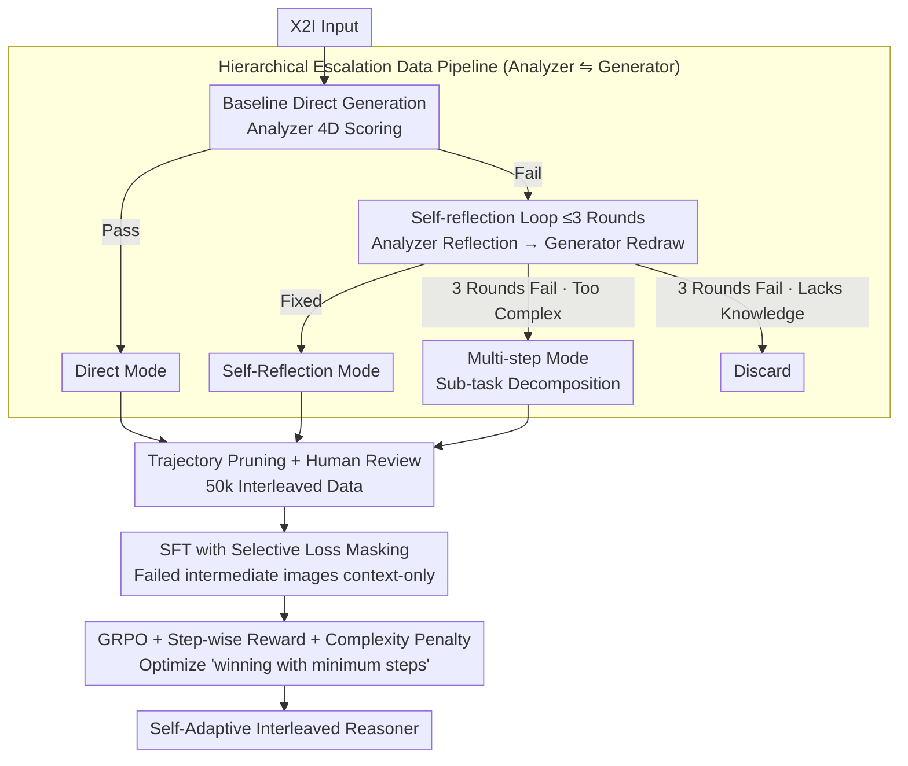

# Breaking Dual Bottlenecks: Evolving Unified Multimodal Models into Self-Adaptive Interleaved Visual Reasoners

**Conference**: ICML 2026  
**arXiv**: [2605.14709](https://arxiv.org/abs/2605.14709)  
**Code**: GitHub (Indicated as "released at GitHub" in the paper, but URL not provided)  
**Area**: Multimodal VLM / Unified Models / Reinforcement Learning  
**Keywords**: Unified Multimodal Models, X2I, Interleaved Reasoning, GRPO, Adaptive Planning

## TL;DR
To address the "understanding-generation gap" (capable of understanding but failing to generate) in unified multimodal models for anything-to-image (X2I) tasks, this paper proposes the Self-Adaptive Interleaved Reasoner. Using a hierarchical data synthesis pipeline, 50,000 samples are routed between three modes: direct generation, self-reflection, and multi-step planning. The model is trained via SFT + GRPO with step-wise reasoning rewards and intra-group complexity penalties, enabling Emu3.5 to outperform closed-source models like GPT-4o and Gemini 2.5 Flash on KRIS-Bench and OmniContext.

## Background & Motivation

**Background**: Unified multimodal models (e.g., Emu3.5, BAGEL, OmniGen) can perform both understanding and generation within a single framework and have begun introducing CoT-style interleaved reasoning for X2I tasks (any condition → image).

**Limitations of Prior Work**: The authors attribute the failure of unified models in complex X2I tasks to an "understanding-generation gap," decomposed into two specific bottlenecks: (i) **attention entanglement bottleneck**—direct one-shot generation for complex prompts almost inevitably fails, requiring step-by-step execution. However, existing Plan-then-Generate methods perform "blind planning," where the planner is unaware of the generator's actual execution capabilities, often producing impractical plans. (ii) **visual refinement bottleneck**—single-pass pixel synthesis often contains flaws, requiring reflection and repair. However, existing Generate-then-Reflect methods mix "what is wrong" and "how to fix it" in unstructured text, which is inefficient for composite errors and often relies on frequent model switching, causing inference costs to soar.

**Key Challenge**: Plan-then-Generate and Generate-then-Reflect strategies each address only one bottleneck and typically follow fixed workflows. Since instruction complexity varies significantly, applying a single mode leads to over-reasoning for simple prompts or insufficient reasoning for complex ones. No existing method can "adaptively select the mode based on prompt complexity."

**Goal**: To train a unified model capable of autonomously switching between "direct generation," "reflection/correction," and "multi-step planning" based on instruction complexity and its own capabilities while maintaining generation efficiency without relying on external models.

**Key Insight**: A hierarchical escalation data pipeline is used to automatically categorize prompts of varying complexity into three modes. SFT then teaches the model the required syntax, followed by RL to teach the strategy (deciding when each mode is most cost-effective).

**Core Idea**: Transforming "when to think more" into an autonomous reinforcement learning objective—using step-wise rewards to ensure logical reasoning and intra-group complexity penalties to suppress over-reasoning (marginal gains at the cost of excessive steps).

## Method

### Overall Architecture
The pipeline consists of two stages: **(A) Data Construction**—Given a raw X2I input, the baseline unified model first generates an output. Qwen3-VL-235B (Analyzer) scores it across four dimensions: instruction adherence, consistency, quality, and common sense. If it passes, it is categorized as *Direct*. Otherwise, it enters a self-reflection loop (max 3 rounds) where the Analyzer writes a reflection prompt and Gemini-3-Pro-Image (Generator) redraws. If it still fails after 3 rounds, the Analyzer diagnoses the failure: if due to "excessive prompt complexity," it escalates to *Multi-step* mode (decomposing sub-tasks for step-by-step execution + intermediate evaluation); otherwise (e.g., lacking domain knowledge), it is discarded. After human verification, 50,000 high-quality interleaved samples are obtained. **(B) Training**—SFT adapts the model to interleaved reasoning syntax with selective loss masking to skip failed intermediate images. GRPO reinforces strategy selection with a weighted reward comprising Outcome, Format, and Step-wise reasoning terms, plus an intra-group complexity penalty to encourage "winning with fewer steps."

### Key Designs

**1. Hierarchical Escalation Data Pipeline (Analyzer ⇋ Generator): Modeling "Mode Selection by Complexity"**

To enable the model to select modes adaptively, training data must demonstrate three distinct modes categorized by complexity. The authors built an automated escalation pipeline using Qwen3-VL-235B as the "Reviewer + Diagnostician + Planner" and Gemini-3-Pro-Image as the Generator. Each sample starts with direct generation and is scored. Successes are filed under *Direct*. Failures enter up to 3 rounds of *Self-Reflection*. If fixed, they become *Self-Reflection* data. If failure persists, the Analyzer diagnoses the cause: "complex prompts" escalate to *Multi-step* (sub-task decomposition), while "lack of domain knowledge" leads to discarding. After successful multi-step completion, trajectory pruning is applied to remove failed attempts, leaving a clean "direct trial failure → sub-task decomposition → step-by-step execution" sequence. This ensures simple prompts learn direct generation, while complex ones learn explicit decomposition.

**2. SFT with Selective Loss Masking: Failed Intermediate Images as "Context," not "Targets"**

Multi-step trajectories contain failed intermediate images. Applying standard NLL loss to these would teach the model to generate low-quality images, harming fidelity. The solution is masking the loss to apply only to the selected subsequence $\mathcal{O}$: *Direct* mode only trains on $\{G_1, E_1\}$; *Self-Reflection* mode trains on the final diagnosis $E_{K-1}$, reflection prompt $R_{K-1}$, and the successful image $G_K, E_K$, masking all prior failures; *Multi-step* mode trains on $E_1$ and the full planning sequence $\{S_i, G_i, E_i\}$. Failure information thus enters the context as text for "reflection" without having their pixel artifacts imitated as generation targets.

**3. GRPO + Step-wise Reasoning Reward + Intra-group Complexity Penalty: Incorporating Efficiency into RL**

While SFT teaches syntax, "when to think more" is a strategic problem addressed by RL. The total reward is defined as $\mathcal{R}_{\text{total}}=\alpha_1\mathcal{R}_o+\alpha_2\mathcal{R}_f+\alpha_3\mathcal{R}_s$. Here, $\mathcal{R}_o$ is the weighted average of the 4D outcome score, $\mathcal{R}_f$ is binary format validity, and $\mathcal{R}_s=\frac{1}{T}\sum_t \text{Analyzer}(\text{text}_t)$ provides dense reasoning rewards by scoring intermediate text (failure analysis, reflection prompts, decompositions). To prevent the model from defaulting to higher-scoring multi-step modes (over-reasoning), an intra-group complexity penalty is introduced. Within a group of sampled trajectories, a subset with "near-optimal rewards" (within threshold $\epsilon$) is selected and scaled by the image count: rewards are multiplied by $N_{\text{img}}^*/N_{\text{img}}^i$. This extra credit for achieving equivalent effects with fewer images implicitly optimizes the model to use *Direct* for simple prompts and reserve *Multi-step* for complex ones. Ablations show that removing this term causes the average number of generated images to jump from 1.56 to 2.73 (+75%) with almost no quality gain.

### Loss & Training
SFT: Standard AR-NLL on subset $\mathcal{O}$ (Eq. 1). RL: GRPO policy with the combined reward (Eq. 2–5). Backbone: Emu3.5; RL data: 50,000 samples from UnicEdit-10M, X2Edit, AnyEdit, Pick-a-Pic, and UltraEdit.

## Key Experimental Results

### Main Results

| Benchmark | GPT-4o | Gemini 2.5 Flash | Emu3.5 (vanilla) | Ours |
|---|---|---|---|---|
| KRIS-Bench Overall | 80.09 | 77.29 | 73.75 | **80.18** |
| KRIS Procedural | 78.32 | 75.93 | 71.14 | **85.53** |
| KRIS Factual | 79.80 | 77.03 | 78.59 | **84.24** |
| OmniContext Avg. | 8.80 | 7.84 | 8.82 | **9.35** |
| GenEval | – | – | 0.86 | **0.89** |

### Ablation Study

| Configuration | GenEval | KRIS | Omni | Avg. Imgs |
|---|---|---|---|---|
| Direct Only | 0.86 | 75.16 | 8.89 | – |
| w/o Reflection | 0.86 | 75.21 | 9.03 | – |
| w/o Multi-step | 0.87 | 77.24 | 8.95 | – |
| Full Mix (SFT) | 0.88 | 78.24 | 9.15 | – |
| SFT Only (50k) | 0.86 | 79.16 | 9.12 | 2.45 |
| w/o Step-wise Reward | 0.88 | 79.65 | 9.25 | 1.62 |
| w/o Complexity Penalty | 0.89 | 80.25 | 9.38 | 2.73 |
| SFT + RL (Full) | **0.89** | **80.18** | **9.35** | **1.56** |

### Key Findings
- Removing *Reflection* drops KRIS by 3 points (78.24 → 75.21), while removing *Multi-step* drops Omni by 0.2 (9.15 → 8.95), suggesting the two modes specifically handle "quality repair" and "complex multi-entity scenes" respectively and cannot replace each other.
- Without the intra-group complexity penalty, the average number of generated images surged from 1.56 to 2.73 (+75%), confirming its role in suppressing over-reasoning.
- The shift from SFT to SFT+RL decreased average images from 2.45 to 1.56 while simultaneously increasing quality, proving RL learns "winning with fewer steps."
- Significant gains were observed in OmniContext's "Multiple/Scene" complex multi-entity scenarios (9.56/9.44 vs. Emu3.5's 8.65/8.78), validating that the planning mode effectively resolves "attention entanglement."

## Highlights & Insights
- "When to think more" is elevated to an optimizable policy, and efficiency is integrated into the RL signal via the intra-group complexity penalty—a rare instance of explicit modeling for both quality and efficiency in generation reasoning.
- The data pipeline utilizes an automated escalation workflow (Analyzer ⇋ Generator), categorizing data by complexity without relying on static "plan-then-generate" templates, making it transferable to other multimodal tasks requiring adaptive reasoning depth.
- Selective loss masking is a critical "small trick"; in multi-step tasks involving intermediate failures, including failure steps in NLL can contaminate the model with low-quality examples.

## Limitations & Future Work
- Strong reliance on closed-source models (Qwen3-VL-235B, Gemini-3-Pro-Image) for data construction and step-wise rewards makes replication costly and risks inheriting Analyzer biases.
- The experiments focus on X2I editing and synthesis; whether this extends to longer-horizon tasks like video or 3D generation remains unverified.
- The hard threshold (3-round limit before escalating to multi-step) might overlook moderately complex cases that could be resolved with 4-5 rounds of reflection; learned confidence intervals could replace fixed limits.

## Related Work & Insights
- **vs. Plan-then-Generate (Uni-CoT / Echo-4o)**: Previous works used static textual planning; ours combines reflection and planning, selecting modes via RL, achieving a +1.1–1.5 gain on OmniContext.
- **vs. Generate-then-Reflect (VACoT)**: Previous works performed iterative reflection without explicit planning; ours explicitly separates "analysis" from "improvement" and adds multi-step planning for complex prompts.
- **vs. Emu3.5 (Backbone)**: Interleaved reasoning + RL improved KRIS from 73.75 to 80.18 and Omni from 8.82 to 9.35, demonstrating that "adaptive strategy" is the next frontier for unified model improvements.

## Rating
- Novelty: ⭐⭐⭐⭐ First to make "adaptive mode selection" an explicit RL optimization goal with a clever complexity penalty; individual components, however, are existing concepts.
- Experimental Thoroughness: ⭐⭐⭐⭐ Covers major benchmarks with detailed ablations on data modes and RL components, reporting image count to reflect efficiency.
- Writing Quality: ⭐⭐⭐⭐ Clear narrative flow (gap → bottlenecks → adaptive solution) with well-structured figures.
- Value: ⭐⭐⭐⭐⭐ Surpasses GPT-4o using an open-source backbone on KRIS-Bench, providing a practical "strategy learning via RL" roadmap for the unified model community.

<!-- RELATED:START -->

## Related Papers

- [\[CVPR 2026\] POINTS-Long: Adaptive Dual-Mode Visual Reasoning in MLLMs](../../CVPR2026/vlm_reasoning/points-long_adaptive_dual-mode_visual_reasoning_in_mllms.md)
- [\[ACL 2026\] iReasoner: Trajectory-Aware Intrinsic Reasoning Supervision for Self-Evolving Large Multimodal Models](../../ACL2026/vlm_reasoning/ireasoner_trajectory-aware_intrinsic_reasoning_supervision_for_self-evolving_lar.md)
- [\[CVPR 2026\] Unified Generation and Self-Verification for Vision-Language Models via Advantage Decoupled Preference Optimization](../../CVPR2026/vlm_reasoning/unified_generation_and_self-verification_for_vision-language_models_via_advantag.md)
- [\[CVPR 2026\] GGBench: A Geometric Generative Reasoning Benchmark for Unified Multimodal Models](../../CVPR2026/vlm_reasoning/ggbench_a_geometric_generative_reasoning_benchmark_for_unified_multimodal_models.md)
- [\[ICML 2026\] Learn to Think: Improving Multimodal Reasoning through Vision-Aware Self-Improvement Training](learn_to_think_improving_multimodal_reasoning_through_vision-aware_self-improvem.md)

<!-- RELATED:END -->
