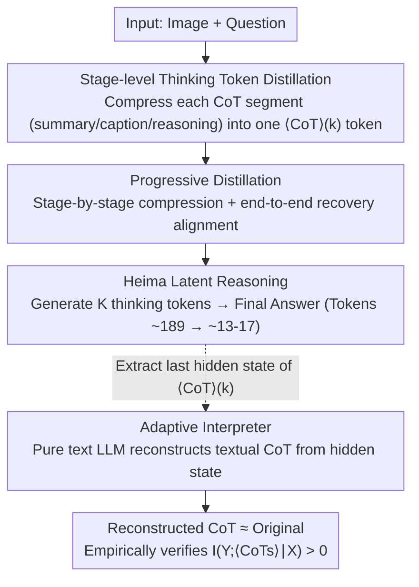

# Efficient Reasoning with Hidden Thinking

**Conference**: ICML 2026  
**arXiv**: [2501.19201](https://arxiv.org/abs/2501.19201)  
**Code**: https://github.com/shawnricecake/Heima  
**Area**: Multimodal VLM / Efficient Inference / Latent Space Reasoning / CoT Compression  
**Keywords**: Heima, thinking tokens, progressive distillation, information-theoretic bound, interpreter

## TL;DR
Heima distills each stage (summary / caption / reasoning) of lengthy Multimodal LLM (MLLM) Chains-of-Thought (CoT) into **a single special thinking token**. This allows the model to "think" in latent space, reducing the token count from the 100-200 range to 13-16 while achieving zero-shot accuracy more stable than LLaVA-CoT. An accompanying LLM "interpreter" is trained to reconstruct the textual reasoning chain from the thinking token's hidden states, empirically validating the information-theoretic upper bound of compression loss.

## Background & Motivation

**Background**: MLLMs using CoT for complex multimodal reasoning have become mainstream (e.g., LLaVA-CoT). However, generating hundreds of tokens per CoT results in high inference latency and prohibitive API costs. While Coconut (Hao et al., 2024) explored CoT compression on GPT-2, it was only validated on text-only small models.

**Limitations of Prior Work**: (1) MLLM CoTs are longer than pure text (requiring image descriptions + reasoning), exacerbating latency; (2) Existing latent reasoning methods (Cheng & Van Durme) compress the entire CoT into a continuous embedding, causing significant accuracy drops in math—indicating "naive compression" loses critical information; (3) There is a lack of a theoretical framework to quantify the number of tokens required to save costs without sacrificing reasoning capability.

**Key Challenge**: Shorter CoTs increase inference speed, but removing any segment of CoT may reduce $I(Y;\text{CoTs}|X)$ (the target-related mutual information carried by CoT). Quantifying this trade-off and ensuring $I(Y;\langle CoTs\rangle|X)>0$ after compression requires formal information-theoretic characterization and empirical validation that information is preserved.

**Goal**: (i) Design a latent CoT compression framework for MLLMs; (ii) Formalize the "compression-accuracy" trade-off using information theory; (iii) Design an interpreter capable of reconstructing textual CoT to empirically verify compression loss.

**Key Insight**: LLaVA-CoT outputs are organized by stages (summary / caption / reasoning), each serving as a semantically independent unit suitable for distillation into **one stage-token**. Although the capacity of a single token's hidden state is finite, the 768-4096 dimensions are sufficient to encode the "semantic fingerprint of a reasoning segment."

**Core Idea**: Each CoT stage is distilled into a special token $\langle CoT\rangle(k)$. Heima generates these tokens in embedding space to produce the final answer. Separately, an LLM interpreter reconstructs the textual CoT from these hidden states as empirical proof of information retention.

## Method

### Overall Architecture
Two types of models:
- **Heima** (Based on LLaVA-CoT-11B / LLaVA-Next-Vicuna-7B): Performs latent reasoning. Input: (image, question); Output: $K_i$ thinking tokens + final answer.
- **Interpreters** (Based on Llama-3.1-8B / Vicuna-7B, pure LLM without vision): One per CoT stage. Input: (explanatory prompt, textual question, thinking token hidden state); Output: Original CoT text.

During inference, only Heima is used, reducing token counts from $\sum |CoT(k)|$ (~100-200) to $K_i$ (3-4). Interpreters are used only for "information-theoretic empirical analysis."

### Key Designs

**1. Stage-level Thinking Token Distillation & Information Guarantee: Compressing each CoT segment into one special token and quantifying information loss**

LLaVA-CoT organizes reasoning into stages (summary / caption / reasoning), each acting as a semantic unit. The original dataset $D=\{(X,\text{CoTs},Y)\}$ is rewritten as $D_H=\{(X,\langle CoTs\rangle,Y)\}$, where $\langle CoTs\rangle:=\{\langle CoT\rangle_{(k)}\}_{k=1}^{K_i}$ replaces each stage with a new vocabulary token. The distillation objective $\mathcal{L}(\theta)=-\mathbb{E}_{(X,Y,\langle CoTs\rangle)\sim D_H}\log P_\theta(\langle CoTs\rangle,Y|X)$ fine-tunes the model to predict the thinking token sequence and the answer. Authors formalize the reasoning preservation as an information theory problem: given $\langle CoTs\rangle=f(X,\text{CoTs})$ forms the Markov chain $Y-(X,\text{CoTs})-\langle CoTs\rangle$, Theorem 3.1 states $0\leq I(Y;\langle CoTs\rangle|X)\leq I(Y;\text{CoTs}|X)$. The information gap $I(Y;\text{CoTs}|X)-I(Y;\langle CoTs\rangle|X)=I(Y;\text{CoTs}|X,\langle CoTs\rangle)\geq 0$ quantifies the "compression loss"—as long as $I(Y;\langle CoTs\rangle|X)>0$, reasoning capability is preserved. All samples share the same token for the $k$-th stage, preventing vocabulary explosion.

**2. Progressive Distillation: Compressing one stage at a time to avoid optimization collapse**

Compressing all CoT stages simultaneously places too much burden on each token, leading to difficult optimization. A curriculum approach is used: the process is divided into $M=\max\{K_i\}+1$ stages. Training data at stage $s$ is $D_P=\{(X,\{\langle CoT\rangle_{(k)}\}_{k=1}^s,\{CoT_{(k)}\}_{k=s+1}^{K_i},Y)\}$, where the first $s$ stages are compressed and subsequent ones remain as original text. This allows the model to internalize reasoning patterns into hidden states step-by-step. A final recovering stage uses only thinking tokens to resolve alignment issues between stitched stages. Ablations show removing progressive distillation drops performance by 1.7%, and removing recovery drops it by a further 1.4%.

**3. Adaptive Interpreter: Reconstructing textual CoT from hidden states to measure preserved information**

While theory provides bounds, empirical evidence is needed. Each stage $k$ is paired with a pure-text interpreter $\mathcal{I}_{\theta_k}$ (initialized from Llama-3.1-8B). Training data $D_I$ includes explanatory prompts, textual questions (no images), thinking tokens, their last hidden states $H_{\langle CoT\rangle_{(k)}}$, and original CoT text. Key operation: the interpreter's input word embedding for the thinking token is **replaced** with the last hidden state from Heima, as reasoning information is encoded in the hidden state rather than the token ID. The interpreter is trained via next-token loss $\max_{\theta_k}\mathbb{E}\log P_{\theta_k}(CoT_{(k)}|X_e,X_q,H_{\langle CoT\rangle_{(k)}})$. High reconstruction quality implies a small information gap. This also proves Heima performs actual latent reasoning rather than simple overfitting.

### Loss & Training
- Heima: LoRA fine-tuning LLaVA-CoT-11B (rank=16, alpha=32). Image encoder frozen; all attention, MLP, and output projections updated. Progressive distillation uses one epoch per stage.
- Interpreter: Same LoRA configuration, next-token prediction loss using hidden states extracted from frozen Heima.
- Infrastructure: torchtune + 8×H100.

## Key Experimental Results

### Main Results

6 zero-shot benchmarks for the LLaVA-CoT-11B series (generated token counts in parentheses):

| Model | MMStar | MMBench | MMVet | MathVista | AI2D | Hallusion | Avg | Tokens |
|-------|--------|---------|-------|-----------|------|-----------|-----|--------|
| Llama-3.2-11B-Vision | 48.1 | 58.2 | 50.2 | 50.3 | 68.5 | 37.2 | 52.1 | ~119 |
| LLaVA-CoT | 54.0 | 70.7 | 49.8 | 50.9 | 77.6 | 63.8 | 61.1 | ~189 |
| Heima w/o progressive | 49.7 | 72.5 | 39.0 | 39.3 | 75.9 | 61.3 | 56.3 | ~23 |
| Heima w/o recover | 49.8 | 71.6 | 42.8 | 39.8 | 77.3 | 58.5 | 56.6 | ~24 |
| **Heima (full)** | 49.9 | **72.8** | 43.3 | 43.6 | 77.5 | 60.6 | 58.0 | **~24** |

Heima averages 13-17 tokens (roughly **10-15× fewer tokens** than LLaVA-CoT); on MMBench and AI2D, it even surpasses LLaVA-CoT accuracy.

### Ablation Study

| Configuration | Avg Acc | Remarks |
|------|---------|------|
| Heima w/o progressive | 56.3 | Simultaneous compression of all stages, -1.7 gain |
| Heima w/o recover | 56.6 | No final recovering stage, -1.4 gain |
| Heima (full) | 58.0 | Full methodology |

Interpreter reconstruction quality (4300 samples) evaluated via BLEU-4 / METEOR / ROUGE / BERTScore + GPT-4o similarity: reconstructed text "closely aligns with original CoTs," verifying controllable information gap.

### Key Findings
- **MathVista performance**: Heima (43.6) < LLaVA-CoT (50.9) despite 16× fewer tokens, indicating mathematical reasoning relies on complete CoTs and remains a bottleneck for compression. Heima is more accurate on MMBench/AI2D, potentially by filtering CoT noise.
- **Criticality of Progressive Distillation**: Removing it causes a 1.7% drop; adding the recovering stage provides a 1.4% boost—curriculum and alignment are both essential.
- **Efficiency**: Reducing tokens from ~189 to ~13-17 yields a 14× compression with only a 3% average accuracy drop (61.1→58.0).
- **Interpretability**: The interpreter reconstructs nearly complete captions and reasoning (e.g., the BMW example), proving hidden states carrier reasoning information rather than being "black boxes."
- **Failure Case**: Without progressive distillation, MMVet performance plunges to 39.0, showing simultaneous compression in long-CoT tasks is infeasible.

## Highlights & Insights
- **First to achieve latent CoT compression with rigorous information theory and interpretable validation at MLLM scale**. While Coconut focused on GPT-2 and math, Heima targets 11B MLLMs across 6 multimodal benchmarks.
- **Formalization of Information Gap**: Theorem 3.1 quantifies the intuition that "compression is viable if $I(Y;\langle CoTs\rangle|X)>0$ is maintained," providing a baseline for future latent reasoning research.
- **Interpreters as Diagnostic and Safety Tools**: They provide an objective assessment of hidden state information and allow end-users to see the "internal thoughts" of the model, benefiting alignment and safety.
- **Stage-shared Token Balance**: Sharing $\langle CoT\rangle_{(k)}$ across samples balances expressiveness with vocabulary efficiency.
- **Transferable Training Paradigm**: Progressive distillation can be applied to any task involving compression of multiple semantic units, such as summary generation or dialog history compression.

## Limitations & Future Work
- **Math Bottleneck**: Significant accuracy drop on MathVista indicates 13-17 hidden tokens cannot capture full arithmetic chains; latent reasoning still struggles with precise symbolic operations.
- **Granularity**: The one-token-per-stage design is heuristic; adaptive token counts per stage have not been explored.
- **Dataset Dependency**: Relies on stage annotations from LLaVA-CoT; other datasets would require pre-processing for stage segmentation.
- **Computational Cost**: Training one interpreter per stage increases training time linearly with the number of stages.
- **Scaling**: Performance on larger models (34B+) or closed-source VLMs like GPT-4V remains unknown.
- **Comparison with Coconut**: Coconut uses continuous thinking embeddings while Heima uses token-level representations; which is better for MLLMs is an open question.

## Related Work & Insights
- **vs. Coconut (Hao et al., 2024)**: Coconut is limited to GPT-2 on single-task math. Heima scales to 11B MLLMs across diverse benchmarks with an information-theoretic framework.
- **vs. Cheng & Van Durme 2024**: They compress CoT into continuous embeddings but suffer catastrophic math degradation; Heima’s token-level representation and progressive distillation mitigate this.
- **vs. Speculative Decoding / Medusa**: These optimize autoregressive parallelism, whereas Heima optimizes at the representation level; they are complementary.
- **vs. LISA / VLM-Latent**: These embed vision info in LLM hidden states for downstream tasks; Heima embeds the reasoning process, proving hidden states can carry logic as well as vision.

## Rating
- Novelty: ⭐⭐⭐⭐⭐ First stage-token latent CoT on MLLM with formal theory and interpreter verification.
- Experimental Thoroughness: ⭐⭐⭐⭐ 6 zero-shot benchmarks across two model families; lacks wall-clock latency data and direct RLHF comparisons.
- Writing Quality: ⭐⭐⭐⭐⭐ Concise information-theory section and vivid BMW logo example.
- Value: ⭐⭐⭐⭐⭐ Addresses MLLM deployment bottlenecks with 14× compression for a trade-off of only 3% accuracy; open-source code provided.

<!-- RELATED:START -->

## Related Papers

- [\[CVPR 2026\] Thinking with Drafts: Speculative Temporal Reasoning for Efficient Long Video Understanding](../../CVPR2026/vlm_reasoning/thinking_with_drafts_speculative_temporal_reasoning_for_efficient_long_video_und.md)
- [\[ICML 2026\] Thinking in Structures: Evaluating Spatial Intelligence in Constraint-Governed Spaces](thinking_in_structures_evaluating_spatial_intelligence_in_constraint-governed_sp.md)
- [\[ICML 2026\] From Seeing to Thinking: Decoupling Perception and Reasoning Improves Post-Training of Vision-Language Models](from_seeing_to_thinking_decoupling_perception_and_reasoning_improves_post-traini.md)
- [\[CVPR 2026\] Thinking with Programming Vision: Towards a Unified View for Thinking with Images](../../CVPR2026/vlm_reasoning/thinking_with_programming_vision_towards_a_unified_view_for_thinking_with_images.md)
- [\[ICLR 2026\] Efficient Multimodal Spatial Reasoning via Dynamic and Asymmetric Routing](../../ICLR2026/vlm_reasoning/efficient_multimodal_spatial_reasoning_via_dynamic_and_asymmetric_routing.md)

<!-- RELATED:END -->
