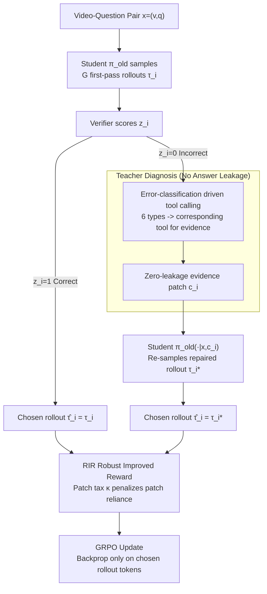

# Find, Fix, Reason: Context Repair for Video Reasoning

**Conference**: ICML 2026  
**arXiv**: [2604.16243](https://arxiv.org/abs/2604.16243)  
**Code**: Yes (FFR, anonymous link)  
**Area**: Multimodal VLM / Video Reasoning / Reinforcement Learning  
**Keywords**: Video Reasoning, GRPO, Tool-Integrated Teacher, Context Repair, Spatio-Temporal Dependency

## TL;DR
Addressing the dilemma in video reasoning where "on-policy RL stagnates at capacity ceilings and off-policy distillation suffers from entropy collapse," this paper introduces a frozen, tool-integrated large teacher model. When a student's rollout fails, the teacher inserts minimal "evidence patches" (e.g., key-frame intervals, error types), enabling the student to re-attempt the same question. These repaired trajectories are then incorporated into GRPO optimization through a chosen-rollout mechanism.

## Background & Motivation

**Background**: GRPO-based video reasoning LMMs (Video-R1, VideoRFT, VideoChat-R1) generally follow a pure on-policy RLVR route, using binary 0/1 signals as rewards for answer correctness. While successful in textual mathematical reasoning, this paradigm struggles in video tasks due to complex spatio-temporal dependencies and a lack of reasoning templates, often leading to self-exploration plateaus once the model reaches its inherent capacity limit.

**Limitations of Prior Work**: Existing "wall-breaking" strategies have significant drawbacks: (a) Hybrid policies (LUFFY, Replay) inject strong teacher trajectories into buffers, mitigating entropy collapse but resulting in wholesale imitation that requires heavy regularization; (b) Tool-integrated reasoners (Pixel-Reasoner, Video-Thinker) let small models invoke tools iteratively, but are limited by the small model's tool-calling accuracy, often leading to "self-doubt" loops; (c) SFT-teacher distillation is simpler but causes students to lose on-policy exploration capabilities.

**Key Challenge**: The trade-off between the student's capacity ceiling and the distribution drift caused by teacher guidance—the more the student sees from the teacher, the more it becomes a replica; too little, and it cannot break its own ceiling. The problem is essentially the *granularity of intervention*: whether to modify the reward, the trajectory, or the observation.

**Goal**: To find an "observation-level" intervention that does not alter the task, reward, or policy, but only modifies the "evidence" seen by the student, thereby maintaining on-policy properties while guiding exploration toward a causal direction.

**Key Insight**: Authors observe that large models (GLM-4.5V) are significantly stronger in instruction following and tool usage than 7B students, reliably diagnosing "where the spatio-temporal dependency failed" and locating evidence via tools (frame ranges, object regions).

**Core Idea**: A frozen tool-integrated large teacher acts as a "diagnostician," outputting a minimal evidence patch $c_i$ (e.g., "re-examine frames 13-17, note the color of the lifted object") for a student's failed rollout, **without directly revealing the answer**. The student re-attempts the question given the original problem + patch, and the repaired trajectory is used as a chosen rollout for GRPO updates.

## Method

### Overall Architecture
Each video-question pair $x=(v,q)$ undergoes two stages: ① The student samples $G$ first-pass rollouts $\{\tau_i\}$ using $\pi_{\theta_{old}}$, which are scored by a verifier; ② For failed rollouts $\tau_i$ ($z_i=0$), the frozen teacher $\mathcal{T}$ outputs an error type $e_i \in \{$temporal, spatial, attribute, counting, dynamics, logic$\}$ and an evidence patch $c_i$. The student re-samples a repaired rollout $\tau_i^*$ using $\pi_{\theta_{old}}(\cdot|x,c_i)$, while correct $\tau_i$ are kept. Finally, the "chosen rollout" $\hat\tau_i$ ($\tau_i$ if $z_i=1$, else $\tau_i^*$) is used to calculate token-level importance ratios for GRPO updates.

### Key Designs

**1. Error-classification driven tool calling: Tailoring repair signals to root causes**
For observation-level intervention to work, the teacher must first identify "where the student should look," but different root causes require vastly different granularities. FFR classifies errors into six categories (temporal, spatial, attribute, counting, dynamics, logic) and invokes corresponding tools: temporal outputs frame intervals, spatial outputs regional coordinates, attribute outputs descriptive features, etc. These textual error classes + optional visual context (frame indices, region masks) are assembled into patch $c_i$. Ablations show these signals are complementary: removing visual context drops Video-Holmes by 10.0 points, and removing GT references drops it by 7.6.

**2. Zero-leakage Teacher Evidence Patches (Teacher Negative Constraint Strategy)**
A prerequisite for observation-level intervention is that the teacher "points the way but does not provide the answer." Once a teacher reveals the answer, the student degrades into wholesale imitation. FFR utilizes the teacher's ICL capabilities with designed negative prompts and format constraints to separate "diagnosis" from "answer." The teacher receives $\mathcal{S}_i=(x,y,\tau_i)$ (with GT) or $(x,\tau_i)$ (without GT) but is only permitted to output $e_i$ and $c_i$. For example, in a counting task, it cannot say "exactly 3 people in frame 15," but must say "please recount within the [13,17] frame interval." This forces the student to **re-observe** rather than copy. Manual verification of 200 interactions showed leakage was reduced from 39.5% to 0%.

**3. Chosen Rollout and Robust Improved Reward (RIR): Safely integrating repaired trajectories**
Repaired rollouts are sampled under a modified observation (original question + patch). Treating them as standard off-policy samples for importance sampling would be unstable. FFR treats them as "on-policy samples from the same policy under different observations." Defining chosen rollout $\hat\tau_i$ ($\tau_i$ if $z_i=1$, else $\tau_i^*$), it calculates a scalar score:

$$\tilde R_i=z_i\big(R(\tau_i)+R_{fmt}(\tau_i)\big)+(1-z_i)\big(R(\tau_i^*)+R_{fmt}(\tau_i^*)-\kappa\big),$$

where $\kappa\ge 0$ is a patch tax that penalizes samples that only achieve correctness via teacher patches. Group normalization $A_i=(\tilde R_i-\text{mean})/\text{std}$ is applied within $G$ samples, and updates utilize the token-level ratio $r_{i,t}(\theta)$ within the PPO clip framework. The patch tax balances imitation vs. exploration; $\kappa=0.3$ was found optimal.

### Loss & Training
The GRPO objective is $\mathcal{J}_{FFR}(\theta)=\tfrac{1}{\sum|\hat\tau_i|}\sum_i\sum_{t\in\hat\tau_i}\text{CLIP}(r_{i,t}(\theta),A_i,\epsilon)-\beta D_{KL}[\pi_\theta\|\pi_{ref}]$, calculating loss only for chosen rollout tokens. The training utilizes 4000 samples, 8 rollouts/sample, 1 epoch, lr=5e-6, 8×A100, with GLM-4.5V as the teacher.

## Key Experimental Results

### Main Results
Comparison on 4 video reasoning (MMVU/VSI-Bench/VideoMMMU/Video-Holmes) and 4 general video understanding benchmarks.

| Baseline/Method | MMVU | VSI-Bench | Video-Holmes | LVBench |
| :--- | :---: | :---: | :---: | :---: |
| GPT-4o | 75.4 | 34.0 | 42.0 | 48.9 |
| GLM-4.5V (Teacher) | 68.7 | - | - | 53.8 |
| Video-R1 | 63.8 | 35.8 | 36.5 | 35.3 |
| **+ FFR** | **68.5** | **38.9** | **52.3** | **38.1** |
| Relative Gain | +11.75% | +22.33% | +51.16% | +24.10% |
| VideoRFT | 68.5 | 36.8 | 40.0 | 33.9 |
| **+ FFR** | **70.1** | **38.6** | **48.0** | **37.8** |

Significantly, the 7B student outperforms GPT-4o by 10 points on Video-Holmes (causal narrative reasoning).

### Ablation Study

| Configuration | MMVU | Video-Holmes |
| :--- | :---: | :---: |
| vanilla GRPO | 60.3 | 45.6 |
| SFT + T-GRPO (Video-R1) | 63.8 | 36.5 |
| FFR (no visual context) | 64.4 | 42.3 |
| FFR (no GT reference) | 63.7 | 44.7 |
| FFR Full | **68.5** | **52.3** |
| SFT-Teacher 32B | 63.9 | 43.3 |
| SFT-Teacher 235B | 67.4 | 47.1 |
| FFR (teacher=32B) | **67.9** | **47.8** |
| FFR (teacher=235B) | **68.2** | **51.6** |

### Key Findings
- FFR + 32B teacher (51.2 avg) surpasses SFT + 235B teacher (50.7), demonstrating that targeted intervention is far more data-efficient than full distillation.
- Intervention ratios dropped from 26.3% early in training to 13.7% late, while accuracy rose from 77.5% to 80.2%, suggesting the student internalized diagnostic capabilities.
- Error distribution: misconception 41.2% > spatial 32% > temporal 26.8%. Students primarily fail at "understanding the question" rather than "seeing the image," aligning with FFR's strategy.

## Highlights & Insights
- **Observation-level intervention is the core innovation**: Unlike prior works that modify rewards, trajectories, or policies, FFR only modifies what the student sees—the most lightweight yet targeted intervention.
- **Counter-intuitive finding (Diagnosis ≠ Answering)**: The teacher does not need to answer correctly; it only needs to diagnose where the student failed. This allows "diagnostic-only" distillation to enable small models to surpass their teachers.
- **The Patch Tax $\kappa$**: Using a scalar to penalize "patch-assisted" correctness forces students to prioritize independent correctness in advantage ranking.

## Limitations & Future Work
- Computational overhead is high, as failed rollouts require teacher calls (comprising image understanding + tool usage).
- The impact of teacher bias is not discussed; systematic misdiagnosis could lead students astray.
- Reliability currently relies on prompt engineering for leakage prevention without mathematical guarantees.
- Internalization of capability was interpreted through intervention ratios; trajectory probing remains needed for verification.

## Related Work & Insights
- **vs. LUFFY/Replay (Hybrid policy)**: These mix off-policy teacher trajectories with high regularization; FFR intervenes only at the observation layer, maintaining on-policy properties and leading across all 8 benchmarks.
- **vs. Pixel-Reasoner/Video-Thinker (Tool-use reasoner)**: These rely on the student's own unstable tool calling; FFR outsources tool use to the teacher, allowing the student to focus solely on "evidence-based reasoning."
- **vs. SFT-Teacher**: SFT is wholesale imitation; FFR only intervenes on failures and provides "where to look" rather than "what to answer."

## Rating
- Novelty: ⭐⭐⭐⭐⭐ "Observation-level intervention" is a fresh paradigm.
- Experimental Thoroughness: ⭐⭐⭐⭐⭐ Extensive analysis across 8 benchmarks and multiple architectures.
- Writing Quality: ⭐⭐⭐⭐ Clear paradigm comparisons; Figure 1 and 3 are very helpful.
- Value: ⭐⭐⭐⭐⭐ Strong practical results with a 7B model outperforming GPT-4o.

<!-- RELATED:START -->

- **Video-RFT**: DeepSeek-style RL applied to video logic.
- **LUFFY**: Hybrid RL for multimodal reasoning with trajectory buffers.
- **GLM-4.5V**: The backbone teacher model used for diagnostic patches.

<!-- RELATED:END -->

## Related Papers

- [\[CVPR 2026\] Reinforce to Learn, Elect to Reason: A Dual Paradigm for Video Reasoning](../../CVPR2026/vlm_reasoning/reinforce_to_learn_elect_to_reason_a_dual_paradigm_for_video_reasoning.md)
- [\[NeurIPS 2025\] Can LLMs Reason Over Non-Text Modalities in a Training-Free Manner? A Case Study with In-Context Representation Learning](../../NeurIPS2025/vlm_reasoning/can_llms_reason_over_non-text_modalities_in_a_training-free_manner_a_case_study_.md)
- [\[CVPR 2026\] Select Less, Reason More: Prioritizing Evidence Purity for Video Reasoning](../../CVPR2026/vlm_reasoning/select_less_reason_more_prioritizing_evidence_purity_for_video_reasoning.md)
- [\[ICML 2026\] Reason, Then Re-reason: Cross-view Revisiting Improves Spatial Reasoning](reason_then_re-reason_cross-view_revisiting_improves_spatial_reasoning.md)
- [\[NeurIPS 2025\] Video-R1: Reinforcing Video Reasoning in MLLMs](../../NeurIPS2025/vlm_reasoning/video-r1_reinforcing_video_reasoning_in_mllms.md)

<!-- RELATED:END -->
