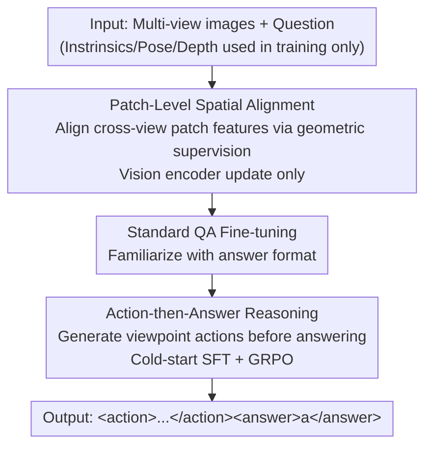

# From Correspondence to Actions: Human-Like Multi-Image Spatial Reasoning in Multi-modal Large Language Models

**Conference**: ICML2026  
**arXiv**: [2602.08735](https://arxiv.org/abs/2602.08735)  
**Code**: https://stjohn2007.github.io/HATCH_project/ (Project Page)  
**Area**: Multimodal VLM / Spatial Reasoning / Reinforcement Learning  
**Keywords**: Multi-image Spatial Reasoning, Cross-view Correspondence, Viewpoint Transformation, GRPO, Geometric Supervision

## TL;DR
Inspired by human spatial cognition, HATCH designs two complementary training objectives for MLLMs: aligning cross-view patch features using geometric supervision (PaStA), and using reinforcement learning to force models to generate explicit "viewpoint change actions" before answering (ActoR). Using only a 3B base model, it achieves multi-image spatial reasoning performance comparable to GPT-5.2.

## Background & Motivation

**Background**: Multimodal Large Language Models (MLLMs) perform well in single-image spatial reasoning, but many real-world scenarios (multiple surveillance cameras, multi-robot coordination) require integrating information from **multiple viewpoints of the same physical scene**. Such multi-image reasoning requires models to not only understand each image independently but also align and fuse local observations from different perspectives into a unified spatial understanding.

**Limitations of Prior Work**: Existing models are unreliable in aggregating information across views. Prevailing methods either rely on brute-force large-scale QA fine-tuning without explicit multi-image mechanisms, inject correspondence implicitly via specialized 3D models/geometric encoders, or embed viewpoint transformations into map-based or task-specific pipelines. These approaches only address the key mechanisms **partially or implicitly**, lacking explicit supervision for core capabilities.

**Key Challenge**: Cognitive science indicates that human multi-image spatial reasoning relies on two mechanisms: (1) **cross-view correspondence**, identifying regions in different views pointing to the same physical location despite changes in appearance, occlusion, or partial overlap; and (2) **stepwise viewpoint transformation**, combining relative viewpoint changes (e.g., rotation, translation) step-by-step. However, prior work has never **jointly and explicitly** integrated these two mechanisms into a single learning objective.

**Goal**: Design a training framework providing **explicit supervision** for both human cognitive mechanisms while ensuring no dependence on extra geometric inputs (intrinsics, pose, depth) during inference; these signals are used only during training to construct supervision.

**Core Idea**: Decouple "how to see" and "how to act" into two sequential training stages: PaStA teaches the model "how to see" (aligning cross-view patch features via geometry), and ActoR teaches the model "how to act" (generating explicit viewpoint transition actions before answering via RL).

## Method

### Overall Architecture

HATCH (Human-Aware Training for Cross-view correspondence and viewpoint cHange) takes a set of images $\mathcal{I}=\{I_1,\dots,I_N\}$ from different views and a natural language question $Q$ as input to produce an answer. During training, it assumes access to camera intrinsics, poses, and depth maps—but these geometric signals are **only used for supervision** and never as model inputs; the model only sees images and questions at inference.

The methodology corresponds to the two cognitive mechanisms through two complementary, **sequentially** applied objectives: PaStA first updates only the vision encoder (LM frozen) to align cross-view features; then ActoR trains the full model to generate explicit viewpoint transition actions. A standard QA fine-tuning step is inserted between them to familiarize the model with the answer format.

### Key Designs

**1. Patch-Level Spatial Alignment (PaStA): Aligning Cross-view Patches via Geometric Supervision**

A core failure mode in multi-image scenarios is that regions pointing to the same physical location in different views map to inconsistent features in the representation space, forcing the model to infer alignment implicitly. PaStA uses training-time geometric information to construct **patch-level correspondence targets** for explicit vision encoder supervision. Specifically, images are divided into $n\times n$ patches. Intrinsics, poses, and depth maps are used to calculate cross-view patch-to-patch overlap matrices: for patch $i$ in image $X$, pixels are back-projected to 3D and projected onto image $Y$. If the projected depth matches $Y$'s depth within threshold $t$, it is geometrically consistent, yielding a directional overlap matrix $M_{X\rightarrow Y}[i,j]$. This is symmetrized as:

$$S=\tfrac{1}{2}\left(M_{X\rightarrow Y}+M_{Y\rightarrow X}^{\top}\right),$$

where $S[i,j]\in[0,1]$ quantifies spatial correspondence intensity. The geometric target distribution $p(j\mid i)=\mathrm{softmax}_j(S[i,:]/\tau_1)$ is aligned with the predicted distribution $q(j\mid i)=\mathrm{softmax}_j(\cos(\mathbf{e}_i^X,\mathbf{e}_:^Y)/\tau_2)$ based on feature similarity by minimizing the cross-entropy $\mathcal{L}_{\text{CL}}$ bidirectionally. Soft targets $p$ tolerate partial overlaps and occlusions. This stage **updates only the vision encoder and freezes the language model** to avoid entangling correspondence learning with language generation.

**2. Action-then-Answer Reasoning (ActoR): Viewpoint Change as Explicit Intermediate Reasoning**

Even with aligned features, answering multi-image questions often requires **composing** viewpoint changes to synthesize evidence. Instead of letting this composition happen implicitly, ActoR treats viewpoint transitions as **explicit actions** serving as interpretable intermediate representations, similar to Chain-of-Thought. For all unordered image pairs $(i,j),\,i<j$, the model generates action sequences:

$$\mathcal{A}=\{(i,j,\mathbf{a}_{i\rightarrow j})\mid 1\le i<j\le N\},$$

where each $\mathbf{a}_{i\rightarrow j}$ is a series of atomic camera operations (turn_left/right_deg, turn_up/down_deg, move_forward_m, move_up/down_m). The output follows the `<action> 𝒜 </action> <answer> a </answer>` format.

**3. Cold-Start SFT + GRPO with Verifiable Rewards: Format then Refine**

ActoR does not use RL directly. First, **cold-start SFT** is performed by decomposing relative camera transforms into rotation and translation to construct teacher sequences, purely to **familiarize the model with the Action-then-Answer structure**. Subsequently, **GRPO** is used for refinement with a weighted reward:

$$R=\lambda_1 R_{\text{act-acc}}+\lambda_2 R_{\text{ans-acc}}+\lambda_3 R_{\text{format}},$$

where $R_{\text{act-acc}}$ evaluates geometric accuracy of generated actions (comparing predicted vs. target motion vectors), $R_{\text{ans-acc}}$ evaluates answer correctness, and $R_{\text{format}}$ is a binary format check. This "geometrically verifiable + answer verifiable" reward system aligns intermediate supervision directly with viewpoint transformation.

### Loss & Training

The training recipe is phased: ① PaStA tunes the vision encoder for cross-view correspondence; ② Standard QA fine-tuning (without action labels) familiarizes the MLLM with the task; ③ ActoR (SFT + GRPO) enhances action generation and final answers. Computational overhead is controlled: PaStA only updates the encoder; cold-start SFT uses only 10% of the data; and the action reward in GRPO is a simple geometric comparison. Training uses 10,000 multi-image samples from SPAR-7M with a Qwen2.5-VL-3B base.

## Key Experimental Results

### Main Results

Evaluated on three benchmarks: SPAR-Bench-MV, MindCube-Tiny, and MMSI-Bench. HATCH shows an average gain of **+14.2%** over the Qwen2.5-VL-3B base, achieving the highest scores among all 3B-base models.

| Model | SPAR-Bench-MV | MindCube-Tiny | MMSI-Bench | Overall |
|------|---------------|---------------|------------|---------|
| Qwen2.5-VL-3B (Base) | 24.9 | 37.8 | 25.6 | 29.4 |
| SpatialLadder-3B (Main baseline) | 35.8 | 46.8 | 23.6 | 35.4 |
| Spatial-MLLM-4B | 30.4 | 37.6 | 24.1 | 30.7 |
| Qwen2.5-VL-72B | 35.4 | 42.2 | 31.8 | 36.5 |
| **HATCH (3B)** | **53.6** | **50.2** | 27.0 | **43.6** |
| GPT-5.2 (Proprietary, Ref) | 52.6 | 58.4 | 42.0 | 51.0 |

Compared to the base, HATCH gains +28.7 points on SPAR-Bench-MV and **surpasses 32B/72B open-source models** and specialized 7B spatial models despite using only a 3B base. On SPAR-Bench-MV, it **matches GPT-5.2 (53.6% vs 52.6%)**.

### Ablation Study

Ablation on SPAR-Bench-MV (subscripts indicate changes relative to full HATCH):

| Configuration | Low | Middle | High | Avg. | Note |
|------|-----|--------|------|------|------|
| HATCH (Full) | 41.3 | 47.4 | 67.1 | 53.6 | All components |
| w/o PaStA | 39.3 | 43.5 | 67.4 | 52.0 (-1.6) | Remove correspondence |
| w/o ActoR | 35.4 | 45.8 | 66.5 | 51.1 (-2.5) | Remove action reasoning |
| w/o both | 36.9 | 44.8 | 67.1 | 51.5 (-2.1) | QA cold-start SFT only |

### Key Findings
- **Complementary Components**: Removing PaStA hurts the "Middle" category (cross-view reasoning under viewpoint change) most (-3.9 pts), confirming its role in viewpoint-invariant representations. Removing ActoR primarily affects "Low" (depth/distance estimation, -5.9 pts), showing explicit actions aid geometric inference.
- **Phased Training Dynamics**: During GRPO, action rewards rise first, followed by QA rewards, validating the design where viewpoint actions assist answering.
- **Patch Grid Sensitivity**: PaStA performs best at $n=4$; resolutions $n\ge5$ decrease performance as excessive granularity disrupts correspondence learning.

## Highlights & Insights
- **Verifiable Supervision for Two Mechanisms**: Combining geometric alignment loss for correspondence and geometric action rewards for transformation creates a robust framework where "how to see" and "how to act" complement each other.
- **Geometry-Free Inference**: Geometric info is used only for supervision. The model has zero extra geometric dependencies at inference, making it suitable for deployment without 3D sensors.
- **Spatial Chain-of-Thought**: Treating viewpoint transitions as explicit action sequences makes spatial reasoning interpretable and verifiable, with low computational overhead for rewards.

## Limitations & Future Work
- **Static Scene Assumption**: The method assumes geometric consistency across views; PaStA's supervision is not applicable to dynamic scenes.
- **Training Label Requirement**: Requires intrinsics, pose, and depth during training, limiting available data sources.
- **MMSI-Bench Performance**: Gains are minimal in non-spatial categories (Attribute/Motion), suggesting HATCH primarily solves viewpoint-related spatial problems.

## Related Work & Insights
- **vs SpatialLadder / MindCube**: They use GRPO with verifiable rewards for abstract intermediate representations (mental maps); HATCH's ActoR grounds the intermediate steps in **concrete viewpoint actions**.
- **vs Spatial-MLLM / Geometric Encoders**: They inject correspondence **implicitly** via 3D modules; HATCH achieves **explicit** patch-level alignment and requires no 3D modules at inference.
- **vs CroCo**: CroCo uses cross-view completion for representation learning but lacks direct multi-image reasoning support; HATCH adapts geometric alignment specifically for reasoning tasks.

## Rating
- Novelty: ⭐⭐⭐⭐⭐ 
- Experimental Thoroughness: ⭐⭐⭐⭐ 
- Writing Quality: ⭐⭐⭐⭐⭐ 
- Value: ⭐⭐⭐⭐⭐ 

<!-- RELATED:START -->

## Related Papers

- [\[ICML 2026\] Vision-aligned Latent Reasoning for Multi-modal Large Language Model](vision-aligned_latent_reasoning_for_multi-modal_large_language_model.md)
- [\[ACL 2026\] OMIBench: Benchmarking Olympiad-Level Multi-Image Reasoning in Large Vision-Language Models](../../ACL2026/vlm_reasoning/omibench_benchmarking_olympiad-level_multi-image_reasoning_in_large_vision-langu.md)
- [\[CVPR 2026\] Evolving Contextual Safety in Multi-Modal Large Language Models via Inference-Time Self-Reflective Memory](../../CVPR2026/vlm_reasoning/evolving_contextual_safety_in_multi-modal_large_language_models_via_inference-ti.md)
- [\[CVPR 2026\] Mimic Human Cognition, Master Multi-Image Reasoning: A Meta-Action Framework for Enhanced Visual Understanding](../../CVPR2026/vlm_reasoning/mimic_human_cognition_master_multi-image_reasoning_a_meta-action_framework_for_e.md)
- [\[CVPR 2026\] dMLLM-TTS: Self-Verified and Efficient Test-Time Scaling for Diffusion Multi-Modal Large Language Models](../../CVPR2026/vlm_reasoning/dmllm-tts_self-verified_and_efficient_test-time_scaling_for_diffusion_multi-moda.md)

<!-- RELATED:END -->
