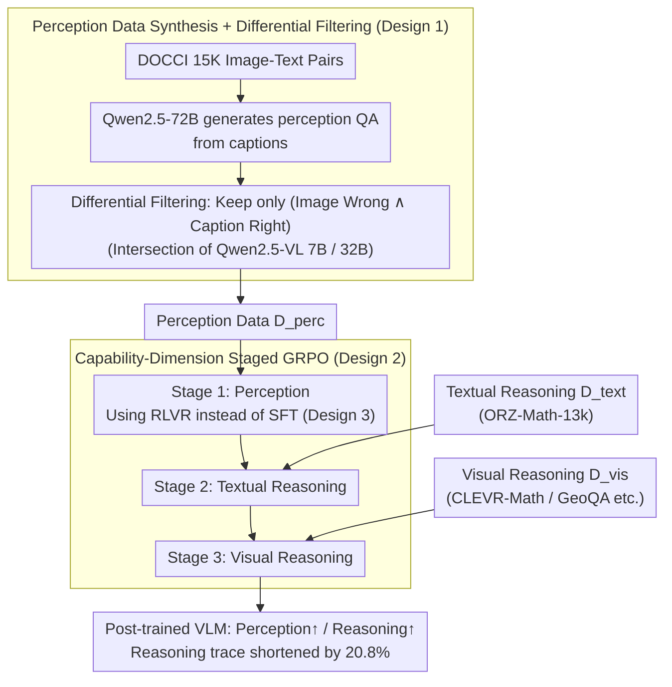

# From Seeing to Thinking: Decoupling Perception and Reasoning Improves Post-Training of Vision-Language Models

**Conference**: ICML 2026  
**arXiv**: [2605.20177](https://arxiv.org/abs/2605.20177)  
**Code**: https://ucsc-vlaa.github.io/VLM-CapCurriculum/ (Project Page)  
**Area**: Multimodal VLM  
**Keywords**: Visual Perception, Staged Post-training, Capability-dimension Curriculum, RLVR, Visual Mathematical Reasoning

## TL;DR
This paper argues that current VLM post-training overemphasizes "long-chain reasoning" while neglecting perception bottlenecks. It explicitly decouples post-training into three independent stages: "Visual Perception $\rightarrow$ Textual Reasoning $\rightarrow$ Visual Reasoning," using RLVR (instead of caption SFT) to specifically refine perception. This approach improves Qwen3-VL-8B by approximately +5.9% and +1.2% on visual math and perception benchmarks, respectively, while shortening reasoning traces by 20.8%.

## Background & Motivation

**Background**: Following DeepSeek-R1, the mainstream paradigm for VLM post-training involves "long-chain CoT + RLVR," co-optimizing tasks like VQA, geometry, chart understanding, and visual math in a single stage (e.g., Mixed Reward in LLaVA-CoT or VLAA-Thinker), hoping the model improves accuracy by "thinking longer."

**Limitations of Prior Work**: The authors performed an attribution analysis of Qwen3-VL-8B errors across three visual math datasets using Claude-Haiku-4.5. They found that **86.9% of incorrect answers originated from errors in the first step of image perception**, rather than subsequent reasoning failures. Once perception fails, elongated chain-of-thought only "rationalizes" incorrect premises, often repeating the same erroneous reading even after re-examining the image.

**Key Challenge**: Merged training (mixing perception and reasoning data) assumes all capabilities can be optimized via the same reward signal. However, visual perception is a more fundamental capability than reasoning and requires specialized objectives and data. If reasoning is prioritized, the model develops a "long-chain + self-persuasion" behavioral pattern without aligning visual features, leading to a "perception tax" where reasoning-only training drops MMStar performance by 1.6%.

**Goal**: (1) Demonstrate that perception must be trained separately with specialized data; (2) Identify the optimal sequence of stages; (3) Compare whether caption-SFT or RLVR is more suitable for learning perception; (4) Unify "capability-dimension stages" and traditional "difficulty-increasing curriculum learning" into a single framework.

**Key Insight**: Post-training should be viewed as sequentially shaping three capabilities: visual perception, textual reasoning, and visual reasoning. If perception is the "scaffolding" for subsequent reasoning, it should be solidified before visual reasoning; otherwise, learning reasoning first may contaminate the learning signals for perception.

**Core Idea**: Organize post-training using a "capability-dimension curriculum" $\mathcal{D}_{\text{perc}} \rightarrow \mathcal{D}_{\text{text}} \rightarrow \mathcal{D}_{\text{vis}}$, utilizing RLVR instead of caption SFT during the perception stage.

## Method

### Overall Architecture
The method consists of two main components: **(1) Perception Data Synthesis**—reverse-generating "perception-essential" QA from 15K DOCCI image-text pairs and filtering for samples that truly test perception via "Image vs. Caption" contrast; **(2) Staged GRPO Training**—sequentially running the same number of epochs for the three data categories in the order $\mathcal{D}_{\text{perc}} \rightarrow \mathcal{D}_{\text{text}} \rightarrow \mathcal{D}_{\text{vis}}$. Each stage uses identical GRPO hyperparameters with the vision encoder unfrozen throughout. The result is a VLM that is stronger in both visual math and perception with shorter reasoning traces.

### Key Designs

**1. Perception Data Synthesis + Dual-model Differential Filtering: Creating "Perception-Essential" QA to prevent language prior leakage**

To train perception independently, the authors need perception questions that cannot be guessed via language priors. They use Qwen2.5-72B to generate perception-focused QA pairs $(Q,A)=f_{\text{gen}}(C)$ from fine-grained DOCCI captions. Each candidate is tested via two paths: providing only the image $\hat{A}_{\text{img}}=f_\theta(I,Q)$ and providing only the caption $\hat{A}_{\text{cap}}=f_\theta(C,Q)$. Samples are retained only if $\mathbb{I}[\hat{A}_{\text{img}}\neq A]\land\mathbb{I}[\hat{A}_{\text{cap}}=A]$. This "reverse engineering" ensures that if a sample can be answered via caption, it tests language rather than vision; only samples where "the caption works but the image fails" expose true perception deficits.

**2. Capability-Dimension Staged GRPO: Establishing "Seeing" before "Reasoning"**

While merged training assumes a single reward can optimize all skills, perception is more foundational. Training reasoning first causes the model to rationalize mistakes. The authors use the GRPO loss:

$$\mathcal{J}_{\text{GRPO}}(\theta)=\mathbb{E}_{x,y}\Big[\tfrac{1}{G}\sum_i \min(\rho_i A_i, \text{clip}(\rho_i,1-\epsilon,1+\epsilon)A_i)\Big] - \beta\, \text{KL}(\pi_\theta\|\pi_{\text{ref}}),$$

training in the sequence $\mathcal{D}_{\text{perc}} \rightarrow \mathcal{D}_{\text{text}} \rightarrow \mathcal{D}_{\text{vis}}$. The rewards $R(x,y_i)=r_{\text{acc}}+r_{\text{format}}$ are consistent across stages. Total steps (930) are divided by epoch into 90 / 375 / 465 to match the merged baseline. The vision encoder remains unfrozen to prevent the refined visual representations from drifting in later stages. This "capability curriculum" is orthogonal to traditional difficulty-based curricula.

**3. RLVR for Perception instead of Caption-based SFT: Avoiding low-quality caption contamination**

Traditional SFT using full captions as targets often injects off-policy supervision that harms existing capabilities due to lower caption quality compared to pre-training data. Since perception QA naturally requires short answers (colors, spatial relations), the authors use exact match as $r_{\text{acc}}$ for on-policy GRPO sampling. This keeps the model near its current policy. Experiments show that replacing RL with SFT in the perception stage results in performance drops of 8.1% on WeMath for Qwen2.5-VL-7B and 1.6% for Qwen3-VL-8B.

### Loss & Training
GRPO group size $G=5$, max response length 2048. Steps for the three stages are 90 / 375 / 465 (totaling 930 to match the merged baseline). The vision encoder is frozen in the merged baseline but unfrozen in the staged approach. Training utilized 8×H200 GPUs with the EasyR1 framework and Claude-Haiku-4.5 as the judge.

## Key Experimental Results

### Main Results

Using Qwen3-VL-8B as the backbone compared to other reasoning VLMs (Acc %):

| Model | MathVista | WeMath | RWQA | MMStar | Overall AVG |
|------|-----------|--------|------|--------|-------------|
| Qwen3-VL-8B (Base) | 72.40 | 50.86 | 70.85 | 70.00 | 62.19 |
| OneThinker-8B | 75.10 | 54.57 | 71.50 | 70.20 | 64.87 |
| **Qwen3-VL-8B (Staged, Ours)** | **75.90** | **56.10** | **74.51** | **73.07** | **65.77** |

Compared to base: WeMath +5.24, RWQA +3.66, MMStar +3.07. Compared to the strong baseline OneThinker: WeMath +1.53, RWQA +3.01, MMStar +2.87.

### Ablation Study: Training Paradigm and Stage Order

| Configuration (Qwen3-VL-8B) | Vis Math AVG | Perception AVG | Overall | Note |
|--------------------|--------------|----------------|---------|------|
| Base | 45.17 | 79.21 | 62.19 | No post-training |
| Merged | 49.64 | 79.71 | 64.67 | Standard baseline |
| Staged 1→2→3 (Perc→Text→Vis) | **51.10** | **80.44** | **65.77** | Default |
| Stage order 3→2→1 (Reasoning back to Perc) | 37.70 (7B) | 74.17 (7B) | 55.93 (7B) | Drops 4.6% vs. 1→2→3 |
| Perception via Caption SFT | -1.6 on WeMath | — | — | 8B; -8.1% on 7B |

### Key Findings
- **Perception errors are the true bottleneck**: 86.9% of Qwen3-VL-8B errors stem from perception. Reasoning-only post-training triggers a "perception tax" (MMStar drops 1.6% on Qwen2.5-VL-7B), while adding perception data increases RWQA by 3.0%.
- **Stage order is critical**: Placing perception last (3→2→1) drops visual math from 42.3% to 37.7% on Qwen2.5-VL-7B, lower than the merged baseline. Early long-chain behaviors override the low-noise gradients of the perception stage.
- **Shorter reasoning $\neq$ Weaker reasoning**: The staged model response length is 20.8% shorter than the merged version (445 vs. 562 tokens), yet visual math accuracy is 1.46% higher. Improved perception naturally streamlines the chain-of-thought.
- **Curriculum dimensions are additive**: Capability-dimension curriculum (staged) is orthogonal to difficulty-dimension curriculum. Combining both yields a +4.43% gain over the merged baseline.

## Highlights & Insights
- **Revisiting "Long-Chain CoT Universalism"**: A simple error attribution experiment (86.9% perception errors) challenges the assumption that "longer reasoning is always better." This "diagnose before prescribing" research paradigm is applicable across various model scaling scenarios.
- **Differential Filtering for Perception Data**: Using "Image Wrong ∧ Caption Right" as a selection criterion is a clever reverse-engineering method. It identifies perception blind spots without manual labeling, a logic applicable to audio, video, or 3D modalities.
- **Capability-Dimension as a New Design Degree of Freedom**: Traditional curricula focus on difficulty; this work introduces "capability" as an orthogonal dimension, opening a unified perspective for multi-stage post-training (e.g., decoupling RLHF, DPO, and RLVR).

## Limitations & Future Work
- The fixed epoch/step ratio across stages may not be optimal; adaptive stopping or dynamic weights were not explored.
- Perception data is based on DOCCI natural image captions, offering limited coverage for charts, tables, or dense OCR (DocVQA gains were smaller).
- Validation was limited to Qwen and InternVL series (up to 32B); scaling laws for 70B+ models or non-Transformer-Decoder architectures remain untested.
- The judge model (Claude-Haiku-4.5) has a 82.5% perception-error labeling accuracy; the 86.9% bottleneck figure may be slightly over- or underestimated.

## Related Work & Insights
- **vs. Reasoning-only RL (OneThinker / WeThink)**: These treat perception as a pre-training byproduct. This paper proves that "explicit perception modeling" is more efficient than simply increasing reasoning RL data.
- **vs. Difficulty Curriculum (Curr-ReFT / PC-GRPO)**: Traditional curricula order data by difficulty; this method orders by capability (perception $\rightarrow$ reasoning). The two are complementary.
- **vs. Perception Benchmarks (VisOnlyQA / NoReGeo)**: While those works "diagnose" the bottleneck, this paper provides the "prescription" through a specific data synthesis and training protocol.

## Rating
- Novelty: ⭐⭐⭐⭐ Defines capability-dimension as a new orthogonal curriculum dimension.
- Experimental Thoroughness: ⭐⭐⭐⭐⭐ Cross-backbone validation, 8 benchmarks, stage-order analysis, and SFT/RL comparisons.
- Writing Quality: ⭐⭐⭐⭐ Clear narrative flow (Diagnosis $\rightarrow$ Decoupling $\rightarrow$ Sequencing $\rightarrow$ RLVR).
- Value: ⭐⭐⭐⭐ A low-cost, high-reward correction to current VLM post-training pipelines.

<!-- RELATED:START -->

## Related Papers

- [\[ICML 2026\] Bad Seeing or Bad Thinking? Rewarding Perception for Vision-Language Reasoning](bad_seeing_or_bad_thinking_rewarding_perception_for_vision-language_reasoning.md)
- [\[ICML 2026\] From Shortcuts to Reasoning: Robust Post-Training of Theory of Mind with Reinforcement Learning](from_shortcuts_to_reasoning_robust_post-training_of_theory_of_mind_with_reinforc.md)
- [\[CVPR 2026\] Improving Vision-language Models with Perception-centric Process Reward Models](../../CVPR2026/vlm_reasoning/improving_vision-language_models_with_perception-centric_process_reward_models.md)
- [\[CVPR 2026\] Seeing What Matters: A Training-Free Self-Guided Framework for Multimodal Detail Perception and Reasoning](../../CVPR2026/vlm_reasoning/seeing_what_matters_a_training-free_self-guided_framework_for_multimodal_detail_.md)
- [\[CVPR 2026\] Dr. Seg: Revisiting GRPO Training for Visual Large Language Models through Perception-Oriented Design](../../CVPR2026/vlm_reasoning/dr_seg_revisiting_grpo_training_for_visual_large_language_models_through_percept.md)

<!-- RELATED:END -->
