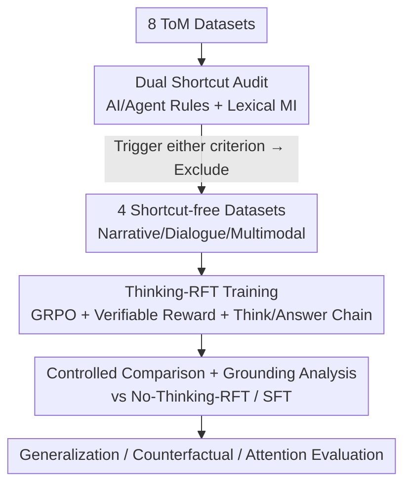

# From Shortcuts to Reasoning: Robust Post-Training of Theory of Mind with Reinforcement Learning

**Conference**: ICML 2026  
**arXiv**: [2606.09092](https://arxiv.org/abs/2606.09092)  
**Code**: https://github.com/jkz-338/Robust-ToM-RL  
**Area**: LLM Reasoning / Theory of Mind (ToM) / Reinforcement Learning Fine-Tuning  
**Keywords**: Theory of Mind, RLVR, Thinking-RFT, Data Shortcut, Verifiable Reward

## TL;DR
The authors first reveal that mainstream ToM datasets are contaminated by "shortcuts" (achieving 99% accuracy via spurious correlations rather than true mental reasoning). They propose a lightweight auditing framework to filter these datasets and systematically demonstrate on four shortcut-free datasets that reinforcement fine-tuning with explicit reasoning chains (Thinking-RFT) outperforms SFT by 6% on average (approximately 10% in higher-order/multimodal scenarios) and exhibits better generalization and counterfactual robustness because RL teaches the model to anchor reasoning on true causal cues.

## Background & Motivation
**Background**: Equipping foundation models with Theory of Mind (ToM)—the ability to infer others' beliefs, intentions, desires, and knowledge—is considered a key capability for safe and natural human-AI interaction. Recent work primarily follows two paths to improve ToM: first, designing multi-step prompts, agentic frameworks, or Bayesian mental state inference around strong backbones (e.g., GPT-4o); second, using post-training to directly instill the capability into the model.

**Limitations of Prior Work**: The first path involves high inference complexity and deployment difficulties. The second path appears effective, but the authors encountered a strange phenomenon when post-training on standard benchmarks: on Hi-ToM, **higher-order problems were easier than lower-order ones** (3rd/4th order >95%, 1st/2nd order only 89.5%), and the generated reasoning chains were logically chaotic. Manual inspection revealed a near-perfect shortcut: the answer is simply "the location of the object when the outermost agent leaves the scene," requiring no recursive reasoning. LLMs can discover and exploit such shortcuts zero-shot, approaching full marks without training.

**Key Challenge**: Many ToM datasets can be "solved" by **spurious causal/lexical correlations** rather than genuine mental reasoning. While acceptable for evaluation, using them for training leads to: ① inverted rankings of training methods (selecting the wrong strategy); ② masking of model scaling gains; ③ impaired generalization or induced negative transfer; ④ teaching shortcuts instead of reasoning. This prevents an honest answer to "which post-training strategy is best."

**Goal**: The problem is split into two sub-problems: first, **systematically audit** ToM datasets to exclude those with shortcuts; second, **fairly compare** SFT, Thinking-RFT, and No-Thinking-RFT on clean data to clarify when and why explicit reasoning + RL improves ToM.

**Key Insight**: The authors observe that "pure state-tracking (e.g., belief) questions are highly susceptible to shortcuts, while mental questions that go beyond tracking (e.g., intention) are naturally more robust." Thus, both auditing and training are built on distinguishing these two types of problems.

**Core Idea**: A dual criterion of "AI rules + Lexical Mutual Information" is used to filter out shortcut datasets. Subsequently, it is proven that **only the combination of "explicit reasoning chains + verifiable reward RL"** truly activates ToM—the essence of RL is teaching the model to anchor reasoning to critical tokens and state changes corresponding to causal factors.

## Method

### Overall Architecture
Rather than proposing a new model, this paper introduces a research pipeline of "audit first, then train, then attribute," aimed at answering "how to robustly post-train ToM." The process has three stages: ① Scanning 8 popular ToM datasets with a lightweight auditing framework, marking them as having shortcuts if they trigger either causal or lexical criteria, resulting in 4 shortcut-free datasets (OpenToM, ToMATO, MMToM, MuMA-ToM); ② Performing three controlled post-training methods on clean data: SFT, Thinking-RFT (with reasoning chains), and No-Thinking-RFT (without reasoning chains); ③ Attributing the effectiveness of RFT through generalization, counterfactual, and attention visualization analysis.

### Key Designs

**1. Dual-path Shortcut Auditing: Measuring "Fake ToM" with Lightweight Tools**

To address the lack of systematic detection for spurious correlations, the authors designed two computationally cheap, complementary criteria. The first is **AI/Agent-guided Rules**: a frozen LLM enumerates candidate shortcut rules (e.g., "last seen location," "world state leakage in belief questions," "first mentioned agent") on a seed set $\mathcal{D}_{\text{seed}}$. Each rule is implemented as a zero-update heuristic $h_k$, and the hit rate $A(h_k)=\frac{1}{|\mathcal{D}_{\text{probe}}|}\sum_{(x,y)}\mathbf{1}\{h_k(x)=y\}$ is calculated on a held-out slice $\mathcal{D}_{\text{probe}}$. If $A(h_k)-A_0\ge\delta_{\text{abs}}$ (default $\delta_{\text{abs}}=0.2$, where $A_0$ is the baseline) and p-value < 0.05, it is deemed a valid shortcut. The second is **Lexical Mutual Information**: for surface features $Z$ (e.g., context-option overlap), the mutual information $I(Z;Y)$ with the label $Y$ is calculated and normalized by the entropy of $Y$. If the average $S_{\text{lex}}\ge 0.15$, the dataset is flagged.

**2. Thinking-RFT: Reinforcement Learning with Verifiable Rewards and Explicit Reasoning**

To solve the issue where SFT only mimics answers without learning recursive reasoning, the authors adopt the RLVR (Reinforcement Learning from Verifiable Rewards) approach. The optimization follows the **GRPO** (Group Relative Preference Optimization) algorithm from DeepSeek-R1, but with the KL coefficient $\beta$ set to 0. The prompt requires the model to "provide reasoning within `<think>...</think>` and the final answer within `<answer>...</answer>`." Rewards are the sum of format and accuracy rewards: $R_{\text{format}}=1$ if tags are used, and $R_{\text{accuracy}}=1$ if the extracted answer is correct. This is purely rule-verifiable, requiring no reward model.

**3. Controlled Comparison & Grounding Attribution: Disentangling Reasoning and RL**

The authors compare Thinking-RFT with **No-Thinking-RFT** (RL without a reasoning chain) and SFT. Thinking-RFT outperforms No-Thinking-RFT by 7% and SFT by 6%, showing that **ToM gains stem from the combination of "reasoning + RL."** Through attention visualization, it was found that Thinking-RFT teaches the model to ground its attention on "anchor cues"—keywords and state changes—enabling precise recursive reasoning, whereas models trained on shortcut data produce illogical reasoning chains 90% of the time.

## Key Experimental Results

### Main Results
The backbone is Qwen2.5-7B-Instruct and its VL variant. Comparisons include SFT, zero-shot, and test-time algorithms SimToM and AutoToM.

| Scenario / Dataset | Metric | Thinking-RFT | SFT | Gain |
|--------------|------|-------------|-----|---------|
| OpenToM (Narrative, 7B avg) | Acc | 89.14 | 83.14 | +6.0 |
| OpenToM (Attitude, 7B) | Acc | — | — | +11 pts |
| ToMATO (Dialogue) | Acc | — | — | +2.08 |
| MMToM + MuMA-ToM (Multimodal avg) | Acc | 82.20 | 74.75 | +7.45 |
| Multimodal vs Test-time AutoToM | Acc | 82.20 | 58.00 | +24.2 |

In multimodal settings, Thinking-RFT (82.20) significantly outperforms AutoToM (58.00), demonstrating that post-training can directly instill ToM capabilities that previously required complex test-time pipelines.

### Ablation Study (Shortcut Verification / Generalization / Robustness)
Experiments on ExploreToM (shortcut) vs. Hi-ToM (OOD) reveal the harms of shortcut data.

| Configuration | Key Metric | Description |
|------|---------|------|
| Trained on ExploreToM (shortcut), 7B | In-domain 94.3 / OOD 35.3 | Ranking inverted: No-Thinking-RFT > SFT > Thinking-RFT |
| Scaling 3B→7B (shortcut data) | 93–96% plateau | Shortcuts mask scaling gains |
| 1st → 2nd order generalization | RFT 74.33 vs SFT 65.33 | RFT is +9 higher on 2nd order despite similar 1st order performance |
| Cross-dataset (OpenToM→ExploreToM) | RFT 71.0 vs SFT 63.5 | Only Thinking-RFT shows positive transfer on both OOD sets |
| Counterfactual rewriting | RFT drop 7.90 vs SFT drop 17.14 | RFT is more robust to counterfactuals |

### Key Findings
- **Shortcuts are the root cause of "Fake ToM"**: 4 out of 8 datasets (ExploreToM, ToMi, Hi-ToM, FANToM) have severe shortcuts. Training on them inverts rankings, masks scaling, and fails to teach true reasoning.
- **RFT's advantage comes almost entirely from 2nd-order questions**: No gain on 1st-order, but +10.3% over SFT on 2nd-order, indicating strength in recursive belief attribution.
- **Mental Categories > Tracking Categories**: RFT shows larger gains in categories like intention (+3.6 pts) and attitude (+11) than in pure tracking like location, confirming that going beyond state tracking is the core difficulty of ToM.
- **Pure state-tracking is most shortcut-prone**: Questions requiring only belief tracking are easily bypassed by shortcuts, while intention-based questions are naturally more robust.

## Highlights & Insights
- **"Audit data before drawing conclusions" is a valuable methodology**: It points out a neglected systemic trap in ToM post-training—score improvements don't necessarily reflect mental reasoning. This applies to any post-training with synthetic data (math, agents, safety).
- **The auditing framework is "counter-intuitively cheap"**: Simply letting a strong LLM find shortcuts catches ~80% of simple ones, and Lexical MI serves as a backup.
- **Precise disentanglement of "reasoning" and "RL"**: The No-Thinking-RFT design proves that neither component is sufficient alone.
- **Mechanistic attribution via attention grounding**: Showing that RFT teaches models to anchor on keywords/state changes provides a more convincing explanation than simple performance metrics.

## Limitations & Future Work
- **Auditing coverage**: The framework mainly covers "simple" shortcuts; more subtle ones might be missed. The thresholds ($\delta_{\text{abs}}$, $S_{\text{lex}}$) are empirical.
- **Base model variety**: Experiments focused on the Qwen2.5 series; scalability across different architectures remains to be verified.
- **Verifiable reward boundaries**: Rule-based rewards work for definitive ToM questions but might struggle in open-ended mental inference scenarios.
- **Improvement ideas**: The auditing framework could be a continuous "data health check" tool. Counterfactual robustness still shows a performance drop (7.9), suggesting a need for specialized regularization.

## Related Work & Insights
- **vs Test-time ToM (SimToM / AutoToM)**: These rely on complex prompt pipelines; Ours instills the capability directly via post-training, outperforming AutoToM (82.2 vs 58.0).
- **vs SFT Post-training**: SFT often learns shortcuts and has poorer generalization; Thinking-RFT uses exploration + verifiable rewards to achieve +10.3% on 2nd-order tasks.
- **Insight**: Any "synthetic data + post-training" work should perform a shortcut audit first. The "verifiable reward + explicit reasoning" recipe is highly reusable for reasoning tasks with verifiable answers.

## Rating
- Novelty: ⭐⭐⭐⭐⭐ Systematizes shortcut auditing and corrects post-training conclusions in ToM.
- Experimental Thoroughness: ⭐⭐⭐⭐⭐ 8 dataset audits + 4 clean datasets + controlled comparison + grounding analysis.
- Writing Quality: ⭐⭐⭐⭐ Clear logic chains.
- Value: ⭐⭐⭐⭐⭐ Methodological warning and recipe for synthetic data post-training.

<!-- RELATED:START -->

## Related Papers

- [\[CVPR 2026\] MindPower: Enabling Theory-of-Mind Reasoning in VLM-based Embodied Agents](../../CVPR2026/vlm_reasoning/mindpower_enabling_theoryofmind_reasoning_in_vlmba.md)
- [\[ICML 2026\] From Seeing to Thinking: Decoupling Perception and Reasoning Improves Post-Training of Vision-Language Models](from_seeing_to_thinking_decoupling_perception_and_reasoning_improves_post-traini.md)
- [\[ICML 2026\] iVGR: Internalizing Visually Grounded Reasoning for MLLMs with Reinforcement Learning](ivgr_internalizing_visually_grounded_reasoning_for_mllms_with_reinforcement_lear.md)
- [\[ICML 2025\] Overcoming Multi-step Complexity in Multimodal Theory-of-Mind Reasoning: A Scalable Bayesian Planner](../../ICML2025/vlm_reasoning/overcoming_multi-step_complexity_in_multimodal_theory-of-mind_reasoning_a_scalab.md)
- [\[CVPR 2026\] R-C2: Cycle-Consistent Reinforcement Learning Improves Multimodal Reasoning](../../CVPR2026/vlm_reasoning/r-c2_cycle-consistent_reinforcement_learning_improves_multimodal_reasoning.md)

<!-- RELATED:END -->
