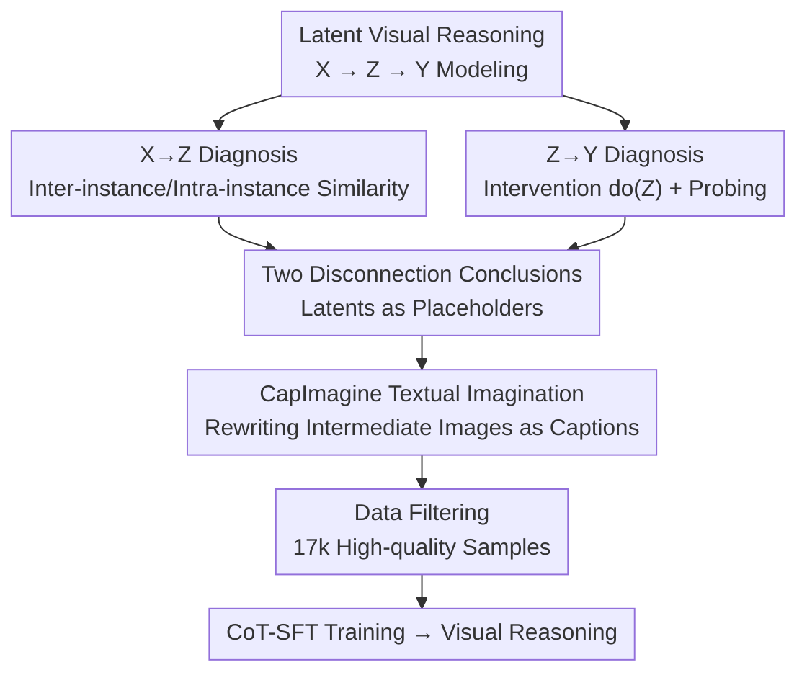

# Imagination Helps Visual Reasoning, But Not Yet in Latent Space

**Conference**: ICML2026  
**arXiv**: [2602.22766](https://arxiv.org/abs/2602.22766)  
**Code**: Open-sourced (as marked in the paper)  
**Area**: Multimodal VLM Reasoning / Visual Reasoning  
**Keywords**: Latent Visual Reasoning, Causal Mediation Analysis, Visual Imagination, Text-space Reasoning, MLLM

## TL;DR
This paper employs causal mediation analysis to decompose "Latent Visual Reasoning (using MLLM hidden states as latent tokens for visual imagination)" into a causal chain $X\to Z\to Y$. Empirical evidence reveals that latent tokens are neither varied with inputs (Input-Latent disconnection) nor significantly impact the final answer (Latent-Answer disconnection), questioning their necessity. Consequently, a simple alternative, CapImagine, is proposed to explicitly write visual imagination as text, outperforming complex latent-space methods on visual perception benchmarks.

## Background & Motivation
**Background**: MLLM visual reasoning has recently gained traction, with complex tasks requiring models to "actively perceive" images. One approach involves tool-use (e.g., zoom-in, drawing lines), which remains rigid and distant from native human imagination; another is Latent Visual Reasoning (LVR / Mirage / Monet), which avoids decoding hidden states into text and instead uses the final Transformer hidden states as "latent tokens" to "imagine" in high-dimensional latent space, supervised by visual features or teacher hidden representations. These have empirically performed well on several visual tasks.

**Limitations of Prior Work**: Despite promising results, "why latent visual reasoning works" remains a black box—no prior work has verified whether MLLMs truly perform deliberate reasoning in the latent space or merely rely on other shortcuts.

**Key Challenge**: If latent tokens neither encode input-related visual information nor truly drive the final answer, their causal contribution to reasoning is illusory, rendering the entire paradigm's "necessity" questionable.

**Goal**: (i) Systematically examine the true role of latent tokens in the $X\to Z\to Y$ chain using causal tools; (ii) If latents are ineffective, identify a more faithful, interpretable, and causally effective alternative.

**Key Insight**: Modeling latent reasoning as a causal mediation process—where the input $X$ is the treatment, the latent token $Z$ is the mediator, and the answer $Y$ is the outcome—and performing interventions $P(Z\mid do(X))$ and $P(Y\mid do(Z))$ to verify if the mediation path is functional.

**Core Idea**: First, prove that "latent imagination is currently ineffective" via causal mediation analysis, then demonstrate that "imagination is actual and stronger in text space" through CapImagine, a minimal data modification that explicitly writes visual imagination as text.

## Method

### Overall Architecture
The paper follows a two-stage "Diagnosis and Prescription" structure. The diagnosis segment abstracts latent reasoning into a causal chain $X\to Z\to Y$ and applies systematic perturbations to both input and latent ends to test the validity of $X\to Z$ and $Z\to Y$ causal links. The conclusion is that both links are disconnected (supplemented by a probe analysis showing minimal visual semantics in latents). The prescription segment introduces CapImagine: instead of relying on latent variables, it rewrites all semantic changes brought by "intermediate imagined images" in training data into text captions, forcing the model to "imagine" visual transformations via an explicit text reasoning chain. Input consists of image sets $\{I_i\}$ and a question $q$. Formally, latent reasoning adaptively switches between "standard text tokens" and "latent tokens" at each step:

$$y_i=\mathbb{I}(i\in\mathcal{I}_L)\cdot\phi(h_i)+\mathbb{I}(i\notin\mathcal{I}_L)\cdot E(\text{Decode}(h_i)),$$

where $h_i$ is the hidden state, $\mathcal{I}_L$ is the set of latent token indices, and $\phi$ is an optional projection layer. CapImagine retains the entire chain within the text space.

### Key Designs

**1. Causal Mediation Analysis Framework: Turning "Are Latents Useful?" into an Interventional Causal Problem**

To address the "black box" nature of latent reasoning, the authors explicitly model the process as a causal chain $X\to Z\to Y$ and use do-calculus to test the edges. This framework distinguishes whether the "model is correct" versus "the latent truly participated in reasoning"—the latter requiring the mediator $Z$ to vary with treatment $X$ and exert a causal effect on outcome $Y$. Analysis covers three representative methods (Monet, LVR, Mirage) compared against text/image tokens and internal MLLM representations.

**2. Empirical Diagnosis of Two Disconnections: Input-Latent + Latent-Answer**

For $X\to Z$, input perturbations show that latent tokens exhibit extremely high cosine similarity across different instances and tasks, suggesting they fail to encode image/question info even at a coarse task level. Intra-instance analysis shows that as reasoning progresses, latent tokens gradually collapse into highly similar clusters, while text reasoning hidden states maintain low similarity and clear state transitions. For $Z\to Y$, intervention $do(Z)$ (clamping latents to a single tensor, injecting Gaussian noise, or zeroing out) causes minimal performance fluctuations on V*, HR-Bench, and MME-RealWorld-Lite ($<1.0\%$ drop). Probing analysis further shows that attempting to answer questions using only latent tokens as input yields accuracy worse than random guessing. Combined, these findings suggest latent tokens act more like soft prompts or placeholders than active carriers of visual imagination.

**3. CapImagine Text-space Imagination + Data Filtering: Descriptive Captions as Latent Replacements**

CapImagine moves visual imagination back to text. Based on Monet-SFT-125K, it performs two types of rewriting: for "zooming in" subsets (Visual-CoT / Zebra-CoT), Qwen3-VL-4B generates concise captions for the highlighted regions; for "annotation/drawing" subsets (Refocus / CogCoM), the model describes visual differences and explicit information revealed by the operation (e.g., annotated values). To maintain logical coherence, an MLLM is used to polish the entire reasoning chain. Furthermore, 94.88% of Visual-CoT data in Monet-SFT is filtered out due to quality issues (conflicts or ambiguity), leaving 17k high-quality samples for training.

### Loss & Training
No new loss functions are introduced. The model, based on Qwen2.5-VL-7B, undergoes standard CoT-SFT on the reconstructed data using the Monet codebase. Training uses 8×A800-80G GPUs, batch size 1, gradient accumulation 16, with the best checkpoint selected based on training performance to mitigate instability. The "method" is essentially a transformation of the data format (latent supervision $\to$ textual imagination).

## Key Experimental Results

### Main Results
On benchmarks focused on high-resolution fine-grained perception (V*, HR-Bench, MME-RealWorld-Lite, BLINK), CapImagine is compared against latent methods, tool-based methods, and proprietary models:

| Method | Category | V* | HR-Bench-8K | MME-RW-Lite | BLINK-MV |
|------|------|------|------|------|------|
| Qwen2.5VL-7B | Base | 76.4 | 63.8 | 45.8 | 42.9 |
| LVR | Latent | 81.7 | 63.0 | 50.6 | 46.6 |
| Monet | Latent | 83.3 | 68.0 | 46.9 | 47.4 |
| DeepEyes | Tool | 90.0 | 72.6 | 53.2 | - |
| **CapImagine** | Textual | **85.9** | **70.7** | **54.8** | **49.6** |

CapImagine outperforms Monet by ~2.6% on V*, ~2.7% on HR-Bench-8K, and improves MME-RealWorld-Lite from 46.9 to 54.8. It shows significant gains (>10 points) in abstract reasoning tasks (Jigsaw, Multi-view) and improves by ~6.1% on TableVQA over Monet.

### Ablation Study
Ablation on CapImagine's two-step data transformation (V*/HR-Bench-8K Overall):

| Config | V* | HR-Bench-8K | Description |
|------|------|------|------|
| CapImagine (Full) | 85.9 | 70.7 | Rewriting + Filtering |
| w/o Rewriting | 82.7 | 69.8 | Drop to near Monet levels without text rewriting |
| w/o Filtering | 82.7 | 69.3 | Performance hindered by low-quality data |

Removing either component leads to significant performance drops, highlighting the necessity of both explicit verbalization and quality control.

### Key Findings
- Extreme interventions on latent tokens (noise, zeroing) cause $\le 1\%$ fluctuation, providing direct evidence of Latent-Answer disconnection.
- Latent-only probing performs worse than random guessing, despite the same model achieving 76.67% when provided with the original image.
- CapImagine outperforms Monet using only 17k filtered samples from the original 125k dataset, proving explicit textual imagination preserves more actionable visual semantics than latent imagination.

## Highlights & Insights
- The introduction of causal mediation analysis to test "latent reasoning effectiveness" is a methodological highlight, cleanly separating "correct results" from "true mediation."
- The conclusion that "latent tokens resemble soft prompts or placeholders" is backed by solid evidence across homogeneity, intervention insensitivity, and probe failure.
- The shift from implicit latent transformations to explicit textual verbalization offers a transferable pipeline for multimodal reasoning data ("image difference $\to$ caption $\to$ polish $\to$ filter").

## Limitations & Future Work
- The diagnostic conclusion applies to *current* latent methods rather than the *principle* of latent imagination (as noted in the title "Not Yet").
- Causal analysis was conducted on a limited sample size (e.g., 100 instances, 30 probe questions), and its generalizability to stronger future latent supervision remains to be seen.
- CapImagine still lags behind RL-based tool methods (DeepEyes) in pure perception, indicating that textual imagination does not yet fully replace the complementary benefits of real image re-projection.

## Related Work & Insights
- **vs. Tool-augmented Visual Reasoning (DeepEyes / PixelReasoner)**: These use fixed tools or RL for active perception of real pixels. CapImagine is more lightweight but slightly less effective in raw perception.
- **vs. Latent Visual Reasoning (Mirage / LVR / Monet)**: While both pursue "imagination," this work uses causal analysis to debunk the effectiveness of current latent tokens and proposes a textual alternative.
- **vs. Existing Text-space Reasoning (Vision-R1 / R1-Onevision)**: Unlike standard CoT, CapImagine "anchors" its textual imagination in the semantic rewriting of real intermediate images, making it more faithful than evidence-free long-chain reasoning.

## Rating
- Novelty: ⭐⭐⭐⭐ Excellent use of causal mediation for falsification.
- Experimental Thoroughness: ⭐⭐⭐⭐ Comprehensive diagnosis and benchmarks.
- Writing Quality: ⭐⭐⭐⭐ Clear "Diagnosis-Prescription" structure.
- Value: ⭐⭐⭐⭐ Provides a grounded critique of LVR and a reproducible textual alternative.

<!-- RELATED:START -->

## Related Papers

- [\[CVPR 2026\] Monet: Reasoning in Latent Visual Space Beyond Image and Language](../../CVPR2026/vlm_reasoning/monet_reasoning_in_latent_visual_space_beyond_image_and_language.md)
- [\[ICLR 2026\] Latent Visual Reasoning](../../ICLR2026/vlm_reasoning/latent_visual_reasoning.md)
- [\[ICLR 2026\] Not Search, But Scan: Benchmarking MLLMs on Scan-Oriented Academic Paper Reasoning](../../ICLR2026/vlm_reasoning/not_search_but_scan_benchmarking_mllms_on_scan-oriented_academic_paper_reasoning.md)
- [\[CVPR 2026\] Latent Implicit Visual Reasoning](../../CVPR2026/vlm_reasoning/latent_implicit_visual_reasoning.md)
- [\[ICML 2026\] Vision-aligned Latent Reasoning for Multi-modal Large Language Model](vision-aligned_latent_reasoning_for_multi-modal_large_language_model.md)

<!-- RELATED:END -->
