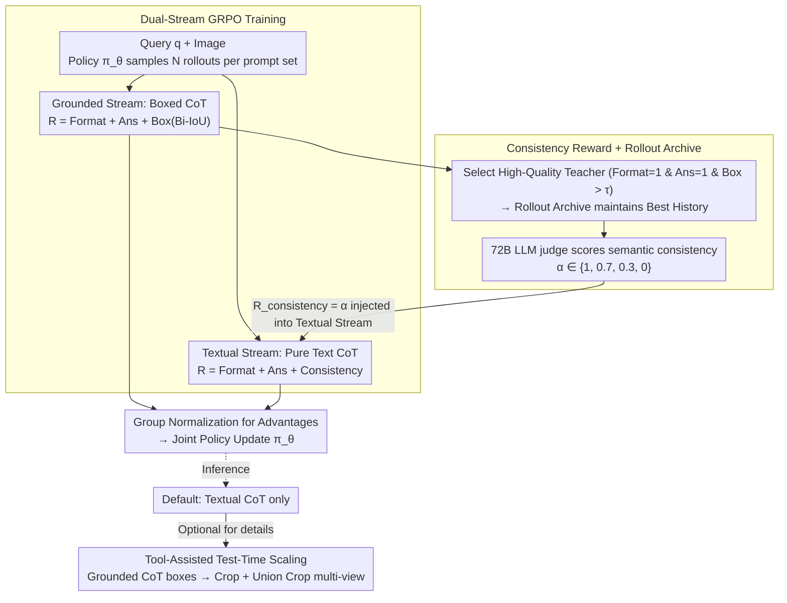

# iVGR: Internalizing Visually Grounded Reasoning for MLLMs with Reinforcement Learning

**Conference**: ICML 2026  
**arXiv**: [2605.31096](https://arxiv.org/abs/2605.31096)  
**Code**: https://visual-ai.github.io/ivgr/ (Project Page)  
**Area**: Multimodal VLM  
**Keywords**: Visual Reasoning, CoT, Reinforcement Learning, GRPO, Consistency Reward

## TL;DR
Addressing the counter-intuitive phenomenon where "explicit visual grounding actually hinders CoT reasoning," the authors propose iVGR—a dual-stream GRPO training framework. It allows textual CoT and grounded CoT (with boxes) to rollout simultaneously. Using a consistency reward, the visual localization capabilities of high-quality grounded trajectories are "internalized" into pure textual CoT, enabling the model to reap the benefits of grounded reasoning without outputting coordinates during inference.

## Background & Motivation

**Background**: In high-resolution fine-grained VQA, standard textual CoT often misses small objects. Consequently, the community has branched into two visually grounded CoT paths: **tool-based streams** like DeepEyes/PixelReasoner, where MLLMs call crop tools during inference to view local areas; and **explicit box streams** like TreeVGR/GRIT, which force models to intersperse bounding box coordinates within the CoT. Both rely on RL methods like GRPO for training to enhance fine-grained perception.

**Limitations of Prior Work**: The authors conducted a set of counter-intuitive experiments. Using models specifically trained for grounded CoT, such as DeepEyes-7B and TreeVGR-7B, they modified only the inference prompts to run standard textual CoT. Results across eight benchmarks (V*, HR4K, HR8K, MME-RW-Lite, etc.) showed that textual CoT actually performed better on average (75.1 vs. 74.1 for DeepEyes; 75.7 vs. 74.7 for TreeVGR). Detailed analysis by IoU bins revealed that the tool-based stream outperformed textual CoT only during high-quality localization ($\mathrm{IoU}>0.5$), while the box stream was surpassed by textual CoT across all IoU intervals.

**Key Challenge**: Explicit grounding during inference simultaneously handles two tasks—"accurate localization" and "final answering"—which compete for token budget and attention. When localization is suboptimal, incorrect coordinates or crops contaminate the final answer, leading to performance degradation.

**Goal**: Decouple "grounding supervision during training" from "mandatory grounding output during inference." The objective is to extract visual priors from grounded CoT during training while allowing the model to execute pure textual CoT during inference to utilize localization capabilities "silently."

**Key Insight**: Since textual CoT performs better at inference, the training direction should be "ensuring the textual CoT still knows where the targets are during generation" rather than "forcing it to write coordinates explicitly." This is equivalent to providing an additional reward during RL training based on whether the textual rollout "looks at the same place" as the grounded "teacher."

**Core Idea**: Roll out two parallel streams under the GRPO framework—a grounded stream (forced boxes) and a textual stream (text only). An LLM-based **consistency reward** is used to align the textual stream with high-quality grounded trajectories, internalizing visual localization into pure textual CoT.

## Method

### Overall Architecture
iVGR performs GRPO post-training on Qwen2.5-VL / Qwen3-VL. For each query $q$, the policy $\pi_\theta$ samples $N$ rollouts for each of two different system prompts, resulting in a grounded set $\mathcal{O}^b$ and a textual set $\mathcal{O}^t$. Both sets calculate individual rewards and undergo group-wise normalization to obtain advantages $\mathcal{A}^b, \mathcal{A}^t$ for a joint policy update. The key coupling point is the **consistency reward** $R_{\text{consistency}}$ added to the textual stream. Its "teacher" is the high-quality trajectories selected from the grounded stream (maintained via a cross-step Rollout Archive for the historical best teacher), thus distilling localization capabilities into the textual stream. At inference, only the textual stream is executed, with an optional tool-assisted test-time scaling workflow for multi-view fusion.

### Key Designs

**1. Dual-Stream GRPO Training: Learning two paradigms with one policy via shared backbone**

Training only on textual CoT lacks visual supervision, while training only on grounded CoT makes localization a "must-do," interfering with answering during inference. iVGR resolves this by running two streams concurrently within the same policy. The grounded stream outputs `<think>...</think><answer>...</answer>` following the TreeVGR format. The reward $R^b_i=R_{\text{format}}+R_{\text{acc}}+R_{\text{box}}$ uses bi-directional IoU matching to balance recall and precision:

$$R_{\text{box}}=\tfrac{1}{2}\Big(\tfrac{1}{|\mathcal{B}_{\text{gt}}|}\sum_{b}\mathrm{MaxIoU}(b,\mathcal{B}_{\text{pred}})+\tfrac{1}{|\mathcal{B}_{\text{pred}}|}\sum_{\hat{b}}\mathrm{MaxIoU}(\hat{b},\mathcal{B}_{\text{gt}})\Big)$$

The textual stream removes box supervision, using the reward $R^t_i=R_{\text{format}}+R_{\text{acc}}+R_{\text{consistency}}$. By jointly updating the policy, the model learns localization priors and coordinate-free reasoning simultaneously.

**2. Consistency Reward + Rollout Archive: Translating "where to look" into "what is described"**

The challenge of cross-stream migration is that the textual stream provides no coordinates for IoU calculation. The consistency reward bypasses this by selecting high-quality "accurate" trajectories from the grounded stream as teachers (requiring $R_{\text{format}}=1$, $R_{\text{acc}}=1$, and $R_{\text{box}}>\tau$). An external LLM (Qwen2.5-72B) judge then scores the semantic alignment between the textual rollout and the teacher’s visual focus: $\alpha=1.0$ (consistent), $0.7$ (partial deviation), $0.3$ (missing/redundant), and $0.0$ (contradictory), setting $R_{\text{consistency}}=\alpha$. To handle non-stationary teacher quality in RL, a per-query Rollout Archive is used, updating as $\mathcal{Z}_{\text{archive}}^{(q)}\leftarrow\arg\max_{z\in\{\mathcal{Z}_{\text{archive}}^{(q)},o_{\text{best}}^{b}\}}R_{\text{box}}(z)$.

**3. Tool-Assisted Test-Time Scaling: Textual CoT by default, boxes as routers when needed**

The model retains the ability to output boxes when prompted. iVGR leverages this for optional test-time scaling: the model first runs a grounded prompt to extract boxes, uses a crop tool for local views, and constructs a **union crop** (minimum bounding rectangle) to preserve relative spatial relationships. Finally, the original image, local crops, and the union crop are combined as multi-view inputs for standard textual CoT. Default inference remains text-only to avoid grounding interference, calling tools only when fine-grained details are necessary.

### Loss & Training
Both streams undergo independent group normalization and PPO surrogate loss calculation within the GRPO framework, followed by combined backpropagation. $\tau$ controls the teacher selection threshold, and $N$ is the number of rollouts per stream per query. The archive persists across steps to ensure stability in consistency rewards.

## Key Experimental Results

### Main Results
Evaluation of iVGR (on Qwen2.5-VL-7B) against general MLLMs and grounded reasoning methods across fine-grained VQA and general VQA benchmarks.

| Model | Tools | V* | HR4K | HR8K | MME-RW-Lite | POPE | RWQA | CV-2D | CV-3D |
|------|-------|----|------|------|-------------|------|------|-------|-------|
| Qwen2.5-VL-7B Baseline | ✗ | 78.5 | 69.0 | 65.1 | 44.5 | 86.3 | 68.1 | 75.7 | 73.6 |
| DeepEyes-7B | ✓ | 82.7 | 75.1 | 72.6 | 53.2 | 87.7 | 69.4 | 75.0 | 77.3 |
| TreeVGR-7B | ✗ | 83.8 | 77.1 | 73.1 | 54.9 | 87.3 | 67.3 | 76.6 | 77.2 |
| Thyme-7B | ✓ | 82.2 | 77.0 | 72.0 | 55.2 | 86.8 | 70.2 | 78.0 | 75.1 |
| **iVGR-Qwen2.5-VL-7B** | ✗ | **86.4** | **78.3** | **75.5** | **55.6** | **88.9** | 68.6 | **78.4** | — |

Ours outperforms same-sized grounded models on most fine-grained tasks without external tools, raising the V* score from 78.5 to 86.4 using pure textual CoT.

### Ablation Study (Counter-Intuitive Comparison)
Results when existing grounded models are forced to use textual CoT via prompt switching.

| Model | CoT Mode | V* | HR4K | HR8K | MME-RW-Lite | Avg. |
|------|---------|----|------|------|-------------|------|
| DeepEyes-7B | grounded (G, w/ crop) | 82.7 | 75.1 | 72.6 | 53.2 | 74.1 |
| DeepEyes-7B | textual (T) | 81.7 | 74.9 | 73.1 | 53.5 | **75.1** |
| TreeVGR-7B | grounded (G, w/ box) | 83.8 | 77.1 | 73.1 | 54.9 | 74.7 |
| TreeVGR-7B | textual (T) | 84.3 | 76.9 | 74.7 | 54.7 | **75.7** |

The textual mode is superior on average, falsifying the assumption that "explicit grounding is mandatory during inference."

### Key Findings
- Per-IoU bin analysis: DeepEyes only beats textual CoT at $\mathrm{IoU}>0.5$, while TreeVGR is consistently outperformed. This suggests that the "visual priors learned during training," rather than the "explicit coordinates," are the true source of gain.
- iVGR matches or exceeds tool-based models (DeepEyesV2, Mini-o3, Thyme) without tools, offering lower inference costs (shorter tokens).
- Gains in general VQA show that consistency-reward-learned "visual focus" does not impair general reasoning.

## Highlights & Insights
- The "counter-intuitive" narrative is well-supported: the approach transitions logically from observing grounded CoT's negative impact to explaining why, then proposing a solution.
- Translating visual alignment into semantic alignment for LLM judging bypasses the inability of text streams to calculate IoU. This trick is applicable to any RL distillation where the teacher has structured output and the student uses natural language.
- The Rollout Archive is a practical mechanism for handling non-stationary teachers in GRPO, allowing "the teacher to improve as the policy improves."

## Limitations & Future Work
- Dependency on an external 72B LLM for judging introduces training costs and potential bias; the impact of smaller judge models remains unquantified.
- Dual-stream rollouts double the required training compute.
- Alignment occurs only at the natural language level, lacking direct visual attention supervision. Very small but linguistically similar targets (e.g., different ROIs in medical imaging) might receive inflated scores.
- The gain from tool-assisted test-time scaling is not fully disclosed, and a learned strategy for when to invoke tools is missing.

## Related Work & Insights
- **vs DeepEyes / PixelReasoner**: These utilize external crop tools. iVGR defaults to no tools but keeps the capability as an optional scaling factor, reducing inference overhead.
- **vs TreeVGR / GRIT**: These force box insertion. iVGR treats grounding as an auxiliary training task, removing the cognitive burden during inference.
- **vs DeepSeek-R1 / GRPO**: iVGR serves as a multi-stream extension of GRPO, introducing "cross-stream consistency" and "cross-step archiving" as templates for multimodal/multi-task RL.

## Rating
- Novelty: ⭐⭐⭐⭐⭐ The "internalization" perspective is unique and the experimental refutation of common assumptions is striking.
- Experimental Thoroughness: ⭐⭐⭐⭐ Extensive benchmarks and IoU analysis, though lacking judge model robustness ablations.
- Writing Quality: ⭐⭐⭐⭐⭐ Clear, logical progression from refutation to hypothesis to verification.
- Value: ⭐⭐⭐⭐⭐ Provides a transferable RL template for agent training and multimodal reasoning.

<!-- RELATED:START -->

## Related Papers

- [\[CVPR 2026\] Incentivizing Versatile Video Reasoning in MLLMs via Data-Efficient Reinforcement Learning](../../CVPR2026/vlm_reasoning/incentivizing_versatile_video_reasoning_in_mllms_via_data-efficient_reinforcemen.md)
- [\[ICLR 2026\] MedVR: Annotation-Free Medical Visual Reasoning via Agentic Reinforcement Learning](../../ICLR2026/vlm_reasoning/medvr_annotation-free_medical_visual_reasoning_via_agentic_reinforcement_learnin.md)
- [\[ICLR 2026\] VisionReasoner: Unified Reasoning-Integrated Visual Perception via Reinforcement Learning](../../ICLR2026/vlm_reasoning/visionreasoner_unified_reasoning-integrated_visual_perception_via_reinforcement_.md)
- [\[CVPR 2026\] Reading or Reasoning? Format Decoupled Reinforcement Learning for Document OCR](../../CVPR2026/vlm_reasoning/reading_or_reasoning_format_decoupled_reinforcement_learning_for_document_ocr.md)
- [\[ICML 2026\] From Shortcuts to Reasoning: Robust Post-Training of Theory of Mind with Reinforcement Learning](from_shortcuts_to_reasoning_robust_post-training_of_theory_of_mind_with_reinforc.md)

<!-- RELATED:END -->
