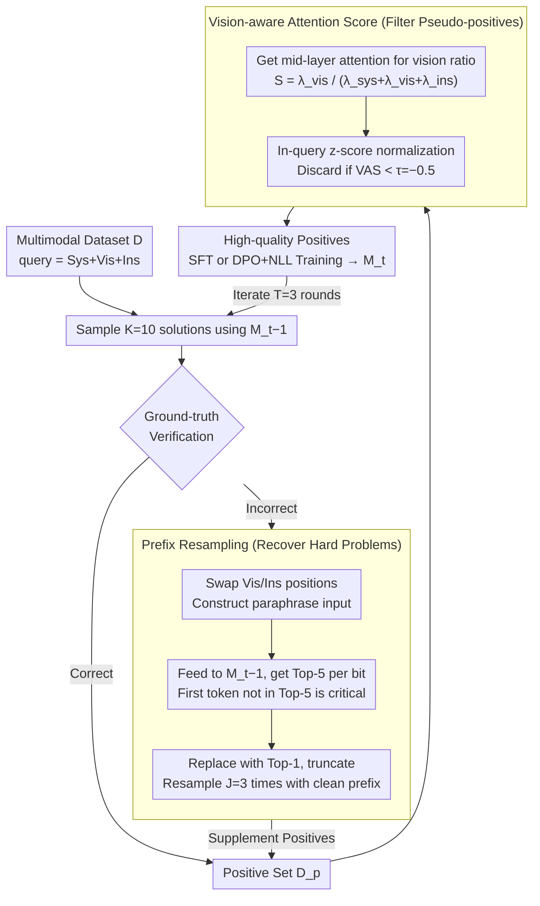

# Learn to Think: Improving Multimodal Reasoning through Vision-Aware Self-Improvement Training

**Conference**: ICML 2026  
**arXiv**: [2605.11931](https://arxiv.org/abs/2605.11931)  
**Code**: Not mentioned  
**Area**: Multimodal VLM / LLM Reasoning / Self-improvement  
**Keywords**: Multimodal reasoning, Self-improvement training, Visual attention, prefix resampling, DPO

## TL;DR
VISTA transforms self-improvement training for Multimodal Large Language Models (MLLMs) into a two-stage pipeline: "supplementing samples for difficult problems via prefix resampling" and "filtering pseudo-positives through Vision-aware Attention Score (VAS)." This approach achieves an average improvement of +13.66% in mathematical and medical multimodal reasoning on Qwen2.5-VL-3B.

## Background & Motivation
**Background**: Current mainstream approaches enhance multimodal reasoning by performing post-training on MLLMs with explicit Chain-of-Thought (CoT). Since annotating CoT data is expensive, "self-improvement" paradigms like STaR, ReSTEM, and R3V allow models to sample their own answers, validate them against ground truth, and then retrain themselves.

**Limitations of Prior Work**: Empirical analysis using Qwen2.5-VL-3B on SLAKE, VQA-Rad, and Geometry3K reveals two overlooked issues. First, **Data Imbalance**: simple questions easily yield many correct solutions, while difficult questions (e.g., Geometry3K) often see over 40% of queries with zero correct hits in 10 samples, despite being most critical for training. Second, **Language Prior Bias**: even if the final answer is correct, the intermediate reasoning may describe objects not present in the image. Attention distributions show that while visual tokens occupy the largest portion of the context, their attention scores across layers are often below 20%.

**Key Challenge**: Existing self-improvement methods **only use "answer correctness" as a quality signal**. This signal is insufficient in terms of quantity (too few positive samples for hard problems) and quality (inability to distinguish true image-based reasoning from lucky guesses).

**Goal**: (1) How to supplement correct solutions for difficult problems? (2) How to identify and filter pseudo-positives where the answer is correct but the reasoning is hallucinated?

**Key Insight**: Following observations by Ji et al. 2025, errors in failed solutions often occur in the later stages of reasoning, while the **prefixes are typically correct**. Furthermore, the model's own attention distribution can serve as an internal signal for visual focus, requiring no additional models or second forward passes (unlike He et al. 2025, which requires a blank-image rerun).

**Core Idea**: Utilize "prefix resampling" to revive good prefixes from failed solutions to supplement hard samples. Employ "Vision-aware Attention Score (VAS)" to calculate attention ratios for vision, system, and instruction segments in a single forward pass, filtering out pseudo-positives with low visual attention.

## Method

### Overall Architecture
VISTA is embedded into a standard three-step iteration (sampling → verification → training), primarily modifying the sampling and verification steps. Given model $\mathcal{M}_{t-1}$ at iteration $t-1$ and multimodal dataset $\mathcal{D}$, each query $x_i = \{x_i^{\text{sys}}, x_i^{\text{vis}}, x_i^{\text{ins}}\}$ is first conventionally sampled $K=10$ times. Ground truth distinguishes the positive set $\mathcal{D}_t^p$ and the negative set $\mathcal{D}_t^n$. Subsequently: (1) Prefix resampling is applied to $\mathcal{D}_t^n$ with $J=3$ additional samples to expand $\mathcal{D}_t^p$. (2) VAS is calculated for each solution in $\mathcal{D}_t^p$, discarding those below threshold $\tau=-0.5$. (3) Remaining high-quality solutions are used for SFT or DPO+NLL optimization to obtain $\mathcal{M}_t$ over $T=3$ iterations. These two steps—**prefix resampling** to address "insufficient hard samples" and **VAS filtering** to address "hallucinated pseudo-positives"—systematically enhance the quantity and quality of self-improvement data.

### Key Designs

**1. Prefix Resampling: Recycling "not-yet-incorrect prefixes" from failed solutions to save hard problems**

The difficulty with hard problems is that 40%+ of queries yield zero correct answers in 10 samples; discarding these equates to losing the most critical training data. Observing that errors often occur late in the reasoning chain, the authors locate the "critical token" where the error originates and truncate the sequence for resampling. This does not rely on ground truth or external models: for each failed solution $r_i^{k_n}$, a paraphrased input "$x_i^{\text{sys}} + x_i^{\text{ins}} + x_i^{\text{vis}} + r_i^{k_n}$" is constructed by swapping image and instruction positions. This is fed back to $\mathcal{M}_{t-1}$ to obtain Top-5 predictions for each position. The first token in the original solution not appearing in $\text{Top}_5(o_{n-1})$ is identified as the critical token. It is replaced by the new Top-1 token, the subsequent text is truncated, and the model resamples $J=3$ times using this clean prefix. This leverages the model's self-calibration to recycle good prefixes from negative samples more efficiently than simple repeated sampling.

**2. Vision-aware Attention Score (VAS): Identifying "correct answer but ignored image" pseudo-positives via attention distributions**

A blind spot in self-improvement is relying solely on answer correctness; a model may reach the correct answer while describing non-existent objects due to language priors. VAS acts as a hallucination detector using the model's internal attention maps. It extracts the attention output $\mathbf{A}_i^k$ from the middle layers of $\mathcal{M}_{t-1}$ (identified as most responsible for visual processing). The attention scores from the output tokens toward the system, vision, and instruction segments are summed as $\lambda^k_{\text{sys}}, \lambda^k_{\text{vis}}, \lambda^k_{\text{ins}}$. The vision ratio is defined as $S_i^k = \lambda^k_{\text{vis}} / (\lambda^k_{\text{sys}} + \lambda^k_{\text{vis}} + \lambda^k_{\text{ins}})$. A query-wise z-score is calculated: $\text{VAS}_i^k = (S_i^k - \text{mean}(S_i)) / \text{std}(S_i)$. Solutions with $\text{VAS}_i^k < \tau=-0.5$ are judged as lacking visual focus and filtered out. Compared to methods requiring blacked-out image reruns, VAS uses a single forward pass with zero additional overhead and adapts to varying attention levels across samples via z-scores.

### Loss & Training
The filtered high-quality positives can be used in two post-training paradigms. SFT simplifies training via NLL optimization: $\mathcal{L}_{\text{SFT}} = -\mathbb{E}[\log \mathcal{M}_\theta(r,\hat y \mid x)/(|r|+|\hat y|)]$. Preference learning pairs each positive sample with a randomly selected negative sample using a combined loss: $\mathcal{L}_{\text{DPO+NLL}} = \mathcal{L}_{\text{DPO}} + \alpha \cdot \mathcal{L}_{\text{NLL}}(r^{k_p}, \hat y^{k_p})$ ($\alpha=0.5, \beta=0.1$), where the NLL term prevents DPO collapse and maintains generation quality. Training involves $T=3$ iterations, sampling $K=10$, resampling $J=3$, temperature 1.0, and a max output of 2048. Models are fine-tuned from the base model each round to prevent overfitting. Training is conducted on 8×A800 80GB for 3 epochs with greedy decoding for inference.

## Key Experimental Results

### Main Results

| Model / Method | SLAKE | VQA-Rad | Geo3K | Overall (Δ vs SFT-Seed) |
|---|---|---|---|---|
| Qwen2.5-VL-3B + SFT-Seed | 67.04 | 64.14 | 25.46 | 52.21 |
| Qwen2.5-VL-3B + ReSTEM (iter 3) | 81.69 | 73.71 | 32.28 | 62.56 (+10.35) |
| Qwen2.5-VL-3B + R3V (iter 3) | 81.41 | 69.32 | 32.78 | 61.17 (+8.96) |
| **Qwen2.5-VL-3B + VISTA-SFT (iter 3)** | **84.23** | **76.10** | **37.27** | **65.87 (+13.66)** |
| Qwen2.5-VL-7B + SFT-Seed | 79.15 | 70.52 | 36.94 | 62.20 |
| **Qwen2.5-VL-7B + VISTA-SFT (iter 3)** | **87.89** | **77.29** | **41.43** | **68.87 (+6.67)** |

Consistent improvement across MLLMs: Single-round training on Qwen3-VL-2B and InternVL3-2B/8B consistently outperforms baselines like STaR and STaR+, proving the method is backbone-agnostic.

### Ablation Study

| Configuration | Overall (3B) | Description |
|---|---|---|
| Full VISTA-SFT (iter 1) | 62.41 | Both prefix resampling and VAS enabled |
| Prefix resampling only | Intermediate | Addresses data imbalance |
| VAS filtering only | Intermediate | Addresses hallucinated pseudo-positives |
| Shifting VAS threshold $\tau$ | Bell-shaped | High thresholds filter out too many valid samples |

### Key Findings
- **Hard Problem Recovery**: On the Geo3K dataset, the 3B model improved from 25.46 to 37.27 (absolute +11.81), demonstrating that prefix resampling successfully revives hard queries that otherwise yield no hits.
- **Layer Analysis**: VAS analysis (Appendix C.2) indicates that filtering using middle layers is most effective, aligning with Jiang et al. 2025 regarding middle layers being primary for visual processing.
- **OOD Generalization**: Gains observed on unseen ScienceQA and ChartQA suggest VISTA learns reliable visual reasoning habits rather than dataset-specific features.

## Highlights & Insights
- **"Negative samples as resources"**: While traditional self-improvement discards all incorrect solutions, prefix resampling highlights that **prefixes of incorrect solutions are often correct and highly valuable**. This paradigm shift is applicable to any sample-then-filter framework.
- **Internal Attention z-score as a Hallucination Detector**: A minimalist yet effective "model introspection" method that requires no extra discriminators or token-level alignment data.
- **"Correct Answer ≠ Correct Reasoning"**: By quantifying this observation through attention scores into an actionable filtering signal, it provides a foundation for "process-level" extensions of reward models.

## Limitations & Future Work
- The effectiveness of VAS relies on the assumption that the model's internal attention distribution is a reliable indicator of visual focus, which may not hold for models with collapsed attention distributions due to heavy instruction tuning.
- Layer selection is empirical (targeting one middle layer); recalibration may be necessary for different backbones, and an automatic selection mechanism is currently lacking.
- The threshold $\tau$ is globally fixed, whereas different task difficulties may require adaptive thresholds.
- Experiments focused primarily on medical and geometric math; scalability to more complex vision modalities (e.g., video, documents) remains to be verified.

## Related Work & Insights
- **vs STaR / ReSTEM**: These methods discard all failed traces; VISTA recycles prefixes and considers visual attention rather than just answer correctness.
- **vs Ding et al. 2025 (GT-guided Reasoning)**: Their approach uses ground truth to guide reasoning (hint-augmented); VISTA relies solely on model consistency.
- **vs He et al. 2025 (Quantifying Language Priors)**: That method requires two forward passes; VAS achieves an equivalent signal in a single pass, saving computation.
- **vs R3V**: R3V uses multiple iterations but performs worse despite having ~2x more samples than VISTA, indicating that **quality > quantity**.

## Rating
- Novelty: ⭐⭐⭐⭐ Both technical components are grounded in existing observations but are combined effectively to target specific bottlenecks.
- Experimental Thoroughness: ⭐⭐⭐⭐ Covers 5 MLLMs, 5 benchmarks, SFT/DPO paradigms, and detailed ablation/layer analysis.
- Writing Quality: ⭐⭐⭐⭐ Motivation analysis (§2.1) is backed by data and diagrams; method description is clear with consistent notation.
- Value: ⭐⭐⭐⭐ The self-improvement paradigm is highly relevant; focus on hallucination filtering via attention and prefix recovery are easily reproducible tricks.

<!-- RELATED:START -->

## Related Papers

- [\[ICLR 2026\] Through the Lens of Contrast: Self-Improving Visual Reasoning in VLMs](../../ICLR2026/vlm_reasoning/through_the_lens_of_contrast_self-improving_visual_reasoning_in_vlms.md)
- [\[ACL 2026\] iReasoner: Trajectory-Aware Intrinsic Reasoning Supervision for Self-Evolving Large Multimodal Models](../../ACL2026/vlm_reasoning/ireasoner_trajectory-aware_intrinsic_reasoning_supervision_for_self-evolving_lar.md)
- [\[ICML 2026\] From Seeing to Thinking: Decoupling Perception and Reasoning Improves Post-Training of Vision-Language Models](from_seeing_to_thinking_decoupling_perception_and_reasoning_improves_post-traini.md)
- [\[ICLR 2026\] VTool-R1: VLMs Learn to Think with Images via Reinforcement Learning on Multimodal Tool Use](../../ICLR2026/vlm_reasoning/vtool-r1_vlms_learn_to_think_with_images_via_reinforcement_learning_on_multimoda.md)
- [\[ICML 2026\] Breaking Dual Bottlenecks: Evolving Unified Multimodal Models into Self-Adaptive Interleaved Visual Reasoners](breaking_dual_bottlenecks_evolving_unified_multimodal_models_into_self-adaptive_.md)

<!-- RELATED:END -->
