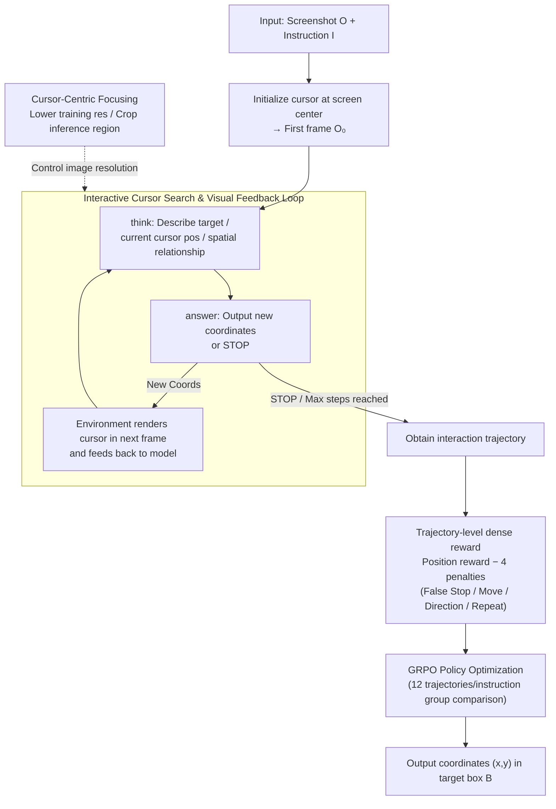

# Learning GUI Grounding with Spatial Reasoning from Visual Feedback

**Conference**: ICML 2026  
**arXiv**: [2509.21552](https://arxiv.org/abs/2509.21552)  
**Code**: None  
**Area**: LLM Agent / GUI Grounding / Multimodal VLM / Reinforcement Learning  
**Keywords**: GUI grounding, virtual cursor, visual feedback, GRPO, spatial reasoning

## TL;DR
Gui-Cursor reformulates GUI grounding from "one-shot coordinate prediction" into an interactive search of "moving the cursor on the screen to find the target." By training the VLM with GRPO using a dense reward with trajectory penalties, the model leverages visual feedback from rendered cursors to align numerical coordinates with screen positions. With only 8K samples, it improves GTA1's performance on ScreenSpot-Pro from 50.1% to 58.1%.

## Background & Motivation

**Background**: GUI agents are typically decoupled into a planner and a grounding module; the latter maps instructions like "click the login button" to pixel coordinates $(x,y)$ on the screen. Current mainstream grounding models (SeeClick, UGround, OS-Atlas, UI-TARS, GUI-Actor, and RL methods like GUI-R1, SE-GUI, GUI-G2, GTA1) treat this as **single-step coordinate regression**: given a screenshot, the model directly outputs a pair of numbers.

**Limitations of Prior Work**: VLMs still perform poorly at predicting precise numerical coordinates on high-resolution screenshots with complex layouts. Even 7B-scale SOTA models only reach approximately 50% accuracy on ScreenSpot-Pro. The authors attribute this to the **spatial semantic alignment** problem—the model must map its semantic understanding of a visual element to a set of discrete coordinate tokens via implicit mapping. However, during training, the model only sees the numbers it outputs and **never observes where those numbers actually land on the screen**.

**Key Challenge**: The training signal covers the "output" but not the "landing point." Without a visual feedback loop, the alignment between numerical predictions and screen pixels is naturally fragile, failing immediately in out-of-distribution or high-resolution scenarios.

**Goal**: Enable the model to see "where my last click landed" during training to stabilize the coordinate-pixel alignment and allow it to "look again" to confirm before finalizing during inference.

**Key Insight**: Humans do not hit a target on a screen in one shot; they move the mouse, check if it aligns, and adjust if necessary. The authors explicitly model this process as an interactive environment—at each step, the current prediction is rendered as a **virtual cursor** on the screenshot. The model decides the next movement or outputs STOP based on the "target appearance + current cursor position + spatial relationship between the two."

**Core Idea**: Rewrite GUI grounding from "one-step regression of $(x,y)$" to "multi-step search + rendered cursor for visual feedback + trajectory-level RL." Optimize this policy using GRPO and stack a cursor-centric focusing mechanism for high-resolution screens.

## Method

### Overall Architecture
Input: Screenshot $O$ ($W\times H$) + natural language instruction $I$. Output: Pixel coordinates $(x,y)$ falling within the target box $B$.

Gui-Cursor decomposes this into an interactive episode of at most $T$ steps:

1. **Initialization**: At $t=0$, the cursor is rendered at the center of the screen $(x_0,y_0)$ to obtain $O_0$.
2. **Multi-step Interaction**: At each step, the model generates $A_t = \langle\text{think}\rangle\ldots\langle/\text{think}\rangle\langle\text{answer}\rangle\ldots\langle/\text{answer}\rangle$ based on the history $(I, O_0, A_0, O_1, \ldots, A_{t-1}, O_t)$. The `<think>` section explicitly describes the target appearance, current cursor position, and their spatial relationship; the `<answer>` section provides either new absolute coordinates $(x_t,y_t)$ or a `STOP` command.
3. **Rendered Feedback**: If new coordinates are given, the environment renders the cursor at that position in the next frame $O_{t+1}$ and feeds it back to the model. If `STOP` is called or the maximum steps are reached, the episode ends, and the last cursor position is taken as the final prediction.

Training uses GRPO with Qwen2.5-VL-7B and UI-TARS-1.5-7B as base models. Maximum training steps per interaction is 4, sampling 12 trajectories per instruction, with a batch size of 32 and a learning rate of $10^{-6}$. Data is a subset of Aria-UI + OS-Atlas (only 8K samples compared to GTA1's 64K), and online filtering is used to skip "all-correct/all-incorrect" samples.

### Key Designs

**1. Interactive Cursor Search & Visual Feedback Loop: Multi-step search over single-step regression**  
Previous training failed because models never knew where their predicted coordinates landed. By allowing the VLM to control a virtual cursor, it can directly observe "where my last strike landed" in the `<think>` block. This forces the model to align coordinates in pixel space rather than pure token space, addressing the root cause of spatial semantic alignment issues. At inference, the number of steps is adaptive—simple samples are solved in one step, while difficult samples automatically trigger more moves. On ScreenSpot-v2, 99.5% of samples are one-shot, but on ScreenSpot-Pro, 9.4% use multiple steps for small targets (average target area 5024 px vs. 31584 px for one-step samples).

**2. Trajectory-level Dense Reward: Suppressing pathological behaviors with 4 penalties**  
Interactive tasks can easily degenerate (e.g., immediate STOP or oscillating between points). The position reward $r_p$ follows SE-GUI’s dense form: $r_p = 1 + (1 - d_{\text{centre}}/d_{\max})^2$ inside box $B$ and $r_p = 1 - d_{\text{edge}}$ outside, normalized by image dimensions. To stabilize movement, four binary penalties are added: False Stop (STOP called outside $B$), False Move (moving out of $B$ after entering), False Direction (ending further from $B$ than the first step), and Repeated Position (coordinates appearing $\geq 2$ times). The total reward $R_T = r_p - w_p(r_{\text{FD}} + r_{\text{FS}} + r_{\text{FM}} + r_{\text{RP}})$ is optimized via GRPO.

**3. Cursor-Centric Focusing (CCF): Lower resolution for training, cropping for inference**  
Iterative pipelines face compute bottlenecks because history grows linearly with image size. CCF decouples training and inference resolutions: training images are scaled down to $\leq 1920\times 1080$. During inference, if the original image is larger, the model takes one coarse step, then crops a $1920\times 1080$ region centered on that prediction for subsequent refined moves. This maintains efficiency during training while allowing high-precision targeting on high-resolution screens.

### Loss & Training
GRPO optimizes $R_T$ + format rewards. 12 trajectories are sampled per instruction for group comparison. Online filtering is applied to ensure a learning signal. Max 4 interaction steps and 250 gradient steps.

## Key Experimental Results

### Main Results

| Dataset | Metric | GUI-Cursor (UI-TARS-1.5-7B) | Prev. SOTA (7B Class) | Gain |
| :--- | :--- | :--- | :--- | :--- |
| ScreenSpot-Pro | Avg. Acc | **58.1** | GTA1-7B (50.1) | **+8.0** |
| ScreenSpot-v2 | Avg. Acc | **93.9** | GUI-G2-7B (93.3) | +0.6 |
| OSWorld-G | Avg. Acc | 65.6 | GTA1-7B (67.7) | -2.1 |
| UI-Vision | Avg. Acc | **27.3** | GTA1-7B (26.2) | +1.1 |
| OSWorld (online) | Success Rate | **57.1** (Qwen2.5-VL-7B) | GTA1-7B (53.1) | +4.0 (fewer steps) |
| SpatialMQA (OOD) | Acc | **43.4** | Qwen2.5-VL-7B (38.1) | +5.3 |

**Highlights**: Gui-Cursor outperforms GTA1 with only 8K training samples compared to 64K, achieving ~8x data efficiency.

### Ablation Study

| Configuration | ScreenSpot-Pro | Explanation |
| :--- | :--- | :--- |
| Full Gui-Cursor (w/ ccf) | 56.5 | Base: Qwen2.5-VL-7B |
| w/o ccf | 45.3 | CCF is critical for high-res screens |
| w/o False Stop penalty | Sig. drop | Multi-step rate drops 9.4% → 0.1% |
| w/o thinking tokens | Sig. drop | Thinking is valuable only with visual feedback |
| Apply ccf to GTA1 | 50.1 → 54.0 | CCF is a universal enhancement |

### Key Findings
- **Visual Feedback is Essential**: Thinking + multi-step feedback only shows power in interactive training. Unlike GUI-G2/GTA1 where thinking adds little value to single-step RL, Gui-Cursor relies heavily on it.
- **Improved Spatial Reasoning**: On a cursor-in-box task, the base model shows heavy center bias. Gui-Cursor maintains high F1 even at edges and improves on OOD benchmarks like SpatialMQA/SPHERE.
- **Adaptive Steps are Intuitive**: The model learns to "look again" for small targets, with multi-step samples having significantly smaller areas than one-step samples.

## Highlights & Insights
- **Paradigm Shift as Leverage**: Moving from "single-step regression" to "interactive search" fills the missing link of the model not seeing its own output. 
- **Trajectory Rewards over Position Rewards**: Designing binary penalties for pathological movements (oscillating, false stops) is a refined form of reward engineering.
- **Data Efficiency via Interaction**: Winning with 1/8 of the data suggests that task formulation optimization is more effective than blind data scaling.

## Limitations & Future Work
- **External Dependencies**: Still relies on an external planner; the model only handles grounding.
- **Inference Latency**: Multi-step interactions increase the wall-clock time compared to one-shot models.
- **Scaling Limit**: The "multi-step" depth is currently shallow (mostly 1-2 steps). Future work could explore high-bandwidth signals like region highlighting or zoomed views.

## Related Work & Insights
- **vs GTA1**: GTA1 uses 64K samples and high-res training. Gui-Cursor uses 8K samples and multi-step interaction. Even when applying CCF to GTA1, Gui-Cursor maintains its lead.
- **vs SE-GUI / GUI-G2**: These are single-step RL. Gui-Cursor upgrades the reward engineering to support multi-step trajectories.
- **Insight**: The concept of "visual feedback for action landing" is transferable to other domains like robotic manipulation, video editing, or medical ROI localization.

## Rating
- **Novelty**: ⭐⭐⭐⭐ Reformulating grounding as an interactive search is a clear innovation.
- **Experimental Thoroughness**: ⭐⭐⭐⭐⭐ Extensive testing across 4 grounding benchmarks, online agents, and OOD spatial reasoning tasks.
- **Writing Quality**: ⭐⭐⭐⭐ Clear logic, though the information density in certain sections is high.
- **Value**: ⭐⭐⭐⭐⭐ Highly practical for teams training GUI agents due to the massive data efficiency gains.

<!-- RELATED:START -->

## Related Papers

- [\[ICML 2026\] 3ViewSense: Spatial and Mental Perspective Reasoning from Orthographic Views in Vision-Language Models](3viewsense_spatial_and_mental_perspective_reasoning_from_orthographic_views_in_v.md)
- [\[ICML 2026\] ReVSI: Rebuilding Visual Spatial Intelligence Evaluation for Accurate Assessment of VLM 3D Reasoning](revsi_rebuilding_visual_spatial_intelligence_evaluation_for_accurate_assessment_.md)
- [\[ICML 2026\] Active Exploring like a Pigeon: Reinforcing Spatial Reasoning via Agentic Vision-Language Models](active_exploring_like_a_pigeon_reinforcing_spatial_reasoning_via_agentic_vision-.md)
- [\[NeurIPS 2025\] GUI-Rise: Structured Reasoning and History Summarization for GUI Navigation](../../NeurIPS2025/vlm_reasoning/gui-rise_structured_reasoning_and_history_summarization_for_gui_navigation.md)
- [\[ICML 2026\] iVGR: Internalizing Visually Grounded Reasoning for MLLMs with Reinforcement Learning](ivgr_internalizing_visually_grounded_reasoning_for_mllms_with_reinforcement_lear.md)

<!-- RELATED:END -->
