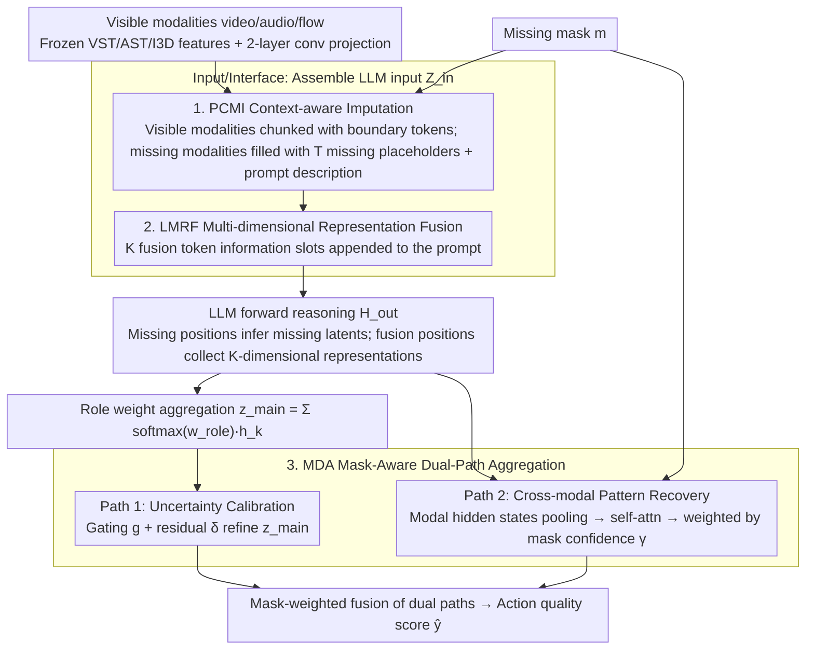

# LIMSSR: LLM-Driven Sequence-to-Score Reasoning under Training-Time Incomplete Multimodal Observations

**Conference**: ICML 2026 Spotlight  
**arXiv**: [2605.00434](https://arxiv.org/abs/2605.00434)  
**Code**: https://github.com/XuHuangbiao/LIMSSR  
**Area**: Multimodal VLM / Incomplete Multimodal Learning / Action Quality Assessment  
**Keywords**: Incomplete Multimodal Learning, LLM Reasoning, Action Quality Assessment, Mask-Aware Fusion, Token-level Regularization

## TL;DR
The authors remodel multimodal Action Quality Assessment (AQA) with "incomplete modalities during training" as an "LLM-based conditional sequence-to-score reasoning" problem. By utilizing prompts and special tokens, the LLM completes missing semantics without complete data supervision. Combined with mask-aware dual-path fusion to suppress hallucinations, the method outperforms SOTAs relying on complete training data across three AQA datasets.

## Background & Motivation

**Background**: In real-world scenarios, multimodal data often lacks modalities due to sensor failure, privacy desensitization, or collection costs, resulting in incomplete video/audio/flow data. Incomplete Multimodal Learning (IML) research typically follows two lines: (a) reconstruction-based (ActionMAE, IMDer, GAIN, DMVG), which directly reconstructs missing modal features; (b) distillation/prior-based (CorrKD, MoMKE, MCMoE), which uses complete modalities as teachers for distillation or priors.

**Limitations of Prior Work**: These two categories of methods rely on a "God's eye view" assumption—complete modalities must be available during training as reconstruction targets or distillation teachers. However, real-world data collection is inherently incomplete (e.g., some subjects never recorded audio). If the training data itself is incomplete, there is no ground truth for reconstruction and no teacher for distillation, causing the entire IML framework to collapse.

**Key Challenge**: When modalities are missing during the training phase, how can the missing semantics be "imagined" from thin air? Traditional reconstruction-distillation routes require "complete-incomplete" pairs, which do not exist here. Simple zero-filling causes the model to learn "missingness" as noise, leading to performance degradation in the main task. A mechanism is needed to "infer" missing semantics without relying on paired supervision.

**Goal**: (i) Formalize the more realistic setting of "incomplete observations during training"; (ii) propose a framework that infers missing semantics without relying on complete training data; (iii) validate this on long-video Action Quality Assessment (AQA), a task highly dependent on multimodality.

**Key Insight**: The authors observe that LLMs are not only sequence models but also possess vast world knowledge and reasoning capabilities. Given observable modalities and a description of the missing structure, an LLM should be able to infer the semantic representation of the missing parts like a "cloze test" without needing pixel-level reconstruction.

**Core Idea**: Reformulate incomplete multimodal learning as "conditional sequence reasoning"—describe the task and missing status via prompts, use missing tokens as placeholders, and use fusion tokens to collect information. This allows the LLM to infer latent semantics under the condition of invisible missing modalities, followed by mask-aware gating to calibrate reasoning uncertainty.

## Method

### Overall Architecture
For a sample $(\mathbf{X} \odot \boldsymbol{m}, \boldsymbol{m}, y)$ (where $\boldsymbol{m}\in\{0,1\}^M$ is the missing mask), LIMSSR follows three steps: (1) Context Construction $\Phi_{in}$ assembles the instruction prompt, visible modal features $\tilde{\mathbf{X}}^m$, missing token placeholder sequences, and fusion tokens into a unified embedding $\mathbf{Z}_{in}$; (2) LLM Reasoning $\mathbf{H}_{out} = \mathrm{LLM}(\mathbf{Z}_{in})$ simultaneously completes missing semantic inference and multimodal fusion; (3) Mask-Aware Dual-Path Aggregation $\Psi_{agg}$ fuses the high-level semantic path and the low-level cross-modal path using mask weighting to output the action quality score $\hat{y}$. On the modality side, frozen VST/AST/I3D are used to extract video/audio/flow features, which are projected into the LLM input space via 2-layer convolutions. The three contributing modules (PCMI, LMRF, MDA) correspond to the input, interface, and output sides, respectively.

### Key Designs

**1. Prompt-guided Context-aware Modality Imputation (PCMI): Elevating missing modalities from "zero vectors" to "latent variables for inference"**

Traditional zero-padding causes missing signals to be buried as noise during attention, leading to biased learning. While methods like MissRAG or TAMML use RAG or text bridging, they require additional maintenance of retrieval libraries or pre-trained alignment. PCMI explicitly writes the missing structure into the sequence: each modality $m$ is wrapped with a pair of boundary tokens `<m_start>, <m_end>`. Visible modalities contain real features $\tilde{\mathbf{X}}^m$, while missing modalities contain $T$ repeated learnable `<missing_m>` placeholder embeddings. A prompt explains the visible/missing status: "Given the available {avail} features... The {miss} modality is missing. Based on the available modalities, please infer and reconstruct the useful latent representations for the missing {miss} modalities at the designated positions". After the LLM forward pass, the hidden states extracted from these missing positions $\mathbf{H}_{miss}^m = \mathrm{LLM}(\mathbf{Z}_{in})|_{\text{positions of }\mathbf{E}_{miss}^m}$ serve as the inferred missing representations. The elegance of this design is that "predicting the next token" and "inferring missing latents" are mathematically similar; the LLM's next-token mechanism naturally adapts without pixel-level reconstruction or paired supervision.

**2. LLM-driven Multi-dimensional Representation Fusion (LMRF): Using dedicated token slots to collect cross-modal information instead of crude pooling**

Directly applying mean-pooling to long LLM sequence outputs collapses the generative structure and loses dimensional information. LMRF adopts the BERT `[CLS]` concept but generalizes it to multiple dimensions: $K$ special tokens `<emb_dim_1>, ..., <emb_dim_K>` are appended to the prompt as "information slots," with explicit instructions for the LLM to "integrate and enhance all multimodal features for action quality assessment. Output the fused multi-dimensional feature representations at the designated feature dimension positions." The outputs at these positions from the last layer, $\mathbf{H}_{fusion} = \{\boldsymbol{h}_1, \dots, \boldsymbol{h}_K\}$, are treated as carrying different evaluation dimensions (e.g., difficulty, execution, artistry). These are aggregated into a main vector $\boldsymbol{z}_{main} = \sum_k \mathrm{Softmax}(\boldsymbol{w}_{role})_k \cdot \boldsymbol{h}_k$ using learnable role weights. This is more structured than pooling and more interpretable than implicit attention heads regarding "evaluation dimensions."

**3. Mask-Aware Dual-Path Aggregation (MDA): Balancing "how much to trust the inferred content"**

Relying solely on LLM reasoning can lead to hallucinations when data is severely missing, while relying only on statistical aggregation lacks high-level semantics. MDA executes two paths and mixes them based on the missing mask. Path 1 (Uncertainty-calibrated reasoning) calculates gating $\boldsymbol{g} = \sigma(\mathrm{MLP}_{gate}([\boldsymbol{z}_{main}, \boldsymbol{m}]))$ and a residual $\boldsymbol{\delta} = \mathrm{MLP}_{res}([\boldsymbol{z}_{main}, \boldsymbol{m}])$ on the main vector to yield a refined representation $\tilde{\boldsymbol{z}}_{main} = \boldsymbol{z}_{main} + \boldsymbol{g}\odot \boldsymbol{\delta}$. Path 2 (Cross-modal pattern recovery) performs temporal pooling on LLM hidden states at modal positions to get $\boldsymbol{h}_v, \boldsymbol{h}_a, \boldsymbol{h}_f$, stacks them for self-attention to get $\mathbf{Z}_{attn}$, and weights them by availability $\alpha_{m_j} = \boldsymbol{m}_j \cdot 1 + (1-\boldsymbol{m}_j)\cdot \gamma_{m_j}$ (where $\gamma_m = \sigma(\lambda_m)$ is a modal-level learnable confidence), resulting in $\boldsymbol{z}_{aux} = \sum_m \alpha_m (\boldsymbol{z}_{attn}^m \odot \mathcal{G}(\mathbf{H}_{stack})^m)$. For example, if only video is present and audio/flow are missing, the mask suppresses the weights of the missing modality paths via the learned low confidence $\gamma$, forcing the output to rely on the visible video path rather than allowing the LLM to hallucinate when information is absent. The dual-path fusion provides the final score.

### Mechanism Example: Inferring Missing Audio and Flow from Video

Using a figure skating video where audio and flow are missing: ① PCMI inserts video features into `<v_start>...<v_end>`, places $T$ `<missing>` placeholders in the audio/flow positions, and specifies in the prompt that "audio and flow are missing, please infer their latent representations based on the visible video"; ② During the LLM forward pass, it generates missing modal latents at the missing positions and outputs a three-dimensional "difficulty/execution/artistry" fused representation in $K=3$ `<emb_dim>` slots at the end; ③ Path 2 of MDA detects that two modal masks are 0 and their corresponding confidence $\gamma$ is low, thus reducing their contribution and trusting the video path; Path 1 performs uncertainty calibration via gating; ④ The weighted fusion of the two paths yields the final score. This process utilizes no complete training samples; missing semantics are "filled in" by the LLM's world knowledge.

### Loss & Training
In addition to the main regression loss, the authors introduce: (1) Consistency Learning to constrain the consistency between the two paths, forcing reasoning and statistical paths to cross-validate; (2) Token-Level Metric Regularization to ensure different fusion tokens learn different feature dimensions (avoiding collapse) by maximizing non-diagonal elements in the token similarity matrix; (3) LoRA fine-tuning for the LLM backbone to avoid full parameter training.

## Key Experimental Results

### Main Results (FS1000, 7-class, Spearman ↑ / MSE ↓, T-Miss denotes modalities missing during training)

| Method | T-Miss | {v,f} | {v,a} | {v} | {a} | Average | {v,f,a} |
|------|--------|-------|-------|------|------|---------|---------|
| ActionMAE | ✗ | 0.775/24.66 | 0.766/64.13 | 0.761/50.64 | 0.458/41.66 | 0.651/38.18 | 0.809/17.96 |
| GCNet | ✗ | 0.730/25.56 | 0.740/23.86 | 0.696/26.67 | 0.442/39.40 | 0.610/28.62 | 0.764/21.82 |
| MoMKE | ✗ | 0.798/18.86 | 0.805/23.88 | 0.785/37.96 | 0.499/27.53 | 0.668/26.08 | 0.819/16.85 |
| MCMoE | ✗ | 0.845/12.66 | 0.882/11.85 | 0.845/13.64 | 0.615/16.72 | 0.782/15.37 | 0.881/11.53 |
| **LIMSSR** | **✓** | **0.854/12.51** | **0.891/10.54** | **0.853/12.50** | **0.687/15.51** | **0.789/14.08** | **0.891/10.44** |

| Δ vs Prev. SOTA | {v,f} | {v,a} | {v} | {a} | Average | {v,f,a} |
|-----------|-------|-------|------|------|---------|---------|
| Gain (Spearman) | ↑1.1% | ↑1.0% | ↑0.9% | ↑11.7% | ↑0.9% | ↑1.1% |
| Gain (MSE) | ↓1.2% | ↓11.1% | ↓8.4% | ↓7.2% | ↓8.4% | ↓9.5% |

Note: LIMSSR is the only model in the table trained under the **T-Miss ✓** setting, yet it outperforms all methods trained with **T-Miss ✗** (i.e., those having access to complete training data) across almost all missing combinations. This is the most compelling evidence of the "qualitative difference" of the proposed method.

### Ablation Study

| Configuration | Average Spearman | Description |
|------|------------------|------|
| Full LIMSSR | 0.789 | Full framework |
| w/o PCMI (Direct zero-padding) | Significant drop | Missing semantics cannot be inferred by LLM |
| w/o LMRF (Mean pooling instead of fusion tokens) | Drop | Multi-dimensional information collapse |
| w/o MDA Path 1 (Cross-modal aggregation only) | Drop | Lack of high-level semantic calibration |
| w/o MDA Path 2 (LLM reasoning only) | Drop | Hallucinations under severe missingness |
| w/o Consistency Loss | Drop | Lack of mutual validation between paths |
| w/o Token-Level Regularization | Drop | Fusion token redundancy |

### Key Findings
- **Outperforming complete-data rivals while training with incomplete data**: This counter-intuitive result demonstrates that in extreme cases like {a}-only, LIMSSR's Spearman is 11.7% higher and MSE 7.2% lower than SOTA, confirming the qualitative advantage of LLM world knowledge in completing missing semantics.
- **Path 1 + Path 2 Complementarity**: Removing either path results in performance drops; MDA's mask-adaptive fusion is critical for robustness against hallucinations.
- **Sweet Spot of Fusion Token Count $K$**: $K=3$ matches the "difficulty/execution/artistry" structure of AQA best; higher values lead to overfitting.
- **Audio is the hardest to impute**: All methods perform worst in the {a}-only setting as audio has the lowest correlation with action quality, yet LIMSSR maintains a significant lead, showing that LLM inference gains are highest for low-information modalities.

## Highlights & Insights
- **Contribution through Task Reformulation**: Remodeling IML from "reconstruction/distillation" to "conditional sequence reasoning" transforms a supervision-constrained problem into a next-token problem that LLMs excel at; this logic of "reformulating as an LM task" can be transferred to many incomplete multimodal scenarios.
- **Elegant Special Token Design**: Missing placeholders + boundary tokens + fusion tokens treat the LLM as a programmable "semantic calculator" without modifying its architecture.
- **Mask-aware Dual-path Adaptation**: Encoding "self-confidence" into the network via learnable modal-level confidence $\gamma_m$ demonstrates an engineered approach to handling reasoning uncertainty.
- **Surpassing Full-data Models with Incomplete Data**: This finding suggests a new perspective for the IML community—LLM priors may be more valuable than paired data, prompting a re-evaluation of the paired-data paradigm.

## Limitations & Future Work
- Primarily validated on AQA tasks; the effectiveness in other IML scenarios like emotion recognition or medical diagnosis requires more experiments.
- LLM reasoning introduces significant computational cost, making it less practical for real-time applications like live scoring.
- Lacks systematic experiments on LLM scale (7B/13B/70B); world knowledge only helps if it is task-relevant, which may fail for low-resource languages or rare action types.
- "Hallucination" lacks a quantified metric and is only indirectly mitigated via MDA.
- Does not explore expansion to modalities beyond text/vision/audio (e.g., physiological signals, depth maps).

## Related Work & Insights
- **vs ActionMAE / IMDer / DMVG (reconstruction)**: These depend on complete training pairs; ours breaks this constraint.
- **vs MoMKE / MCMoE / CorrKD (distillation/prior)**: They still need complete modalities as teachers; LIMSSR replaces this with LLM priors, essentially substituting paired supervision with general world knowledge.
- **vs MissRAG / TAMML (LLM-based IML)**: MissRAG needs pre-constructed prototype pools; TAMML textualizes all modalities, losing fine-grained info. LIMSSR reasons directly in the embedding space, making it more general.
- **vs Hedgehog / LoLCATs (LLM for other tasks)**: Shared logic of mining non-linguistic capabilities of LLMs to solve domain problems, but LIMSSR focuses on "inference of missing info" rather than "long-sequence modeling."

## Rating
- Novelty: ⭐⭐⭐⭐⭐ Proposes the new "incomplete observation during training" setting and reshapes IML as sequence reasoning.
- Experimental Thoroughness: ⭐⭐⭐⭐ Three AQA benchmarks with various missing combinations and 10+ baselines; however, limited evidence for cross-task generalization beyond AQA.
- Writing Quality: ⭐⭐⭐⭐ Clear storytelling; Fig 1 clarifies the paradigms well; formulas are semantic and accessible.
- Value: ⭐⭐⭐⭐ Offers a new paradigm for the IML community and a convincing non-linguistic use case for LLM-as-a-tool.

<!-- RELATED:START -->

## Related Papers

- [\[ICLR 2026\] Reasoning-Driven Multimodal LLM for Domain Generalization](../../ICLR2026/vlm_reasoning/reasoning-driven_multimodal_llm_for_domain_generalization.md)
- [\[ACL 2026\] TableVista: Benchmarking Multimodal Table Reasoning under Visual and Structural Complexity](../../ACL2026/vlm_reasoning/tablevista_benchmarking_multimodal_table_reasoning_under_visual_and_structural_c.md)
- [\[ICML 2026\] Learn to Think: Improving Multimodal Reasoning through Vision-Aware Self-Improvement Training](learn_to_think_improving_multimodal_reasoning_through_vision-aware_self-improvem.md)
- [\[ACL 2026\] Thinking Like a Botanist: Challenging Multimodal Language Models with Intent-Driven Chain-of-Inquiry](../../ACL2026/vlm_reasoning/thinking_like_a_botanist_challenging_multimodal_language_models_with_intent-driv.md)
- [\[ICML 2026\] From Seeing to Thinking: Decoupling Perception and Reasoning Improves Post-Training of Vision-Language Models](from_seeing_to_thinking_decoupling_perception_and_reasoning_improves_post-traini.md)

<!-- RELATED:END -->
