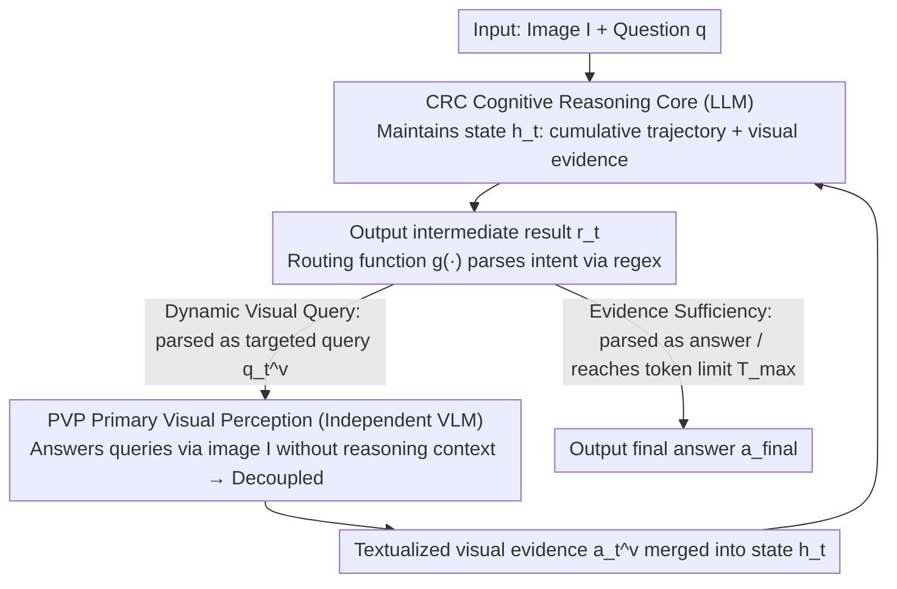

# CSMR (Look on Demand): A Cognitive Scheduling Framework for Visual Evidence Acquisition in Multimodal Reasoning

**Conference**: ICML 2026  
**arXiv**: [2605.28160](https://arxiv.org/abs/2605.28160)  
**Code**: https://github.com/YangZhang2511/CSMR  
**Area**: Multimodal VLM / Multimodal Reasoning / Tool-use  
**Keywords**: Multimodal Reasoning, Working Memory Theory, Dynamic Visual Evidence Acquisition, Perception-Reasoning Decoupling, Zero-shot

## TL;DR
Inspired by Baddeley's working memory theory, CSMR treats "when to introduce visual evidence into reasoning" as a dynamic decision-making process. The LLM maintains the reasoning state and invokes an independent perception module (VLM) for visual evidence on demand until sufficiency is reached. It addresses the flaws of existing paradigms (pre-reasoning textualization losing details / unified VL space being contaminated by language priors), outperforming baselines zero-shot across multiple multimodal reasoning benchmarks.

## Background & Motivation

**Background**: Two main paradigms in multimodal reasoning: (a) pre-reasoning visual-to-text (e.g., DDCoT, converting images to captions before reasoning) and (b) unified vision-language space (e.g., CCoT, ICoT, AIMCoT, where VLMs perform end-to-end reasoning).

**Limitations of Prior Work**: (a) Static textualization occurs before reasoning without foresight of necessary details, and coarse-grained captions irreversibly lose fine-grained information. (b) Visual representations in the unified paradigm are contaminated by language priors—substantial evidence (Section 4.2 of the paper) shows that self-attention systematically assigns higher attention to text tokens (approx. 2.5×), which is further amplified by soft-max, suppressing visual tokens over time.

**Key Challenge**: The timing of visual evidence introduction determines reasoning quality—introducing it once too early misses details, while remaining unified results in language dominance. A "look-on-demand" mechanism is required: judging whether to look, where to look, and if enough info is gathered based on the current reasoning state.

**Goal**: (1) Analyze the dominance of language priors in unified paradigms; (2) Enable the LLM to maintain reasoning states and dynamically schedule visual evidence acquisition; (3) Decouple the perception-reasoning structure to prevent visual representation contamination; (4) Surpass baselines in zero-shot settings.

**Key Insight**: Drawing from Baddeley's working memory theory—the central executive schedules the visuospatial sketchpad and phonological loop. The LLM acts as the central executive maintaining the reasoning state, while an independent VLM acts as the visuospatial sketchpad returning textualized visual evidence on demand.

**Core Idea**: A decoupled structure of CRC (Cognitive Reasoning Core, LLM) + PVP (Primary Visual Perception, VLM). The CRC determines when and what to query, while the PVP independently observes the original image to answer. Visual evidence is iteratively acquired, driven by the reasoning state, until sufficiency terminates the process.

## Method

### Overall Architecture

The CRC (LLM) maintains a reasoning state (containing the original question + collected visual evidence list). In each step:
1. It decides whether more visual evidence is needed.
2. If yes, it generates a targeted visual query (e.g., "What color is the bottom right corner?").
3. It calls the PVP (independent VLM observing the original image) to return a textualized answer.
4. It incorporates evidence into the state and updates the reasoning trajectory.
5. If reasoning is sufficient, it outputs the final answer.

The PVP does not participate in reasoning and only performs QA; its visual representation is unaffected by the CRC's linguistic context.

### Key Designs

**1. Perception-Reasoning Structural Decoupling: Allowing PVP to observe independently to avoid language prior contamination.**

The issue with unified paradigms is that LLM reasoning gradually dominates visual representations. Section 4.2 quantifies that self-attention systematically gives text tokens ~2.5× more attention than visual tokens, magnified by soft-max. CSMR sets the PVP as an independent VLM instance that receives only the original image + visual query without the CRC's reasoning context. The CRC receives textualized answers but prevents query context from flowing back into the PVP's subsequent calls. This ensures the PVP "looks" at the image freshly each time, mirroring the visuospatial sketchpad in Baddeley's theory. Ablation shows this contributes most (+3.7 points), confirming the existence of language contamination.

> CRC = Cognitive Reasoning Core (LLM), PVP = Primary Visual Perception (Independent VLM).

**2. Reasoning-State-Driven Dynamic Visual Querying: Incremental acquisition based on current state rather than one-time planning.**

Pre-reasoning once-and-for-all captioning cannot foresee fine-grained details needed for later reasoning. CSMR maintains a reasoning state $h_t$ (= cumulative trajectory + textualized evidence). Each step outputs $r_t$, which a deterministic **routing function** $g(\cdot)$ parses via regex into two intents: initiating a new query or providing the final answer (the CRC's output format is constrained by prompts). Queries are generated incrementally based on the state (e.g., from coarse "main content" to "detailed regions"). New evidence is appended to $h_t$ for further reasoning. This ensures "reasoning-guided perception," filtering out irrelevant information. Replacing this with one-time planning leads to a 5.4-point drop.

**3. Early Termination: CRC-determined sufficiency allowing adaptive query allocation based on difficulty.**

Different cases vary in difficulty—simple questions need 1–2 queries, while complex ones require multiple rounds. CSMR integrates the termination decision into the CRC's per-step choice. When $g(\cdot)$ parses $r_t$ as a "final answer," the loop terminates. Otherwise, it continues until sufficiency is reached or the context hits $T_{\max}$. Sufficiency and querying are two sides of the same reasoning-driven prompt decision. Experiments show the model adaptively allocates queries: Easy (1.4), Medium (2.7), Hard (4.2), optimizing efficiency without losing accuracy.

### Quantitative Evidence of Attention Bias (Figure 2)

Mean attention measured across 35 layers of Qwen3-VL-8B on ScienceQA:
- Average text token attention is 2.5× higher than visual tokens.
- Soft-max further compresses the visual token ratio.
- Similar phenomena observed in LLaVA-1.6-7B, proving this is a systemic issue in VLM paradigms.

## Key Experimental Results

### main Results (Zero-shot)

| Benchmark | Pre-reason (DDCoT) | Unified (CCoT) | Unified (AIMCoT) | **CSMR** |
|------|------------|----------|--------|--------|
| ScienceQA | 72.4 | 75.8 | 77.3 | **80.6** |
| A-OKVQA | 56.7 | 58.9 | 60.4 | **63.8** |
| MMStar | 39.5 | 41.2 | 42.8 | **45.7** |
| MMBench-Reasoning | 52.1 | 54.6 | 56.0 | **59.3** |
| RealWorldQA | 45.3 | 47.8 | 49.2 | **52.6** |

CSMR consistently leads by 3-4 points across 5 benchmarks, especially in tasks requiring fine-grained visual verification.

### Ablation Study

| Configuration | ScienceQA |
|------|---------|
| Full CSMR | 80.6 |
| − Early Termination (Fixed queries) | 78.4 |
| − Perception Decoupling (PVP receives CRC context) | 76.9 |
| − Dynamic Querying (One-time planning) | 75.2 |
| Back to pre-reason DDCoT | 72.4 |

All modules contribute positively; perception decoupling is the most significant (−3.7), validating the language contamination problem.

### Early Termination Efficiency

| Difficulty | Avg. Queries | Accuracy |
|------|------------|------|
| Easy | 1.4 | 87% |
| Medium | 2.7 | 79% |
| Hard | 4.2 | 64% |

The model identifies difficulty and adaptively allocates queries.

### Key Findings
- **Perception-Reasoning Decoupling is critical**: It provides the largest gain, proving unified paradigms suffer from language contamination.
- **Dynamic Querying outperforms Pre-planning**: One-time planning results in a 5.4-point drop.
- **Early Termination saves queries without accuracy loss**: Fixed query counts dropped performance by 2.2 points.
- **Cross-architecture Versatility**: Flexible combinations of various LLMs (CRC) and VLMs (PVP) are feasible.

## Highlights & Insights
- **Engineering Inspired by Cognitive Science**: Baddeley's theory provides clear role division (central executive vs. visuospatial sketchpad) for LLM-VLM collaboration.
- **Decoupling as Paradigm Innovation**: Challenges the assumption that "end-to-end unified" is always superior; decoupling + dynamic invocation performs better.
- **Quantitative Evidence for Bias**: Converts "language prior contamination" from a intuition into 2.5× attention figures.
- **Training-free & Modular**: CRC and PVP are independently upgradeable, making it industry-friendly and compatible with future models.

## Limitations & Future Work
- Context grows rapidly in long-chain reasoning; summarization or graph-based storage is needed.
- Information may still be lost during PVP textualization; structured outputs (coordinates, bounding boxes) could be explored.
- Zero-shot prompting for scheduling might be less stable than learnable strategies.
- Total latency includes multiple VLM calls, which is less ideal for real-time scenarios.
- Complex collaboration (e.g., PVP proactively suggesting focus points) is unexplored.

## Related Work & Insights
- **vs. DDCoT (pre-reasoning)**: Uses one-time captioning; CSMR uses dynamic multiple queries.
- **vs. CCoT / AIMCoT (unified VL)**: These suffer from language contamination; CSMR solves it via decoupling.
- **vs. ReAct / Toolformer**: Similar "tool-use" logic but focuses specifically on VLM as a "perception tool."
- **vs. PathCTM**: Both use multi-step reasoning and early termination; PathCTM is internal multi-scale, whereas CSMR is external VLM invocation.
- **Insights**: Re-evaluating the "unified end-to-end" approach suggests that tasks requiring distinct capabilities (perception-reasoning, retrieval-generation) benefit from decoupling + scheduling.

## Rating
- Novelty: ⭐⭐⭐⭐⭐ Decoupling + dynamic querying is a paradigm-level innovation; strong theoretical grounding.
- Experimental Thoroughness: ⭐⭐⭐⭐ 5 benchmarks + detailed ablation; lacks comparison with some ReAct-style tool-use baselines.
- Writing Quality: ⭐⭐⭐⭐⭐ Clear comparison of paradigms (Figure 1); definitive evidence provided in Figure 2.
- Value: ⭐⭐⭐⭐ Training-free, modular, and SOTA results; applicable to all tasks requiring fine-grained visual verification.

<!-- RELATED:START -->

## Related Papers

- [\[CVPR 2026\] Perceptual-Evidence Anchored Reinforced Learning for Multimodal Reasoning](../../CVPR2026/vlm_reasoning/perceptual-evidence_anchored_reinforced_learning_for_multimodal_reasoning.md)
- [\[CVPR 2026\] CLiViS: Unleashing Cognitive Map through Linguistic-Visual Synergy for Embodied Visual Reasoning](../../CVPR2026/vlm_reasoning/clivis_unleashing_cognitive_map_through_linguistic-visual_synergy_for_embodied_v.md)
- [\[CVPR 2026\] DocSeeker: Structured Visual Reasoning with Evidence Grounding for Long Document Understanding](../../CVPR2026/vlm_reasoning/docseeker_long_document_understanding.md)
- [\[CVPR 2026\] When to Think and When to Look: Uncertainty-Guided Lookback](../../CVPR2026/vlm_reasoning/when_to_think_and_when_to_look_uncertainty-guided_lookback.md)
- [\[CVPR 2026\] OASIS: On-Demand Hierarchical Event Memory for Streaming Video Reasoning](../../CVPR2026/vlm_reasoning/oasis_on-demand_hierarchical_event_memory_for_streaming_video_reasoning.md)

<!-- RELATED:END -->
