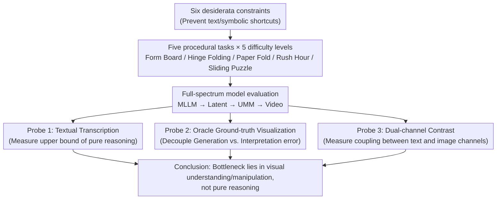

# MentisOculi: Revealing the Limits of Reasoning with Mental Imagery

**Conference**: ICML2026  
**arXiv**: [2602.02465](https://arxiv.org/abs/2602.02465)  
**Code**: Available (The paper states that generator code will be released; ⚠️ subject to the original repository)  
**Area**: Multimodal VLM / Visual Reasoning / Benchmark  
**Keywords**: Mental Imagery, Visual Reasoning, Unified Multimodal Models (UMM), Procedural Benchmark, Generation-Interpretation Error

## TL;DR
The authors developed MentisOculi, a procedural, hierarchically difficult multi-step visual reasoning benchmark consisting of five tasks that "can only be solved via internal mental imagery." By systematically testing whether frontier models can utilize "mental imagery" to assist in reasoning like humans, the study concludes that **current explicit visual strategies (latent tokens, generated images, video) fail to consistently outperform pure text baselines**. More pointedly, Unified Multimodal Models (UMMs) cannot effectively utilize even ground-truth visualizations, exposing a dual bottleneck of "generation errors" compounded by "interpretation errors."

## Background & Motivation

**Background**: Frontier models are shifting from Multimodal Large Language Models (MLLMs) that only consume visual input to **Unified Multimodal Models (UMM)** (e.g., Emu3.5, Gemini 2.5/3) capable of natively interleaved text/image/video generation. This inspires a compelling hypothesis: allowing models to generate intermediate visualizations during reasoning, analogous to human "mental imagery"—such as imagining the combination of fabric pieces when designing a dress and adjusting accordingly—a capability considered vital for problem-solving and new knowledge generation.

**Limitations of Prior Work**: The actual utility of machine mental imagery remains **highly ambiguous**. The vast majority of existing "visual reasoning" benchmarks measure "reasoning about images" rather than "reasoning with images." Efforts to use interleaved image generation to assist reasoning have yielded inconsistent results, where gains from latent visual tokens or UMM-generated images appear sporadic in multi-step settings.

**Key Challenge**: A critical question remains unanswered: when a model fails, is it due to **insufficient core reasoning ability**, **defective image generation**, or an **inability to interpret self-generated cues**? The field lacks a rigorous framework to decouple these three factors. Furthermore, existing benchmarks often suffer from pitfalls: Zebra-CoT/MIRA violate "visual nature" by relying on prior knowledge; STARE-like tasks use grid layouts with "low information density" (easily translatable to text); many tasks lack "sequential operations" (requiring only single-step rule application); and many are not strictly procedural or lack tiered difficulty.

**Goal**: To create a benchmark that **can only be solved by forming, maintaining, and repeatedly manipulating visual representations**, thereby decoupling "reasoning ability," "generation fidelity," and "interpretation capability" to determine if explicit visual thinking is currently a dead end.

**Core Idea**: Task design is constrained by six desiderata (visual nature, high information density, sequential operations, procedural, hierarchical, generative feasibility). Combined with a **ground-truth visual chain-of-thought** as an oracle, the "oracle probe"—testing if performance improves when provided with ground-truth visualizations—is used to surgically separate generation errors from interpretation errors.

## Method

This paper presents a benchmark combined with diagnostic analysis. The "method" encompasses the design principles of the benchmark, the five specific tasks, and the experimental probes used to decouple failure modes.

### Overall Architecture

MentisOculi consists of five multi-step visual reasoning tasks, each procedurally generated across five difficulty levels (where difficulty is defined by the minimum steps required for a solution, Levels 1–5, with 30 samples per level). The evaluation covers a full spectrum of reasoning paradigms: pure-text MLLMs → latent visual reasoning models → image-generating UMMs → pixel-only video models. The core diagnostic logic involves assessing each paradigm across all tasks, performing a family comparison on the representative *Rush Hour* task, and finally using three probes (textual transcription, oracle ground-truth visualization, and dual-channel contrast) to pinpoint where the bottleneck lies.

### Key Designs

**1. Six desiderata: Enforcing "Mental Imagery" as a Hard Constraint**

To address the issue where existing benchmarks allow models to bypass vision using text/symbolic shortcuts, the authors established six task design criteria: **Visual Nature** (testing spatial relationships and geometric constraints rather than common sense), **High Information Density** (avoiding grid worlds or symbolic arrangements like "Piece A at (0,1)" by using complex shapes and continuous transformations), **Sequential Operations** (requiring repeated updates to mental images where subsequent actions depend on previous results), **Procedural** (easy to generate with ground-truth visualizations), **Hierarchical** (clear complexity knobs to locate model breakdown points), and **Generative Feasibility** (ensuring visual states are representable in 2D and readable at standard resolutions). These six rules ensure that "short text cannot provide a lossless transcription," forming the foundation for the benchmark's validity.

**2. Five Tasks: Covering a Spectrum of Geometric Capabilities**

The five tasks progressively increase geometric complexity: **Form Board** (selecting a subset of candidate shapes to seamlessly cover a target outline, testing shape comparison and geometric maintenance under translation), **Hinge Folding** (predicting 90° discrete rotation angles for hinges in a chain of polygons to match a target outline, introducing mental rotation), **Paper Fold** (selecting the correct unfolded pattern given a sequence of folds and hole punches, testing spatial fidelity under reflection), **Rush Hour** (maneuvering a red car out of a crowded lot; vehicles are non-axis-aligned with continuous coordinates to prevent symbolic shortcuts), and **Sliding Puzzle** (natural images are scrambled, requiring a sequence of moves to restore coherence, testing multi-step planning). Difficulty is controlled by the minimum steps to solution; the authors note that Level 5 is sufficiently challenging for frontier models.

**3. Three Diagnostic Probes: Decoupling Failure into Reasoning, Generation, and Interpretation**

This represents the core methodological contribution—moving beyond simply reporting failure to pinpointing its location. **Probe 1: Textual Transcription**: Losslessly transcribing *Rush Hour* into pure text (lot dimensions, coordinates, orientations), allowing models to solve via "mathematical geometry" rather than visual planning. If models succeed here, the bottleneck is visual, not logical. **Probe 2: Oracle Ground-truth Visualization**: Replacing the UMM-generated images in the chain-of-thought with ground-truth visualizations. If performance improves, the issue was **generation error**; if it remains stagnant despite correct visuals, it is an **interpretation error**. **Probe 3: Dual-channel Contrast**: Comparing moves extracted from the image-only output with actions proposed in the text channel. If the channels are coupled, the actions should be consistent.

**4. Procedural Generation + Automated Scoring + Human Baseline**

To support rigorous analysis, every task is procedurally generated with ground-truth visual chains-of-thought. Scoring for *Form Board* and *Paper Fold* uses exact label matching, while *Hinge Folding*, *Sliding Puzzle*, and *Rush Hour* use environmental simulation to check if the final state is reached. Video model outputs are evaluated frame-by-frame via an automated scorer. A human psychophysics experiment (n=5 PhD students) was conducted on *Rush Hour* to provide a performance upper bound.

### Example: How the Oracle Probe Decouples the Dual Malaise of UMMs

Taking a UMM on *Hinge Folding* as an example for Probe 2: the model performs poorly when generating its own visualizations. The authors replace its self-generated folding images with ground-truth (oracle) images. Results: on *Form Board*, the oracle allows Gemini 3-I/2.5-I to reach peak accuracy, indicating the bottleneck was primarily generation error. However, on *Hinge Folding* and *Paper Fold*, oracle visualizations **only pull performance back to the level of the base MLLM**, failing to provide further gains. In some tasks, even with oracle visuals, performance remains at chance. The conclusion is clear: UMMs suffer from both "generation error" (cannot draw correctly) and "interpretation error" (cannot use the drawing even if it is correct), with the latter being the more insidious ceiling.

## Key Experimental Results

### Main Results: Visual Strategies vs. Pure Text Baseline

| Model Family | Representative Model | Key Observation |
|--------------|----------------------|-----------------|
| MLLM (Implicit Text) | Gemini 3 / GPT-5.1 / Qwen3-VL | Stable rankings; Gemini 3 is strongest; struggles to reliably exceed chance except on *Form Board*. |
| Latent Visual Reasoning | Qwen2.5-VL-32B + Mirage/LatentSketchpad | Slightly outperforms MLLM at Level 2–3, but fragile at higher difficulties; near chance at Level 5. |
| UMM (Generated Image) | Gemini 3-I / 2.5-I / Emu 3.5 | **Generally lower than corresponding MLLMs**; interleaved visualizations yield no consistent benefit. |
| Video Model (Pixels) | Veo 3.1 / Wan 2.6 | **Never exceeds chance** even with lenient scoring; performance collapses rapidly as difficulty rises. |

Overall conclusion: **No visual intervention reliably outperforms pure text baselines**; all models drop to chance or below at Level 5, with performance degrading monotonically with difficulty (validating the hierarchical design).

### Key Findings from Probes

| Probe | Finding |
|-------|---------|
| Textual Transcription (Fig.4) | Gemini 3/GPT-5.1 on pure-text *Rush Hour* **performs on par with humans**, proving the task is within their reasoning capacity → bottleneck is visual. |
| Oracle Visualization (Fig.5) | Performance increases on most tasks only after feeding ground truth (indicating generation errors), but often still fails to reach MLLM/human levels (indicating interpretation errors). |
| Dual-channel (Fig.7) | Weak coupling between channels: even at the easiest levels, about half the problems are solved by only one channel; Gemini 3-I shows greater divergence. |

### Key Findings
- **Standard language reasoning enhancements fail collectively for visual reasoning** (Fig.6): In-context learning, prompt optimization (OpenEvolve), increased reasoning budget (GPT-5.1), and tool-use all fail to provide consistent gains. This suggests the visual reasoning bottleneck is **qualitatively different** from language reasoning.
- **Models do not "allocate effort by difficulty"**: Humans spend more time on harder problems, but Gemini 3’s token usage does not increase from Level 3 to 5, failing to dynamically adjust the reasoning process.
- **Human-Machine Gap and Cost Disparity**: Humans maintain >60% accuracy at Level 5. Generating a Veo 3.1 video reasoning trajectory costs $\$3.2$ per sample—$21\times$ more expensive than Gemini 2.5-I and $60,000\times$ more than Gemini 2.5—with roughly equal performance.

## Highlights & Insights
- **The distinction between "reasoning with images" vs. "reasoning about images" is the foundation of the paper**: It identifies that the visual reasoning community has largely been measuring the wrong thing and operationalizes this distinction through six desiderata.
- **The Oracle visualization probe is an elegant design**: By testing "if the model improves when given the correct intermediate step," it surgically separates "generation error" from "interpretation error." This "upper-bound injection" logic is transferable to any diagnostic problem regarding downstream utilization of intermediate products (e.g., whether CoT or RAG results are actually being "read").
- **The discovery of weak dual-channel coupling is counter-intuitive**: The fact that UMM text and image channels solve "largely different puzzles" suggests that UMM "unification" is superficial; the two modalities operate independently without a shared, manipulatable internal visual state.

## Limitations & Future Work
- **Not a death sentence for explicit visual thinking**: Frontier models possess the underlying capabilities (Fig.4). If generation errors can be suppressed (Fig.5) and interpretation errors fixed, gains are still possible; however, this likely requires specialized training data for multi-step visual reasoning.
- **Geometric/Spatial bias**: Tasks focus on geometric transformations and spatial planning. The conclusions may not extend to "visual assistance for abstract/mathematical reasoning."
- **Small human sample size**: The human baseline (n=5) is used only as an upper bound and lacks broad statistical representation.
- **Future Direction**: The key question is not whether mental imagery is useful overall, but **which visual aids are useful for which types of tasks**. MentisOculi enables paired analysis of task-auxiliary types to establish operational guidelines for when to generate images versus using pure text.

## Related Work & Insights
- **vs. Wiedemer et al. (2025) (Pixel-based visual reasoning)**: While they showed models can solve reasoning in pixel space, this paper's conclusions are more pessimistic—Veo 3.1/Wan 2.6 never exceed chance on MentisOculi, indicating that native visual reasoning potential is far from realized.
- **vs. Mirage / LatentSketchpad (Latent visual reasoning)**: These frameworks provide limited gains over MLLMs at higher difficulties, casting doubt on the "latent visual token" narrative as a panacea.
- **vs. Zebra-CoT / MIRA / STARE**: The authors point out that these benchmarks violate desiderata (low information density, reliant on priors, etc.), positioning MentisOculi as the **first benchmark specifically for this strict "mental imagery" category**.

## Rating
- Novelty: ⭐⭐⭐⭐⭐ Clear definition of "reasoning with images" + Oracle probe for decoupling failures.
- Experimental Thoroughness: ⭐⭐⭐⭐⭐ Covers four model families, three diagnostic probes, human baselines, and four enhancement ablations.
- Writing Quality: ⭐⭐⭐⭐⭐ Logical chain from desiderata to tasks to probes is very clean.
- Value: ⭐⭐⭐⭐⭐ Provides a falsifiable, controlled testbed and diagnostic vocabulary for "visual chain-of-thought."

<!-- RELATED:START -->

## Related Papers

- [\[CVPR 2026\] Machine Mental Imagery: Empower Multimodal Reasoning with Latent Visual Tokens](../../CVPR2026/vlm_reasoning/machine_mental_imagery_empower_multimodal_reasoning_with_latent_visual_tokens.md)
- [\[ICCV 2025\] Perspective-Aware Reasoning in Vision-Language Models via Mental Imagery Simulation](../../ICCV2025/vlm_reasoning/perspective-aware_reasoning_in_vision-language_models_via_mental_imagery_simulat.md)
- [\[CVPR 2026\] From Indoor to Open World: Revealing the Spatial Reasoning Gap in MLLMs](../../CVPR2026/vlm_reasoning/from_indoor_to_open_world_revealing_the_spatial_reasoning_gap_in_mllms.md)
- [\[ICML 2026\] 3ViewSense: Spatial and Mental Perspective Reasoning from Orthographic Views in Vision-Language Models](3viewsense_spatial_and_mental_perspective_reasoning_from_orthographic_views_in_v.md)
- [\[ICLR 2026\] MindCube: Spatial Mental Modeling from Limited Views](../../ICLR2026/vlm_reasoning/mindcube_spatial_mental_modeling_from_limited_views.md)

<!-- RELATED:END -->
