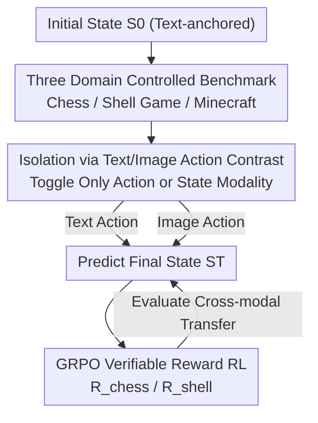

# MET-Bench: Multimodal Entity Tracking for Evaluating the Limitations of Vision-Language and Reasoning Models

**Conference**: ICML2026  
**arXiv**: [2502.10886](https://arxiv.org/abs/2502.10886)  
**Code**: To be confirmed  
**Area**: LLM Reasoning / Multimodal VLM  
**Keywords**: Entity State Tracking, Vision-Language Models, Multimodal Reasoning, Reinforcement Learning, GRPO

## TL;DR
This paper proposes MET-Bench, a multimodal entity tracking benchmark across three domains (Chess, Shell Game, and Minecraft). It requires vision-language models to track entity state changes from sequences of actions presented in either text or image format. Findings show that "image-based actions" are significantly more difficult than "text-based actions," and this gap originates from visual reasoning rather than perception. While GRPO reinforcement learning yields substantial improvements within a single modality, it fails to transfer across modalities.

## Background & Motivation

**Background**: "World models" capable of tracking and predicting the latent states of the world are a major goal in AI. At the heart of this is **entity state tracking** (estimating how entities, attributes, and relations evolve over time), which is essential for robotic manipulation, video Q&A, and computer-control agents. Early research on entity tracking was conducted almost exclusively on **text-only** tasks (coreference resolution, discourse processing, narrative understanding).

**Limitations of Prior Work**: As AI increasingly processes mixed "text + image/video" content, entity tracking must extend to the multimodal domain. However, existing benchmarks primarily evaluate text, and there has been no systematic quantification of whether models can maintain coherent entity representations when state updates are provided in visual form.

**Key Challenge**: Models perform well on pure text, but once actions/states are switched to visual formats, is the failure due to **not seeing (perception)** or **not thinking (reasoning)**? These two are often entangled, and standard benchmarks cannot distinguish them, leading to unclear directions for improvement.

**Goal**: Construct a controlled benchmark that **decouples perception and reasoning**, quantifies the gap in entity tracking between text and images, and explores whether reinforcement learning can bridge this gap.

**Key Insight**: Use "game-like" environments with explicit rules and controllable difficulty — Chess, Shell Game, and Minecraft — to anchor initial and final states as well-defined text representations. By toggling only the "actions" or "states" between text and images, any performance drop directly equates to the "loss introduced by visual reasoning," minimizing interference from perceptual noise.

**Core Idea**: Isolate the visual reasoning gap through a controlled design where "states are anchored in text, and action/state modalities are switchable," and then attempt to close it using programmatically verifiable GRPO reinforcement learning to test for cross-modal transfer.

## Method

### Overall Architecture
MET-Bench formalizes multimodal entity tracking as **sequential state estimation**: given an initial state $\mathbf{S}_0$ and an action sequence $\mathbf{A}=(\mathbf{a}_1,\dots,\mathbf{a}_T)$, the model is prompted to infer the final state

$$\mathbf{S}_T = f(\mathbf{S}_0, \mathbf{a}_1, \mathbf{a}_2, \dots, \mathbf{a}_T)$$

where each action $\mathbf{a}_t$ can be text $\mathbf{a}_t^{\text{text}}$ or an image $\mathbf{a}_t^{\text{image}}$. The benchmark covers three domains of increasing difficulty (Chess / Shell Game / Minecraft). It isolates the contribution of visual reasoning by "switching only the modality of actions or states while keeping everything else constant." Finally, it trains open-source models using GRPO reinforcement learning to examine if single-modality gains transfer across modalities.

### Key Designs

**1. Three Domain Controlled Benchmark: Isolating Entity Tracking via Controlled Games**

The authors selected three complementary domains covering a spectrum from "structured/closed" to "open/dynamic." **Chess**: The state $S_t$ is the FEN representation of an 8×8 board, and actions are legal moves from real games, provided as UCI text (e.g., `e2e4`) or rendered images. The model outputs the final FEN after the sequence — a mature testbed for entity tracking, though prone to memorization risks given models have seen vast UCI/FEN data. **Shell Game**: A ball is hidden under one of three cups, and pairs of cups are swapped several times. The model must track the ball's final position. Actions are `x swap y` text or images of the swap (with the ball invisible). The output is the position number (1/2/3). It has a smaller entity space but is likely absent from training data, avoiding memorization shortcuts. **Minecraft**: Closer to a real-world partially observable, dynamic, and visually complex environment. The state consists of a first-person local world (position/orientation/nearby blocks/visible scene), and actions are low-level commands like "move forward 8 blocks, attack." Unlike the others, the model must **select the correct next state** from four candidates (multiple choice), comparing visual vs. text reasoning by varying the state modality.

**2. Contrastive Isolation of Text/Image Actions: Equating Performance Gaps to Visual Reasoning Loss**

This is the central design of the benchmark. In Chess and the Shell Game, **initial and final states are always represented in text**, while only the intermediate actions toggle between UCI text and rendered images. Since the model "starts from well-defined text and ends with well-defined text," the only variable is the presentation modality of the actions. The accuracy difference between text and image conditions **cleanly measures the gap introduced by visual state understanding**, minimizing the interference of perceptual failure. In Minecraft, the process is reversed: actions are fixed as text, while the **state** modality is switched (text telemetry vs. first-person screenshots). The text condition serves as a performance upper bound due to its structured and sufficient information; any drop in the image condition represents visual understanding loss. The implication is that if visual and text reasoning were equal, both conditions should yield similar accuracy; a larger gap indicates a more severe visual bottleneck. Additionally, image actions undergo specific visual prompt engineering (arrows, bounding boxes, symbolic markers), achieving high action classification accuracy to further isolate errors into "reasoning" rather than "perception."

**3. GRPO Verifiable Reward Reinforcement Learning: Improving Tracking for Open-Source Models**

To test whether stronger entity tracking can be trained, the authors applied **GRPO (Group Relative Policy Optimization)** to open-source VLMs. GRPO is a policy gradient RL method suitable for "outcome-verifiable" tasks, which entity tracking allows via programmatic verification. The reward function leverages the benchmark's automatic verifiability: for Chess, rewards are given based on piece-by-piece accuracy on the board:

$$R_{\text{chess}}(y, y^*) = \frac{1}{64}\sum_{i=1}^{64} \mathbb{1}[y_i = y_i^*]$$

The Shell Game uses a binary reward $R_{\text{shell}}(y, y^*) = \mathbb{1}[y = y^*]$. The target model is Gemma 3 4B IT. Since the base policy cannot output valid chains-of-thought for Chess images with 10 steps, SFT was first performed on synthetic demonstrations to initialize the output format before RL. The authors also found that fine-tuning only on the "final state" fails to generalize; models must generate intermediate reasoning steps — consistent with findings in Tables 1/2 that explicit reasoning facilitates sequential state tracking.

### Example: Chess Zero-Shot Prompt
The model receives a system prompt: "You are an assistant that tracks chess games and produces final FENs." Given an initial FEN `rnbqkbnr/pppppppp/8/8/8/8/PPPPPPPP/RNBQKBNR w KQkq - 0 1`, followed by two moves `e2e4`, `e7e5`, the model must output `FINAL ANSWER: [FEN]`. In the text condition, UCI strings are provided directly. In the image condition, these steps are replaced with rendered images and a description of how to interpret them. The model responds with `rnbqkbnr/pppp1ppp/8/4p3/4P3/8/PPPP1PPP/RNBQKBNR w KQkq - 0 2`. By varying only the modality for the same problem, the visual reasoning loss is contrasted.

## Key Experimental Results

### Main Results
In zero-shot settings, text actions significantly outperform image actions, a gap consistently present across all models. In Chess, since predicting the "Initial Position" is already a strong baseline (most of the board remains unchanged after 10 moves, with the Game Start baseline reaching 74.9%), the drop in the image condition is particularly telling.

| Domain / Setting | Model | Text(%) | Image(%) |
|------|------|------|------|
| Chess Zero-Shot | Claude 3.7 Sonnet | 96.1 | 70.2 |
| Chess Zero-Shot | Gemini-2.5-Flash | 91.0 | 66.9 |
| Chess Zero-Shot Baseline | Game Start | 74.9 | 74.9 |
| Shell Game Zero-Shot | Claude 3.7 Sonnet | 35.4 | 37.8 |
| Shell Game Zero-Shot Baseline | Random | 33.3 | 33.3 |

### Ablation Study
In the Shell Game zero-shot setting, all models perform near random (the ball is hidden and requires reasoning). While Chain-of-Thought (CoT)/reasoning brings text-condition performance near perfect, it barely improves image-condition performance, indicating the visual tracking gap remains stubborn even when the model "can reason."

| Configuration | Shell Game Text(%) | Shell Game Image(%) | Description |
|------|------|------|------|
| GPT-4o Zero-Shot | 33.0 | 32.2 | Near random guessing |
| GPT-4o CoT | 98.2 | 36.6 | Text surges, image remains near random |
| GPT-4.1-mini CoT | 100.0 | 72.0 | Text perfect, image clearly lagging |
| Claude 3.7 Sonnet CoT (Chess) | 99.5 | 96.2 | Rare case of closing the visual gap |

### Key Findings
- **Image ≪ Text, and the gap stems from reasoning, not perception**: Image-based actions maintain high classification accuracy through prompt engineering yet result in significant performance drops, suggesting the bottleneck is high-level visual reasoning rather than "not seeing clearly."
- **Explicit reasoning is helpful but insufficient**: Few-shot, CoT, and reasoning models all improve scores, and text conditions often approach perfection, but image conditions for long sequences (e.g., 20 steps in the Shell Game) still degrade to random for most models. Long-range multimodal tracking remains a hard problem.
- **RL gains are intra-modal and hard to transfer**: GRPO training provides significant "intra-modality" gains but fails to transfer robustly to the other input modality — highlighting that VLM multimodal representations remain fragmented.
- **Learning only the final state does not generalize**: Intermediate reasoning steps must be generated during training for the model to learn sequential state tracking.

## Highlights & Insights
- **The "Text-anchored state, toggled action modality" contrast** is the most elegant design: it surgically separates the perception vs. reasoning entanglement that haunts multimodal evaluation, making the performance difference a clean metric for the visual reasoning gap. This methodology is applicable to any task where state can be textualized.
- **The Shell Game as a "non-memorization" control** is strategic: while Chess has memorization risks due to FEN/UCI prevalence in pre-training, the Shell Game is likely unseen, allowing the separation of "true tracking" from "rote memorization."
- **Verifiable Reward + GRPO** turns entity tracking into a natural RL task (using piece-by-piece accuracy for dense rewards), but the negative result of "intra-modality success, cross-modality failure" is a major finding itself, warning that RL does not automatically unify modalities.
- A counter-intuitive point: Even the strongest reasoning models degrade to random on long-sequence "Image Shell Game" tasks, suggesting current VLMs lack the ability to integrate visual updates into a coherent world state rather than simply being unable to see the frames.

## Limitations & Future Work
- All three domains are **controlled games**; Chess and Shell Game are notably "toy-like." The authors acknowledge real-world settings are more ambiguous; Minecraft attempts to bridge this but still uses scripted trajectories.
- **Memorization pollution** remains a risk for Chess (given models have seen UCI/FEN extensively); it is difficult to isolate how much text-condition success comes from true tracking vs. pattern memorization.
- RL was only validated on Gemma 3 4B IT and required SFT to initialize output formats, limiting its scale and generalizability. Whether the "cross-modality non-transfer" conclusion holds for larger models or different RL algorithms is unknown.
- Conflict of Interest: One author is a student researcher at Google DeepMind, and the evaluation includes Gemini/Gemma models — interpretations of results should be handled with appropriate caution.

## Related Work & Insights
- **vs. Text-only Entity Tracking (toshniwal2022chess, etc.)**: This work extends classic text-based tracking tasks like Chess to the multimodal domain, adding "image action/state" conditions and quantifying the cross-modal tracking gap for the first time.
- **vs. General VLM Perception Benchmarks**: Most benchmarks conflate perception and reasoning. MET-Bench deliberately anchors the state in text to keep **only** visual reasoning as the variable, offering a more precise diagnostic.
- **vs. DeepSeekMath / Original GRPO Work**: Reuses GRPO but applies it to "verifiable entity tracking" rewards, providing new boundaries on its effectiveness ("intra-modality effective, cross-modality failure") in this specific domain.

## Rating
- Novelty: ⭐⭐⭐⭐ First system to extend entity state tracking to multimodal contexts while decoupling perception and reasoning.
- Experimental Thoroughness: ⭐⭐⭐⭐⭐ Three domains × multiple settings (zero/few-shot/CoT/Reasoning) × numerous frontier models + RL; very broad coverage.
- Writing Quality: ⭐⭐⭐⭐ Clear formalization, well-explained contrastive design, though table cached versions are slightly fragmented.
- Value: ⭐⭐⭐⭐ Provides a clean diagnostic tool for understanding why VLM visual reasoning is weak and offers a cautionary conclusion on RL transfer.

<!-- RELATED:START -->

## Related Papers

- [\[ICLR 2026\] GTR-Bench: Evaluating Geo-Temporal Reasoning in Vision-Language Models](../../ICLR2026/vlm_reasoning/gtr-bench_evaluating_geo-temporal_reasoning_in_vision-language_mod.md)
- [\[CVPR 2026\] VisRes Bench: On Evaluating the Visual Reasoning Capabilities of VLMs](../../CVPR2026/vlm_reasoning/visres_bench_on_evaluating_the_visual_reasoning_capabilities_of_vlms.md)
- [\[CVPR 2026\] SpatiaLQA: A Benchmark for Evaluating Spatial Logical Reasoning in Vision-Language Models](../../CVPR2026/vlm_reasoning/spatialqa_a_benchmark_for_evaluating_spatial_logical_reasoning_in_vision-languag.md)
- [\[ICML 2025\] Reasoning Limitations of Multimodal Large Language Models. A Case Study of Bongard Problems](../../ICML2025/vlm_reasoning/reasoning_limitations_of_multimodal_large_language_models_a_case_study_of_bongar.md)
- [\[CVPR 2026\] QUANTIPHY: A Quantitative Benchmark Evaluating Physical Reasoning Abilities of Vision-Language Models](../../CVPR2026/vlm_reasoning/quantiphy_a_quantitative_benchmark_evaluating_physical_reasoning_abilities_of_vi.md)

<!-- RELATED:END -->
