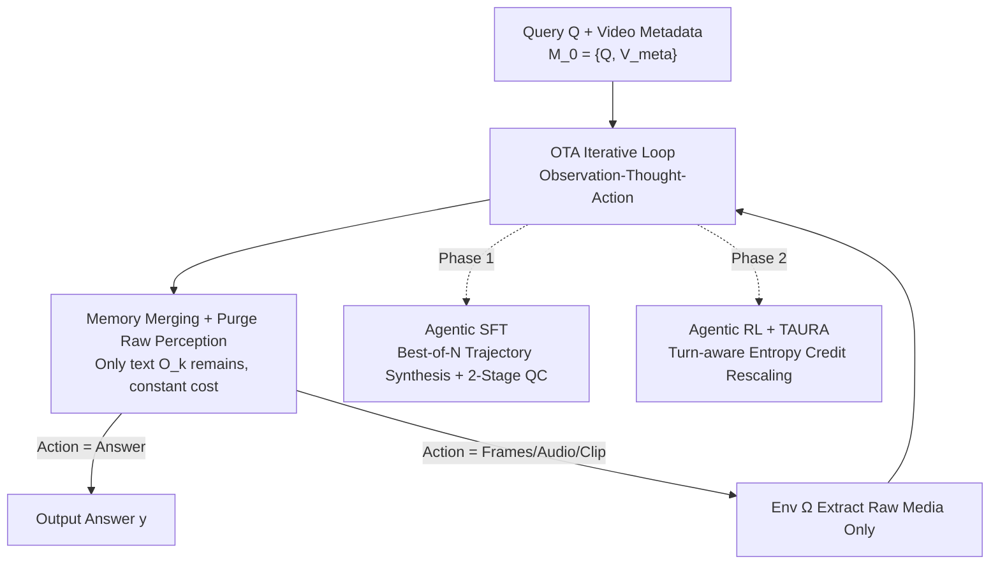

# Native Active Perception as Reasoning for Omni-Modal Understanding

**Conference**: ICML 2026  
**arXiv**: [2606.19341](https://arxiv.org/abs/2606.19341)  
**Code**: https://github.com/harryhsing/OmniAgent  
**Area**: Multimodal VLM / VLM Reasoning / Long Video Understanding / Agentic RL / test-time scaling  
**Keywords**: Active Perception, POMDP, Long Video Understanding, Agentic RL, test-time scaling

## TL;DR
OmniAgent shifts long video understanding from the passive "watch-it-all" paradigm to an active perception approach of "iterative look-as-needed." Using an Observation-Thought-Action (OTA) loop within a native omni-modal model, it distills audio-visual cues into persistent text memory and immediately discards raw media, thereby decoupling reasoning costs from video duration. Combined with Agentic SFT for cold-starting and Agentic RL with TAURA, the 7B model achieves 50.5% on LVBench, surpassing the 10x larger Qwen2.5-VL-72B (47.3%), and exhibits positive test-time scaling where performance improves with more reasoning turns.

## Background & Motivation

**Background**: Currently, the mainstream approach for omni-modal/long video understanding is "watch-it-all"—feeding all frames into the model uniformly for one-time processing regardless of query difficulty. The challenge is that spatiotemporal data has extremely high dimensionality, causing **computational costs to grow super-linearly with sequence length**, making it nearly impossible for hour-long videos.

**Limitations of Prior Work**: To alleviate this burden, two types of agentic modifications exist, but neither achieves true decoupling. First, using an LLM as a controller to call expert tools (captioning, ASR, retrieval); however, these intermediate modules sever the gradient flow between reasoning and perception, creating an information bottleneck. Second, "thinking with images" methods that insert transformations like temporal cropping or spatial zooming into the MLLM's chain-of-thought; yet, these remain **semi-passive**, usually requiring a global pre-scan of the entire video or maintaining a dense visual buffer to decide "where to look," meaning context costs still grow with video length.

**Key Challenge**: In passive paradigms, the **complexity of the model's internal state is bound to the raw video duration**, whereas human perception is actually an active, on-demand interrogation of interleaved signals. What is truly needed is to unbind "internal state complexity" from "raw duration," making it depend only on the evidence required for reasoning.

**Goal**: (1) Enable MLLMs to become native active perceivers, modeling multimodal exploration as an iterative decision process; (2) Use a single native model for perception, reasoning, and action without external modules; (3) Develop a training paradigm that can cold-start such agentic behavior and correctly assign credit across multiple interaction turns.

**Key Insight**: Model audio-visual exploration as a **Partially Observable Markov Decision Process (POMDP)** and enforce "information distillation"—compressing high-dimensional transient perception into persistent textual memory and discarding raw media after viewing. This ensures the internal state depends only on the complexity of the reasoning trajectory rather than the video duration, naturally enabling System-2 style test-time scaling: difficult problems simply take more steps.

**Core Idea**: Use an "OTA iterative loop + strict separation of transient perception/persistent memory" to transform video understanding into a native active perception reasoning process, decoupling reasoning complexity from video duration.

## Method

### Overall Architecture

OmniAgent models its interaction with the video environment as a POMDP: the transient perception $\mathcal{E}_k$ is the raw media returned by the environment $\Omega$, and the persistent memory $\mathcal{M}_k$ is the agent's aggregated internal state. At each turn $k$, the policy $\pi_\theta$ autoregressively generates an OTA triplet $(O_k, T_k, A_k)$ conditioned on previous memory and transient perception: $(O_k, T_k, A_k) \sim \pi_\theta(\cdot \mid \mathcal{M}_{k-1}, \mathcal{E}_{k-1})$. The initial memory $\mathcal{M}_0 = \{Q, V_{\text{meta}}\}$ contains only the query and video metadata (duration, FPS, existence of audio). After each turn, the environment **purges** the raw perception $\mathcal{E}_{k-1}$ from the context, leaving only the distilled text $O_k$ in memory—ensuring constant media overhead regardless of duration. Crucially, $\Omega$ **only performs raw media extraction** (sampling frames, extracting audio, clipping segments), while all semantic perception and reasoning are handled by the same native model $\pi_\theta$. The model uses Agentic SFT to cold-start execution capabilities, followed by Agentic RL with TAURA to refine reasoning-driven perception.

### Key Designs

**1. OTA Loop under POMDP: Strict separation of transient perception and persistent memory for cost-duration decoupling**

To address the issue of internal state complexity being tied to video duration, OmniAgent treats perception as query-driven iterative reasoning. Each turn consists of three parts: **Observation $O_k$** distills high-dimensional transient perception $\mathcal{E}_{k-1}$ into a structured text summary, explicitly preserving key audio-visual details needed for subsequent reasoning before the raw media is purged; **Thought $T_k$** analyzes existing memory $\mathcal{M}_{k-1}$ and current observations to identify information gaps and justify the next action; **Action $A_k$** is sampled from the operator set $\mathcal{A} = \{a_{\text{frames}}, a_{\text{audio}}, a_{\text{clip}}, a_{\text{answer}}\}$. Operators include $a_{\text{frames}}(s, e, n)$ for uniform frame sampling, $a_{\text{audio}}(s, e)$ for audio extraction, $a_{\text{clip}}(s, e)$ for synchronized audio-visual clips, and $a_{\text{answer}}(y)$ to terminate. The **strict context purging mechanism** is the key to decoupling: $\mathcal{M}_k \leftarrow \mathcal{M}_{k-1} \cup \{(O_k, T_k, A_k)\}$ adds only text, while $\mathcal{E}_{k-1}$ is discarded. Unlike tool-calling agents, $\Omega$ performs no semantic understanding, ensuring the gradient flow between reasoning and perception is not severed.

**2. Agentic SFT: Best-of-N trajectory synthesis + two-stage quality control to cold-start native active perception**

To prevent policy collapse due to a lack of long-range agentic priors, the authors perform supervised cold-starting. They curate an Agentic SFT corpus of 58K trajectories covering MCQ, numerical reasoning, and temporal localization, strictly aligned with the $(O_k, T_k, A_k)$ format. Synthesis is achieved through **exploration rather than static annotation**—prompting a teacher model to perform success-driven exploration in the environment $\Omega$, generating a pool of best-of-N candidate trajectories. The process **deliberately allows self-correction** (e.g., recovering from an invalid out-of-bounds timestamp), which helps the model treat diagnostic signals as useful cues rather than fatal failures. This is refined by **two-stage quality control**: (1) Result verification—exact matches for discrete tasks and threshold-based checks for continuous tasks (IoU $\geq 0.5$ for localization); (2) Rationality audit—using GPT-4o on a 5-point Likert scale to judge if $T_k$ is logically entailed by $\mathcal{M}_{k-1}$ and $O_k$, filtering out "lucky guesses" and ensuring each SFT action is grounded in explicit context (score $\geq 3/5$).

**3. TAURA: Turn-aware Adaptive Uncertainty Rescaled Advantage to solve Advantage Homogenization in multi-turn RL**

When applying GRPO to multi-turn agentic reasoning, "Advantage Homogenization" occurs—vanilla GRPO broadcasts the same scalar advantage to every turn, failing to distinguish between critical "discovery" turns and trivial filler turns (empirically, 79.2% of critical turns have significantly higher token entropy than the trajectory average). TAURA refines trajectory-level advantages to turn-level. First, it calculates the baseline advantage $A_i$ via group-relative reward normalization:

$$A_i=\frac{R_i-\frac{1}{G}\sum_{j=1}^{G}R_j}{\text{std}(R_1,\dots,R_G)},$$

Then, it uses the **average token entropy $H_{i,k}$ per turn as a continuous weight** for turn-level rescaling:

$$\hat{A}_{i,k}=A_i\cdot w_{i,k},\quad w_{i,k}=\frac{H_{i,k}}{\frac{1}{N_\mathcal{G}}\sum_{j=1}^{G}\sum_{m=1}^{K_j}H_{j,m}},$$

where $N_\mathcal{G} = \sum_j K_j$ is the total number of turns in the group. Normalization ensures $\mathbb{E}[w_{i,k}]=1$, maintaining the original gradient scale while directing updates toward high-uncertainty discovery moments. Continuous weighting is used instead of masking because masking tokens breaks output structure, and masking whole turns severs context dependencies. TAURA scales signed advantages: for correct trajectories ($A_i > 0$), high entropy ($w_{i,k} > 1$) amplifies the advantage to reinforce turns where the model actually tackles uncertainty; for incorrect trajectories ($A_i < 0$), high entropy brings a larger penalty, strictly punishing "confused guessing."

### Main Results

OmniAgent-7B achieves SoTA among open-source models across 10 benchmarks, showing consistent improvement over the Qwen2.5-Omni baseline.

| Benchmark | Duration Scale | Qwen2.5-Omni-7B | OmniAgent-7B | Gain ($\Delta$) |
|:---|:---|:---|:---|:---|
| VideoMME (Overall) | 1–60 min | 64.8 | 67.8 | +3.0 |
| VideoMME-Long | 30–60 min | 54.8 | 59.6 | +4.8 |
| VSI-Bench | 97 sec | 35.5 | 48.4 | +12.9 |
| MLVU | 3–120 min | 65.2 | 71.1 | +5.9 |
| LVBench | Long | 43.0 | 50.5 | +7.5 |
| DailyOmni | 43 sec | 60.1 | 64.8 | +4.7 |
| OmniVideoBench | 384 sec | 29.3 | 37.1 | +7.8 |
| LongVALE (IoU) | 233 sec | 5.7 | 39.1 | +33.4 |
| VUE-TR (Vision+Audio) | 1066 sec | 3.5 | 36.5 | +33.0 |

Highlights: On LVBench, the 7B model (50.5%) **outperforms the 10x larger Qwen2.5-VL-72B (47.3%)** while using 73% fewer frames. In temporal localization (LongVALE/VUE-TR), it achieves absolute gains of +33.4/+33.0, even surpassing closed-source models like GPT-4o and Gemini-1.5-Pro. Compared to LongVU (1 FPS dense sampling), it improves VideoMME by +7.2%, demonstrating higher efficiency of active perception over uniform processing.

### Ablation Study

| Configuration | LVBench | MLVU | DailyOmni | Notes |
|:---|:---|:---|:---|:---|
| Qwen2.5-Omni (Baseline) | 43.0 | 65.2 | 60.1 | Passive starting point |
| + Standard SFT | 41.6 ↓ | 67.1 | 61.7 | Static QA finetuning degrades in ultra-long context |
| + Agentic SFT | 48.7 | 69.9 | 63.3 | OTA format cold-start significantly boosts long video |
| + Vanilla GRPO | 49.8 | 69.9 | 62.2 ↓ | Advantage homogenization: reasoning stall, perception drop |
| + TAURA | **50.5** | **71.1** | **64.8** | Turn-level entropy credit improves both perception & reasoning |

### Key Findings
- **Passive SFT suffers from performance degradation in long videos**: Standard SFT dropped LVBench scores from 43.0 to 41.6, confirming that passive paradigms suffer from information overload as duration increases. Switching to Agentic SFT immediately improved it to 48.7, validating the necessity of OTA active selection.
- **TAURA revitalizes the RL phase**: Vanilla GRPO stalled on MLVU and dragged DailyOmni down. After applying TAURA to weight high-entropy turns, both perception (DailyOmni 64.8) and reasoning (MLVU 71.1) improved consistently.
- **Positive and adaptive test-time scaling**: On VideoMME-Long, accuracy increases with the maximum turn limit $K$ (+6.2%). However, even with $K=52$, the actual average execution saturates at 11.7 turns—the model adjusts reasoning depth based on information needs rather than simply filling steps.
- **Costs are driven by task complexity, not duration**: Analysis on LVBench showed that sampling density significantly decreases for longer videos while accuracy remains stable, directly proving the core claim of "decoupling reasoning complexity from video duration."

## Highlights & Insights
- **"Perception as Reasoning" instead of "Perception as Pre-processing"**: Integrating "where to look" and "what to hear" into a single POMDP decision process within one native model avoids gradient disconnection and information bottlenecks found in tool-based agents.
- **Strict Context Purging = Constant Media Overhead**: Discarding raw media while keeping only textual observations is a simple yet powerful mechanism that makes "cost independent of duration" possible.
- **TAURA translates "high entropy indicates reasoning branching" into turn-level logic**: Using continuous entropy weights instead of binary masks preserves the structural integrity of agentic trajectories while directing credit to critical discovery turns.
- **Positive test-time scaling is direct evidence of active perception efficacy**: The fact that performance improves with more steps and saturates adaptively proves that the model learns "exploration on demand."

## Limitations & Future Work
- The RL phase is limited to videos under 300 seconds; RL gains on long videos rely on generalization. The stability of active perception strategies on ultra-long videos (>2h) requires further verification.
- Rationality auditing depends on GPT-4o acting as a judge, introducing bias and cost. The granularity of environment $\Omega$ (frame sampling limits and token counts) directly dictates the performance ceiling.
- Future directions include extending active perception to streaming scenarios, reducing reliance on external judges, and expanding the action space (e.g., finer spatial zooming) to improve localization precision.

## Related Work & Insights
- **Vs. Tool-orchestration Agents**: These rely on pre-extracted contexts from modules, cutting gradient flow. OmniAgent is a single native model where the environment only provides raw media, keeping perception and reasoning unified.
- **Vs. "Thinking with Images"**: Those methods often require global scans or dense buffers, scaling with duration. OmniAgent achieves decoupling through strict purging.
- **Vs. Open-source Thinking Models (e.g., Video-R1)**: While they extend CoT on static inputs, OmniAgent actively queries the environment for missing evidence, addressing the insight that the bottleneck in long video is often "incomplete perception" rather than just "reasoning depth."

## Rating
- **Novelty**: ⭐⭐⭐⭐⭐ First end-to-end framework to treat omni-modal video understanding as a native active perception POMDP.
- **Experimental Thoroughness**: ⭐⭐⭐⭐⭐ Comprehensive evaluation across 10 benchmarks, 7B model vs 72B model comparison, and detailed test-time scaling analysis.
- **Writing Quality**: ⭐⭐⭐⭐ Solid formalization and motivation; some technical details are deferred to appendices.
- **Value**: ⭐⭐⭐⭐⭐ Provides a scalable roadmap for long video understanding by decoupling cost from duration.

<!-- RELATED:START -->

## Related Papers

- [\[ACL 2026\] OMHBench: Benchmarking Balanced and Grounded Omni-Modal Multi-Hop Reasoning](../../ACL2026/vlm_reasoning/omhbench_benchmarking_balanced_and_grounded_omni-modal_multi-hop_reasoning.md)
- [\[ICLR 2026\] ThinkOmni: Lifting Textual Reasoning to Omni-modal Scenarios via Guidance Decoding](../../ICLR2026/vlm_reasoning/thinkomni_lifting_textual_reasoning_to_omni-modal_scenarios_via_guidance_decodin.md)
- [\[CVPR 2026\] Act2See: Emergent Active Visual Perception for Video Reasoning](../../CVPR2026/vlm_reasoning/act2see_emergent_active_visual_perception_for_video_reasoning.md)
- [\[ACL 2026\] ChemVLR: Prioritizing Reasoning in Perception for Chemical Vision-Language Understanding](../../ACL2026/vlm_reasoning/chemvlr_prioritizing_reasoning_in_perception_for_chemical_vision-language_unders.md)
- [\[ACL 2026\] Decoding Scientific Experimental Images: The SPUR Benchmark for Perception, Understanding, and Reasoning](../../ACL2026/vlm_reasoning/decoding_scientific_experimental_images_the_spur_benchmark_for_perception_unders.md)

<!-- RELATED:END -->
