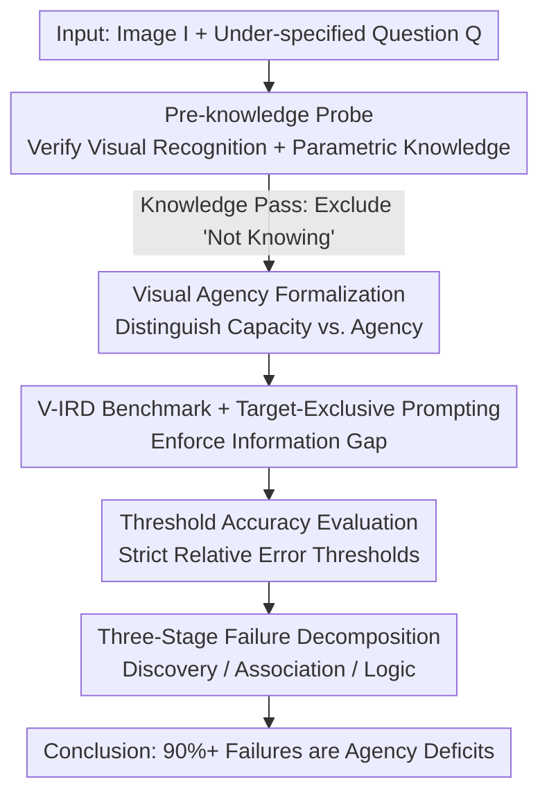

# Position: The Systemic Lack of Agency in Visual Reasoning

**Conference**: ICML 2026  
**arXiv**: [2606.14795](https://arxiv.org/abs/2606.14795)  
**Code**: [Project Page](https://haoychen.github.io/Implicit-Reasoning/)  
**Area**: Multimodal VLM / Visual Reasoning / Position Paper  
**Keywords**: Visual Agency, Implicit Reasoning, Position Paper, V-IRD Benchmark, Attention Tunneling

## TL;DR
This position paper argues that current VLMs exhibit a systemic "lack of visual agency"—they can perceive details when explicitly directed but fail to autonomously search for implicit visual cues that are unmentioned in the prompt yet essential for problem-solving. Through a formal framework, a four-quadrant taxonomy, and the specially constructed V-IRD benchmark, the authors demonstrate that even the strongest closed-source models fail primarily because they "did not look for evidence" rather than "could not compute the answer."

## Background & Motivation
**Background**: Cognitive science has long understood "perception" as a goal-driven, active information-gathering process rather than passive stimulus reception. Current VLMs (InternVL, Qwen-VL, GPT-5.2, Gemini-3, etc.) have become highly proficient in semantic recognition and explicit instruction following. Almost all mainstream benchmarks (PhysBench, MMMU, V*, etc.) evaluate models within this "explicitly told where to look" paradigm.

**Limitations of Prior Work**: The authors identify a systemic blind spot in existing evaluation systems—they measure "visual capacity" (what a model can see when guided) but neglect "visual agency" (whether a model autonomously searches for evidence). This manifests in three ways: ① Explicit VQA offloads the visual planning process to the user, who acts as an "attention manager"; ② Hallucination research focuses on "commission" errors (fabricating non-existent objects) while ignoring "omission" errors (failing to see what should be seen); ③ Physical reasoning benchmarks are mostly in closed-set formats where necessary variables are already provided.

**Key Challenge**: Most real-world visual reasoning is **implicit**. Critical geometric or physical cues (e.g., background reference objects like ID cards or coins needed to estimate bottle dimensions) are typically **not** included in the user's prompt. The core difficulty is not "recognizing the object" but "autonomously retrieving unmentioned, supportive visual details to construct valid physical arguments." When a prompt focuses only on the target object without pointing to background information, the model fails to discover critical hidden information and instead acts as a passive observer, discarding the visual context as irrelevant background.

**Goal**: To formalize the distinction between "visual capacity" and "visual agency" and provide empirical evidence through diagnostic experiments that this deficiency is a systemic weakness of current VLMs.

**Core Idea**: When language no longer serves as an "attention crutch," models expose a lack of **agency to initiate visual searches** rather than a lack of knowledge. The authors name this the **Visual Implicit Reasoning Deficit (V-IRD)** and argue that it cannot be resolved simply by scaling or prompting; it requires fundamental changes to training objectives or architectures.

## Method
> Note: As this is a position paper, it does not propose a new model. The "method" refers to the **conceptual framework, diagnostic pipeline, and evaluation design** used to argue the position.

### Overall Architecture
The argument proceeds through three layers: first, a mathematical formalization distinguishes explicit reasoning, implicit reasoning, and the deficit state; second, a two-dimensional four-quadrant taxonomy identifies the "Missing Quadrant Q4" overlooked by existing benchmarks; finally, the V-IRD benchmark is constructed with a diagnostic pipeline that filters for knowledge before testing agency to decouple whether failures stem from "not knowing" or "not looking."

### Key Designs

**1. Formalization of Visual Agency vs. Capacity: Defining the Deficit as a Search Break**

The authors denote a VLM mapping image $I$ and question $Q$ to answer $A$ as $M(I,Q)\to A$. In **explicit reasoning**, $Q$ includes pointers to the necessary evidence $E$ (e.g., "Is the red wire connected to the battery?" directs attention to the wire and battery). The task reduces to verification $A\leftarrow M(I,Q_{\text{explicit}})$, where the model passively executes a user-provided search plan. **Implicit reasoning** is under-specified (e.g., "What is the diameter of this badge?"), where $E$ is unmentioned. This requires two stages: a Plan stage using world knowledge $K$ to convert $Q$ into search intent, followed by autonomous Search: $E\leftarrow \textit{Search}(I,\textit{Plan}(Q,K))$, and finally $A\leftarrow M(E,Q)$. The **Deficit** is precisely defined as the collapse of the $E\leftarrow\textit{Search}(\cdot)$ step—when $E$ is not named, the model fails to initiate $\textit{Plan}(Q,K)$, and reasoning degrades into a restricted inspection of only the named target $A\leftarrow M(I|_{Q_{\text{target}}},Q)$. The authors term the phenomenon where a model precisely processes pixels of mentioned objects but treats context containing key evidence as irrelevant background as **attention tunneling**.

**2. Four-Quadrant Taxonomy: Locating the "Missing Quadrant" Q4**

The authors partition the vision-language task space along two axes: **Information Availability** (Explicit vs. Implicit input) and **Cognitive Demand** (Recognition vs. Reasoning). This yields four quadrants: Q1 Explicit Recognition (target named, recognition only; high capacity in current models); Q2 Explicit Reasoning (math benchmarks, text provides reasoning path; good performance); Q3 Implicit Perception (passive quality checks like object hallucination, no active search required); **Q4 Autonomous Information Retrieval—where visual evidence determines the answer but is entirely absent from the prompt**. The authors argue Q4 is the "Missing Quadrant" systematically ignored by current benchmarks: success requires models to autonomously infer "which unmentioned features need to be retrieved," translating high-level goals into low-level visual search operations.

**3. V-IRD Benchmark + Target-Exclusive Prompting + Threshold Accuracy: Measuring Agency**

To isolate Q4, the authors constructed the **V-IRD (Visual Implicit Reasoning Diagnosing Benchmark)**, covering four domains and ten fine-grained tasks: Spatial Geometry (41%, including precision measurements of length/distance/volume/area), Contextual Inference (29%, environment/annotation inference), Physical Properties (21%, temperature/weight), and Physical Logic (9%, electricity/kinematics). The core mechanism is **Target-Exclusive Prompting**: the prompt is only allowed to mention the semantic target (e.g., "How tall is this bottle?") and is **strictly prohibited** from mentioning any background reference objects (coins, environmental markers, relative positions), turning the evaluation into a test of "autonomous visual discovery." For evaluation, discrete tasks use standard Accuracy $\text{ACC}=\mathbb{I}(\hat c=c)$, while continuous estimation tasks use **Threshold Accuracy** $\text{ACC}_\delta=\mathbb{I}\!\left(\tfrac{|y-\hat y|}{y}\le\delta\right)$, where only relative errors within $\delta\in\{0.05, 0.10, 0.20, 0.30\}$ are considered correct to penalize vague guessing.

**4. Three-Stage Failure Decomposition: Dissecting Agency vs. Capacity**

To prove failures stem from agency rather than "computing power," the authors generated explicit CoT chains for high-density samples and categorized failures based on where the cognitive chain broke: **Stage I Discovery Failure**—the model describes a cluttered scene but fails to acknowledge the existence of implicit information; **Stage II Association Failure**—the model notices valid evidence but fails to establish a logical link to the target, treating key cues as noise; **Stage III Logical Computation Failure**—the model successfully bridges the anchor and target but fails in physical modeling or numerical calculation. Stage I+II are classified as **Agency Deficit**, while Stage III is a **Capacity Deficit**.

## Key Experimental Results

### Pre-knowledge Validation (Excluding "Not Knowing" as a Confounder)
The authors conducted a "unit test" to ensure models possess the atomic knowledge required for the tasks. Results show visual recognition is saturated (>99.5%), and parametric knowledge increases with scale but is generally sufficient:

| Model Scale | Visual Recognition % | Parametric Knowledge % |
|-------------|-----------------------|-------------------------|
| Lightweight (<7B) | 99.74 | 74.81 |
| Medium (7–30B) | 100.00 | 87.01 |
| Large (30–80B) | 99.55 | 90.91 |
| Closed-source | 100.00 | 96.00 |

**Conclusion**: The atomic knowledge required for V-IRD is already encoded in the models; therefore, implicit reasoning failures are isolated as agency deficits rather than foundational capacity gaps.

### Main Results on V-IRD (Average Accuracy under Target-Exclusive Setting, $\text{ACC}_{5\%}/\text{ACC}_{10\%}$)
A "catastrophic collapse" occurs in spatial geometry—most models fail to achieve meaningful accuracy even at a relaxed threshold of $\delta=10\%$, while human baseline is significantly higher:

| Model | Average ($5\%$, $10\%$) | Remarks |
|-------|-------------------------|---------|
| InternVL3.5-1B | (22.93, 28.08) | Lightweight Open-source |
| Qwen3-VL-8B | (39.45, 44.01) | Medium Open-source |
| Qwen3-VL-235B | (46.44, 51.50) | Large Open-source |
| GPT-5.2 | (47.45, 51.82) | Closed-source |
| Claude-Sonnet-4.5 | (49.96, 56.15) | Closed-source |
| Gemini-3-Pro | (58.36, 64.18) | Strongest Model |
| **Human** | **(66.21, 69.81)** | Human Baseline |

**Key Findings**: Closed-source models generally outperform open-source ones, but even Gemini-3-Pro lags significantly behind humans. Without textual pointers to reference objects, models frequently fail to "find" them and instead hallucinate based on training distributions.

### Failure Stage Quantization Decomposition

| Model | Accuracy % | Stage I Discovery % | Stage II Association % | Stage III Logic % |
|-------|------------|--------------------|-----------------------|-------------------|
| InternVL3-2B | 0.00 | 90.00 | 10.00 | 0.00 |
| InternVL3.5-38B | 0.00 | 70.00 | 20.00 | 10.00 |
| InternVL3-78B | 30.00 | 57.14 | 14.29 | 28.57 |
| Gemini-3-Pro | 50.00 | 60.00 | 20.00 | 20.00 |
| **Average** | **16.67** | **75.82** | **14.42** | **9.76** |

**Main Conclusion**: On average, 75.82% of failures occur at Stage I (failing to perceive implicit cues). Combined with Stage II (14.42%), **Agency Deficits (Stage I+II) account for over 90% of all failures**, while logic computation failures account for only 9.76%. Even the strongest model, Gemini-3-Pro, still shows an 80% agency deficit.

## Highlights & Insights
- **Pinpointing the Deficit**: Through the $E\leftarrow\textit{Search}(I, \textit{Plan}(Q, K))$ formalization, the authors anchor the vague observation of "weak reasoning" to the collapse of the search initiation step. This makes the position falsifiable and measurable.
- **Clean Diagnostic Pipeline**: By filtering out the "not knowing" variable first, then enforcing an information gap with Target-Exclusive prompts, and finally decomposing failure stages, the authors eliminate counter-arguments regarding knowledge gaps or poor prompting.
- **The "Missing Quadrant" as a Cognitive Map**: The use of Information Availability and Cognitive Demand axes to locate benchmark blind spots provides a reusable framework for other modalities.
- **Counter-intuitive Insight**: Failures are almost entirely due to "not looking for evidence" (90%+) rather than "calculation errors" (<10%). This ratio holds even for the strongest models, challenging the optimistic expectation that scaling alone will solve the problem.

## Limitations & Future Work
- **Omissions**: The authors acknowledge that scaling and prompting improve performance when guided but do not grant autonomous visual agency. Addressing the failure to initiate reasoning in implicit settings requires architectural solutions, which the paper identifies but does not propose.
- **Benchmark Scale**: The failure stage decomposition was performed on a relatively small set of 10 high-density samples for CoT analysis; larger-scale statistical robustness is needed.
- **Open Problem**: As a position paper, the central contribution is "identifying the problem + providing evidence." The question of "how to inject visual agency" remains an open challenge for the community.

## Related Work & Insights
- **vs. V\* (Wu and Xie, 2024)**: V\* introduces visual search but still operates under explicit instructions. Ours (Target-Exclusive setting) prohibits such pointers to test if the model can independently decide what to search for.
- **vs. DeepEyes / AdaptVision**: These methods provide "execution mechanisms" for active perception (e.g., zooming). Ours identifies the **precondition** for these mechanisms—without the agency to seek unmentioned cues, the model does not know "where to zoom or why."
- **vs. Hallucination Benchmarks**: Most studies focus on commission errors. Ours points out that omission errors (ignoring necessary visual context) are the true manifestation of a lack of agency.
- **vs. Physics Benchmarks (PhysBench/MMMU)**: These often provide necessary variables in a closed-set format to test rule application. Ours emphasizes that real-world physical reasoning is **open-set** and requires the autonomous discovery of supportive evidence.

## Rating
- Novelty: ⭐⭐⭐⭐⭐ Formalizing "visual agency deficit" into a measurable diagnostic framework is a unique perspective that fills a significant evaluation gap.
- Experimental Thoroughness: ⭐⭐⭐⭐ Covers a wide range of models (1B to 235B + closed-source) with a rigorous pipeline, though the manual failure decomposition sample size is restricted.
- Writing Quality: ⭐⭐⭐⭐⭐ Logical, evidence-supported, and exceptionally clear for a position paper.
- Value: ⭐⭐⭐⭐⭐ Directs VLM reasoning research toward a systematically overlooked direction; the V-IRD benchmark and diagnostic paradigm have lasting utility.

<!-- RELATED:START -->

## Related Papers

- [\[ACL 2026\] Position: Multimodal Large Language Models Can Significantly Advance Scientific Reasoning](../../ACL2026/vlm_reasoning/position_multimodal_large_language_models_can_significantly_advance_scientific_r.md)
- [\[ICML 2026\] Learning GUI Grounding with Spatial Reasoning from Visual Feedback](learning_gui_grounding_with_spatial_reasoning_from_visual_feedback.md)
- [\[ICML 2026\] Imagination Helps Visual Reasoning, But Not Yet in Latent Space](imagination_helps_visual_reasoning_but_not_yet_in_latent_space.md)
- [\[ICML 2026\] Decomposed On-Policy Distillation for Vision-Language Reasoning: Steering Gradients for Visual Grounding](decomposed_on-policy_distillation_for_vision-language_reasoning_steering_gradien.md)
- [\[CVPR 2026\] Latent Implicit Visual Reasoning](../../CVPR2026/vlm_reasoning/latent_implicit_visual_reasoning.md)

<!-- RELATED:END -->
