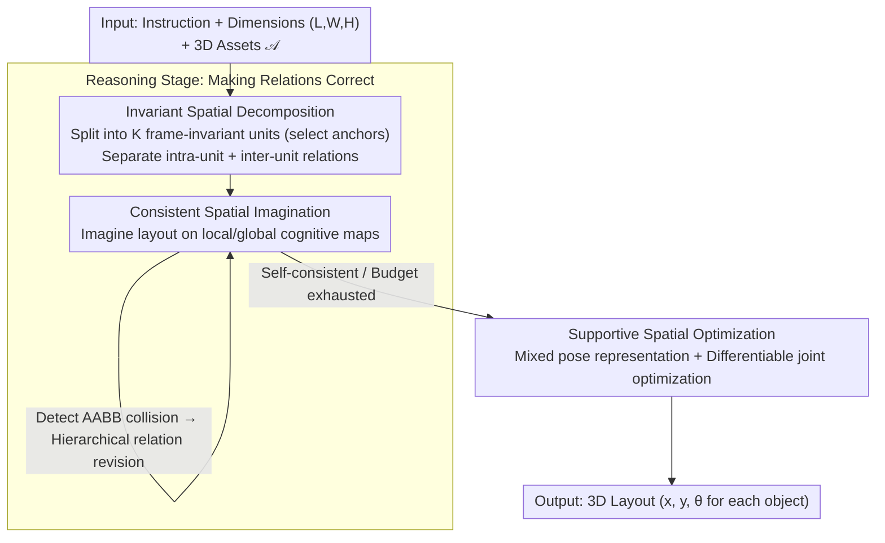

# R$^3$L: Reasoning 3D Layouts from Relative Spatial Relations

**Conference**: ICML 2026  
**arXiv**: [2605.06758](https://arxiv.org/abs/2605.06758)  
**Code**: Available (github.com/Neal2020GitHub/R3L)  
**Area**: Multimodal VLM / 3D Scene Generation / Spatial Reasoning  
**Keywords**: 3D Layout Generation, MLLM, Relational Reasoning, Frame Transformation, Self-consistency

## TL;DR
R³L attributes two types of systemic errors in multi-hop "relative spatial relation" reasoning of MLLMs (semantic drift and metric drift) to "recurrent reference frame transformations." Through three modules—Invariant Spatial Decomposition (shortening relation chains), Consistent Spatial Imagination (an imagine-and-revise loop to eliminate conflicts), and Supportive Spatial Optimization (global-to-local pose re-parameterization)—it enables GPT-5 to generate open-vocabulary 3D scenes where collision and out-of-bounds rates across 9 scene types are near zero, significantly outperforming LayoutVLM/Holodeck/LayoutGPT in semantic metrics.

## Background & Motivation

**Background**: There are two mainstream routes for generating 3D scene layouts from natural language: (1) Direct route—letting the MLLM directly output the pose of each asset (LayoutGPT / 3D-FRONT fine-tuning), which suffers from narrow data coverage and poor extrapolation; (2) Relation-solver route—the MLLM reasons about relative spatial relations between objects (e.g., "chair is 0.5m to the left of the table"), and a DFS solver or differentiable optimization instantiates these relations into poses (Holodeck, LayoutVLM).

**Limitations of Prior Work**: The bottleneck of the relation-reasoning route is that the **relative relations reasoned by the MLLM themselves are often unreliable**—either semantically inconsistent or physically unsolvable. Existing pipelines use various post-hoc heuristics (grid discretization, conflicting relation pruning) to "hard-solve" them, often at the cost of semantic fidelity. These heuristics avoid the real question: why does the MLLM perform decently on relations between two objects but fail in **multi-hop reasoning across multiple objects**?

**Key Challenge**: Multi-hop spatial reasoning requires **repeatedly transforming between object-centric reference frames**—each hop of a relation is expressed in a new local frame, and the MLLM must constantly "re-project" intermediate conclusions. Two systemic errors arise: (a) **Semantic drift**: Directional relations are re-interpreted between frames; a single local axis swap can flip "left/right" to "up/down"; (b) **Metric drift**: Metric displacements accumulate layer by layer across changing frames, where small errors compound into collisions, inconsistent spacing, and physical infeasibility.

**Goal**: (i) Reduce the number of reference frame transformations during multi-hop reasoning; (ii) enable the MLLM to self-perceive and correct metric conflicts; (iii) feed the reasoning products into a pose optimizer that is **more robust to initialization**.

**Key Insight**: Spatial reasoning is analogous to "mental rotation" in cognitive science (Shepard & Metzler 1971)—humans also accumulate errors in multi-step spatial reasoning, and the solutions are to **reduce frame switching** or **externalize intermediate representations to verify consistency**. R³L introduces these two points into the MLLM reasoning pipeline.

**Core Idea**: Utilizing a trio of **frame-invariant unit decomposition** + **imagine-and-revise self-consistency loop** + **global-to-local pose re-parameterization**, the focus shifts from "what post-processing to do" to "making relations correct during the reasoning phase."

## Method

### Overall Architecture
Given a natural language instruction $I$, spatial dimensions $(L,W,H)$, and a set of 3D assets $\mathcal A=\{a_i\}_{i=1}^N$, R³L follows a two-stage "reasoning-then-solving" pipeline: (1) In the reasoning stage, the MLLM first decomposes $\mathcal A$ into $K$ frame-invariant units $\{U_k\}$, generating two layers of relations—intra-unit relations $\mathcal R^{\text{intra}}_k$ within units and inter-unit relations $\mathcal R^{\text{inter}}$ between units; simultaneously, the MLLM performs an "imagine-and-revise" loop on unit-local and global cognitive maps to eliminate conflicts. (2) In the solving stage, all relations are translated into differentiable constraints, and a joint optimization is performed on a mixed pose representation (independent objects / unit poses / local poses of unit members) to output final poses $p_i=(x_i,y_i,\theta_i)$.

### Key Designs

**1. Invariant Spatial Decomposition: Splitting the scene into frame-invariant units to structurally shorten relation chains**

The root cause of error accumulation is the excessive number of reference frame transformations. R³L uses an assignment function $\pi:\{1,\dots,N\}\to\{0,1,\dots,K\}$ to assign assets to $K$ units or an independent class ($\pi(i)=0$). For each unit $U_k$, an anchor $a_k^{\text{anchor}}$ is selected. The global pose of a member is synthesized by $p_i=P_{\pi(i)}\oplus p_{i,\pi(i)}$ (where $\oplus$ represents planar rigid body composition). Relation generation is split into two non-interfering levels—intra-unit reasoning $\mathcal R^{\text{intra}}_k$ occurs only in the unit-local frame, while inter-unit reasoning $\mathcal R^{\text{inter}}$ occurs only in the global frame. From a graph theory perspective, this is equivalent to performing a vertex cut on the anchors, factorizing the relation graph $G=(V,E)$ into $K$ local subgraphs and one inter-unit graph. The number of transformations $\mathcal T_{\text{path}}(\gamma)=m-1$ on a multi-hop path $\gamma$ is thus significantly reduced. Unlike previous semantic grouping which only reduces scale without reducing frame switches, R³L attacks the root cause: once an anchor is fixed, members remain rigid-invariant in the unit-local frame, unaffected by global rotations.

**2. Consistent Spatial Imagination: Externalizing spatial hypotheses to cognitive maps for conflict self-detection and iterative revision**

Shortening the chains does not entirely stop metric drift—MLLM reasoning for metric displacements in pure text tends to be "locally plausible but globally unverified." This module makes it explicitly maintain two maps: a local map $\mathcal M^{\text{local}}_k=\{q_{i,k}\}$ and a global map $\mathcal M^{\text{global}}=\{Q_k\}\cup\{q_i\}$. For each object, the yaw-rotated planar footprint ranges are calculated as $e_i^x(\theta_i)=|l_i\cos\theta_i|+|w_i\sin\theta_i|$ and $e_i^y(\theta_i)=|l_i\sin\theta_i|+|w_i\cos\theta_i|$, yielding axis-aligned boundaries $B_i^x=[x_i-\tfrac12 e_i^x, x_i+\tfrac12 e_i^x]$ (similarly for $B_i^y$). The collision criterion is the overlap of two AABBs on both axes: $\text{Collide}(i,j)\Longleftrightarrow|B_i^x\cap B_j^x|>0\wedge|B_i^y\cap B_j^y|>0$. In each iteration $t$, the MLLM instantiates maps from current relations $\mathcal R^{(t)}$, detects collisions, and revises them hierarchically—intra-unit collisions change intra-relations, inter-unit collisions change inter-relations—to obtain $\mathcal R^{(t+1)}$ until there are no conflicts or the budget is exhausted. Using simple AABB overlap checks as a reasoning proxy in the prompt acts as a lightweight self-checker for MLLMs without spatial renderers, avoiding expensive 3D simulations while preventing trial-and-error re-generation through local revision.

**3. Supportive Spatial Optimization: Stabilizing differentiable execution with mixed pose representation to avoid global oscillations**

Once the reasoning products enter the solving stage, a common problem arises: objects with many constraints trigger multiple penalties simultaneously when moved, causing oscillation. R³L resolves this with a mixed pose representation $\tilde p$—independent assets use $p_i=(x_i,y_i,\theta_i)$ in the global frame, each unit uses a global unit pose $P_k$, and members use unit-local $p_i^\ell$. All relations are translated into differentiable penalties $\ell(r;\tilde p)$ (zero when satisfied). The final goal is to minimize a two-level objective $\mathcal L(\tilde p)=\mathcal L_{\text{global}}(\tilde p)+\sum_k\mathcal L_{\text{local}}^k(\tilde p)$, each containing boundary, collision, and relational losses. Crucially, the unit-local coordinate system decouples intra-unit gradients from the unit pose (Proposition B.1), allowing the entire unit to translate or rotate without disrupting internal relations, leading to faster and more stable convergence.

### Loss & Training
Completely inference-time, requiring no training. Gradient optimizers like Adam are used to minimize $\mathcal L(\tilde p)$ during the solving stage; penalties are weighted by $\lambda_{\text{col}}/\lambda_{\text{rel}}/\lambda_{\text{bd}}$. GPT-5 is used as the MLLM; Gemini 3 Flash serves as the evaluator.

## Key Experimental Results

### Main Results
9 scene categories × 3 scenes/category × 3 difficulties, with up to 40 floor-standing assets per case. Physical metrics: %CR (Collision Rate), %OR (Out-of-bounds Rate) (lower is better); Semantic metrics: Realism / Functionality / Instruction-following (1-10, higher is better).

| Scene | Method | %CR↓ | %OR↓ | Real.↑ | Func.↑ | Instr.↑ |
|---|---|---|---|---|---|---|
| Bathroom | LayoutGPT | 7.6 | 12.1 | 5.9 | 5.3 | 7.9 |
| Bathroom | Holodeck | 4.0 | 0.0 | 2.9 | 2.3 | 1.9 |
| Bathroom | LayoutVLM | 3.0 | 13.2 | 3.5 | 3.5 | 4.7 |
| Bathroom | **Ours** | **0.0** | **0.0** | **7.5** | **7.5** | **9.4** |
| Bedroom | LayoutVLM | 0.3 | 6.8 | 6.4 | 5.9 | 7.3 |
| Bedroom | **Ours** | **0.0** | **0.0** | **6.9** | **6.5** | **7.9** |
| Bookstore | LayoutVLM | 1.1 | 7.3 | 3.4 | 4.3 | 5.5 |
| Bookstore | **Ours** | **0.0** | **0.0** | **8.9** | **8.9** | **8.9** |
| Gym | LayoutGPT | 7.4 | 25.0 | 6.5 | 6.3 | 7.3 |
| Gym | **Ours** | **0.0** | **0.0** | High | High | High |

Ours achieves %CR=%OR=0 across all scenes, while semantic scores significantly outperform others—proving that "making relations correct during reasoning" is superior to "post-hoc heuristic repair."

### Ablation Study

| Configuration | Explanation | Effect |
|---|---|---|
| Full R³L | All modules enabled | Optimal |
| w/o Decomposition | Single-layer relation graph | Path length increases, significant semantic drift |
| w/o Imagination | No imagine-and-revise | Metric drift leads to increased collisions |
| w/o Support Opt. | Single-layer global pose optimization | Slow convergence, prone to oscillation |
| Decomposition only | Shortened chains but no self-check | Intermediate |
| Imagination only | Self-check but chains remain long | Intermediate |

### Key Findings
- **Frame-induced errors are the true bottleneck of MLLM multi-hop spatial reasoning**: Treating them as explicit design targets yields performance gains far exceeding those from post-hoc fixes.
- **AABB collision as a reasoning proxy is sufficient**: No expensive 3D simulator is needed; simple boundary checks guide the MLLM toward self-consistent revisions.
- **Mixed pose representation significantly excels in convergence speed**: The gradient decoupling of unit-local coordinates from unit poses results in smoother optimization curves.

## Highlights & Insights
- **Quantifying reasoning error via "reference frame transformation count"**: Defining $\mathcal T_{\text{path}}(\gamma)=m-1$ allows for counting frame switches to measure the "pathology" of any spatial reasoning pipeline—this perspective is highly insightful for future spatial reasoning work.
- **Relation decomposition via graph theory vertex cuts**: Cutting through unit anchors naturally splits the relation graph into local subgraphs and a global graph, which is theoretically clean and structurally more beneficial than semantic grouping.
- **"Reasoning proxy + self-revise" as a lightweight paradigm for MLLM self-consistency**: It eliminates metric drift without external 3D simulators or retraining, using only a prompt to let the MLLM check AABB overlaps. This is directly transferable to other spatial tasks like robotics.
- **Optimizer-friendliness as an undervalued design goal**: While researchers focus on loss forms or prompt engineering, this paper demonstrates that "operating on the pose representation layer" can enable the same loss function to converge more stably.

## Limitations & Future Work
- Processes only floor objects; wall-mounted or tabletop objects require additional support/attachment relations, for which pipeline extensions are not provided.
- The imagine-and-revise loop may be limited by the MLLM context window when the number of units is large; no chunking strategy is specified.
- Relies on strong MLLMs (GPT-5); performance on open-source models (Qwen-VL, InternVL) is untested.
- Uses LLM-as-judge (Gemini 3 Flash), which has preference bias and lacks human evaluation comparison.
- Physical metrics focus only on AABB collisions, ignoring finer constraints like surface alignment or stability.

## Related Work & Insights
- **vs LayoutGPT**: Directly predicts absolute poses, often physically invalid; Ours uses a relation-solver route with reasoning-stage consistency.
- **vs Holodeck**: Uses a DFS solver for grid-discretized relations, sacrificing semantic fidelity; Ours uses differentiable optimization to preserve continuous semantics.
- **vs LayoutVLM**: Also uses MLLM relations followed by optimization, but is sensitive to initialization and relies on post-hoc heuristics; Ours eliminates relation conflicts during reasoning.
- **vs Multi-agent frameworks**: Uses multiple agents + external feedback for trial-and-error; Ours embeds the feedback mechanism into a single reasoning flow, making it lighter and more stable.

## Rating
- Novelty: ⭐⭐⭐⭐⭐ Attribution of errors to "frame transformations" + vertex cut decomposition + imagine-and-revise design is highly original.
- Experimental Thoroughness: ⭐⭐⭐⭐ Broad coverage across 9 scene types, but LLM-as-judge lacks human baseline and ablation combinations are relatively few.
- Writing Quality: ⭐⭐⭐⭐⭐ Links spatial reasoning to cognitive science, uses clean graph theory formalization, and modules are well-defined.
- Value: ⭐⭐⭐⭐ Directly transferable value for embodied AI, scene generation, and robotics; the combination of open-vocabulary and physical feasibility is rare.

<!-- RELATED:START -->

## Related Papers

- [\[ICML 2026\] ReVSI: Rebuilding Visual Spatial Intelligence Evaluation for Accurate Assessment of VLM 3D Reasoning](revsi_rebuilding_visual_spatial_intelligence_evaluation_for_accurate_assessment_.md)
- [\[ICML 2026\] 3D-RFT: Reinforcement Fine-Tuning for Video-based 3D Scene Understanding](3d-rft_reinforcement_fine-tuning_for_video-based_3d_scene_understanding.md)
- [\[ICLR 2026\] MetaSpatial: Reinforcing 3D Spatial Reasoning in VLMs for the Metaverse](../../ICLR2026/vlm_reasoning/metaspatial_reinforcing_3d_spatial_reasoning_in_vlms_for_the_metaverse.md)
- [\[CVPR 2026\] Beyond 3D VQAs: Injecting 3D Spatial Priors into Vision-Language Models for Enhanced Geometric Reasoning](../../CVPR2026/vlm_reasoning/beyond_3d_vqas_injecting_3d_spatial_priors_into_vision-language_models_for_enhan.md)
- [\[CVPR 2026\] Think with 3D: Geometric Imagination Grounded Spatial Reasoning from Limited Views](../../CVPR2026/vlm_reasoning/think_with_3d_geometric_imagination_grounded_spatial_reasoning_from_limited_view.md)

<!-- RELATED:END -->
