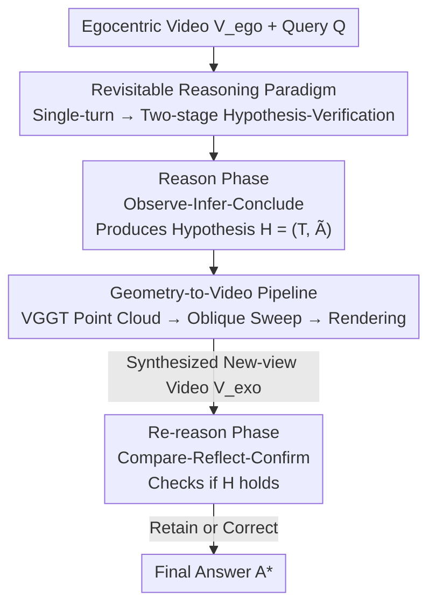

# Reason, Then Re-reason: Cross-view Revisiting Improves Spatial Reasoning

**Conference**: ICML 2026  
**arXiv**: [2606.11683](https://arxiv.org/abs/2606.11683)  
**Code**: https://zhenjiemao.github.io/ReRe/ (Project Page)  
**Area**: Multimodal VLM / Spatial Reasoning / Egocentric Video Understanding  
**Keywords**: Spatial Reasoning, MLLM, Cross-view Verification, New View Synthesis, Training-free Inference

## TL;DR
To address the issue where egocentric video spatial reasoning is "trapped by camera trajectories and relies on semantic priors to guess geometry," this paper proposes the training-free ReRe framework. It first forms a spatial hypothesis on the original video (Reason), then verifies or corrects the hypothesis using a new "oblique overview" video rendered from 3D geometry (Re-reason), enabling open-source MLLMs to approach closed-source SOTA on VSI-Bench / STI-Bench.

## Background & Motivation

**Background**: Spatial reasoning from egocentric videos is a core capability for MLLMs—requiring the identification of objects, inference of geometric constraints, relations, and 3D layouts across frames and camera movements. Current improvement routes follow two categories: training-based (e.g., Video-R1 using two-stage training for spatial cognition, or using VGGT geometric features to align MLLM representations) and training-free (e.g., See&Trek using off-the-shelf tools to extract spatial cues into text for MLLM reasoning).

**Limitations of Prior Work**: Evidence provided by egocentric videos is **inherently constrained by trajectory**—what is seen is entirely determined by the recording camera path. The temporal order of frames rarely aligns with the true spatial topology, and 3D layouts or object relations are often under-determined. General MLLMs lack explicit 3D world modeling and only implicitly enforce cross-frame correspondence. When forced to provide an answer in a single round, the model can only resolve uncertainty using **semantic priors** rather than verifiable geometric constraints, leading to "plausible but incorrect" outputs (e.g., missing a chair occluded by a table).

**Key Challenge**: All existing methods (whether training-based or training-free) default to **spatial reasoning as a single-turn process**—given a fixed trajectory, a final answer must be produced at once, and the reasoning process terminates. Even for geometry-augmented methods, geometry is merely an **implicit internal representation** (feature alignment/auxiliary supervision). Geometry has not become observable visual evidence that the model can "see with its own eyes and revisit its own reasoning," thus remaining trapped in the single-turn paradigm and helpless against occlusion-induced hallucinations.

**Goal**: Transform spatial reasoning into a **revisitable process**—instead of a one-shot decision, first propose a hypothesis and then verify it with complementary cross-view evidence. This must be training-free, architecture-agnostic, and capable of generating such evidence at scale.

**Key Insight**: Monocular geometry prediction (e.g., VGGT) can already recover 3D structures and synthesize new views from 2D inputs at scale. By **rendering the recovered geometry into videos native to MLLMs**, the model can be provided with a "God's eye view" for re-examination during inference.

**Core Idea**: Rewrite "single-turn $A^* = \arg\max_A P(A \mid V_{ego}, Q)$" into a "two-stage hypothesis-verification"—first sample a hypothesis $H \sim P(H \mid V_{ego}, Q)$, then $A^* = \arg\max_A P(A \mid H, V_{exo}, Q)$, where $V_{exo}$ is a complementary new-view video synthesized from the original video's geometry.

## Method

### Overall Architecture

ReRe is an **inference-time, frozen-MLLM, zero-training** framework that decomposes spatial reasoning into two stages. **Reason Phase**: The MLLM observes the original egocentric video $V_{ego}$ and query $Q$, producing a temporary hypothesis $H = (T, \tilde A)$ according to an "Observe-Infer-Conclude" protocol—where $T$ is the explicit thought trajectory and $\tilde A$ is the temporary answer, which is treated as "pending" due to viewpoint constraints. **Re-reason Phase**: A Geometry-to-Video pipeline first recovers a 3D point cloud from $V_{ego}$, plans an oblique sweep camera trajectory, and renders an allocentric (bystander view) new-view video $V_{exo}$. The MLLM takes $V_{exo}$ and the previous hypothesis $H$, explicitly checking, retaining, or correcting based on a "Compare-Reflect-Confirm" protocol to provide the final answer $A^*$. The entire pipeline requires no fine-tuning and relies purely on the MLLM's in-context reasoning for self-correction.

### Key Designs

**1. Revisitable Reasoning Paradigm: Transforming Single-turn Answering into Two-stage Hypothesis-Verification**

This is the paradigm-level contribution of the paper, targeting the root cause of "structural fragility in the single-turn paradigm." Standard practice models the task as single-turn conditional inference $A^* = \arg\max_A P_{\mathcal M}(A \mid V_{ego}, Q)$, assuming $V_{ego}$ is sufficient to determine the answer. However, trajectory constraints leave scene geometry under-determined, forcing the model to rely on priors. This paper introduces an intermediate hypothesis $H$, decomposing reasoning into:

$$H \sim P_{\mathcal M}(H \mid V_{ego}, Q), \qquad A^* = \arg\max_A P_{\mathcal M}(A \mid H, V_{exo}, Q).$$

The key lies in the introduction of $V_{exo}$ as **complementary visual evidence**—allowing the model to test its first-round spatial assertions against "newly observed things" before the final decision. This is not simple self-consistency voting or CoT lengthening, but a true injection of new observations beyond the original trajectory.

**2. Reason Phase: Observe-Infer-Conclude Protocol + Structured Hypothesis Output**

The design principle of the first stage is to **separate perception from reasoning and make the reasoning process explicitly traceable**, otherwise, there is nothing to verify later. $\text{prompt}_{\text{reason}}$ decomposes spatial reasoning into three sequential goals: (1) **Observe**: Identify and describe key visual elements (objects, spatial layouts, geometric cues); (2) **Infer**: Deduce possible spatial relations based on observations even if information is incomplete; (3) **Conclude**: Provide an answer **explicitly labeled as "temporary."** The output is captured using structured labels: the thought trajectory $T$ wrapped in `<think>...</think>` and the temporary answer $\tilde A$ in `<answer>...</answer>`. This serves two purposes—explicit expression exposes implicit assumptions derived from semantic priors (exactly what needs verification), and the thought trajectory provides specific anchors for the second stage to check which spatial assertions still hold under the new view.

**3. Re-reason Phase: Compare-Reflect-Confirm Protocol for Explicit Self-Correction**

The principle of the second stage is to **force the model to confront its old reasoning with new evidence before finalizing**. $\text{prompt}_{\text{re-reason}}$ also sets three goals: (1) **Compare**: Examine the new-view video and identify inconsistencies with the original egocentric observations; (2) **Reflect**: Evaluate whether the spatial assertions in thought trajectory $T$ still hold under the new view; (3) **Confirm**: Decide whether to retain or correct the temporary answer $\tilde A$ to produce $A^*$. This step **anchors the final decision on cross-view evidence**, thereby suppressing hallucinations in the Reason Phase caused by occlusion or missing viewpoints—for example, an oblique overview in Figure 1 reveals a chair hidden by a table, allowing the model to correct the object count.

**4. Geometry-to-Video Pipeline: Oblique Sweep Trajectory + Point Cloud Rendering for Native Geometry Consumption**

For cross-view verification to be effective, the synthesized video $V_{exo}$ must satisfy two principles: **geometric complementarity** (the new view must strategically expose hidden spatial information, reduce occlusions, and maximize coverage; random views merely trade one set of occlusions for another) and **native compatibility** (it must be presented in a video format familiar to MLLMs, rather than raw point clouds). The pipeline consists of two steps:

*Trajectory Planning (Ensuring Geometric Complementarity)*: First use VGGT to predict the 3D point cloud $P_{3D}$ from $V_{ego}$, calculating the scene center $\mathbf c$ and horizontal radius $r$ (the 95th percentile of distance from points to the ground plane of $\mathbf c$). The camera sweeps along a diagonal:

$$\mathbf p(t) = \mathbf c + r \cdot (1-2t) \cdot \mathbf d, \quad t \in [0, 1],$$

where $\mathbf d = \text{normalize}([1, \sqrt2, 1]^\top)$ is a diagonal direction with a $45^\circ$ elevation angle. The camera sweeps from $\mathbf c + r\mathbf d$ to $\mathbf c - r\mathbf d$, maintaining orientation $\mathbf d$ throughout—yielding a long-baseline "aerial oblique sweep" of the scene. Raising the viewpoint eliminates eye-level occlusions while the diagonal path covers the entire field, which the authors call the **Oblique Sweep** trajectory.

*View Rendering (Ensuring Native Compatibility)*: The predicted geometry is rendered into temporally coherent video frames $V_{exo}$ via point-based rasterization, allowing 3D geometric cues to be consumed natively by the frozen MLLM without any architectural changes or additional training.

## Key Experimental Results

Evaluated on VSI-Bench and STI-Bench spatial reasoning benchmarks, covering multiple open-source architectures (2B–8B) such as Qwen2.5-VL, Qwen3-VL, and InternVL2.5/3, all training-free and plug-and-play.

### Main Results (VSI-Bench, Avg.)

| Model | Baseline | +ReRe | Gain |
|---|---|---|---|
| Qwen2.5-VL-3B | 26.4 | 28.2 | +1.8 |
| Qwen2.5-VL-7B | 24.8 | 29.5 | +4.7 |
| Qwen3-VL-2B | 22.5 | 31.0 | +8.5 |
| Qwen3-VL-4B | 30.7 | 36.5 | +5.8 |
| Qwen3-VL-8B | 30.5 | 35.8 | +5.3 |
| InternVL2.5-8B | 35.5 | 36.7 | +1.2 |
| InternVL3-2B | 26.5 | 29.9 | +3.4 |

For reference, the closed-source Gemini-1.5 Pro scores 45.4 Avg. on VSI-Bench, while GPT-4o scores only 34.0. Open-source models enhanced by ReRe can approach or even exceed closed-source APIs in certain sub-tasks.

### Gain by Sub-task (Qwen3-VL-2B, Selected)

| Sub-task | Baseline | +ReRe | Gain |
|---|---|---|---|
| Object Size | 29.8 | 50.5 | +20.7 |
| Room Size | 10.8 | 21.0 | +10.2 |
| Abs. Dist. | 14.7 | 23.4 | +8.7 |
| Rel. Dist. | 19.9 | 25.8 | +5.9 |
| Appr. Order | 19.4 | 26.2 | +6.8 |

### Key Findings
- **The revisiting protocol is the primary performance driver**: Ablations confirm that the effective mechanism is "revisiting and correcting with new viewpoints," rather than simply lengthening CoT or multi-sampling.
- **Egocentric semantics × allocentric structure must be synergistic**: Combining egocentric semantic evidence with allocentric structural evidence is necessary—using only the overview (losing original semantics) or vice versa causes verification to fail.
- **Geometry-sensitive sub-tasks benefit most**: Tasks heavily dependent on geometry and occlusion resolution, such as Object Size, Room Size, and Abs./Rel. Dist., show the most significant improvements (e.g., Object Size +20.7), while temporal/semantic tasks occasionally show slight regressions, aligning with the intuition that new viewpoints primarily supplement geometry.
- **Small models benefit more**: Qwen3-VL-2B achieved a +8.5 gain, suggesting ReRe provides "missing geometric evidence" externally, providing greater leverage for smaller models with weaker geometric priors.

## Highlights & Insights
- **Execution of the "revisitable spatial reasoning" epistemological claim**: Instead of an abstract slogan, it is implemented as an executable two-stage protocol and geometric rendering pipeline, which is extremely lightweight and can be plugged into any video MLLM without training.
- **Clever Oblique Sweep trajectory design**: Using a simple diagonal "oblique flight" path simultaneously satisfies "occlusion reduction (raised viewpoint)" and "maximum coverage (diagonal traversal)," compressing fragmented multi-frame evidence into a "top-down map readable by MLLMs," avoiding the trap of random viewpoints changing occlusions.
- **Geometry as "observable evidence" rather than "implicit features"**: Compared to aligning VGGT features into MLLM latent spaces, this paper renders geometry back into video for the model to "see with its own eyes," bypassing architectural changes and retraining—a paradigm of "letting the model see the image instead of feeding features" that is transferable to any multimodal task requiring 3D verification.
- **Structured `<think>/<answer>` as a prerequisite for verification**: By explicitly separating temporary answers from testable spatial assertions, the second stage can verify them point-by-point. This "making hypotheses falsifiable" output format is worth emulating.

## Limitations & Future Work
- **Heavy reliance on VGGT geometry quality**: If point cloud reconstruction is distorted (weak texture, large dynamic objects, extreme scales), the rendered $V_{exo}$ will be noisy or even misleading. The paper does not fully discuss robustness when geometry fails.
- **Fixed single trajectory**: The Oblique Sweep is a hard-coded diagonal sweep used for all queries; theoretically, different queries (counting vs. route planning) might require different optimal viewpoints. Adaptive trajectory planning is a potential improvement.
- **Doubled inference cost**: Each sample requires running the MLLM twice plus one VGGT reconstruction and rendering session. The computational cost is significantly higher than single-turn inference, trading latency for accuracy.
- **Regressions in some sub-tasks**: Occasional negative gains in Room Size, Route Plan, and Appr. Order suggest that new viewpoints are not complementary for all spatial problems; criteria for when *not* to re-reason are lacking.

## Related Work & Insights
- **vs. Video-R1 (Training-based)**: Video-R1 uses two-stage training + task data injection for spatial cognition, requiring retraining. ReRe is training-free and uses new-view evidence for self-correction at inference time.
- **vs. See&Trek (Training-free)**: See&Trek uses off-the-shelf tools to extract spatial cues into structured text for MLLM, but remains single-turn. ReRe introduces an explicit Re-reason phase, turning geometry into observable video evidence for the model to revisit.
- **vs. Geometric feature alignment methods**: These treat geometry as implicit latent context and require architectural changes and single-turn reasoning. ReRe renders geometry as native video evidence, avoids architectural changes, and supports explicit hypothesis verification.
- **vs. Static image spatial understanding**: Early work was limited to single-frame fixed viewpoints; ReRe actively synthesizes new viewpoints beyond the original trajectory, breaking the fundamental limit of "fixed partial occlusion viewpoints."

## Rating
- Novelty: ⭐⭐⭐⭐⭐ The "revisitable spatial reasoning" concept + rendering geometry as observable video evidence is a paradigm-level shift.
- Experimental Thoroughness: ⭐⭐⭐⭐ Covered 4 architecture families and 2 benchmarks with ablations, but lacks larger models and cross-dataset generalization/robustness analysis.
- Writing Quality: ⭐⭐⭐⭐⭐ Motivation derivation (single-turn fragility) is clear, and the two-stage protocol and Oblique Sweep are well-explained.
- Value: ⭐⭐⭐⭐⭐ Training-free plug-and-play capability that elevates open-source MLLMs to approach closed-source levels is highly practical.

<!-- RELATED:START -->

## Related Papers

- [\[ICML 2026\] Find, Fix, Reason: Context Repair for Video Reasoning](find_fix_reason_context_repair_for_video_reasoning.md)
- [\[CVPR 2026\] Learning to Reason in 4D: Dynamic Spatial Understanding for Vision Language Models](../../CVPR2026/vlm_reasoning/learning_to_reason_in_4d_dynamic_spatial_understanding_for_vision_language_model.md)
- [\[CVPR 2026\] Can a Second-View Image Be a Language? Geometric and Semantic Cross-Modal Reasoning for X-ray Prohibited Item Detection](../../CVPR2026/vlm_reasoning/can_a_second-view_image_be_a_language_geometric_and_semantic_cross-modal_reasoni.md)
- [\[CVPR 2026\] Reinforce to Learn, Elect to Reason: A Dual Paradigm for Video Reasoning](../../CVPR2026/vlm_reasoning/reinforce_to_learn_elect_to_reason_a_dual_paradigm_for_video_reasoning.md)
- [\[CVPR 2026\] ViRC: Enhancing Visual Interleaved Mathematical CoT with Reason Chunking](../../CVPR2026/vlm_reasoning/virc_enhancing_visual_interleaved_mathematical_cot_with_reason_chunking.md)

<!-- RELATED:END -->
