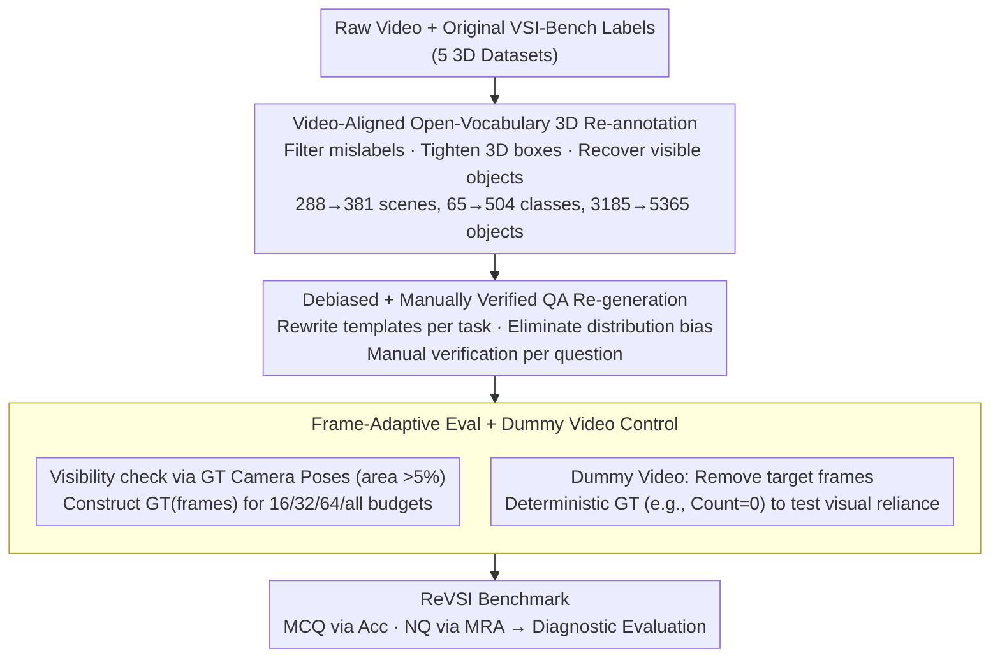

# ReVSI: Rebuilding Visual Spatial Intelligence Evaluation for Accurate Assessment of VLM 3D Reasoning

**Conference**: ICML 2026  
**arXiv**: [2604.24300](https://arxiv.org/abs/2604.24300)  
**Code**: Available (Project Page + GitHub + HuggingFace)  
**Area**: Multimodal VLM / Evaluation Benchmark / Visual Spatial Intelligence  
**Keywords**: VSI-Bench, Spatial Reasoning, Frame Budget, Dummy Video, Hallucination

## TL;DR
This paper systematically reveals structural failures in the widely used VSI-Bench due to 3D annotation drift and frame sampling inconsistency. By re-annotating 381 scenes and 5365 objects and designing frame-budget adaptive QA alongside "dummy video" stress tests (removing frames containing target objects), the authors construct ReVSI, a high-fidelity spatial intelligence benchmark. Evaluations show that open-source VLMs suffer performance drops of up to 40% on ReVSI while exhibiting high hallucination rates on dummy videos, exposing a systematic overestimation of current 3D reasoning capabilities in VSI-Bench.

## Background & Motivation

**Background**: As VLMs expand toward embodied and 3D perception, benchmarks like VSI-Bench, SPAR-Bench, and VSI-SUPER have become mainstream. These use 3D datasets such as ScanNet/ARKitScenes to automatically generate QA for testing spatial reasoning in tasks like object counting, relative direction, and room area. VLM training (e.g., SpatialVLM, Cambrian-S, SpaceR) is increasingly optimized around these benchmarks.

**Limitations of Prior Work**: Manual audits reveal two core flaws. First, **Annotation-Video Drift**: VSI-Bench's ground truth (GT) comes from point-cloud-based 3D reconstruction annotations (serving traditional 3D perception). However, clearly visible objects in raw video may be omitted due to incomplete reconstruction, mislabeled (e.g., a cup labeled as a notebook), or have inaccurate room areas calculated from noisy Alpha Shapes. Among 565 Object Counting samples, 27% were incorrect and 11% were ambiguous. Second, **Unobservable Frame Sampling**: While VLMs typically view 16/32/64 frames, VSI-Bench GT is based on "all-frames." Figure 3 shows that under a 16-frame budget, GT correctness drops to 67%, meaning many questions are unanswerable given the model's actual input.

**Key Challenge**: Benchmarks assume "full scene observed by model = full scene observed during annotation." Sparse-frame inputs break this assumption, making it impossible to distinguish whether a model failure stems from weak spatial reasoning or missing evidence. Furthermore, biased answer distributions (e.g., "2" accounting for 53% of Object Counting) allow models to score high based on priors rather than visual evidence.

**Goal**: To retain the VSI-Bench task paradigm while ensuring: (i) annotations are strictly consistent with original videos; (ii) QA is answerable and correct across different frame budgets; and (iii) controllable diagnostics are provided to decouple "visual evidence" from "reasoning ability."

**Key Insight**: Rather than training another model, one should fix the evaluation. By strictly aligning "what the benchmark asks" with "what the model sees," the benchmark regains diagnostic value.

**Core Idea**: Construct the first input-consistent VSI benchmark, ReVSI, via video-aligned manual 3D re-annotation, frame-budget adaptive QA, and dummy video stress testing.

## Method

### Overall Architecture
The ReVSI pipeline consists of three stages: (1) Using a self-developed 3D web annotation interface, annotations are expanded from 288 scenes/65 categories to 381 scenes/504 categories (open-vocabulary) across ScanNetv2, ScanNet++, ARKitScenes, 3RScan, and MultiScan, redefining 5365 3D bounding boxes. (2) Re-generating QA for 6 task types (excluding Object Appearance Order) using stricter template rules and manual verification. (3) Constructing budget-specific GT for 16/32/64/all-frame budgets and generating "dummy videos" by removing frames containing query objects to conduct visibility-guided control experiments.

### Key Designs

**1. Video-Aligned Open-Vocabulary 3D Re-annotation: Anchoring GT to Raw Video**
The root cause of old GT issues was miscalculating the target as a reconstructed mesh rather than raw video. ReVSI replaces the annotation target. Using a custom web annotator, the authors filtered mislabels, tightened 3D boxes, and recovered objects visible in video but missing in reconstruction. For physically damaged meshes, sizes were extrapolated from adjacent frames. Room areas were manually drawn as polygons from top-down views. Open-vocabulary labels (e.g., "Sony PlayStation") were manually written and verified by GPT-5.2, preventing "narrow guessing" shortcuts based on the original 65 labels.

**2. Debiased + Manually Verified QA Re-generation: Breaking Distribution Shortcuts**
VSI-Bench allowed models to collapse into high-frequency answers (e.g., guessing "2" for counting yielded 62% accuracy). ReVSI rewrites templates for all tasks: Object Counting introduces single-instance queries ("How many black office chairs") and dual-category templates; Object Size removes fixed-size categories (toilets/beds) in favor of OOD sampling; Absolute Distance removes <1m samples; Relative Direction adds "facing/away" templates. Every question passed manual verification to ensure the metrics reflect spatial reasoning rather than prior-matching.

**3. Frame-Budget Adaptive Evaluation + Dummy Video Stress Tests: Aligning Inputs**
Modern VLMs see only 16/32/64 frames, whereas old GT assumed all frames were visible. ReVSI uses GT camera poses to rasterize sampled frames and define visibility (area >5%). GT is transformed from a constant to a function $\text{GT}(\text{frames})$. Dummy videos further remove target object evidence. If a model answers correctly on a dummy video (where the answer should be 0 or unknown), it indicates the response is driven by prior rather than vision—the literal definition of hallucination. MCQ uses Accuracy, while NQ uses Mean Relative Accuracy $\text{MRA}=\frac{1}{|C|}\sum_{\theta\in C}\mathbb{1}[|\hat y-y|/y<1-\theta]$ with $C=\{0.5,0.55,\dots,0.95\}$.

### Loss & Training
ReVSI is an evaluation benchmark and does not involve model training. Evaluation follows MRA (NQ) and Acc (MCQ).

## Key Experimental Results

### Main Results
Evaluated general VLMs (Qwen3-VL, InternVL-3.5, LLaVA-Video, GPT-5.2, Gemini 3) and 3D experts (SpatialVLM, Cambrian-S, SpaceR, VLM-3R, Spatial-MLLM) on both ReVSI and VSI-Bench.

| Dataset Stats | VSI-Bench | ReVSI |
|------------|-----------|-------|
| Scenes | 288 | 381 |
| Objects | 3185 | 5365 |
| Categories | 65 | 504 |
| Open-Vocabulary | ✗ | ✓ |
| Frame-Adaptive GT | ✗ (All-frame only) | ✓ (16/32/64/all) |

| Model Category | VSI-Bench Perf | ReVSI Perf | Conclusion |
|----------|----------------|-------------|------|
| Closed-source (GPT-5.2, Gemini 3) | Lower than open-source | Significant lead, especially in Counting | VSI-Bench systematically underestimates closed models |
| Open-source VLM (Qwen3-VL, InternVL-3.5) | High | Drops up to 40% (Counting/Rel-Dist) | VSI-Bench overestimates open-source |
| 3D Finetuned Experts (SpaceR, 3D-R1) | Way above base | Diminishing returns, some < base | Finetuning gains were artifacts of benchmark bias |

### Ablation Study

| Diagnostic Setting | Key Findings |
|----------|----------|
| Counting (Guessing "2") | 62% on VSI-Bench vs <20% on ReVSI; validates debiasing. |
| Absolute Distance | Some models score higher on ReVSI as MRA is more lenient for long distance. |
| Dummy Video Counting | InternVL-3.5 still gives non-zero counts; high hallucination rate. |
| Black Frames (Size) | Experts still guess typical sizes; reveals heavy reliance on category priors. |
| Frame Budget Scan | GT correctness rises from 67% (16f) to 92% (64f), proving necessity of frame-aware GT. |

### Key Findings
- The "Open-source > Closed-source" conclusion in VSI-Bench is reversed in ReVSI, suggesting previous SOTA claims were benchmark artifacts.
- 3D finetuned experts show plummeting gains on clean data, indicating current 3D instruction tuning largely "overfits to noisy GT."
- Dummy videos expose that many SOTA VLMs are insensitive to whether visual evidence actually exists—a major bottleneck in spatial reasoning.
- Single-room scenes require at least 64 frames for reliable evaluation.

## Highlights & Insights
- **Assessment Hygiene**: Proves that fixing evaluation is often more impactful than scaling models. The 27% error rate in VSI-Bench obscured real performance gaps.
- **Dummy Video Protocol**: Provides a zero-cost method to quantify hallucination by removing target evidence and checking if models still attempt to answer.
- **Frame-aware GT**: Transitions GT from a static value to a function $\text{GT}(\text{frames})$, a standard that should be adopted by all long-video benchmarks.

## Limitations & Future Work
- Re-annotation remains manual and labor-intensive; future work could explore semi-automated pipelines (e.g., GPT-5.2 assisted with human spot-checks).
- Temporal reasoning (object order) was removed to isolate spatial skills, but spatial-temporal joint understanding remains under-explored.
- Does not yet include new 3D tasks like multi-view registration or 6DoF manipulation.

## Related Work & Insights
- **vs VSI-Bench (Yang 2025a)**: Directly audited and corrected by this work; ReVSI is its more robust successor.
- **vs SPAR-Bench/VSI-SUPER**: Shares similar GT drift issues; the "input-consistent" principle of ReVSI can be applied to these benchmarks.
- **Cross-task Inspiration**: The dummy video protocol can be extended to medical VQA (removing pathological regions) or robot perception (removing critical frames) to test robust dependencies.

## Rating
- Novelty: ⭐⭐⭐⭐ Significant conceptual shift in evaluation protocols.
- Experimental Thoroughness: ⭐⭐⭐⭐⭐ Comprehensive audit and multi-dimensional diagnostics.
- Writing Quality: ⭐⭐⭐⭐⭐ Extremely clear logic; visuals effectively communicate the core problem.
- Value: ⭐⭐⭐⭐⭐ High potential to steer the VLM spatial reasoning research direction.

<!-- RELATED:START -->

## Related Papers

- [\[ICML 2026\] Thinking in Structures: Evaluating Spatial Intelligence in Constraint-Governed Spaces](thinking_in_structures_evaluating_spatial_intelligence_in_constraint-governed_sp.md)
- [\[CVPR 2026\] G$^2$VLM: Geometry Grounded Vision Language Model with Unified 3D Reconstruction and Spatial Reasoning](../../CVPR2026/vlm_reasoning/g2vlm_geometry_grounded_vision_language_model_with_unified_3d_reconstruction_and.md)
- [\[ICML 2026\] R$^3$L: Reasoning 3D Layouts from Relative Spatial Relations](r3l_reasoning_3d_layouts_from_relative_spatial_relations.md)
- [\[CVPR 2026\] SpatialStack: Layered Geometry-Language Fusion for 3D VLM Spatial Reasoning](../../CVPR2026/vlm_reasoning/spatialstack_layered_geometry-language_fusion_for_3d_vlm_spatial_reasoning.md)
- [\[ICML 2026\] 3D-RFT: Reinforcement Fine-Tuning for Video-based 3D Scene Understanding](3d-rft_reinforcement_fine-tuning_for_video-based_3d_scene_understanding.md)

<!-- RELATED:END -->
