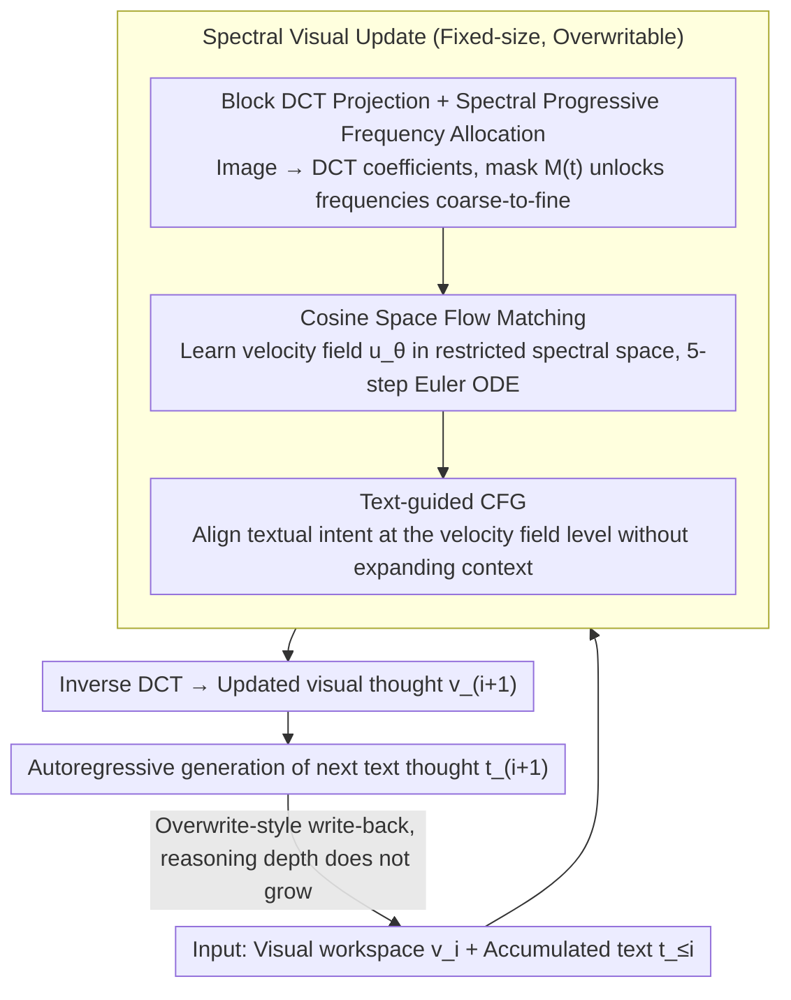

# Spectral-Progressive Thought Flow for Lightweight Multimodal Reasoning

**Conference**: ICML 2026  
**arXiv**: [2606.02842](https://arxiv.org/abs/2606.02842)  
**Code**: TBD  
**Area**: Multimodal Reasoning / LLM Inference Efficiency  
**Keywords**: Multimodal Spatial Reasoning, Flow Matching, Spectral Methods, Progressive Frequency, Efficiency Optimization

## TL;DR
SpecFlow shifts multimodal spatial reasoning from "pixel thinking" to "spectral thinking"—using Block Discrete Cosine Transform + Flow Matching + Progressive Frequency Activation to maintain visual intermediate thoughts in a fixed-size spectral workspace, combined with Classifier-Free Guidance (CFG) to let text guide visual evolution, reducing KV cache by 1.6–2.1× while maintaining spatial reasoning accuracy.

## Background & Motivation

**Background**: Multimodal spatial reasoning (path planning, object search, spatial relationship judgment) is a crucial direction for evaluating VLM reasoning capabilities. The mainstream approach is "Text-Image Interleaved Chain-of-Thought" (MVoT)—where visual intermediate thoughts are autoregressively generated and accumulated at each step.

**Limitations of Prior Work**: The MVoT paradigm has fundamental scalability issues—each intermediate visual thought can contain thousands of visual tokens ($O(10^3)$), far exceeding text tokens ($O(10^2)$); as reasoning steps increase, context length, KV cache, and memory bandwidth explode rapidly. Explicit token pruning relies on heuristic criteria that cannot adapt to the dynamics of multi-step reasoning, while implicit latent space reasoning lacks interpretability and explicit control over spatial states.

**Key Challenge**: Multimodal spatial reasoning must maintain precision while controlling the scale of intermediate representations; existing methods either sacrifice accuracy or fail to reduce costs. The root cause is the misuse of dense representations in pixel space—intermediate thoughts actually only need to capture global layout and geometric relationships.

**Goal**: Design a lightweight, scalable multimodal spatial reasoning framework where memory footprint and computational cost do not grow with reasoning depth.

**Key Insight**: An observation of the strong energy compaction property of Block DCT—most energy is concentrated in a few low-frequency coefficients. Intuition: Early stages of spatial reasoning only require global layout (low frequency), while details (high frequency) can be activated later, inspiring a progressive frequency scheduling.

**Core Idea**: Maintain a fixed-size visual workspace in the spectral domain (DCT space) rather than pixel space, using Flow Matching for deterministic state transitions, with CFG aligning textual intent with visual evolution—keeping costs constant regardless of reasoning steps.

## Method

### Overall Architecture
The reasoning process consists of an alternating cycle of text generation and visual updates: At each step $i$, given the current visual workspace $\hat{v}_i$ and accumulated text $\hat{t}_{\leq i}$, the model first generates the updated visual thought $\hat{v}_{i+1}$ via Flow Matching, and then autoregressively generates the next text thought $\hat{t}_{i+1}$ based on the new visual state. The key is that **visual states are fixed-size and overwritable**, unlike the cumulative growth in MVoT. The visual update step is completed in the spectral domain, integrating three key designs: first projecting the visual state into a frequency-limited DCT spectral space (Design 1), then running deterministic ODEs using Flow Matching in this space to generate new states (Design 2), where the velocity field is guided by text via CFG (Design 3).

### Key Designs

**1. Block DCT Projection + Spectral Progressive Frequency Allocation: Compressing dense visual states into frequency-limited spectral coefficients, then gradually unlocking high frequencies**

The fundamental problem with MVoT is that each intermediate visual thought can easily consume thousands of tokens, causing explosion as reasoning deepens. This work leverages the strong energy compaction of Block DCT—most energy is concentrated in a few low-frequency coefficients. Images are decomposed into frequency components: low frequencies handle global layout (position, spatial configuration), while high frequencies handle detailed textures. A time-dependent mask $M(t)$ controls the activation range, starting from $t=0$ by only allowing DC and adjacent low frequencies, and gradually releasing mid and high frequencies as $t$ reaches 1. The number of activated frequencies $m(t) = \sum_{u, v} M_t(u, v)$ is monotonically non-decreasing, forming a coarse-to-fine curriculum. The rationale is that early spatial reasoning only requires global layouts; forcing the model to build fine-grained pixel representations from the start is wasteful. Compared to heuristic pruning, frequency masking is principle-driven, differentiable, and naturally fits the dynamics of multi-step reasoning.

**2. Cosine Space Flow Matching: Learning deterministic velocity fields in frequency-limited space, generating visual thoughts with few ODE steps**

Diffusion or autoregressive models require multiple samples per step, leading to heavy latency in multi-step reasoning. SpecFlow adopts Flow Matching for deterministic, low-step (e.g., 5-step Euler) state transitions. The coefficient trajectory $X(t)$ follows an ODE $\frac{dX}{dt} = u_\theta(\tilde{X}(t), t, c)$, where $\tilde{X}(t) = M(t) \odot X(t)$ represents the masked spectral coefficients. Training utilizes the standard flow matching loss:

$$\mathcal{L}_{FM} = \mathbb{E}\|u_\theta(M(t) \odot X_t, t, c) - (X_0 - X_1)\|_2^2$$

where $X_t = (1 - t) X_1 + t X_0$, $X_0 = D_b(x_0)$ are the DCT coefficients of the data, and $X_1 \sim \mathcal{N}(0, I)$. After sorting coefficients by frequency, the mask $M(t)$ naturally imposes a "low-to-high frequency" hierarchical dynamic into the flow matching process. Compared to implicit latent methods, spectral domain operations preserve frequency semantics—it is clear which frequencies are activated when, facilitating debugging and control.

**3. Text-guided CFG: Aligning text and visual evolution at the velocity field level without inflating context**

In multi-step reasoning, visual updates must follow the current textual intent to avoid drifting. SpecFlow implements this via Classifier-Free Guidance: during training, the condition $c_i$ is randomly dropped with probability $p_{\text{drop}}$, allowing the model to learn both the conditional $u_\theta(\cdot, t, c_i)$ and unconditional $u_\theta(\cdot, t, \emptyset)$ velocity fields. During inference, the guided velocity is constructed as:

$$u^{\text{guid}}_\theta = u_\theta(\tilde{X}, t, \emptyset) + w \cdot (u_\theta(\tilde{X}, t, c_i) - u_\theta(\tilde{X}, t, \emptyset))$$

The difference term isolates the "direction of velocity change attributed to text," with $w=4$ being most balanced in experiments. The key advantage is that the guidance occurs at the velocity field level rather than the sample level, meaning visual tokens do not need to be accumulated in the trajectory, thus avoiding context length expansion and the "token pile-up" issue of MVoT.

## Key Experimental Results

### Main Results (Multimodal Spatial Reasoning Benchmarks)

| Benchmark | Method | Accuracy (%) ↑ | FLOPs (G) ↓ | Latency (s) ↓ | Memory (GB) ↓ |
|-----------|---------|----------------|-------------|---------------|---------------|
| VSR       | VoCoT   | 68.88          | 20342.4     | 0.65          | 56.37         |
| VSR       | Heima   | 51.69          | 10394.5     | 0.40          | 38.84         |
| VSR       | **SpecFlow** | **70.14** | 11169.7     | 0.41          | 39.53         |
| V-Star    | VoCoT   | 59.87          | 22334.0     | 0.71          | 59.28         |
| V-Star    | PCCoT   | 44.40          | 13963.5     | 0.50          | 42.31         |
| V-Star    | **SpecFlow** | **61.28** | 13985.5     | 0.45          | 41.22         |
| EmbSpatial| SparseVLM| 63.89          | 20785.2     | 0.74          | 51.93         |
| EmbSpatial| **SpecFlow** | **67.79** | 17731.5     | 0.44          | 42.57         |
| Winoground| VoCoT   | 70.09          | 28092.9     | 0.80          | 62.23         |
| Winoground| **SpecFlow** | **70.47** | 18390.1     | 0.49          | 46.94         |

Ours achieved 18.5% higher accuracy than Heima on VSR with comparable latency, 16.9% higher than PCCoT on V-Star, and outperformed SparseVLM by 3.9% on EmbSpatial.

### Ablation Study: Spectral Scheduling Strategies (Maze & FrozenLake)

| Environment | Strategy | Accuracy (%) | Latency (ms) | FLOPs (G) |
|-------------|----------|--------------|--------------|-----------|
| Maze        | Fixed (Low-freq only) | 90.39 | 1.13 | 12723.3 |
| Maze        | Linear   | 94.37        | 1.96         | 16752.2   |
| Maze        | **Cosine** | **94.12** | **1.29**     | **13976.7** |
| FrozenLake  | Fixed    | 82.37        | 1.42         | 13672.5   |
| FrozenLake  | Linear   | 87.79        | 2.97         | 18265.1   |
| FrozenLake  | **Cosine** | **87.94** | **1.73**     | **15991.1** |

### Key Findings
- KV cache reduced from 5.4–5.9 GB to 3.0–3.5 GB (1.6–1.8× reduction), reaching 2.1× on dynamic decision tasks—an intrinsic property of the flow matching paradigm.
- Fixed low-frequency schemes are fast but suffer a 3–5% accuracy drop, proving that progressive activation is key to balancing coarse and fine details.
- Pure flow matching (DiffThinker) lacks accuracy in complex reasoning; SpecFlow achieves significant gains on long sequences through CFG.

## Highlights & Insights
- **From Pixel Thinking to Spectral Thinking**: The core insight is that intermediate visual thoughts do not require pixel-level detail; breaking the "accumulated token" trap can be generalized to any task requiring multi-step visual reasoning.
- **Flow Matching in Restricted Space**: Using mask $M(t)$ to explicitly encode frequency constraints retains the advantage of deterministic low-step generation while inducing a coarse-to-fine reasoning strategy via hierarchical activation.
- **Clever Application of CFG in Multi-step Reasoning**: Achieving text guidance **without context expansion**—the key is combining conditional branches at the velocity field level rather than the sample level.
- **Scalability of Fixed Workspaces**: The Markov assumption completely decouples memory usage from reasoning depth, which is particularly prominent for long reasoning sequences.

## Limitations & Future Work
- Experiments were primarily based on Qwen3-VL-8B; generalization to larger or smaller models is not yet finalized.
- Frequency masks $M(t)$ are preset (Fixed Linear/Cosine); there is room to explore task-adaptive spectral budget strategies.
- The ODE solver step count is fixed at $T=5$; "dynamic step adjustment" has not been systematically explored.
- While interpretability is better than in implicit latent spaces, the specific correspondence between frequency activation and reasoning steps requires further visual analysis.

## Related Work & Insights
- **vs MVoT / VoCoT**: In the MVoT paradigm, visual tokens accumulate infinitely; VoCoT optimizes prompts but does not fundamentally solve the issue. SpecFlow bypasses this entirely using a fixed workspace and non-autoregressive updates.
- **vs FastV / LightFastV (Heuristic Pruning)**: Heuristic pruning is unfriendly to multi-step reasoning dynamics; SpecFlow avoids over-pruning using principle-driven spectral decomposition.
- **vs Heima / CODI (Implicit Latent Reasoning)**: Implicit methods lack explicit constraints and are difficult to learn; SpecFlow injects hard spectral structure constraints into continuous latent spaces, achieving both compactness and interpretability.
- **vs DiffThinker**: Pure flow matching lacks text guidance; SpecFlow aligns text-visual evolution via CFG, significantly increasing success rates in complex reasoning.

## Rating
- Novelty: ⭐⭐⭐⭐⭐ Paradigmatic shift from pixel to spectral space + flow matching in frequency-limited space + clever integration of CFG in multi-step reasoning.
- Experimental Thoroughness: ⭐⭐⭐⭐⭐ Comparison across 6 benchmarks × 3 task categories × 4 models + ablations on scheduling / CFG / ODE steps, with clear marginal effects.
- Writing Quality: ⭐⭐⭐⭐ Clear logic, intuitive frequency energy analysis diagrams; dynamic frequency budget details are somewhat briefly explained in the appendix.
- Value: ⭐⭐⭐⭐⭐ Resolves the fundamental KV cache bottleneck in long VLM reasoning, with 1.6–2.1× memory reduction directly applicable; the design philosophy of careful representation space selection vs. brute-force compression has long-term significance.

<!-- RELATED:START -->

## Related Papers

- [\[ACL 2025\] Progressive Multimodal Reasoning via Active Retrieval](../../ACL2025/vlm_reasoning/progressive_multimodal_reasoning_via_active_retrieval.md)
- [\[CVPR 2026\] Grounded Chain-of-Thought for Multimodal Large Language Models](../../CVPR2026/vlm_reasoning/grounded_chain-of-thought_for_multimodal_large_language_models.md)
- [\[CVPR 2026\] COT-FM: Cluster-wise Optimal Transport Flow Matching](../../CVPR2026/vlm_reasoning/cot-fm_cluster-wise_optimal_transport_flow_matching.md)
- [\[CVPR 2026\] UniT: Unified Multimodal Chain-of-Thought Test-time Scaling](../../CVPR2026/vlm_reasoning/unit_unified_multimodal_chain-of-thought_test-time_scaling.md)
- [\[CVPR 2026\] ReaGEN: Adaptive Generation of Structured Chains-of-Thought for Efficient Multimodal Reasoning](../../CVPR2026/vlm_reasoning/reagen_adaptive_generation_of_structured_chains-of-thought_for_efficient_multimo.md)

<!-- RELATED:END -->
