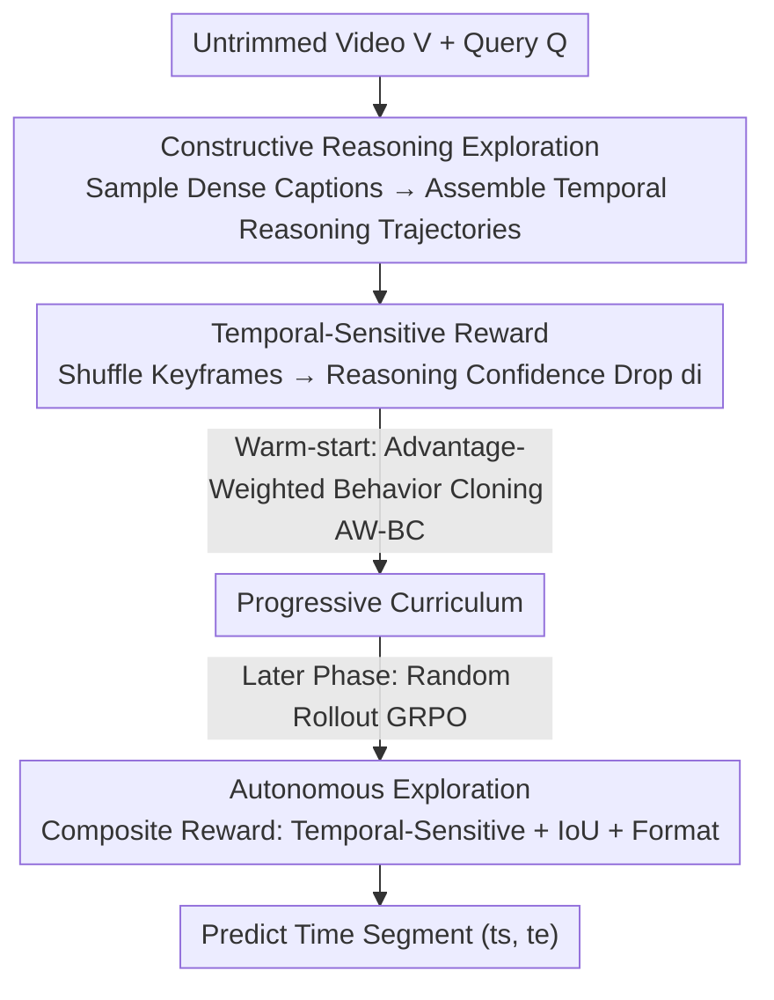

# Temporal-Aware Reasoning Optimization for Video Temporal Grounding

**Conference**: ICML 2026  
**arXiv**: [2606.09248](https://arxiv.org/abs/2606.09248)  
**Code**: https://github.com/oceanflowlab/TaRO  
**Area**: Multimodal VLM / Video Reasoning  
**Keywords**: Video Temporal Grounding, Multimodal Large Language Models, Reinforcement Learning, Reasoning Quality Reward, Curriculum Learning

## TL;DR
This paper proposes TaRO to address the issue of "glitzy but insubstantial reasoning" in RL-trained Video Temporal Grounding (VTG). It constructs high-quality reasoning trajectories using dense captions for warm-starting and introduces a reward based on the "confidence drop after shuffling keyframes" to measure reasoning quality, forcing the model to truly "think with time."

## Background & Motivation

**Background**: Video Temporal Grounding (VTG) aims to localize precise time segments corresponding to a query within untrimmed videos. Recent Reinforcement Learning (RL) methods based on Multimodal Large Language Models (MLLMs), such as Time-R1, which generate a Chain-of-Thought (CoT) before predicting timestamps, have become the state-of-the-art (SOTA) approach.

**Limitations of Prior Work**: The authors find that the reasoning produced by these RL methods is **glitzy but insubstantial**. In controlled experiments on Time-R1, the performance of "training and inference with CoT" vs. "both directly outputting answers" is nearly identical (Fig. 1a)—indicating that the generated reasoning contributes **almost nothing** to the final localization. Statistics further reveal that in the Charades-STA test set, **only 8.3% of reasoning generated by Time-R1 contains explicit timestamps**, with the majority being vague descriptions.

**Key Challenge**: The problem stems from two root issues in the RL paradigm: (1) **Blind exploration via random rollout**: The reasoning space for video is massive, and random sampling likely hits low-quality trajectories, leading to superficial reasoning; (2) **Rewards focus only on answers, not reasoning**: Existing rewards (like IoU) only evaluate the correctness of the final timestamps. They fail to assess the quality of the reasoning process. Consequently, reasoning that "luckily gets the answer right without relying on visual-temporal evidence" is still reinforced, causing the model to learn spurious correlations and exhibit poor zero-shot generalization.

**Goal**: To make the model truly "think with time." The authors define effective reasoning in VTG as: **selectively attending to key visual cues + temporal sensitivity, and anchoring these cues to specific timestamps**. This requires solving both "how to efficiently explore good reasoning" and "how to evaluate reasoning quality."

**Key Insight**: Instead of random exploration from scratch, high-quality reasoning prototypes can be "fed" to the model using existing dense captions (with precise timestamps). Simultaneously, a reward signal can be designed to directly measure "whether the reasoning depends on key moments."

**Core Idea**: Constructive exploration (assembling reasoning trajectories from dense captions) + temporal-sensitive reward (measuring confidence drop when shuffling keyframes) + progressive curriculum (transitioning from imitating constructed trajectories to autonomous exploration).

## Method

### Overall Architecture

TaRO implements three components within the GRPO reinforcement learning framework. Problem setup: Given an untrimmed video $V$ and a query $Q$, predict the time segment $y=(t^s, t^e)$ of the target event. Step 1: **Constructive Reasoning Exploration**: Use an off-the-shelf dense captioner (Gemini-3-Pro) to generate a set of atomic events with timestamps, randomly sample subsets to assemble reasoning trajectories in chronological order, and have the MLLM continue writing to predict the answer. This bypasses the inefficiency of random exploration. Step 2: **Temporal-Sensitive Reward**: For each rollout, shuffle frames near the ground-truth event boundaries and compare the log-probability of reasoning tokens under the original vs. perturbed video. A larger drop in confidence indicates that the reasoning is more strongly anchored to key moments. Step 3: **Progressive Curriculum**: A warm-start phase uses Advantage-Weighted Behavior Cloning (AW-BC) on constructed trajectories to teach the model "what cues to watch and how to attach timestamps," followed by standard random rollouts guided by the temporal-sensitive reward for refined autonomous exploration.

### Key Designs

**1. Constructive Reasoning Exploration: Replacing Random Rollout with Dense Captions**

Random rollouts struggle to find reasoning containing timestamps within the vast video reasoning space. The authors use "construction": first generating a set of dense captions $\mathcal{C}=\{(t_k^s, t_k^e, c_k)\}_{k=1}^N$ with an external captioner. To avoid noise and redundancy, only a **random subset** $\hat{\mathcal{C}}_i \subset \mathcal{C}$ is sampled and sorted chronologically to form a reasoning trajectory template: `<think>From $t^s$ to $t^e$, $c$ ...</think>`. The MLLM then completes the reasoning and final answer, forming a full rollout $o_i$. Different sampling combinations result in varying reasoning quality, and the model learns through rewards **which captions are critical and which are distractions**.

Since the reasoning part is externally constructed rather than generated by the current policy $\pi_\theta$ (off-policy data), standard on-policy GRPO cannot be used directly. Instead, the authors use **Advantage-Weighted Behavior Cloning (AW-BC)** for imitation learning. The advantage is calculated as $A_i = \frac{r(o_i) - \mu_r}{\sigma_r}$ within a group, and weighted cloning is performed only for samples with positive advantage ($A_i > 0$):

$$\mathcal{L}_{AW\text{-}BC} = -\frac{1}{G} \sum_{i=1}^{G} \mathbb{I}(A_i > 0) \cdot A_i \cdot \log \pi_\theta(o_i | V, Q)$$

This offers two advantages over SFT: SFT struggles with continuous temporal outputs (3.0s vs 2.9s is a heavy token mismatch penalty despite being semantically similar), whereas RL rewards (IoU) tolerate small numerical deviations. Furthermore, while SFT is static, constructive exploration produces **dynamic and diverse** reasoning variants through random sampling and model completion.

**2. Temporal-Sensitive Reward: Shuffling Keyframes to Measure Confidence Drop**

The core intuition for evaluating reasoning quality is: **good reasoning should depend on key events and timestamps**. If keyframes are shuffled, the reasoning should become "untenable." For a rollout containing reasoning $r_i$, the average log-probability of reasoning tokens under the original video is calculated as $p_i = \frac{1}{|r_i|} \sum_k \log \pi(r_{i,k} | V, Q, r_{i,<k})$. A perturbed video $V'$ is then constructed by randomly shuffling frames within a small window $\Delta t$ near the ground-truth timestamps $t^s, t^e$. The log-probability $q_i$ of the same reasoning is then calculated. The temporal-sensitive score is the difference:

$$d_i = p_i - q_i$$

A larger $d_i$ indicates the model finds the reasoning less "plausible" after keyframes are shuffled, meaning the reasoning is strongly anchored to correct visual-temporal evidence. The reward uses the group mean $\bar d = \frac{1}{G} \sum_j d_j$ as a baseline:

$$r^{\text{temp}}_i = \begin{cases} \alpha, & d_i > \bar d \\ 0, & \text{otherwise} \end{cases}$$

To prevent the model from gaming the temporal reward when the answer is completely wrong, a **gate** is added: the temporal reward is only issued if the IoU exceeds a threshold $\tau$. The final composite reward is:

$$r(o_i) = r_{\text{form}}(o_i) + r_{\text{tIoU}}(o_i) + r^{\text{temp}}_i \cdot \mathbb{I}(\text{IoU}_i > \tau)$$

This fills the gap of "answer-only rewards" by providing an instance-level signal that directly measures the temporal sensitivity of each piece of reasoning.

**3. Progressive Curriculum: From Imitating Constructions to Autonomous Exploration**

Constructive exploration provides a good initialization, but the model cannot rely on external constructions indefinitely. Therefore, the process is split into two stages: The **warm-start** phase uses constructive rollouts + AW-BC (Eq. 2) to quickly teach the model to attend to key sub-events and reason with explicit timestamps. The **self-exploration** phase switches back to standard random rollouts where the model generates its own reasoning and answers $o_i \sim \pi_\theta(o | V, Q)$, optimized via GRPO using the temporal-sensitive composite reward (Eq. 7). This smooth transition from "supervised imitation" to "autonomous creation" resulted in **100% of reasoning containing explicit timestamps** on Charades-STA after training (compared to 8.3% for Time-R1).

## Key Experimental Results

### Main Results

Zero-shot evaluation on four VTG benchmarks (Charades-STA / ActivityNet / QVHighlights / TVGBench) using R1@m (proportion of samples where predicted IoU > m, $m \in \{0.3, 0.5, 0.7\}$). Base model: Qwen2.5-VL-7B. Partial R1@0.5 results:

| Method | Size | Charades R1@0.5 | ActivityNet R1@0.5 | QVHighlights R1@0.5 | TVGBench R1@0.5 |
| :--- | :--- | :--- | :--- | :--- | :--- |
| Qwen2.5-VL-7B-Instruct | 7B | 53.6 | 13.6 | 7.10 | 20.0 |
| UniTime | 7B | 59.1 | 22.8 | 41.0 | — |
| Time-R1 (Prev. SOTA) | 7B | 60.8 | 39.0 | 66.2 | 29.4 |
| **TaRO (Ours)** | 7B | **64.8** | **39.8** | **69.4** | **37.8** |

TaRO achieves SOTA across all four benchmarks, with particularly significant gains on TVGBench R1@0.5 (29.4 → 37.8) and R1@0.3 (41.8 → 54.6).

### Performance on Smaller Models and Long Videos

| Config | Charades R1@0.5 | QVHighlights R1@0.5 |
| :--- | :--- | :--- |
| Qwen2.5-VL-3B Base | 42.0 | 9.9 |
| Time-R1 (3B) | 53.1 | 19.7 |
| **TaRO (3B)** | **55.2** | **43.1** |

TaRO consistently outperforms Time-R1 at the 3B scale, more than doubling performance on QVHighlights R1@0.5 (19.7 → 43.1).

### Key Findings
- **Reasoning is finally "useful"**: The ratio of reasoning containing explicit timestamps surged from 8.3% to 100%, supporting the goal of "substantial reasoning contribution"—exactly what Time-R1 lacked.
- **Largest improvement on TVGBench**: The most significant gains occur on the strictest comprehensive benchmark, indicating that temporal-sensitive rewards suppress spurious correlations and improve zero-shot generalization.
- **Gating is critical**: The IoU gate ($\mathbb{I}(\text{IoU} > \tau)$) prevents the model from farming temporal rewards when answers are wrong, ensuring the temporal reward serves the main task.
- **Constructive Exploration > SFT Warm-start**: Diverse reasoning from dynamic construction + reward-based discrimination of cues outperforms static SFT on CoT data and is immune to token mismatch issues in continuous time outputs.

## Highlights & Insights
- **"Shuffling keyframes to measure confidence" is a clever counterfactual reward**: Using the log-probability drop of reasoning after perturbing ground-truth boundaries provides the first **instance-level, direct evaluation of reasoning quality** in VTG, unlike Video-R1's group-level, answer-only reward. This counterfactual approach can be transferred to other tasks requiring verification of evidence-dependency.
- **Using off-the-shelf dense captions to construct reasoning**: Replacing "random exploration" with "timestamped caption assembly + model completion" is an efficient paradigm for injecting domain priors at low cost.
- **AW-BC handles off-policy warm-starts**: Using advantage-weighted behavior cloning instead of forcing GRPO on constructed data cleanly resolves the conflict between off-policy data and continuous-time supervision.

## Limitations & Future Work
- **Dependency on external captioner quality**: The warm-start quality depends on Gemini-3-Pro's dense captions. Timestamp precision and coverage may vary in scenarios with weaker captioners.
- **Dual forward passes for temporal reward**: Each rollout requires two log-probability calculations (original vs. perturbed), doubling training overhead. Parameters like $\Delta t$, $\alpha$, and $\tau$ require tuning.
- **Perturbation assumptions**: The effectiveness of shuffling depends on the reasoning actually describing those specific frames. For queries not relying on local frame order, this signal might be insensitive.
- **Limited model validation**: Effectiveness has primarily been verified on 7B/3B Qwen2.5-VL; performance on larger or different MLLM architectures remains to be seen.

## Related Work & Insights
- **vs. Time-R1**: Both are RL-based VTG. Time-R1 uses random rollout + answer-only IoU rewards, leading to insubstantial reasoning (8.3% timestamps). TaRO uses constructive exploration + temporal-sensitive rewards, achieving 100% timestamps and superior performance.
- **vs. Video-R1 (T-GRPO)**: Video-R1 encourages temporal awareness by comparing "ordered vs. shuffled" entire videos. However, that is a **group-level, answer-oriented** reward that doesn't evaluate individual reasoning. Shuffling the entire video also invalidates temporal ground truth, making IoU uncalculable for VTG. TaRO provides **instance-level** rewards by shuffling only boundary frames to measure single reasoning sensitivity.
- **vs. SFT Warm-start**: SFT heavily penalizes token mismatches in continuous time (3.0s vs 2.9s) and only imitates fixed paths. TaRO's RL + constructive exploration tolerates numerical variance and generates diverse reasoning variations.

## Rating
- Novelty: ⭐⭐⭐⭐⭐ "Shuffling keyframes to measure reasoning confidence drop" is an industry-first instance-level reasoning quality reward for VTG.
- Experimental Thoroughness: ⭐⭐⭐⭐⭐ Covers four standard + two long video benchmarks, two model scales, and provides mechanistic evidence like timestamp ratios.
- Writing Quality: ⭐⭐⭐⭐ Solid motivation (revealing useless reasoning via control experiments), clear three-part methodology, and complete formulas.
- Value: ⭐⭐⭐⭐⭐ Directly addresses the "glitzy but insubstantial reasoning" pain point in RL; the method is transferable to other video reasoning tasks.

<!-- RELATED:START -->

## Related Papers

- [\[CVPR 2026\] Thinking with Drafts: Speculative Temporal Reasoning for Efficient Long Video Understanding](../../CVPR2026/vlm_reasoning/thinking_with_drafts_speculative_temporal_reasoning_for_efficient_long_video_und.md)
- [\[ACL 2026\] TemporalVLM: Video LLMs for Temporal Reasoning in Long Videos](../../ACL2026/vlm_reasoning/temporalvlm_video_llms_for_temporal_reasoning_in_long_videos.md)
- [\[CVPR 2026\] Learning Transferable Temporal Primitives for Video Reasoning via Synthetic Videos](../../CVPR2026/vlm_reasoning/learning_transferable_temporal_primitives_for_video_reasoning_via_synthetic_vide.md)
- [\[CVPR 2026\] Streaming Video Crime Anticipation with Spatio-Temporal Causal Reasoning](../../CVPR2026/vlm_reasoning/streaming_video_crime_anticipation_with_spatio-temporal_causal_reasoning.md)
- [\[ICLR 2026\] VideoZoomer: Reinforcement-Learned Temporal Focusing for Long Video Reasoning](../../ICLR2026/vlm_reasoning/videozoomer_reinforcement-learned_temporal_focusing_for_long_video_reasoning.md)

<!-- RELATED:END -->
